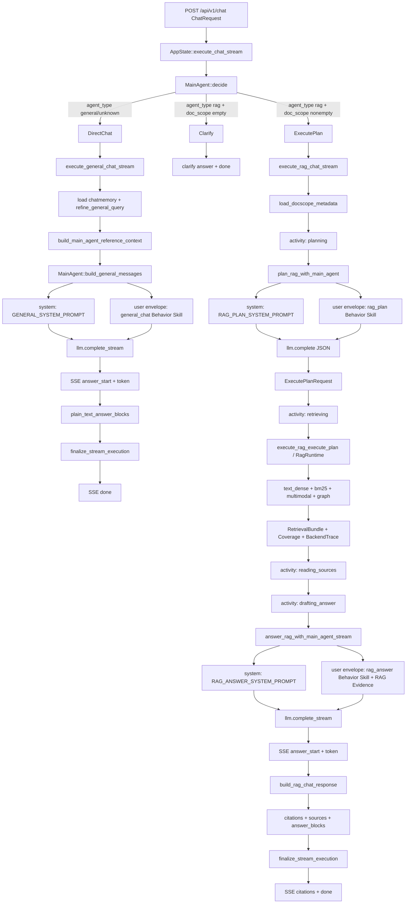

# Main Agent 系统提示词、Behavior Skill 与 Query→Answer 装载机制

生成时间：2026-04-28

代码依据：

- `crates/app/src/main_agent/mod.rs`
- `crates/app/src/lib_impl/main_agent.rs`
- `crates/app/src/lib_impl/chat_streaming.rs`

本文只描述当前代码实现。这里的 “skill” 指当前 Rust 代码里的 `MainAgentBehaviorSkill`，不是外部工具系统、不是 Hermes skill registry，也不是可执行 tool schema。

---

## 1. 总体结论

当前 Main Agent 的 skill 装载机制是静态、轻量、prompt-envelope 级别的：

1. HTTP chat request 进入 `AppState::execute_chat_stream`。
2. `MainAgent::decide(&req)` 根据 `agent_type` 和 `doc_scope` 决定进入 `general/chat`、`rag`、`search` 或 clarify。
3. 对于 Chat 模式，代码构造 `general_chat` behavior skill。
4. 对于 RAG 模式，代码分两次调用 Main Agent：
   - `rag_plan` 阶段：装载 `rag_plan` behavior skill，要求模型只输出 ExecutePlanRequest JSON。
   - `rag_answer` 阶段：装载 `rag_answer` behavior skill，要求模型只基于 retrieval bundle 生成自然语言答案。
5. 每个 behavior skill 都通过 `build_main_agent_envelope()` 写进 user message 的 `<Behavior Skill>` 段。
6. 系统提示词仍然由 `LlmChatMessage::system(...)` 单独发送。
7. 当前实现没有动态 skill discovery / registry / permission / tool execution。测试也明确断言 envelope 不包含 `<Tools>` 或 `tool_schema`。

核心 envelope 格式：

```text
<Mode>
{mode}

<Current Task>
{current_task}

<Authoritative Context>
{authoritative_context}

<Reference Context>
{reference_context}

<User Preference Memory>
{preferences}

<Behavior Skill>
name: {skill.name}
instructions:
- {instruction 1}
- {instruction 2}

<Output Contract>
{output_contract}
```

---

## 2. Main Agent 模式选择

代码位置：`crates/app/src/main_agent/mod.rs`

```rust
pub fn profile(agent_type: &str) -> ModeProfile {
    match agent_type {
        "search" => ModeProfile::Search,
        "rag" => ModeProfile::Rag,
        _ => ModeProfile::General,
    }
}

pub fn decide(request: &ChatRequest) -> MainAgentDecision {
    match Self::profile(&request.agent_type) {
        ModeProfile::General => MainAgentDecision::DirectChat,
        ModeProfile::Search => MainAgentDecision::ExternalSearch,
        ModeProfile::Rag => {
            if request.doc_scope.is_empty() {
                MainAgentDecision::Clarify {
                    message: "请先选择要检索的文档范围，再让我执行知识库检索。".to_string(),
                }
            } else {
                MainAgentDecision::ExecutePlan
            }
        }
    }
}
```

含义：

| 输入 agent_type | profile | 决策 | 后续路径 |
|---|---|---|---|
| `general` 或其他未知值 | General | DirectChat | `execute_general_chat_stream` |
| `rag` 且 `doc_scope` 非空 | Rag | ExecutePlan | `execute_rag_chat_stream` |
| `rag` 但 `doc_scope` 为空 | Rag | Clarify | 直接生成澄清答案 |
| `search` | Search | ExternalSearch | `execute_search_chat_stream` |

本次用户要求只看 RAG 和 Chat，所以下文不展开 Search。

---

## 3. Chat / General 模式

### 3.1 系统提示词

代码常量：`GENERAL_SYSTEM_PROMPT`

```text
You are the general assistant for Context OS. Maintain continuity across turns, use conversation memory when relevant, and answer directly without inventing facts.
```

### 3.2 Behavior Skill

构造位置：`MainAgent::build_general_messages()`

```text
name: general_chat
instructions:
- Answer directly while preserving conversational continuity.
- Do not treat reference context as factual evidence for document claims.
```

### 3.3 User envelope 内容

Chat 模式调用：

```rust
MainAgent::build_general_messages(&refined_query, reference_context.as_ref())
```

构造出的 user message 主要字段：

```text
<Mode>
general_chat

<Current Task>
{refined_query}

<Authoritative Context>
none

<Reference Context>
{session working state + recent user turns, if any}

<User Preference Memory>
{user preferences or none}

<Behavior Skill>
name: general_chat
instructions:
- Answer directly while preserving conversational continuity.
- Do not treat reference context as factual evidence for document claims.

<Output Contract>
Return a natural-language answer only.
```

### 3.4 Chat 模式执行链路

代码位置：`crates/app/src/lib_impl/chat_streaming.rs`

```text
execute_chat_stream
  -> MainAgent::decide
  -> DirectChat
  -> execute_general_chat_stream
      -> chatmemory.load(session)                       # 可选
      -> refine_general_query(query, memory_context)    # 查询改写/压缩
      -> build_main_agent_reference_context(session)    # 用户偏好、最近 user turns、working memory
      -> MainAgent::build_general_messages
          -> system: GENERAL_SYSTEM_PROMPT
          -> user: envelope + general_chat skill
      -> MainAgent::answer_general_stream
          -> llm.complete_stream(...)
          -> SSE answer_start
          -> SSE token...
      -> plain_text_answer_blocks
      -> ChatResponse(agent_type=general, citations=[])
      -> finalize_stream_execution
          -> persist user/assistant messages
          -> SSE done
```

Chat 模式没有 RAG evidence，没有 citations，没有 RAG activity 阶段。它只会有答案流式 token 和 done。

---

## 4. RAG 模式：阶段一 rag_plan

RAG 模式是两段式 Main Agent：先规划，再回答。

### 4.1 rag_plan 系统提示词

代码常量：`RAG_PLAN_SYSTEM_PROMPT`

```text
You are the Context OS Main Agent in RAG planning mode.
Return exactly one raw JSON object.

When retrieval can proceed, return an ExecutePlanRequest:
{
  "plan_version": "rag-execute-v1",
  "doc_scope": ["document-id"],
  "items": [
    { "priority": 1.0, "query": "semantic retrieval query" }
  ],
  "summary_mode": "none" | "related" | "all",
  "query_entities": [{ "text": "named entity", "kind": "optional kind" }],
  "graph_hints": [{ "subject": "optional", "predicate": "optional", "object": "optional" }],
  "placeholder_triplets": [
    { "subject": "known entity or ?placeholder", "predicate": "relationship", "object": "known entity or ?placeholder" }
  ]
}

When the target cannot be identified from the current task, doc_scope, document metadata, and reference context, return:
{
  "action": "clarify",
  "message": "one concise clarification question"
}

Rules:
- Do not answer the user.
- Do not include session_id, messages, history, clarify_needed, or clarify_message.
- Keep doc_scope exactly equal to the provided doc_scope.
- Use 1 to 4 retrieval items.
- Each item must contain exactly one of query or bm25_terms.
- Prefer one high-priority semantic query; add bm25_terms only for filenames, exact names, codes, or rare terms.
- Add query_entities only for concrete named people, organizations, projects, systems, artifacts, or concepts in the user request.
- Add graph_hints only when the user asks about a relationship between entities.
- Add placeholder_triplets only for relationship, comparison, or multi-hop questions where graph retrieval can help.
- Use ? or named placeholders such as ?directorA for unknown triplet positions; prefer one-placeholder traceable triplets.
- Do not add placeholder_triplets for plain summarization or broad semantic lookup.
- Use summary_mode "related" when document summaries may help answer the question; otherwise use "none".
- Ask for clarification only when multiple plausible targets remain or a required scope/entity/time range is missing.
- Never ask for clarification only because a previous assistant message said retrieval failed.
```

### 4.2 rag_plan Behavior Skill

构造位置：`build_rag_plan_user_prompt()`

```text
name: rag_plan
instructions:
- Generate an execute-plan for the RAG API.
- Ask one natural-language clarification question when retrieval cannot proceed.
```

### 4.3 rag_plan User envelope 内容

```text
<Mode>
rag_plan

<Current Task>
{用户 query}

<Authoritative Context>
Provided doc_scope JSON:
{doc_scope}

Docscope metadata JSON:
{docscope metadata or null}

<Reference Context>
{session working state + recent user turns, if any}

<User Preference Memory>
{user preferences or none}

<Behavior Skill>
name: rag_plan
instructions:
- Generate an execute-plan for the RAG API.
- Ask one natural-language clarification question when retrieval cannot proceed.

<Output Contract>
Return exactly one raw JSON object: either ExecutePlanRequest or {"action":"clarify","message":"..."}.
```

### 4.4 rag_plan 输出 schema

```json
{
  "plan_version": "rag-execute-v1",
  "doc_scope": ["document-id"],
  "items": [
    {
      "priority": 1.0,
      "query": "semantic retrieval query"
    }
  ],
  "summary_mode": "none",
  "budget": null,
  "channel_budget": null,
  "query_entities": [],
  "graph_hints": [],
  "placeholder_triplets": [],
  "trace": null
}
```

字段约束：

- `doc_scope` 必须非空。
- `items` 必须 1~4 个。
- 每个 item 必须且只能有一个 payload：`query` 或 `bm25_terms`。
- `priority` 必须在 `0.0..=1.0`。
- `summary_mode` 是 `none | related | all`。
- `graph_hints` 只用于关系型问题。
- `placeholder_triplets` 不用于普通总结/宽泛语义检索。

### 4.5 fallback plan

如果 `answer_llm` 没配置、planner LLM 出错、或者返回无效 JSON，会走 deterministic fallback：

```json
{
  "plan_version": "rag-execute-v1",
  "doc_scope": "request.doc_scope",
  "items": [
    {
      "priority": 1.0,
      "query": "request.query.trim()",
      "bm25_terms": null
    }
  ],
  "summary_mode": "related if docscope metadata exists else none",
  "budget": null,
  "channel_budget": null,
  "query_entities": [],
  "graph_hints": [],
  "placeholder_triplets": [],
  "trace": null
}
```

---

## 5. RAG 模式：阶段二 execute retrieval

这一步不是 Main Agent skill，而是 RAG Runtime 执行 `ExecutePlanRequest`。

代码位置：

- `crates/app/src/lib_impl/chat_streaming.rs`
- `crates/app/src/lib_impl/rag_execute.rs`
- `crates/rag-core/src/runtime/execute.rs`
- `crates/rag-core/src/runtime/retrieval.rs`

流式 activity：

```text
planning          正在分析问题
retrieving        正在检索知识库
reading_sources   正在阅读命中内容
drafting_answer   正在生成回答
```

检索阶段默认通道：

```text
text_dense
bm25
multimodal_dense
graph
```

默认预算在 runtime 层生效；如果 plan 里没有显式传 `budget` / `channel_budget`，就使用 runtime 默认配置。

---

## 6. RAG 模式：阶段三 rag_answer

### 6.1 rag_answer 系统提示词

代码常量：`RAG_ANSWER_SYSTEM_PROMPT`

```text
You are the Context OS Main Agent in RAG answer mode.
Answer the user's question using only the retrieval bundle.
Do not mention internal planning, tool calls, or hidden reasoning.
Do not output JSON.
Do not output markdown code fences.
Do not include inline citation markers, chunk ids, or source ids.
Reply in the same language as the user's question unless the conversation strongly indicates another language.
If the evidence is partial, answer only the grounded portion and clearly note what remains uncertain.
If the evidence is insufficient, say so plainly and suggest how the user can refine the request.
```

### 6.2 rag_answer Behavior Skill

构造位置：`build_rag_answer_user_prompt()`

```text
name: rag_answer
instructions:
- Answer using only RAG Evidence for factual claims.
- Use preferences only for expression style.
- The executed doc_scope was: {execute_request.doc_scope.join(", ")}.
```

### 6.3 rag_answer User envelope 内容

```text
<Mode>
rag_answer

<Current Task>
{用户 query}

<Authoritative Context>
RAG Evidence (only factual evidence):
Retrieval bundle answer context JSON:
{answer_context JSON}

Coverage JSON:
{execute_response.coverage JSON}

Backend trace JSON:
{execute_response.backend_trace JSON}

<Reference Context>
none

<User Preference Memory>
{user preferences or none}

<Behavior Skill>
name: rag_answer
instructions:
- Answer using only RAG Evidence for factual claims.
- Use preferences only for expression style.
- The executed doc_scope was: {doc_scope}.

<Output Contract>
Return a natural-language answer only.
```

### 6.4 rag_answer 执行链路

```text
execute_rag_chat_stream
  -> execute_rag_execute_plan(execute_request)
  -> answer_context = MainAgent::answer_context(execute_response)
  -> MainAgent::answer_rag_stream
      -> system: RAG_ANSWER_SYSTEM_PROMPT
      -> user: envelope + rag_answer skill + RAG Evidence
      -> llm.complete_stream(...)
      -> SSE answer_start
      -> SSE token...
  -> MainAgent::build_rag_chat_response
      -> extract_referenced_chunk_ids(answer)
      -> 如果没有显式引用 chunk id，则 fallback 使用所有 citation_chunks
      -> materialize citations / sources / answer_blocks
  -> finalize_stream_execution
      -> output guard
      -> persist user/assistant messages
      -> record usage
      -> SSE citations
      -> SSE done
```

---

## 7. RAG 与 Chat 的 Skill 装载机制对比

| 维度 | Chat / General | RAG Plan | RAG Answer |
|---|---|---|---|
| Main Agent mode | `general_chat` | `rag_plan` | `rag_answer` |
| System prompt | `GENERAL_SYSTEM_PROMPT` | `RAG_PLAN_SYSTEM_PROMPT` | `RAG_ANSWER_SYSTEM_PROMPT` |
| Behavior skill name | `general_chat` | `rag_plan` | `rag_answer` |
| Skill 装载位置 | user envelope `<Behavior Skill>` | user envelope `<Behavior Skill>` | user envelope `<Behavior Skill>` |
| Authoritative Context | `none` | doc_scope + doc metadata | RAG Evidence + coverage + backend trace |
| Reference Context | working memory + recent turns | working memory + recent turns | `none` |
| User Preference Memory | yes | yes | yes |
| 输出契约 | natural-language answer | raw JSON ExecutePlanRequest 或 clarify | natural-language answer |
| 是否检索 | no | 只生成检索计划 | 使用已经检索出的 evidence 回答 |
| citations | no | no | yes，最终 response 构造 |
| SSE activity | no RAG activity | planning | retrieving / reading_sources / drafting_answer 后进入 answer |

---

## 8. 当前实现的关键边界

### 8.1 Behavior Skill 不是工具系统

`MainAgentBehaviorSkill` 当前只是：

```rust
pub struct MainAgentBehaviorSkill {
    pub name: String,
    pub instructions: Vec<String>,
}
```

它通过下面函数格式化成 prompt 文本：

```rust
fn format_behavior_skill(skill: &MainAgentBehaviorSkill) -> String {
    let instructions = ...;
    format!("name: {}\ninstructions:\n{}", skill.name, instructions)
}
```

所以它的作用是“行为 profile / prompt hint”，不是：

- 可调用工具
- skill registry
- plugin
- MCP tool
- function calling schema
- 权限隔离层
- 动态装载系统

### 8.2 RAG Answer 的事实来源更强

Chat 模式的 reference context 明确不能当成 document claims 的事实证据：

```text
Do not treat reference context as factual evidence for document claims.
```

RAG Answer 模式则明确：

```text
Answer using only RAG Evidence for factual claims.
```

所以当前实现的事实约束强度是：

```text
RAG Answer > Chat / General
```

### 8.3 RAG Plan 和 RAG Answer 分离是正确的深模块边界

RAG Plan 阶段只负责把用户问题变成结构化检索计划，不回答用户。

RAG Answer 阶段只负责基于已检索 evidence 回答，不再重新规划检索。

这让两个 prompt 的职责非常清楚：

```text
rag_plan: 结构化、机器可消费、JSON contract
rag_answer: 用户可读、证据约束、自然语言 contract
```

---

## 9. Mermaid 流程图



---

## 10. 直接回答“skills 装载机制是什么”

当前机制可以一句话概括：

```text
Main Agent 并没有动态加载可执行 skills；它在每个阶段静态构造一个 MainAgentBehaviorSkill，把 name 和 instructions 注入 user prompt envelope 的 <Behavior Skill> 段，再配合该阶段独立的 system prompt 和 output contract 约束模型行为。
```

对 RAG：

```text
query -> rag_plan skill 生成 ExecutePlanRequest -> RAG Runtime 检索 -> rag_answer skill 基于 RAG Evidence 生成答案
```

对 Chat：

```text
query -> general_chat skill + reference context -> 直接流式生成自然语言答案
```
