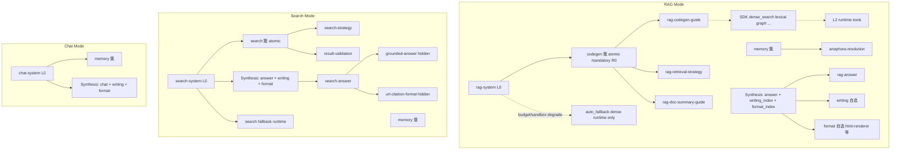

# ADR-0007: ReAct 循环分阶段上下文注入（Per-Iteration Disclosure）

| 项目 | 内容 |
|---|---|
| 状态 | **提议中**（v0.6；RAG 检索 codegen 唯一入口，修订双路径漂移） |
| 决策日期 | 2026-06-08 |
| 关联 | ADR-0006-revised、`docs/agents/progressive-disclosure-framework.md` |
| 背景 | Product E2E `llm_real` 暴露：tool schema 常驻、Skill 仅注入一行 description、会话历史未接入 ReAct messages、format/citation 约束与检索阶段混在同一 cognitive frame |

---

## 1. 问题陈述

当前 `ReActLoop` 实现把 ADR-0006 的简化当成了常态：

| 注入面 | 现状 | 问题 |
|--------|------|------|
| `native_tools` | 每轮 `complete_with_tools(..., &mode.native_tools)` 全量传入 | tool schema 干扰 LLM；**v0.3 取消**，改服务端 fallback + skill 簇 |
| Skill | `<available_skills>` 仅 `id: description` 一行 | `rag-answer`、`html-renderer` 等 SKILL.md 正文从未进入 prompt |
| `format_hint` | 仅在 Synthesis 前 push skill metadata | 检索轮缺少 format 边界，合成轮缺少完整 format 指令 |
| 会话历史 | ReAct 有 `[prior_user_query]` 逻辑，入口未从 PG 灌 `messages` | 多轮 RAG 退化为单轮 |
| Base prompt | `rag-system` 全文每轮常驻 | 旧版 base 写 `[1]` 与 `rag-answer` 冲突；**v0.5** 在 orchestrator 统一 citation 契约 |

**核心澄清（已达成共识）**：

> **ReAct 循环 ≠ 上下文固定。** ReAct 只要求每轮 LLM 能看见上一轮 tool observation。在此之上，system 内容、tools 列表、skill 正文、会话片段均可按轮次变化。与状态机/工作流的区别是**谁驱动转移**（LLM vs 代码），不是能否分阶段注入。

---

## 2. 决策（提议）

保留**单一 ReActLoop + Synthesis**，引入统一的 **Per-Iteration Context Assembler**：

```
system(iter) = base + Σ disclosure_slices(iter, request, phase)
tools(iter)  = assembler.tools_on_demand(iter, phase, mode)   // 按需；无 native_tools
messages       = history + react_trace(tool_calls + observations) + query
```

**LLM API 一轮调用携带**：
- `messages`：含历史 **tool 消息**（assistant `tool_calls` + tool role `content`）
- `tools` 参数：仅在该轮 **需要** 继续 tool_call 时传入对应 **schema 子集**（非全量常驻）

### 2.0 Global System Prompt（每轮常驻）

`system_prompt_base`（`rag-system` / `search-system` / `chat-system`）作为 **ReAct 全生命周期 orchestrator**，在**每一轮** LLM 调用中常驻 system 首部。

#### 2.0.1 Orchestrator 五段式结构（已定）

每份 system prompt 按固定章节编写（实现时可映射为 SKILL.md 内 `<role>` 等标签）：

| 章节 | 内容 | 三 Mode 差异 |
|------|------|-------------|
| **1. 角色** | 你是谁、服务的用户场景 | RAG 文档助手 / Search 网络助手 / Chat 对话助手 |
| **2. 任务** | 本 mode 下 ReAct 循环要完成的任务（检索→合成 / 搜索→合成 / 对话→合成） | 各 mode 不同 |
| **3. 定位** | 与另两个 mode 的边界（何时应用本 mode、何时建议切换） | 三份互相引用 |
| **4. 目录** | **无 schema** 的能力目录：检索阶段簇（`codegen`/`search`/`memory`）、Synthesis 阶段 `writing`/`format` 簇说明 | rag 仅 `codegen`+`memory`；search 含 `search`；chat 无检索簇 |
| **5. 回答格式** | 最终回答的结构、语言、引用、禁止编造 | **见 §2.0.2** |

**不应写进 orchestrator**（交给 slice / skill body）：tool JSON schema 全文、SDK 方法签名、`html-renderer` 模板细节、grounded-answer 长文证据分级表。

#### 2.0.2 Citation：写入 RAG / Search 的 system prompt（已定）

**结论**：RAG 与 WebSearch 的 **citation 契约应写在 orchestrator §5**，而非仅放在 Synthesis 的 answer skill。理由：

- 检索轮 observation 已含 chunk/搜索结果，模型从第一轮就需要知道如何引用
- Synthesis 再教格式太晚，易出现检索轮草稿与终答格式不一致
- 与「每轮常驻同一 orchestrator」一致：引用是**不变契约**，不是可选 skill

**防重复规则**（避免与 `rag-answer` / `search-answer` 冲突）：

| 层级 | 写什么 |
|------|--------|
| **System §5（契约）** | 唯一权威格式 + 一行禁止项（≤10 行） |
| **answer skill body（细则）** | 示例、边界情况、证据等级、与 `grounded-answer` 衔接；**不得**重新定义格式符号 |

**RAG §5 引用契约（权威）**：

```
- 文档证据引用：[[cite:CHUNK_ID]]，CHUNK_ID 必须来自本轮检索 observation 中的 chunk_id
- 禁止：编造 ID；禁止 Web 序号 [1]；禁止无证据断言
```

**Search §5 引用契约（权威）**：

```
- 网络证据引用：[[n]]，n 为 observation 证据块中的序号 [1][2]…
- 须与 URL 来源一致；禁止编造序号；禁止混用 [[cite:…]]
```

**Chat §5**：无 grounded citation；说明对话体例即可。

`rag-citation-format` / `url-citation-format` 独立 skill **退役语义**（合并进 system §5 + answer skill 示例），不进 ClusterIndex。

**三 Agent 各有一套 orchestrator**（`modes/*.yaml` 的 `system_prompt_base`）：

| Mode | System Prompt | Tool schema | 检索阶段簇 | Synthesis 披露簇 |
|------|---------------|-------------|------------|------------------|
| **rag** | `rag-system` | **`[]` 恒空**（检索不经 native tool） | `codegen`, `memory` | mandatory answer + **`writing` + `format`** |
| **search** | `search-system` | **按需**（如 `web_search`, `web_fetch`） | `search`, `memory` | mandatory answer + **`writing` + `format`** |
| **chat** | `chat-system` | **按需**（若有 `tool_pool`） | `memory` | mandatory `chat` + **`writing` + `format`** |

### 2.1 Disclosure Slice 类型

| Slice | 内容 | 典型挂载时机 |
|-------|------|-------------|
| **GlobalSystem** | `system_prompt_base` 全文（ReAct orchestrator） | **每轮** |
| **History** | PG 会话历史（`[prior_user_query]`，默认 user 角色） | Round 0 起写入 `messages`；更多历史通过 PG / `conversation-history-load` 调取 |
| **Tools** | 本轮允许的 tool JSON schema **子集** | **按需**（检索轮等）；Synthesis 为 `[]`；见 §2.2 |
| **ClusterIndex** | 簇 id + description | 检索轮 Round 0（`codegen`/`search`/`memory`） |
| **SkillBody** | SKILL.md 正文 | 检索阶段按 `skill_request`；Synthesis 见 §2.3.2 |
| **WritingIndex** | `writing` 簇内叶子 id + description | **仅 Synthesis** |
| **FormatIndex** | `format` 簇内叶子 id + description | **仅 Synthesis** |

> **已废弃**：`session_summary` 不再作为 Context slice。产品层跨轮连续性仅依赖 PG messages；需要更长历史时扩展 PG 加载或调用历史工具，不做摘要压缩注入。

### 2.2 工具：取消 native_tools，按需披露 schema + tool 消息（已定）

**意图澄清**：
- **不要** `native_tools`（每轮全量、与 mode 绑死的常驻 schema）
- **要** 在 assembler 判定「本轮需要 tool」时，向 LLM API **同时**传递：
  1. **`tools` 参数**：本轮允许的 schema **子集**
  2. **`messages`**：ReAct 历史中已有的 `tool_calls` / tool role **observation**（以及 assistant 的 tool 请求）

即：**按需传 schema，按需走 tool_call 循环**；不需要 tool 的轮次（尤其 Synthesis）`tools=[]`。

**配置**：`modes/*.yaml` 用 `tool_pool`（**可披露候选池**，非 mode 级 native_tools）替代已废弃的 `native_tools`：

```yaml
tool_pool: []                          # rag：检索不经 LLM tool schema（§2.2.1）
tool_pool: [web_search, web_fetch]     # search
tool_pool: []                          # chat：默认无；可扩展
```

**Assembler 规则**：

| 阶段 | `tools(iter)` | `messages` 中的 tool 内容 |
|------|---------------|---------------------------|
| Round 0 | 见 mode 表 | History +（RAG）mandatory codegen body |
| 检索轮 | 从 `tool_pool` 选出子集；**RAG 恒 `[]`** | 含 code 执行 observation / 服务端 fallback 注入 |
| Synthesis | **`[]`** | 含完整检索 trace；**不再**开放新 tool_call |

| Mode | `tool_pool` / `tools(iter)` | 检索入口 |
|------|------------------------------|----------|
| **RAG** | **`[]` 恒空** | **`codegen` 簇唯一入口** → Python SDK → runtime L2；服务端 `auto_fallback` 代跑 dense（不经 LLM schema） |
| **Search** | `web_search`, `web_fetch` 按需 | 简单直调 + `search` 簇复杂路径 |
| **Chat** | 默认 `[]` | 纯对话 + `memory` 簇 |

#### 2.2.1 RAG 检索：`codegen` 唯一入口（v0.6 已定）

> **废止 v0.5 漂移**：RAG 不得将 `dense_retrieval` 放入 `tool_pool` 或 orchestrator 直调指引。

| 层级 | 角色 |
|------|------|
| **LLM 可见** | Round 0 **强制**注入 `codegen` 原子簇正文；模型输出 `<code language="python">` 调 SDK |
| **Runtime** | `dense_retrieval`、`lexical_retrieval` 等 L1/L2 工具仅由沙箱 SDK 或服务端 fallback 调用 |
| **禁止** | LLM `NativeToolCalls` 直调 `dense_retrieval`；orchestrator 写「调用 dense_retrieval 工具」 |

简单问答（如「什么是反脆弱性？」）同样走 codegen：一行 `client.dense_search(...)`，或由 **服务端 `auto_fallback`** 在 budget/沙箱失败时代跑 `dense_retrieval`。

**Orchestrator**：只写 codegen/SDK 契约与簇目录，**不**嵌入 tool JSON schema。

**Search / Chat** 仍 **禁止 codegen**（无 SDK 代码块路径）。

### 2.3 Skill 正文 vs 索引

- **ClusterIndex**：告诉 LLM「有哪些能力簇」（低 token）；**仅 RAG** 在检索域暴露 `codegen`
- **Body**：请求簇后注入完整 SKILL.md（受 token budget 约束）
- **原子捆绑**（`atomic: true`）：请求簇时必须加载列出的全部叶子 skill，不可拆选

| Mode | 原子簇 | 捆绑叶子 | 说明 |
|------|--------|----------|------|
| **rag** | `codegen` | `rag-codegen-guide`, `rag-retrieval-strategy`, `rag-doc-summary-guide` | **全部检索唯一入口**（含简单 dense）；Round 0 mandatory body；Chat/Search **无此簇** |
| **search** | `search` | `search-strategy`, `result-validation` | 复杂搜索策略；**不用 codegen** |
| **chat** | — | — | 无检索/搜索类原子簇 |

**检索阶段簇**（Round 0 ClusterIndex，三 mode 按表裁剪）：
- `codegen`（仅 rag）、`search`（仅 search）、`memory`（三 mode）

**Synthesis 阶段簇**（**三 mode 均披露**，与 `writing` 对称）：
- `writing`：文体、语气、brainstorming
- `format`：输出形态（`html-renderer`、`ppt-generation`、`framework-extraction`、`teaching`）

> `writing` / `format` **不进**检索轮 ClusterIndex；**仅在 Synthesis 披露**。

#### 2.3.1 `format` 与 `writing`：Synthesis 对称披露（已定）

| 维度 | `writing` 簇 | `format` 簇 |
|------|-------------|-------------|
| **职能** | 怎么说（语气、文体、叙事） | 长成什么（HTML、幻灯片、框架、教学步骤） |
| **披露时机** | **仅 Synthesis** | **仅 Synthesis** |
| **披露形态** | `WritingIndex`（叶子 id + description） | `FormatIndex`（叶子 id + description） |
| **谁选择** | **Agent 自主**选定 0~1 个叶子 | **Agent 自主**选定 0~1 个叶子 |
| **选定后** | 注入对应 skill **Body**，再生成最终回答 | 同上 |
| **与 mandatory answer 关系** | 并列叠加在 Synthesis system | 并列叠加 |

`html-renderer` 在 **`format` 簇**，**不在** `writing`、**不在** orchestrator 正文。

**可选提示**（不强制跳过选择）：
- `format_hint` / `writing_hint`：写入 Synthesis system 作为用户偏好，Agent 仍可 override。

**Synthesis 组装顺序（提议）**：

```
1. mandatory answer skill body（rag-answer / search-answer / chat + grounded-answer）
2. WritingIndex + FormatIndex（三 mode 均提供）
3. Agent 声明 writing_choice / format_choice（或隐式体现在生成中）
4. 注入已选 writing + format skill body
5. tools=[]，生成最终回答
```

**Synthesis mandatory**（代码强制，非可选）：
- rag → `rag-answer`（depends `grounded-answer`）
- search → `search-answer`（depends `grounded-answer`）
- chat → `chat`

### 2.4 会话历史

- 有 `session_id` 时从 PG 加载 prior messages → 填入 `AgentRequest.messages`
- 遵守 ADR-0005：默认只注入 **user** 角色，加 `[prior_user_query]` 前缀
- 需要更多历史：从 PG 分页加载或 `conversation-history-load`，**不使用 session summary**
- 指代消解：可选注入 `memory` 簇（`anaphora-resolution`），不靠摘要字段

### 2.5 三 Mode YAML 配置（提议）

结构统一；**仅 RAG 含 `codegen` 簇**。

**rag**（[`modes/rag.yaml`](../modes/rag.yaml)）：
```yaml
system_prompt_base: prompts/skills/rag-system/SKILL.md
tool_pool: []   # 检索不经 LLM tool schema；见 §2.2.1
skill_catalog:
  retrieve_clusters: [codegen, memory]
  synthesis_clusters: [writing, format]
  clusters:
    - id: codegen
      skills: [rag-codegen-guide, rag-retrieval-strategy, rag-doc-summary-guide]
      atomic: true
      disclose_at: retrieve
    - id: memory
      skills: [anaphora-resolution]
      disclose_at: retrieve
    - id: writing
      skills: [tone-guidance, brainstorming, academic-writing, professional-writing, concise-writing, storytelling]
      disclose_at: synthesis
    - id: format
      skills: [html-renderer, ppt-generation, framework-extraction, teaching]
      disclose_at: synthesis
  mandatory:
    synthesis: [rag-answer]
```

**search** / **chat** 结构同构：`tool_pool` 分别为 `[web_search, web_fetch]` / `[]`；`retrieve_clusters` 为 `[search, memory]` / `[memory]`；`synthesis_clusters` 均为 `[writing, format]`。

```yaml
disclosure:
  rounds:
    - round_idx: 0
      load: [global_system, history, retrieve_cluster_index, tools_on_demand]
    - round_idx: 1
      load: [skill_body_from_request, tools_on_demand]
  synthesis:
    load: [skill_body_mandatory, writing_index, format_index, selected_skill_bodies]
    tools: []
```

实现时扩展 `crates/app/src/agents/loop/config.rs`，**不**新建状态机；`ContextAssembler` 读 `mode.id` 选择 orchestrator 与簇表。

---

## 3. 配置扩展（DisclosureLoad）

在 `disclosure.rounds` 上扩展 slice 类型（见 §2.1），三份 `modes/*.yaml` 同步迁移。

---

## 4. 与测试问题的映射

| E2E 失败 | 本 ADR 解决方式 | 不依赖本 ADR 的 interim fix（已在其他提交） |
|----------|----------------|-------------------------------------------|
| `format_real` | format 场景 Round 0 不暴露 tool；Synthesis 注入 html-renderer 正文 | modality YAML/Rust 对齐 |
| `multi_turn` | Context slice 注入 PG 历史 | `build_agent_request` 从 PG 加载 user messages |
| `rag_real` citation | Synthesis 注入 rag-answer + 后端 ID 校验 | `[[cite:chunk_id]]` 后处理 + E2E 改 ID 断言 |
| synthesis 500 (thinking) | — | stream 解析 reasoning fallback |

---

## 5. 非目标

- 不引入 LangGraph / 外部工作流引擎
- 不替换 ReAct 为显式 PLAN→EXECUTE→ANSWER 状态机（语义阶段映射到 iteration，仍是一个 loop）
- 不在 agent ReAct loop 使用 `session_summary` 压缩注入（产品层废弃）
- 不在本 ADR 内做 PDF bbox 级 `grounded_spans`（citation 生产版后续）

---

## 6. 实现步骤（建议顺序）

1. `assemble_context(iteration, phase, request) -> { system, tools, ... }` 抽函数，ReAct 主循环只调用 assembler
2. `DisclosureLoad` 扩展 + YAML 迁移（先 RAG mode）
3. Skill body 加载（读 SKILL.md，token budget）
4. 实现 `tools_on_demand` + `tool_pool`；Synthesis 恒 `tools=[]`；检索轮 schema 与 messages 内 tool trace 同步
5. 移除 `session_summary` 注入路径（历史仅 PG messages）
6. 重写三份 orchestrator：五段式结构（§2.0.1）；RAG/Search §5 写入 citation 契约（§2.0.2）；剥离 tool schema / HTML 细节
7. 迁移三份 `modes/*.yaml`：移除 `native_tools`；三 Mode 均含 `format` 簇
8. 退役 §8.8 所列 skill，从 `skill_catalog` / registry 默认加载路径移除

---

## 7. 验收标准

- [ ] `format_real`：happy path 无 dense modality degrade；HTML 输出稳定
- [ ] `multi_turn`：turn2 在仅传 `session_id` 时可指代 turn1 主题
- [ ] `rag_real`：回答含 `[[cite:chunk_id]]` 且 `citations[]` 与引用 ID 一致
- [ ] 单轮简单 RAG latency 不明显回归（条件披露默认路径）
- [ ] Search mode：`search-system` 无 codegen 指引；复杂路径 `search` 簇原子展开
- [ ] 检索轮按需 `complete_with_tools(..., &tool_subset)`；Synthesis 恒 `&[]`
- [ ] messages 含 tool_calls + observation 时，同轮 API 请求携带对应 schema
- [ ] Synthesis 三 Mode 均披露 `writing_index` + `format_index`；Agent 自选后注入 body
- [ ] Chat/Search 无 codegen；Synthesis mandatory 分别为 `chat` / `search-answer`
- [ ] 三 Mode 每轮 system 均含对应 orchestrator 全文
- [ ] 已退役 skill 不出现在 ClusterIndex 与 mode catalog
- [ ] mock E2E 全绿

---

## 8. Skill / Tool 盘点与簇勾稽关系（v0.4）

> **统计**：48 SKILL.md；13 runtime Tool。**无 native_tools**；检索轮 **按需** 向 API 传 schema 子集 + messages 内 tool trace。Synthesis 披露 `writing` + `format` 两簇（三 mode）。
>
> **活跃于 ReAct loop**：39 个；**退役**（§8.8）：6 个；**loop 外**（ingestion/postprocess）：3 个。

### 8.1 概念分层

| 层级 | 含义 | 披露方式 | 数量 |
|------|------|----------|------|
| **L0 Orchestrator** | Mode 全局 system prompt，覆盖 ReAct 全生命周期 | `GlobalSystem` 每轮常驻 | 3 |
| **L1 Runtime Tool** | 有 schema；**按需**进入 `tools` API 参数 | `tool_pool` + `tools_on_demand`；Synthesis 不传 | 13 |
| **L2 RAG 检索工具** | L1 子集，RAG 文档检索 | 经 `codegen` 簇指引 + 代码执行；或 `auto_fallback` | 7 |
| **L3 其他 Runtime Tool** | web_search、calculator 等 | registry；Search fallback / 未来路由 | 见 §8.2.2 |
| **L4 Skill Body** | 纯 prompt 模块（策略、写作、格式、answer） | ClusterIndex → SkillBody；或 mandatory | 20+ |
| **L5 Hidden / Depends** | 不独立进 index，随父 skill `depends` 注入 | 代码跟随父 skill 展开 | 2+ |
| **L6 Out-of-Loop** | ingestion / postprocess / **退役 skill** | **不**进入 ReAct assembler | 9 |

**Tool vs Skill 判定（本项目）**：有 `input_schema`（`reference/args-schema.md`）→ 注册进 `CapabilityRegistry.tools`（id 为 snake_case）；否则为纯 Skill。

### 8.2 全量清单

#### L0 — Orchestrator（每轮 GlobalSystem，不进 ClusterIndex）

| ID | applicable_strategies | 勾稽 |
|----|----------------------|------|
| `rag-system` | rag | 五段式 orchestrator；§5 `[[cite:CHUNK_ID]]`；目录含 codegen/memory；**无 tool_pool** |
| `search-system` | search | 分流：检索轮 vs `search` 簇；**禁止** codegen |
| `chat-system` | chat | 分流：`memory`；Synthesis 选 writing/format |

#### L1 — Runtime Tool（`tool_pool` 候选，**按需**传入 API `tools` 参数）

| Tool ID | tool_pool | 暴露 / 调用方式 |
|---------|-----------|-----------------|
| `dense_retrieval` | **rag：不进 pool** | 仅 SDK（codegen）或服务端 `auto_fallback` |
| `web_search`, `web_fetch` | search | 检索轮按需 schema |
| `lexical_retrieval` … `doc_index` | **rag：不进 pool** | 仅 SDK（codegen 代码执行） |
| `calculator` / `weather_query` | chat（可选扩展） | 按需 |
| `conversation_history_load` | 三 mode（可选） | `memory` 相关检索轮 |
| `code_interpreter` | 默认无 | 不进默认 pool |

#### L2 — RAG 检索工具（L1 子集）

| Tool ID | SKILL | 用途 | 与 codegen 簇关系 |
|---------|-------|------|-------------------|
| `lexical_retrieval` | `lexical-retrieval` | 精确字面匹配 | `rag-retrieval-strategy` + `rag-codegen-guide` 引用 |
| `graph_retrieval` | `graph-retrieval` | 实体关系多跳 | 同上 |
| `index_lookup` | `index-lookup` | 按 chunk UUID 精读 | 同上；常配合 `doc_index` |
| `doc_summary` | `doc-summary` | 文档级概览 | `rag-doc-summary-guide` 引用 |
| `doc_metadata` | `doc-metadata` | 文件元信息 / TOC | 同上 |
| `doc_index` | `doc-index` | 章节结构 → chunk 列表 | 同上 |

> **勾稽（v0.6）**：**主路径** codegen 簇 → LLM SDK 代码（含一行 `dense_search`）→ runtime L1/L2；**兜底** 服务端 `auto_fallback` 代跑 `dense_retrieval`（不经 LLM schema）。

#### L4/L5 — Skill Body 按职能分类

| 职能 | ID | strategies | activation | 披露角色 |
|------|-----|------------|------------|----------|
| **Answer（mandatory）** | `rag-answer` | rag | answer | Synthesis 强制；`depends: [grounded-answer]` |
| | `search-answer` | search | answer | 同上 |
| | `chat` | chat | answer | 同上 |
| **Answer 依赖（hidden）** | `grounded-answer` | (全) | — | 随 answer skill 自动注入，**不进 index** |
| **Citation（hidden）** | `rag-citation-format` | rag | — | 并入 `rag-answer` 权威；**不进 index** |
| | `url-citation-format` | search | — | 并入 `search-answer`；**不进 index** |
| **RAG codegen 捆绑** | `rag-codegen-guide` | rag | — | 仅经 `codegen` 簇原子展开 |
| | `rag-retrieval-strategy` | rag | — | 同上 |
| | `rag-doc-summary-guide` | rag | — | 同上 |
| **Search 捆绑** | `search-strategy` | search | — | 仅经 `search` 簇原子展开 |
| | `result-validation` | search | — | 同上 |
| **Memory** | `anaphora-resolution` | rag, search, chat | — | `memory` 簇 |
| **Writing** | `tone-guidance` | chat | — | `writing` 簇 |
| | `brainstorming` | chat | — | `writing` 簇（**已定**，不独立 behavior 簇） |
| | `academic-writing` | chat,rag,search | answer | `writing` 簇 |
| | `professional-writing` | chat,rag,search | answer | 同上 |
| | `concise-writing` | chat,rag,search | answer | 同上 |
| | `storytelling` | chat,rag,search | answer | 同上 |
| **Format** | `html-renderer` | chat,rag,search | answer | **`format` 簇**；**仅 Synthesis** `FormatIndex` → Agent 自选 → body（§2.3.1） |
| | `ppt-generation` | chat,rag,search | — | 同上 |
| | `framework-extraction` | chat,rag,search | answer | 同上 |
| | `teaching` | chat,rag,search | answer | 同上 |

#### L6 — Out-of-Loop / 退役（不进 ReAct assembler）

| ID | 原因 |
|----|------|
| `session-summary` | 产品废弃 session_summary 注入 |
| `user-profile-extraction` | postprocess dream layer |
| `triplet-extraction` | ingestion worker |
| `rag-plan` | **退役**（D1）：orchestrator + codegen/search 簇取代 |
| `search-plan` | **退役**（D1） |
| `chat-plan` | **退役**（D1） |
| `rag-eval` | **退役**（D2）：Rust `evaluator` 模块承担，不注入 skill body |
| `search-eval` | **退役**（D2） |
| `rag-memory-mgmt` | **退役**（D3）：改 PG history + `conversation_history_load` |

### 8.3 三 Mode 簇定义与勾稽图



### 8.4 簇 — 叶子 — 工具 勾稽表（ReAct loop 范围内）

| 簇 ID | Mode | atomic | ClusterIndex | 展开叶子 Skill | 关联 Tool | 触发条件 |
|-------|------|--------|--------------|----------------|-----------|----------|
| `codegen` | rag | **是** | 是（Round 0 **mandatory body**） | codegen-guide, retrieval-strategy, doc-summary-guide | L1/L2 runtime（SDK 代码执行） | **全部检索**；fallback 仅服务端代跑 dense |
| `search` | search | **是** | 是 | search-strategy, result-validation | web_search/web_fetch runtime | 复杂搜索；简单路径靠 search fallback |
| `memory` | rag, search, chat | 否 | 检索轮 | anaphora-resolution | conversation_history_load 按需 | 指代、PG 历史 |
| `writing` | rag, search, chat | 否 | **仅 Synthesis** | tone-guidance, brainstorming, academic/…/storytelling | — | Agent 自选 0~1 叶子 |
| `format` | rag, search, chat | 否 | **仅 Synthesis** | html-renderer, ppt-generation, framework-extraction, teaching | — | Agent 自选 0~1 叶子；与 writing 对称 |
| — | rag | — | 否 | `rag-answer` + `grounded-answer` | — | Synthesis **mandatory** |
| — | search | — | 否 | `search-answer` + `grounded-answer` | — | Synthesis **mandatory** |
| — | chat | — | 否 | `chat` | — | Synthesis **mandatory** |

### 8.5 `depends` 与注入链（强制顺序）

```
rag-answer
  └─ depends → grounded-answer        （Synthesis 自动前置）

search-answer
  └─ depends → grounded-answer

（建议废弃独立注入）
rag-citation-format  ──合并语义──→  rag-answer 正文
url-citation-format  ──合并语义──→  search-answer 正文

codegen 簇（原子，无 depends 链，三文件并列注入）
  ├─ rag-codegen-guide      → 引用 L2 tool API
  ├─ rag-retrieval-strategy → 选型 dense/lexical/graph
  └─ rag-doc-summary-guide  → 选型 doc_summary / 多文档工作流
```

### 8.6 与当前 `modes/*.yaml` 的差异（迁移对照）

| 文件 | 现状 skill_catalog | 目标簇 |
|------|-------------------|--------|
| [rag.yaml](../modes/rag.yaml) | 扁平 5 项 + `native_tools` | 无 native_tools；`codegen` + `memory` + `format` |
| [search.yaml](../modes/search.yaml) | 扁平 3 项 + `native_tools` | 无 native_tools；`search` + `memory` + `format` |
| [chat.yaml](../modes/chat.yaml) | round0 硬编码 body + 无 tools | 无 native_tools；`memory` + `writing` + `format` |

### 8.7 已定决策

| # | 决策 |
|---|------|
| D1 | **退役** `rag-plan` / `search-plan` / `chat-plan` |
| D2 | **退役** `rag-eval` / `search-eval` |
| D3 | **退役** `rag-memory-mgmt` |
| D4 | ~~Chat 暴露原子工具~~ → **v0.3 推翻**：三 Mode **均不**向 LLM 暴露 tool schema |
| D5 | L2 仅经 codegen 指引 + runtime 执行 |
| D6 | **`brainstorming` 并入 `writing` 簇** |
| D7 | ~~web_fetch native~~ → **v0.3 推翻**：`web_fetch` 仅 runtime（Search 簇策略执行） |
| D8 | **取消 `native_tools`** → 改 `tool_pool` + **按需**传 schema；同轮 API 含 tool messages + tools 参数 |
| D9 | **`html-renderer` 归 `format` 簇** |
| D10 | **`writing` / `format` 仅 Synthesis 披露**（三 mode）；Agent 自主选题；`format_hint` 仅为偏好提示 |
| D11 | Synthesis 阶段 **`tools=[]`**；检索轮才按需 tool_call |
| D12 | **RAG/Search citation 写入 orchestrator §5**；answer skill 只写细则不重复契约 |
| D13 | 冲突文档归档见 §10；coding agent **以本文为准** |
| D14 | **RAG `tool_pool: []`**；检索 **仅** codegen SDK + 服务端 `auto_fallback`；**废止** LLM 直调 `dense_retrieval`（v0.6） |

### 8.8 退役 Skill 处理约定

- SKILL.md 文件**暂保留**于 `prompts/skills/`（避免破坏引用），frontmatter 增加 `deprecation` / 移出 `CapabilityRegistry.standard()` 默认注册（实现阶段）
- 不得出现在任何 mode 的 `skill_catalog`、ClusterIndex、`DisclosureLoad::Auto` 关键词表
- 退役清单：`rag-plan`, `search-plan`, `chat-plan`, `rag-eval`, `search-eval`, `rag-memory-mgmt`

---

## 10. 文档冲突审查与归档（避免污染 agent 上下文）

> **Coding agent 权威顺序**：**ADR-0007（本文）** > 仍标记有效的 ADR-0006/0005 基础设施章节 > `docs/agents/ARCHIVE-superseded-by-adr-0007.md` 索引中的归档文档（**勿作实现依据**）。

### 10.1 与本文冲突的要点对照

| 旧文档主张 | ADR-0007 取代 |
|------------|---------------|
| `native_tools` 每 mode 0~1 个常驻 schema | `tool_pool` + **按需**传 schema（§2.2） |
| `session_summary` 注入 system | **废弃**；仅 PG messages（§2.4） |
| `format_hint` 硬注入 answer、planner 不感知 | Synthesis **writing/format 簇** Agent 自选；hint 仅为偏好（§2.3.1） |
| PLAN→EXECUTE 显式状态机驱动披露 | 单一 ReActLoop + **ContextAssembler** 按 iteration 切片 |
| `rag-plan` / `search-plan` / `chat-plan` 驱动规划 | **退役**；orchestrator §4 目录 + 簇 |
| citation 仅 answer skill | RAG/Search **orchestrator §5 + answer skill 细则**（§2.0.2） |
| Chat 通过 codegen 调 SDK | Chat **禁止 codegen**；`tool_pool` 默认空 |

### 10.2 已标注归档的文档

以下文件**已加顶部废止横幅**；实现与 prompt 编写时**不要**以之为准：

| 路径 | 处置 | 说明 |
|------|------|------|
| [docs/agents/progressive-disclosure-framework.md](../agents/progressive-disclosure-framework.md) | **归档参考** | v4 PLAN/EXECUTE 状态机；披露切片以 ADR-0007 为准 |
| [docs/adr/0006-unified-agent-loop-revised.md](0006-unified-agent-loop-revised.md) | **部分废止** | Loop 骨架仍有效；`native_tools`/disclosure 细节被 0007 取代 |
| [docs/adr/0006-unified-agent-loop.md](0006-unified-agent-loop.md) | **归档** | 早期稿，已被 revised 取代 |
| [.handoff-0006-stage1.md](../../.handoff-0006-stage1.md) | **归档** | 会话 handoff；含过时 native_tools 描述 |
| [.handoff-0006-all-stages.md](../../.handoff-0006-all-stages.md) | **归档** | 同上 |
| [docs/architecture-review-2026-06.md](../architecture-review-2026-06.md) | **部分废止** | 产品观察有效；format/plan 机制见 §10.1 |
| [prompts/skills/session-summary/SKILL.md](../../prompts/skills/session-summary/SKILL.md) | **退役** | 产品废弃 session_summary |
| [prompts/skills/rag-plan/SKILL.md](../../prompts/skills/rag-plan/SKILL.md) | **退役** | 见 §8.8 |
| [prompts/skills/search-plan/SKILL.md](../../prompts/skills/search-plan/SKILL.md) | **退役** | 同上 |
| [prompts/skills/chat-plan/SKILL.md](../../prompts/skills/chat-plan/SKILL.md) | **退役** | 同上 |
| [prompts/skills/rag-memory-mgmt/SKILL.md](../../prompts/skills/rag-memory-mgmt/SKILL.md) | **退役** | 见 D3 |
| [prompts/skills/rag-eval/SKILL.md](../../prompts/skills/rag-eval/SKILL.md) | **退役** | 见 D2 |
| [prompts/skills/search-eval/SKILL.md](../../prompts/skills/search-eval/SKILL.md) | **退役** | 见 D2 |
| [prompts/skills/rag-citation-format/SKILL.md](../../prompts/skills/rag-citation-format/SKILL.md) | **退役语义** | 合并至 `rag-system` §5 |
| [prompts/skills/url-citation-format/SKILL.md](../../prompts/skills/url-citation-format/SKILL.md) | **退役语义** | 合并至 `search-system` §5 |

**索引副本**：[docs/agents/ARCHIVE-superseded-by-adr-0007.md](../agents/ARCHIVE-superseded-by-adr-0007.md)

### 10.3 仍有效、需与本文配合阅读的文档

| 路径 | 关系 |
|------|------|
| [ADR-0005-unified-agent-kernel-revised.md](0005-unified-agent-kernel-revised.md) | `[prior_user_query]`、PG 历史加载 |
| [ADR-0006-unified-agent-loop-revised.md](0006-unified-agent-loop-revised.md) §1–2 动机、ReAct+Synthesis 二分 | 骨架一致 |
| [docs/e2e-gates.md](../e2e-gates.md) | 验收场景；披露实现后同步更新 |
| `prompts/skills/rag-answer/SKILL.md` | Synthesis mandatory；citation **细则**（契约在 rag-system §5） |
| `prompts/skills/search-answer/SKILL.md` | 同上 |

### 10.4 待同步修改的运行时代码/配置（非文档）

实现时注意代码仍引用旧模型处：`modes/*.yaml` 的 `native_tools`、`AgentRequest.session_summary`、`DisclosureLoad::Auto`、`skill_catalog` 扁平列表。以本文为准改代码，**勿**反向改回归档文档。

---

## 11. 参考

- 本文 §8 — Skill/Tool 盘点与簇勾稽关系（v0.4）
- 本文 §10 — 文档冲突审查与归档
- `docs/agents/ARCHIVE-superseded-by-adr-0007.md` — 废止文档索引
- `docs/agents/progressive-disclosure-framework.md` — **已归档**，仅历史参考
- `docs/adr/0006-unified-agent-loop-revised.md` — 当前简化实现
- `docs/adr/0005-unified-agent-kernel-revised.md` — `[prior_user_query]` 跨 mode 历史
- `prompts/skills/rag-answer/SKILL.md` — RAG citation 权威格式 `[[cite:CHUNK_ID]]`
