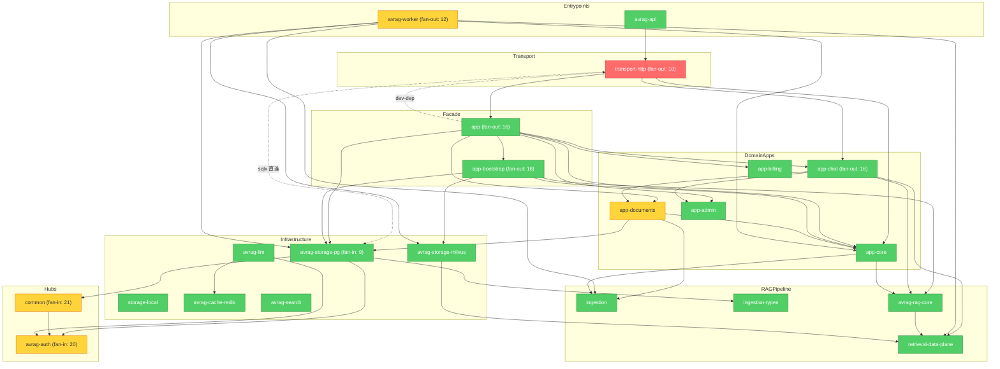

# Brooks-Lint Review

**Mode:** Architecture Audit  
**Scope:** `avrag-rs` 全 workspace（35 成员）+ 抽样 `frontend_next`；深度探测（依赖图、Port 迁移、worker/transport 分层、领域词汇）  
**Health Score:** 77/100  
**Trend:** 73 → 77 (+4) over last 2 runs

Round 2–P1 Phase A 结构性修复已兑现：`cargo build --workspace` 通过、`pg()` 逃逸口移除、`app-core` 与 `storage-pg` 解耦、worker 拆分为 `pipeline/` 模块。剩余主债集中在 **transport-http 直连 PG** 与 **hub crate 高扇入**。

---

## Module Dependency Graph



---

## Findings

### 🟡 Warning

**Dependency Disorder — transport-http 传输层直连 PostgreSQL**

Symptom: `transport-http` 在 `auth_primary.rs`（258 行）、`auth_secondary.rs`（1387 行）、`routes/admin.rs`（786 行）中直接使用 `sqlx::query` / `PgPool`，合计约 2400+ 行 SQL 与 RLS `set_config` 逻辑嵌在 HTTP 路由层；`Cargo.toml` 声明 `sqlx` 生产依赖。P1 Phase A 已在 `app-core` 引入 `AdminStorePort` 等 trait，但 admin/auth 热路径未迁移。

Source: Martin — Clean Architecture — Dependency Inversion Principle (DIP)

Consequence: 数据库 schema 或 RLS 策略变更需同时修改传输层与存储层，auth 安全逻辑分散在 HTTP/应用/存储三处，无法单独对 admin 行为做契约测试或替换 PG 实现。

Remedy: 将 `auth_primary` / `auth_secondary` / `routes/admin` 中的 SQL 下沉到 `app-bootstrap` adapter（或新建 `AuthStorePort` / 扩展现有 `AdminStorePort`）；`transport-http` 仅调用 `AppState` 方法；完成后从 `transport-http/Cargo.toml` 移除 `sqlx`。

---

**Dependency Disorder — app-documents 生产依赖 storage-pg**

Symptom: `app-documents/Cargo.toml` 生产依赖 `avrag-storage-pg`；`pg_content_store.rs` 在域应用 crate 内实现 `ContentStore`，直接 `use avrag_storage_pg::{PgAppRepository, ...}`。`DocumentStorePort` 契约测试已禁止 `storage.pg()`，但 PG adapter 仍留在 documents crate 而非 composition root。

Source: Martin — Clean Architecture — Stable Dependencies Principle (SDP)

Consequence: 任何 `storage-pg` API 变更触发 `app-documents` 重编译；documents 域无法以纯 Port + 内存 fake 运行集成测试，必须拉 PG 类型。

Remedy: 将 `PgContentStore` 迁至 `app-bootstrap/src/adapters/`（与 `PgDocumentStoreAdapter` 并列）；`app-documents` 仅依赖 `app-core` Port 与 `common::ContentStore` trait。

---

**Cognitive Overload — worker pipeline/helpers.rs 上帝模块**

Symptom: `bins/worker/src/pipeline/helpers.rs` 1273 行，`document_pipeline.rs` 664 行；单文件混合解析路由、Milvus 索引、PG 通知、Redis 锁、VLM 多模态与 IR 校验等多层抽象。

Source: Fowler — Refactoring — Long Method（模块级延伸）

Consequence: 修复单一 ingest 路径（如 OCR gating 或 multimodal degrade）需阅读千行文件，回归面覆盖 worker 全流水线；新人无法从文件名判断修改落点。

Remedy: 按职责拆为 `pipeline/parse_route.rs`、`pipeline/index_dispatch.rs`、`pipeline/pg_side_effects.rs`；`helpers.rs` 仅保留跨步骤小函数；目标单文件 < 400 行。

---

**Change Propagation — common / auth 超高扇入枢纽**

Symptom: 生产依赖扇入：`common` 21、`avrag-auth` 20；扇出 Top 4 为 `app-bootstrap`(18)、`app`(16)、`app-chat`(16)、`worker`(12)。改动 `AuthContext` 或 `AppError` 触发 workspace 大范围重编译。

Source: Brooks — The Mythical Man-Month — Ch. 2: Brooks's Law (communication overhead via change radius)

Consequence: 横切类型演进（如多租户 claims、错误码扩展）成本高，抑制小步重构；CI 增量编译收益有限。

Remedy: 将 `common` 拆为 `common-types`（纯数据结构）+ `common-http`（ApiResponse 等）；auth 导出面收敛为 `AuthContext` + 3–5 个 port trait；新代码禁止 domain crate 直接依赖完整 `common` 聚合。

---

**Cognitive Overload — app-chat 代理子系统文件过大**

Symptom: `agents/loop/mod.rs` 1088 行、`chat_private.rs` 1119 行、`rag_prompts.rs` 1739 行、`agents/eval_framework.rs` 1633 行；单 crate 合计约 2.7 万行。

Source: Ousterhout — A Philosophy of Software Design — Ch. 4: Modules Should Be Deep（接口复杂相对功能）

Consequence: Chat/agent 行为变更难以定位；prompt 与 runtime 逻辑纠缠，阻碍独立测试 RAG prompt 版本。

Remedy: 将 `rag_prompts.rs` 迁为 `prompts/` 目录按场景分文件；`agents/loop/` 拆 `plan.rs` / `execute.rs` / `stream.rs`；eval 框架移入 `#[cfg(feature = "eval")]` 或独立 `app-chat-eval` crate。

---

### 🟢 Suggestion

**Dependency Disorder — dev 构建 app ↔ transport-http 环**

Symptom: `app` 生产不依赖 `transport-http`，但 `dev-dependencies` 含 `transport-http`；`transport-http` 生产依赖 `app`。dev 测试构建存在双向边。

Source: Martin — Clean Architecture — Acyclic Dependencies Principle (ADP)

Consequence: 集成测试 crate 边界模糊，未来可能引入生产级反向依赖。

Remedy: 将 `app` 中依赖 `transport-http` 的测试迁至 `tests/` 或 `transport-http` 的 `#[cfg(test)]`；删除 `app/Cargo.toml` 中 `transport-http` dev-dep。

---

**Knowledge Duplication — 定价改版 gate 多入口残留**

Symptom: 已抽取 `usePricingRevampGate` 与 `PricingRevampGate`，但 `pricing/page.tsx`、`settings/usage`、`upgrade/paywall`、`workspace-surface` 等仍各自引用 `isPricingRevampEnabledSSR` / probe 逻辑（14 文件命中）。

Source: Hunt & Thomas — The Pragmatic Programmer — DRY: Don't Repeat Yourself

Consequence: feature flag 语义变更需改多处 SSR + client probe，易出现页面间行为不一致。

Remedy: 统一由 `<PricingRevampGate>` 包裹或 layout 级 middleware；页面内只读 gate 结果，不重复 probe。

---

**Accidental Complexity — transport-http notebooks handler 单体**

Symptom: `handlers/notebooks.rs` 924 行，混合 notebook CRUD、分析收集与流式响应。

Source: Fowler — Refactoring — Divergent Change

Consequence: notebook 与分析功能耦在同一文件，任一维度变更增加另一维度回归风险。

Remedy: 拆为 `handlers/notebooks_crud.rs` 与 `handlers/notebook_analysis.rs`，共享 `NotebookRequestState` 提取层。

---

## Summary

本轮最大进展是 **P0/P1 Phase A 落地**：workspace 可编译、`StorageContext` Port 化、`pg()` 移除、worker 从 3263 行 `main.rs` 收敛为 `pipeline/` 模块且去掉对 `app` 的依赖。当前架构主瓶颈是 **transport-http 层 ~2400 行 SQL 未 Port 化**，应作为 P1 Phase B 首要任务；其次收敛 `common`/`auth` 扇入与 worker/chat 超大文件。

建议修复顺序：transport-http SQL 下沉 → `PgContentStore` 迁 bootstrap → `pipeline/helpers.rs` 拆分 → hub crate 瘦身。完成后目标 Architecture ≥ 85。

---

## 与 2026-06-10 审计对照

| 项目 | 2026-06-10 | 2026-06-12（本轮） |
|------|------------|-------------------|
| `cargo build --workspace` | ❌ storage-pg 编译失败 | ✅ 通过（实测 2026-06-12） |
| `app-core` → `storage-pg` | ❌ 生产依赖 + Port 泄漏 | ✅ Cargo 无 storage-pg；Port 在 `storage_context.rs` |
| `storage.pg()` 逃逸口 | ❌ 多处 | ✅ 零匹配；契约测试守护 |
| worker `main.rs` | ❌ 3263 行 | ✅ 4 行；逻辑在 `lib.rs` + `pipeline/` |
| worker → `app` | ❌ 仅为 runtime_mode | ✅ 已移除；改依赖 `app-core` |
| URL 绕过 ParseRouter | ❌ 硬编码 Local+Html | ✅ `processor.rs` 统一 `ParseRouter::route` |
| `PageParseStatus` | ⚠️ 字符串 JSON 泄漏 | ✅ `ingestion/parser/page_status.rs` 强类型 |
| transport-http SQL | ⚠️ 已识别 | ❌ 仍未迁移（本轮首要 Warning） |
| 计费词汇 Enterprise/Plus | ⚠️ 分裂 | ✅ `billing/tier.rs` 归一化 + 单测 |

---

## 应保留的正面模式

| 模式 | 位置 | 说明 |
|------|------|------|
| `RetrievalDataPlane` seam | `retrieval-data-plane` + `MilvusDataPlane` | rag-core 不依赖 storage-milvus |
| Port + bootstrap adapter | `app-core` traits + `app-bootstrap/src/adapters/` | `DocumentStorePort` / `AdminStorePort` / `ChatPersistencePort` |
| `StorageContext` 无 `pg()` | `app-core/src/storage_context.rs` | 仅暴露 Port getter |
| Worker `pipeline/` | `bins/worker/src/pipeline/` | 编排与 `indexing/`、`pdf/` 分离 |
| Ingestion typed page status | `ingestion/parser/page_status.rs` | `PageParseStatus` + `PageStatusEntry` |
| 定价 gate 共享 hook | `frontend_next/lib/billing/usePricingRevampGate.ts` | 方向正确，待收敛入口 |

---

## Conway's Law

团队结构未知，本轮跳过组织对齐检查。

---

## 验证命令

```bash
cd avrag-rs

# 全 workspace 编译（P0 回归）
cargo build --workspace

# Port 契约
cargo test -p app-documents -p app-admin -- storage_port_contract

# Worker 体量
wc -l bins/worker/src/main.rs bins/worker/src/pipeline/*.rs

# transport-http SQL 残留规模
wc -l crates/transport-http/src/lib_impl/auth_*.rs crates/transport-http/src/routes/admin.rs

# 历史分数
cat ../.brooks-lint-history.json | jq '.[] | select(.mode=="Architecture Audit")'
```

---

## 修订记录

| 日期 | 说明 |
|------|------|
| 2026-06-12 | 深度复测；归档 [brooks-health-architecture-audit-2026-06-10.md](./archive/brooks-health-architecture-audit-2026-06-10.md) |
