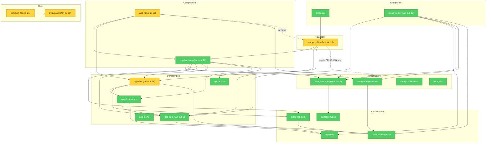

# Brooks-Lint Review

**Mode:** Architecture Audit  
**Scope:** `avrag-rs` 全 workspace（35 成员）+ 抽样 `frontend_next`；深度复测（依赖图、Port 迁移进度、worker/transport 分层、Seam/Conway）  
**Health Score:** 83/100  
**Trend:** 77 → 83 (+6) over last 2 runs（首跑 73 → 83，+10）

P1 Phase B 取得实质进展：`AuthStorePort` 已贯通 auth 热路径，admin 系统路由已 Port 化，`app-documents` 脱离 `storage-pg`，worker `pipeline/` 按职责拆分。剩余主债为 **admin CRUD 双轨** 与 **hub crate 扇入**。

---

## Module Dependency Graph



---

## Findings

### 🟡 Warning

**Dependency Disorder — admin 路由双轨（Port + postgres_repo 并存）**

Symptom: `transport-http/src/routes/admin.rs` 中 6 条路由（`list_orgs`、`get_org`、`list_users`、`delete_user`、`get_usage`、`block_org`、`audit_logs`）仍经 `repo_or_response!` 获取 `postgres_repo`，直接调用 `avrag_admin::handle_*`；另 6 条系统路由（billing/rag-health/workers/degradation/feature-flags）已走 `AdminStorePort` + `call_admin_store`。

Source: Martin — Clean Architecture — Dependency Inversion Principle (DIP)

Consequence: admin 域存在两套访问路径，schema 变更需同时维护 `avrag_admin` handler 与 `PgAdminStoreAdapter`；无法对全部 admin 行为做统一 Port 契约测试。

Remedy: 将剩余 7 个 handler 迁入 `AdminStorePort`（或扩展现有 trait 方法）；`routes/admin.rs` 删除 `repo_or_response!` 宏；`avrag_admin` 仅保留纯领域逻辑，不再接受 `PgAppRepository`。

---

**Change Propagation — common / auth 超高扇入枢纽**

Symptom: 生产依赖扇入：`common` 21、`avrag-auth` 20；扇出 Top 3：`app-bootstrap`(20)、`app`(16)、`app-chat`(16)。改动 `AppError` 或 `AuthContext` 触发 workspace 大范围重编译。

Source: Brooks — The Mythical Man-Month — Ch. 2: Brooks's Law (communication overhead via change radius)

Consequence: 横切类型演进成本高，抑制小步重构；CI 增量编译收益有限。

Remedy: 拆 `common` 为 `common-types`（纯数据）+ `common-http`（ApiResponse）；auth 收敛为最小导出面；新 domain crate 禁止直接依赖完整 `common` 聚合。

---

**Cognitive Overload — app-chat 代理子系统文件过大**

Symptom: `rag_prompts.rs` 1739 行、`agents/eval_framework.rs` 1633 行、`agents/loop/mod.rs` 1089 行、`chat_private.rs` 1119 行；单 crate 约 2.7 万行。

Source: Ousterhout — A Philosophy of Software Design — Ch. 4: Modules Should Be Deep

Consequence: Chat/agent 行为变更难以定位；prompt 版本与 runtime 逻辑纠缠，阻碍独立测试。

Remedy: `rag_prompts.rs` 拆为 `prompts/` 目录；`agents/loop/` 拆 `plan.rs` / `execute.rs` / `stream.rs`；`eval_framework` 移入 `#[cfg(feature = "eval")]` 或独立 crate。

---

**Dependency Disorder — app crate 仍绑定 storage-pg 类型**

Symptom: `app/Cargo.toml` 生产依赖 `avrag-storage-pg` + `sqlx`；`secure_service_impls.rs` 直接引用 `avrag_storage_pg::ObjectStoreHandle`，`config_helpers.rs` 引用 `PgStorageError`。`AppState` 已迁至 `app-bootstrap`，但 `app` 仍承担部分 PG 类型泄漏。

Source: Martin — Clean Architecture — Stable Dependencies Principle (SDP)

Consequence: `app` 无法作为纯 facade 编译；object store 类型变更仍牵动遗留 `app` 代码路径。

Remedy: `ObjectStoreHandle` 引用改为 `app_core::ObjectStorePort`；`PgStorageError` 映射收口到 `app-bootstrap` adapter；从 `app/Cargo.toml` 移除 `storage-pg` 与 `sqlx` 生产依赖。

---

### 🟢 Suggestion

**Dependency Disorder — dev 构建 app ↔ transport-http 环**

Symptom: `transport-http` 生产依赖 `app-bootstrap`（不再依赖 `app`），但 `app` dev-dependencies 仍含 `transport-http`，形成 dev 级双向边。

Source: Martin — Clean Architecture — Acyclic Dependencies Principle (ADP)

Consequence: 集成测试 crate 边界模糊，未来可能引入生产级反向依赖。

Remedy: 将依赖 `transport-http` 的测试迁至顶层 `tests/` 或 `transport-http` 自身 `#[cfg(test)]`；删除 `app/Cargo.toml` 中 `transport-http` dev-dep。

---

**Accidental Complexity — transport-http 残留 sqlx 依赖与巨型 handler**

Symptom: `transport-http/Cargo.toml` 仍声明 `sqlx` 生产依赖，但生产代码仅 `router_core.rs` 一处 `sqlx::Row` import；`begin_auth_admin_tx` 仅剩测试调用。`handlers/notebooks.rs` 924 行混合 notebook CRUD 与分析收集。

Source: Fowler — Refactoring — Divergent Change

Consequence: 依赖图暗示 transport 仍绑 PG，增加审查噪音；notebook 变更回归面过大。

Remedy: 移除 `router_core` 对 `sqlx::Row` 的依赖后删除 `sqlx` from Cargo.toml；拆分 `handlers/notebooks.rs` 为 `crud.rs` + `analysis.rs`。

---

**Knowledge Duplication — 定价 gate 已基本收敛**

Symptom: 共享 `usePricingRevampGate` / `PricingRevampGate` 已落地，仅 4 个业务文件仍直接引用（paywall、usage、gate 组件、hook 本身），较上轮 14 文件大幅改善。

Source: Hunt & Thomas — The Pragmatic Programmer — DRY

Consequence: 残余重复风险低，但 SSR/client probe 语义仍分散在 2 个 client 页面。

Remedy: 在 layout 级统一包裹 `<PricingRevampGate>`，页面内只读 gate 结果。

---

## Testability Seam Assessment

| 边界 | 状态 | 说明 |
|------|------|------|
| Auth | ✅ 已修复 | `AuthStorePort` + `PgAuthStoreAdapter`；`auth_primary`/`auth_secondary` 经 `state.auth_store()` |
| Admin 系统路由 | ✅ 已修复 | billing/rag-health/workers/feature-flags 走 `AdminStorePort` |
| Admin CRUD | ⚠️ 未收敛 | 7 条路由仍 `postgres_repo` → `avrag_admin::handle_*` |
| Documents | ✅ 已修复 | `app-documents` 无生产 `storage-pg`；`PgContentStore` 在 bootstrap |
| Chat 持久化 | ✅ 已修复 | `ChatPersistencePort` + bootstrap adapter |
| Milvus 检索 | ✅ 保留 | `RetrievalDataPlane` seam 完好 |
| Worker ingest | ✅ 改善 | `pipeline/` 拆分 `parse_route` / `index_dispatch` / `pg_side_effects` |

Source: Feathers — Working Effectively with Legacy Code — Ch. 4: The Seam Model

---

## Conway's Law

团队结构未知，本轮跳过组织对齐检查。

---

## Summary

本轮架构得分从 77 升至 83，主要得益于 **auth Port 化完成**、**admin 系统路由 Port 化**、**app-documents 解耦 storage-pg**、**worker pipeline 按文件职责拆分**（`helpers.rs` 从 1273 行降至 255 行）。当前最优先动作是 **admin CRUD 路由统一迁入 AdminStorePort**，完成后可冲击 Architecture ≥ 88。

---

## 三轮审计对照

| 项目 | 2026-06-10 | v1 (同日早) | v2 (本轮) |
|------|------------|-------------|-----------|
| `cargo build --workspace` | ❌ | ✅ | ✅ |
| `app-core` → `storage-pg` | ❌ | ✅ | ✅ |
| `pg()` 逃逸口 | ❌ | ✅ | ✅ |
| worker `main.rs` | ❌ 3263 行 | ✅ 4 行 | ✅ 4 行 |
| worker `pipeline/helpers.rs` | — | ❌ 1273 行 | ✅ 255 行（已拆分） |
| worker → `app` | ❌ | ✅ 已移除 | ✅ |
| auth 直连 sqlx | ❌ ~1400 行 | ❌ 未迁移 | ✅ `AuthStorePort` |
| admin 路由 | ❌ 全 sqlx | ❌ 全 sqlx | ⚠️ 双轨（50% Port） |
| `app-documents` → `storage-pg` | ❌ | ❌ 生产依赖 | ✅ 仅 dev 测试 fake |
| `PgContentStore` 位置 | ❌ documents crate | ❌ documents crate | ✅ `app-bootstrap` |
| transport-http → `app` | 依赖 app | 依赖 app | ✅ 改依赖 `app-bootstrap` |
| 定价 gate 重复 | 6+ 处 | 14 文件 | ✅ 4 文件 |

---

## 应保留的正面模式

| 模式 | 位置 |
|------|------|
| `AuthStorePort` seam | `app-core/auth_store.rs` + `app-bootstrap/adapters/pg_auth_store.rs` |
| `AdminStorePort` 系统路由 | `routes/admin.rs` `call_admin_store` 路径 |
| `StorageContext` Port 聚合 | `app-core/storage_context.rs`（无 `pg()`） |
| Worker `pipeline/` 职责拆分 | `parse_route` / `index_dispatch` / `pg_side_effects` / `document_pipeline` |
| `RetrievalDataPlane` | `retrieval-data-plane` + `MilvusDataPlane` |
| `PageParseStatus` 强类型 | `ingestion/parser/page_status.rs` |

---

## 验证命令

```bash
cd avrag-rs

cargo build --workspace

# Port 契约
cargo test -p app-documents -p app-admin storage_port_contract
cargo test -p app-bootstrap bootstrap_contract

# 体量回归
wc -l bins/worker/src/pipeline/*.rs
wc -l crates/transport-http/src/routes/admin.rs crates/transport-http/src/lib_impl/auth_*.rs

# admin 双轨残留
rg 'repo_or_response!' crates/transport-http/src/routes/admin.rs
rg 'auth_store\(\)' crates/transport-http/src/lib_impl/auth_*.rs

# 历史
jq '.[] | select(.mode=="Architecture Audit")' ../.brooks-lint-history.json
```

---

## 修订记录

| 日期 | 说明 |
|------|------|
| 2026-06-12 v1 | 初轮深测（77 分）→ [archive/brooks-architecture-audit-2026-06-12-v1.md](./archive/brooks-architecture-audit-2026-06-12-v1.md) |
| 2026-06-12 v2 | 复测：auth Port 化、pipeline 拆分、documents 解耦后更新（83 分） |
| 2026-06-10 | 更早报告 → [archive/brooks-health-architecture-audit-2026-06-10.md](./archive/brooks-health-architecture-audit-2026-06-10.md) |
