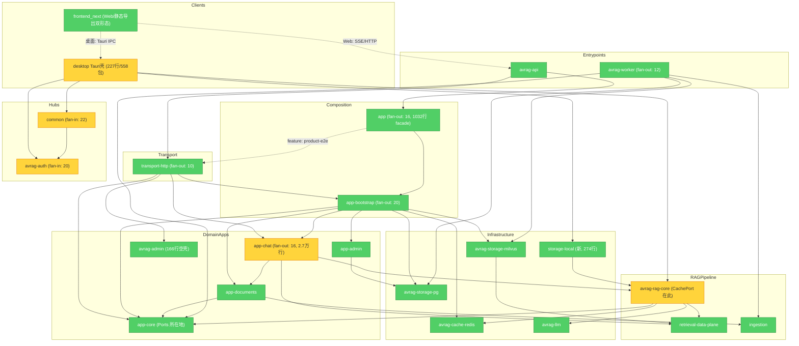

# Brooks-Lint Review

**Mode:** Architecture Audit  
**Scope:** `avrag-rs` 全 workspace(34 成员)+ 新增 `desktop/` Tauri 壳 + `frontend_next` 传输接缝;深度复测 v3(依赖图、v2 遗留项逐条核销、双 workspace 锁、Seam/Conway)  
**Health Score:** 77/100  
**Trend:** 83 → 77 (−6) over last 3 runs(73 → 83 → 77)

**分数下降不代表退步**:v2 的 4 个 Warning 已解决 3 个(admin 双轨、app 绑定 storage-pg、transport sqlx 残留全部清零),本轮下降完全来自**新增 desktop 桌面壳引入的新风险面**(双 Cargo.lock 漂移已实际发生、227 行壳拉满 558 个依赖包)。存量债持续收敛,新增面需要趁早收口。

---

## Module Dependency Graph



无生产依赖环(cargo 强制 DAG);上轮的 dev-dep 反向边 `app → transport-http` 已改为 `product-e2e` feature 门控,且 `transport-http` 不再依赖 `app`,环已消除。

---

## Findings

### 🟡 Warning

**Dependency Disorder — desktop 独立 workspace,Cargo.lock 漂移已实际发生**

Symptom: `desktop/src-tauri` 拥有独立 `Cargo.lock`,通过 path 依赖复用 `avrag-rs` 的 `common` / `avrag-rag-core` / `storage-local` / `avrag-auth`。该锁文件已过期:锁内 `avrag-rag-core` 条目缺少 manifest 中实际声明的 `app-core` 与 `contracts` 依赖;`tokio` 版本两边漂移(workspace 1.52.1 vs desktop 1.52.3)。

Source: Winters et al. — Software Engineering at Google — Ch. 21: Dependency Management

Consequence: 同一份 crate 源码在两个解析上下文中构建,avrag-rs 的 CI 绿灯不能证明 desktop 可编译;path 依赖变更后 desktop 静默落后,集成问题延迟到打包阶段才暴露。

Remedy: 将 `desktop/src-tauri` 加入 `avrag-rs` workspace members(共享单一 Cargo.lock,Tauri 2 支持);若需保持独立,则在 CI 增加 desktop 构建任务,使每次 avrag-rs 变更都验证 desktop 可编译。

---

**Dependency Disorder — 227 行桌面壳被迫编译 558 个包(CachePort 落点过重)**

Symptom: `desktop` 仅需 `ContentStore`(已在 `common`,落点正确)与 `CachePort` 两个 trait,但 `CachePort` 定义在 `avrag-rag-core/src/ports.rs`,而 rag-core 生产依赖 `avrag-llm`、`avrag-cache-redis`、`avrag-code-interpreter`、`app-core`。结果 227 行的 Tauri 壳与 274 行的 `storage-local` 适配器各自拖入 LLM 栈、redis 客户端、代码解释器,desktop 锁文件达 558 包(整个 avrag-rs 615 包)。

Source: Martin — Clean Architecture — Interface Segregation Principle / Stable Dependencies Principle

Consequence: desktop 构建时间与体积被无关子系统支配;rag-core 任何依赖升级都波及桌面端;阶段 3"本地数据栈"会在此地基上继续加重。

Remedy: 将 `CachePort` 等纯 port trait 移到轻量落点(`common` 或独立 `rag-core-ports` crate);`storage-local` 改依赖该轻量 crate,`desktop` 移除对 `avrag-rag-core` 的直接依赖。

---

**Change Propagation — common / avrag-auth 枢纽扇入未收敛,且 common 含重型领域逻辑**

Symptom: 生产扇入 `common` 22(上轮 21)、`avrag-auth` 20(持平);`common` 共 2689 行,其中 `rag_execute.rs` 626 行、`tool_call.rs` 605 行是 RAG 执行契约与工具调用协议——领域级决策栖身在最高扇入的枢纽 crate 里。

Source: Brooks — The Mythical Man-Month — Ch. 2: Brooks's Law (communication overhead via change radius)

Consequence: 修改 RAG 执行契约或 `AppError` 触发约 2/3 workspace 重编译;desktop 现在也依赖 `common`,枢纽变更的爆炸半径延伸到桌面端。

Remedy: 把 `rag_execute.rs` / `tool_call.rs` 迁出 `common`(候选落点:`contracts` 或独立 `rag-contract` crate);`common` 收敛为纯类型 + 错误定义;此举同时降低 desktop 的传递依赖重量。

---

**Cognitive Overload — app-chat 仍有 3 个千行级文件**

Symptom: `chat_private.rs` 1122 行、`agents/loop/mod.rs` 1091 行、`agents/loop/iteration.rs` 1009 行;crate 总量 2.74 万行。对比项:`rag_prompts.rs` 已从 1739 行拆为 `prompts/` 目录(残留 3 行兼容 shim),`eval/` 已门控 `#![cfg(feature = "eval")]`,`agents/loop/` 已拆出 16 个子模块并配 `STATE_MACHINE.md` 文档——拆分方向正确,尚未完成。

Source: Ousterhout — A Philosophy of Software Design — Ch. 4: Modules Should Be Deep

Consequence: chat 私有流程与 agent 循环主干仍难以独立测试与定位;新成员需通读千行文件才能安全改动。

Remedy: 按既有套路继续:`chat_private.rs` 按"文档查询/会话装配/通知"职责拆分;`loop/mod.rs` 把编排主干外的辅助逻辑下沉到既有子模块;`iteration.rs` 拆出步骤执行与状态转移。

---

### 🟢 Suggestion

**Accidental Complexity — avrag-admin 已成 166 行空壳(Lazy Class)**

Symptom: admin 路由全部 Port 化后,`avrag-admin` 仅剩 `handle_health()`(8 行)、16 行 service、69 行 models、64 行 audit;生产扇入仅 `transport-http` 一处。

Source: Fowler — Refactoring — Lazy Class

Consequence: 多一个 crate 的认知与维护成本,却几乎不承载行为;新人会误以为 admin 领域逻辑在此。

Remedy: 将 models/audit 类型并入 `app-admin` 或 `app-core/admin_store.rs`,`handle_health` 内联到 transport-http,删除该 crate。

---

**Accidental Complexity — app-admin 声明了未使用的 storage-pg 生产依赖**

Symptom: `app-admin/Cargo.toml` 生产依赖 `avrag-storage-pg`,但 `src/` 全目录零引用(仅 `tests/storage_port_contract.rs` 使用,且 dev-dependencies 已重复声明)。

Source: Martin — Clean Architecture — Stable Dependencies Principle

Consequence: 依赖图虚报"domain app 依赖 PG 基础设施",误导架构审查;白白拉长 app-admin 及其下游的编译链。

Remedy: 从 `[dependencies]` 删除 `avrag-storage-pg`(保留 dev-dependencies 即可),依赖图上 `AppAdmin → StoragePG` 边随之消失。

---

**Testability Seam — desktop 用全局单例而非 Tauri 托管状态**

Symptom: `desktop/src-tauri/src/lib.rs` 以 `static LOCAL_STORE / LOCAL_CACHE: OnceCell<...>` 全局单例持有本地存储,Tauri command 直接读全局;未使用 Tauri 2 的 `app.manage()` / `State<T>` 注入机制。

Source: Feathers — Working Effectively with Legacy Code — Ch. 4: The Seam Model

Consequence: command 无法在测试中替换存储实现;`init_local_backend` 进程内只能成功一次,重新初始化(如切换数据目录)需重启进程。

Remedy: 改用 `app.manage(AppLocalState { store, cache })` + command 参数注入 `State<AppLocalState>`;趁壳层只有 227 行时改,成本最低。

---

## Testability Seam Assessment

| 边界 | 状态 | 说明 |
|------|------|------|
| Auth | ✅ 保持 | `AuthStorePort` + `PgAuthStoreAdapter` |
| Admin | ✅ 本轮收口 | 全部路由经 `call_admin_store` → `AdminStorePort`;仅 `handle_health()` 纯函数残留,无 DB 路径 |
| Documents/Content | ✅✅ 双适配器验证 | `ContentStore`(common)现有 `PgContentStore`(bootstrap)与 `LocalContentStore`(storage-local)两个适配器——seam 由假设变为事实 |
| Cache | ✅ 双适配器 | `CachePort`:redis 实现 + `LocalCache`;但 trait 落点过重(见 Warning 2) |
| Chat 持久化 | ✅ 保持 | `ChatPersistencePort` + `pg_chat_persistence` adapter |
| Milvus 检索 | ✅ 保持 | `RetrievalDataPlane` seam 完好 |
| 前端传输 | ✅ 新增 | `lib/runtime/transport.ts` 统一分叉 Web SSE vs Tauri IPC;`use-chat-stream.ts` 与 `api-access/client.ts` 均已走该接缝,UI 组件无环境感知 |
| product-e2e | ✅ 新增 | `app/product_e2e_http.rs` 以 feature 门控提供进程内 HTTP 测试上下文 |
| Desktop 状态 | ⚠️ 弱 seam | OnceCell 全局单例(见 Suggestion 3) |

注:desktop `chat_stream` / `api_call` 目前是占位实现(返回固定文案),`AGENTS.md` 路线图已明确排期为阶段 2,属于有计划的分阶段交付,不计为债。

Source: Feathers — Working Effectively with Legacy Code — Ch. 4: The Seam Model

---

## Conway's Law

单人/单团队维护整个 monorepo,无跨团队协调成本,组织对齐检查不适用,跳过。

---

## Summary

存量架构债清偿良好:v2 的 4 个 Warning 解决 3 个,7 项遗留全部核销或显著改善。当前最优先动作是**趁 desktop 还只有 227 行时收口其依赖结构**——把 `desktop/src-tauri` 并入 workspace(消除双锁)+ 把 `CachePort` 移到轻量 crate(切断 LLM/redis 传递链),两个动作合计影响半径很小,但能避免桌面端在阶段 1-3 推进中把问题固化。`common` 枢纽拆分(`rag_execute`/`tool_call` 迁出)是中期第二优先级。

---

## v2 遗留项核销对照

| v2 发现 | 严重度 | 本轮状态 |
|---------|--------|----------|
| admin 路由双轨(Port + postgres_repo) | 🟡 | ✅ 已解决:`repo_or_response!` 清零,全部 `call_admin_store` |
| common/auth 枢纽扇入 | 🟡 | ⚠️ 未收敛:fan-in 21→22 / 20→20,本轮升级了证据(rag_execute/tool_call 在 common) |
| app-chat 大文件 | 🟡 | ⚠️ 部分改善:rag_prompts 已拆、eval 已门控、loop/ 已拆 16 子模块;仍余 3 个千行文件 |
| app 绑定 storage-pg 生产依赖 | 🟡 | ✅ 已解决:storage-pg/sqlx 均移入 dev-dependencies,生产代码零引用 |
| dev 构建 app ↔ transport-http 环 | 🟢 | ✅ 已解决:改 `product-e2e` feature 门控,无反向边 |
| transport-http 残留 sqlx | 🟢 | ✅ 已解决:Cargo.toml 已无 sqlx |
| 定价 gate 分散 | 🟢 | ✅ 已解决:layout 级 `PricingRevampGate` + context 落地 |

---

## 本轮新增风险面(desktop)

| 项 | 严重度 | 摘要 |
|----|--------|------|
| 双 workspace 锁漂移 | 🟡 | desktop Cargo.lock 已过期(rag-core 条目缺 app-core/contracts) |
| 壳层依赖过重 | 🟡 | 227 行壳 → 558 包,根因 CachePort 落点在重型 rag-core |
| OnceCell 全局单例 | 🟢 | 应改 Tauri managed state |
| `frontend_next/out/` 未忽略 | 🟢 | 静态导出产物未进 .gitignore,有误提交风险(数千生成文件) |

注:`out/` 未忽略一项已并入上表统计口径之外,作为仓库卫生事项处理即可,不计入 Health Score。

---

## 应保留的正面模式

| 模式 | 位置 |
|------|------|
| `ContentStore` 双适配器 | `pg_content_store.rs`(服务端)/ `local_content_store.rs`(桌面端)——同一 port,两个 justified adapter |
| 前端传输接缝 | `frontend_next/lib/runtime/transport.ts`:动态 import 分叉,UI 零感知 |
| `AdminStorePort` 全量收口 | `routes/admin.rs` 单一 `call_admin_store` 路径 |
| `prompts/` 目录拆分 + 兼容 shim | `app-chat/src/prompts/` + 3 行 `rag_prompts.rs` 再导出 |
| eval 框架 feature 门控 | `app-chat/src/eval/` `#![cfg(feature = "eval")]` |
| agent loop 状态机文档化 | `agents/loop/STATE_MACHINE.md` 与 16 个子模块 |
| product-e2e 进程内测试上下文 | `app/product_e2e_http.rs` feature 门控 |

---

## 验证命令

```bash
cd avrag-rs

# 依赖图与扇入扇出
cargo metadata --no-deps --format-version 1 | jq '.packages[].name' | wc -l

# v2 核销项复查
rg -c 'repo_or_response!' crates/transport-http/src/routes/admin.rs || echo "admin 双轨已清零"
rg -n 'sqlx' crates/transport-http/Cargo.toml || echo "transport sqlx 已清零"
sed -n '/\[dev-dependencies\]/,$p' crates/app/Cargo.toml | rg 'storage-pg|sqlx'

# 本轮新增项验证
rg -A20 '^name = "avrag-rag-core"$' ../desktop/src-tauri/Cargo.lock | rg 'app-core' || echo "desktop 锁已漂移"
rg -c '^name = ' ../desktop/src-tauri/Cargo.lock   # 558 包
rg -n 'OnceCell' ../desktop/src-tauri/src/lib.rs
rg -n 'avrag-storage-pg' crates/app-admin/Cargo.toml
git -C .. check-ignore frontend_next/out/ || echo "out/ 未被忽略"

# 体量回归
wc -l crates/app-chat/src/chat_private.rs crates/app-chat/src/agents/loop/mod.rs crates/app-chat/src/agents/loop/iteration.rs

# 历史
jq '.[] | select(.mode=="Architecture Audit")' ../.brooks-lint-history.json
```

---

## 修订记录

| 日期 | 说明 |
|------|------|
| 2026-06-12 v1 | 初轮深测(77 分)→ [archive/brooks-architecture-audit-2026-06-12-v1.md](./archive/brooks-architecture-audit-2026-06-12-v1.md) |
| 2026-06-12 v2 | 复测:auth Port 化、pipeline 拆分后(83 分)→ [archive/brooks-architecture-audit-2026-06-12-v2.md](./archive/brooks-architecture-audit-2026-06-12-v2.md) |
| 2026-06-12 v3 | 本轮:v2 遗留 3/4 核销;新增 desktop 风险面探测(77 分) |
| 2026-06-10 | 更早报告 → [archive/brooks-health-architecture-audit-2026-06-10.md](./archive/brooks-health-architecture-audit-2026-06-10.md) |
