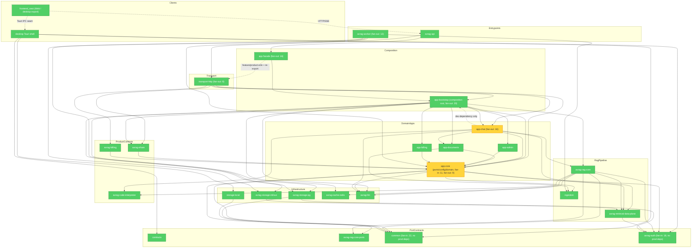

# Brooks-Lint Review

**Mode:** Architecture Audit  
**Scope:** `avrag-rs` active Rust workspace（34 members）+ `desktop/` Tauri shell + `frontend_next` transport seam；深度复查 `cargo metadata` 生产依赖图、关键 crate manifest、现有 Brooks 报告与高风险源码。`frontend_rust/` 为废弃目录，本轮不纳入当前架构结论。  
**Health Score:** 88/100  
**Trend:** 97 -> 88 (-9) over last 3 runs

生产依赖图继续保持无环，`common -> avrag-auth` 与 `rag-core -> app-core` 两个旧 Warning 已核销；当前主要风险集中在 `app-core` 仍承载 Redis 具体实现，以及 `app-chat` 主循环/eval 文件仍过大。

---

## Module Dependency Graph



`cargo metadata --no-deps` 验证：生产依赖图无环；全边图只有 `app-chat -> app-bootstrap -> app-chat` 这一条 dev-dependency 测试环。

---

## Findings

### 🟡 Warning

**Dependency Disorder — `app-core` 同时是 Port 层和 Redis 具体实现宿主**

Symptom: `app-core/Cargo.toml` 生产依赖 `redis`，并在 `crates/app-core/src/adapters/redis_rate_limiter.rs` 实现 `RedisFixedWindowRateLimiter`；`transport-http/src/middleware.rs` 直接 `use app_core::adapters::redis_rate_limiter::RedisFixedWindowRateLimiter`。与此同时，`app-core/src/ports/rate_limit/rate_limiter.rs` 又定义了 `RateLimiter` port，形成“接口和具体 Redis 细节同住核心层”的结构。

Source: Martin — Clean Architecture — Dependency Inversion Principle

Consequence: `app-core` 本应是高层 ports/config/domain 类型中心，但 Redis crate 升级、连接策略、窗口算法变更会触发 `app-core` 及其 11 个生产消费者重编译；后续若接入非 Redis 限流，调用方已经依赖具体类路径，替换成本会高于必要水平。

Remedy: 保留 `RateLimiter` / `RateLimitDecision` 在 `app-core`；把 `RedisFixedWindowRateLimiter` 移到 `app-bootstrap` adapter、`transport-http` 内部 adapter，或独立 infra crate；由 `AppState`/middleware 注入 `Arc<dyn RateLimiter>`，不要从 `transport-http` 直接引用 `app_core::adapters::*`。

---

**Cognitive Overload — `app-chat` 主循环与 eval 框架仍是千行级文件**

Symptom: 当前实测 `crates/app-chat/src/agents/loop/mod.rs` 1289 行，`crates/app-chat/src/eval/framework.rs` 1633 行；`iteration.rs` 已从旧报告的 1147 行降到 767 行，但 `loop/mod.rs` 仍同时承载请求预处理、上下文初始化、检索循环、合成退出和测试。

Source: Ousterhout — A Philosophy of Software Design — Ch. 4: Modules Should Be Deep

Consequence: Agent loop 是产品核心路径，新成员修改 retrieval/synthesis/policy 中任一块时仍要跨越过多局部状态；eval 框架把数据结构、比较、运行器、指标计算、LLM judge 解析和测试放在一个文件里，回归定位慢。

Remedy: 延续已完成的 `iteration_codegen` / `iteration_tools` 拆分方向：`loop/mod.rs` 只保留 `ReActLoop` 编排骨架，把 run preparation、retrieval loop、synthesis/fallback 分到同层子模块；`eval/framework.rs` 拆成 `types`、`compare`、`runner`、`metrics`、`llm_judge`，测试随模块迁移。

### 🟢 Suggestion

**Domain Model Distortion — `avrag-share` 领域 handler 返回 `axum::Json`**

Symptom: `crates/share/src/handlers.rs` 的 `handle_create_share_link` 返回 `Result<axum::Json<ShareTokenResponse>, AppError>`，且 `avrag-share/Cargo.toml` 生产依赖 `axum`；同文件其他 handler 已返回纯领域/API 类型。

Source: Martin — Clean Architecture — Policy vs Detail boundaries

Consequence: Share 逻辑被 HTTP 框架类型污染，worker、CLI 或 desktop IPC 若复用创建分享链接能力，会被迫携带 `axum` 依赖或再包一层转换。

Remedy: 让 `handle_create_share_link` 返回 `Result<ShareTokenResponse, AppError>`；由 `transport-http` 路由层统一包装 `Json(...)`，与当前大多数 app/bootstrap delegate 的纯类型返回风格对齐。

---

**Change Propagation — `app-chat` 与 `app-bootstrap` 仍存在测试依赖环**

Symptom: 生产边无环，但全依赖边存在 `app-chat -> app-bootstrap -> app-chat`；来源是 `app-chat/Cargo.toml` 的 `dev-dependencies` 依赖 `app-bootstrap` 测试夹具，而 `app-bootstrap` 生产依赖 `app-chat` 组装 `ChatContext`。

Source: Martin — Clean Architecture — Acyclic Dependencies Principle (ADP)

Consequence: 当前不影响生产构建，但测试依赖会让 crate 边界更难讲清；后续如果有人把测试夹具提升到生产依赖，会立即生成生产环。

Remedy: 将相关测试夹具迁入 `crates/test-kit` 或 `app-chat/tests/support`，让 `app-chat` 的 dev 边不再回指 composition root。

---

## Testability Seam Assessment

| 边界 | 状态 | 说明 |
|------|------|------|
| Auth | ✅ 保持 | `AuthStorePort` + `PgAuthStoreAdapter`；`avrag-auth` 本身已是轻量类型 crate |
| Admin | ✅ 保持 | `AdminStorePort` 落在 `app-core`，PG adapter 已拆到 `app-bootstrap/adapters/pg_admin_store/` |
| Documents/Object | ✅ 保持 | `DocumentStorePort` / `ObjectStorePort` 抽象清楚，PG/local 对象存储通过 bootstrap 接线 |
| Chat persistence | ✅ 改进 | canonical `ChatPersistencePort` 已迁到 `avrag-rag-core-ports`，`app-core` 只 re-export |
| RAG cache | ✅ 保持 | `CachePort` 在轻量 `avrag-rag-core-ports`，desktop 不直接依赖 `avrag-rag-core` |
| Share persistence | ✅ 改进 | `ShareStorePort` + `PgShareStoreAdapter` 已存在；剩余问题是 share handler 的 `axum::Json` 泄漏 |
| Rate limiting | ⚠️ 部分塌陷 | Port 已存在，但 Redis 实现放在 `app-core::adapters` 并由 `transport-http` 直接引用，infra seam 未完全闭合 |
| Desktop transport | ✅ 保持 | `frontend_next/lib/runtime/transport.ts` 区分 Web SSE 与 Tauri IPC；desktop 仍按阶段路线图推进 |

Source: Feathers — Working Effectively with Legacy Code — Ch. 4: The Seam Model

---

## Conway's Law

当前没有可验证的多团队所有权信息；按现有上下文看是单一 monorepo/单团队维护。没有证据表明模块边界正在制造跨团队协调成本，本轮跳过 Conway's Law finding。

---

## Summary

本轮最重要的动作是把 `app-core` 重新收窄为真正的 ports/config/domain 层：Redis 限流器应迁出核心层，只保留接口。第二优先级是继续拆 `app-chat` 的主循环与 eval 框架；生产依赖图已经无环，`common` 与 `rag-core-ports` 的方向比旧报告更健康。

---

## 本轮核销对照

| 旧报告项 | 本轮状态 |
|----------|----------|
| `common` 直接耦合 `avrag-auth` | ✅ 已核销：`common` 当前无生产依赖，源码无 `avrag_auth` 命中 |
| `rag-core` 生产依赖 `app-core` | ✅ 已核销：`ChatPersistencePort` canonical 定义在 `avrag-rag-core-ports`，`rag-core` 不再依赖 `app-core` |
| 生产依赖环 | ✅ 生产无环；仅余 dev-dependency 测试环 |
| desktop 依赖链过重 | ✅ 保持轻量：`desktop/src-tauri` 只 path 依赖 `common`、`contracts`、`storage-local`、`avrag-auth` |
| `app-chat` 千行文件 | ⚠️ 部分改善：`iteration.rs` 降至 767 行，但 `loop/mod.rs` 与 `eval/framework.rs` 仍需拆 |
| `share` Port 化 | ⚠️ 持续改善：持久化 port 已建立，但 handler 仍泄漏 HTTP 类型 |

---

## 验证摘录

```bash
cd avrag-rs
cargo metadata --format-version 1 --no-deps
# workspace_members=34
# top_prod_fan_in=common:22, avrag-auth:18, app-core:11
# top_prod_fan_out=app-bootstrap:20, app:16, app-chat:16
# prod_cycles=none
# all_cycles=app-chat->app-bootstrap->app-chat
```

```bash
# 文件规模实测
# crates/app-chat/src/agents/loop/mod.rs = 1289 lines
# crates/app-chat/src/agents/loop/iteration.rs = 767 lines
# crates/app-chat/src/eval/framework.rs = 1633 lines
# crates/common/src = 1443 lines across 14 files
```

---

## 修订记录

| 日期 | 说明 |
|------|------|
| 2026-06-13 v5 | 本轮：旧 v4 归档；生产图无环；核销 `common->auth` 与 `rag-core->app-core`；新增/保留 `app-core` Redis adapter、`app-chat` 千行文件、`share` HTTP 类型泄漏、dev-dep 测试环 |
| 2026-06-13 v4 | 旧当前报告，已归档到 [archive/brooks-architecture-audit-2026-06-13-v4.md](./archive/brooks-architecture-audit-2026-06-13-v4.md) |
| 2026-06-12 v3 | [archive/brooks-architecture-audit-2026-06-12-v3.md](./archive/brooks-architecture-audit-2026-06-12-v3.md) |
| 2026-06-12 v2 | [archive/brooks-architecture-audit-2026-06-12-v2.md](./archive/brooks-architecture-audit-2026-06-12-v2.md) |
| 2026-06-12 v1 | [archive/brooks-architecture-audit-2026-06-12-v1.md](./archive/brooks-architecture-audit-2026-06-12-v1.md) |
| 2026-06-10 | [archive/brooks-health-architecture-audit-2026-06-10.md](./archive/brooks-health-architecture-audit-2026-06-10.md) |
