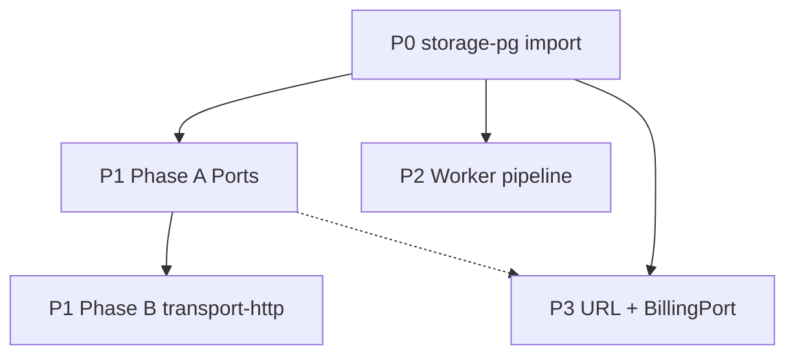

# Brooks 健康度与架构审计结论 — 2026-06-10

Brooks-Lint **Health Dashboard** 与 **Architecture Audit** 对 `avrag-rs`（及抽样 `frontend_next`）的深度 subagent 审计汇总。用于 Round 2 修复后复测、Round 3 排期与 P0–P3 架构修复跟踪。

**关联文档：**

- [HEALTH_OPTIMIZATION_HANDOFF_2026-06-11.md](./HEALTH_OPTIMIZATION_HANDOFF_2026-06-11.md) — T13 app 拆分与测试债务 handoff
- [brooks-pr-review-2026-06-12.md](./brooks-pr-review-2026-06-12.md) — 工作区 PR 维度审查（43/100）
- [brooks-test-quality-review-2026-06-12.md](./brooks-test-quality-review-2026-06-12.md) — 测试质量专项
- 历史分数：仓库根目录 `.brooks-lint-history.json`

---

## 1. 执行摘要

| 审计 | 得分 | 趋势 | 一句话 |
|------|------|------|--------|
| **Health Dashboard（综合）** | **80/100** | 80 → 80（稳定，近 3 次） | Round 2 方向正确，但 worker 编排与 Postgres seam 泄漏抵消得分提升 |
| **Architecture Audit** | **73/100** | 首次记录 | retrieval/ingestion seam 进展明显；`storage-pg` 编译与 `pg()` 逃逸口仍是主拖累 |

**综合判断：** 架构演进（T13 拆分、`ChatPersistencePort`、`page_route_label`、`RetrievalDataPlane`）已落地，但 **横切关注点未收敛**——存储访问、worker 上帝文件、E2E harness 采纳不足。优先修复编译阻断与 Port 化，再拆 worker pipeline。

---

## 2. Health Dashboard（80/100）

**Scope：** `avrag-rs` + `frontend_next`（Round 2 后四维度 subagent 深扫）  
**Composite 权重：** PR 0.25 + Architecture 0.30 + Debt 0.25 + Test 0.20

| 维度 | 得分 | 首要发现 |
|------|------|----------|
| Code Quality (PR) | 85/100 | 定价改版 gate 在 6+ 前端文件重复实现 |
| Architecture | 75/100 | `storage-pg` 依赖迁移未完成时 workspace 无法编译 |
| Tech Debt | 75/100 | Worker `main.rs` 仍 3263 行 |
| Test Quality | 85/100 | `streaming_chat` 每条用例冷启动完整 E2E 栈 |

### 2.1 跨维度 Top 5 发现

#### Critical

1. **R5 — `storage-pg` 对 `ingestion` 的剥离停在半途**  
   - `core.rs` 仍 `use ingestion::...`，`Cargo.toml` 生产依赖仅 `ingestion-types` → workspace 编译失败。  
   - **Remedy：** import 改为 `ingestion_types::`；`cargo build --workspace` 验证。

2. **R1 — Worker `main.rs` God File（3263 行）**  
   - 虽已抽出 `pdf/`、`indexing/`，`PgTaskProcessor::process` 与 `run_document_pipeline` 仍在主文件。  
   - **Remedy：** 拆 `pipeline/`（fetch → route → parse → index）；`main.rs` 仅 wiring。

#### Warning

3. **R5 — `app-core` 域层与 PG 强绑定**  
   - `ChatPersistencePort` re-export `avrag_storage_pg` 行类型；`StorageContext::pg()` 逃逸口。  
   - **Remedy：** DTO 入 `app-core`/`common`；adapter 在 bootstrap；废弃 `pg()`（transport-http Phase B）。

4. **R2 — 定价改版 gate 重复（frontend_next）**  
   - `pricing` / `settings/usage` / `upgrade/paywall` 等 6+ 处重复 SSR + client probe。  
   - **Remedy：** 共享 `usePricingRevampGate` 或 `<PricingRevampGate>`。

5. **T1 — E2E `streaming_chat` 重复冷启动**  
   - 8 条测试各自 `ready_rag_context()` 新建全栈；`ready_rag` 仅该文件采用。  
   - **Remedy：** 模块级共享 context；推广 fixture。

### 2.2 Round 2 修复对照

| 项目 | 目标 | Round 2 后状态 |
|------|------|----------------|
| PR-7 `route_label` 单一映射 | ✅ | `ingestion/router.rs::page_route_label` |
| PR-8 RET-1 强类型 | ✅ | `PageParseStatus` + `multimodal_retrieval_weight` |
| PR-9 worker `indexing/` | ⚠️ | 抽出 ~1500 行，`main.rs` 仍 3263 行 |
| PR-10 `ChatPersistencePort` | ⚠️ | `app-chat` 已移除生产 `storage-pg`；`app-core` 仍 re-export PG 类型 |
| PR-11 E2E `ready_rag_context` | ⚠️ | 存在，主要仅 `streaming_chat` 使用 |
| Workspace 可编译 | ❌→✅ | P0 修复后 `avrag-storage-pg` 可单独编译（见 §5） |

---

## 3. Architecture Audit（73/100）

**Scope：** 35 个 workspace 成员；4 路 subagent（依赖图、领域模型、worker/ingestion、PR 横切）

### 3.1 分层与依赖热点

- **Fan-out 超标（>5）：** 全部 Top 10 crate 超标——`app-bootstrap`(16)、`app-chat`(16)、`app`(15)、`worker`(12)、`app-core`(10)。
- **Fan-in 枢纽：** `common`(23)、`avrag-auth`(20)、`avrag-storage-pg`(11) — 改动触发大范围重编译。
- **生产依赖无环；** dev 构建存在 `app ↔ transport-http` 环（`app` dev-dep `transport-http`）。

### 3.2 Critical 发现

| ID | 风险 | Symptom | Remedy |
|----|------|---------|--------|
| A1 | R5 依赖紊乱 | `storage-pg` 编译失败，`use ingestion` 与 Cargo 不一致 | 改 `ingestion_types` import（P0） |
| A2 | R5 DIP 违反 | `app-core` 直接依赖 `avrag-storage-pg`；Port 泄漏 PG row 类型 | Port + adapter 分离；削减 `app-core` → storage-pg |

### 3.3 Warning 发现

| ID | 风险 | Symptom | Remedy |
|----|------|---------|--------|
| A3 | R1 认知过载 | `main.rs` 3263 行；`run_document_pipeline` ~575 行 | 拆 `pipeline/`（P2） |
| A4 | R2 信息泄漏 | `page_status` 字符串 JSON 跨 4+ crate；worker 侧命名混淆 | ingestion typed builder；`ocr_gating.rs` 重命名 |
| A5 | Seam collapse | Milvus 走 `RetrievalDataPlane`；PG 走 `storage.pg()` | `DocumentStorePort` / `AdminStorePort`；废弃 `pg()`（P1） |
| A6 | R5 扇出 | `worker → app` 仅为 `runtime_mode` 日志拉全量 facade | `app-core` 直接依赖；去掉 `AppState::bootstrap`（P2） |
| A7 | R2 Shotgun | URL 任务硬编码 `Local+Html`，绕过 `ParseRouter` | 统一 `ParseRouter::route`（P3） |

### 3.4 应保留的正面模式

| 模式 | 位置 | 说明 |
|------|------|------|
| `RetrievalDataPlane` seam | `retrieval-data-plane` + `MilvusDataPlane` | rag-core 不依赖 storage-milvus |
| Ingestion runtime seam | `ingestion/runtime.rs` | `TaskSource` / `StateSink` / `AuditSink` |
| `ContentStore` seam | `common` + `PgContentStore` | RAG 稀疏检索正确注入 |
| `app-bootstrap` composition root | `app-bootstrap` | 分域构造 Chat/Billing/Document context |
| Worker `indexing/` | `bins/worker/src/indexing/` | multimodal/media/vlm 职责清晰 |

### 3.5 Conway's Law

团队结构未知，本轮跳过组织对齐检查。

---

## 4. P0–P3 修复计划与状态

计划详见 Cursor plan「Brooks 审计 P0–P3 修复」；**P1 采用 Phase A/B**：本轮 Phase A 端口化 + 废弃 `pg()`（documents/admin）；Phase B 迁移 `transport-http` 并从 `app-core` Cargo 移除 `storage-pg`。

| 优先级 | 目标 | 验收标准 | 状态（文档更新时） |
|--------|------|----------|-------------------|
| **P0** | `storage-pg` 编译恢复 | `cargo build -p avrag-storage-pg` / `--workspace` | **已完成** — `core.rs` 改用 `ingestion_types` |
| **P1 Phase A** | Port 化 + 废弃 `pg()` | `app-documents`/`app-admin` 无 `storage.pg()` | **进行中** — `DocumentStorePort`/`AdminStorePort`/`BillingQuotaPort` trait 与 bootstrap adapter 已起草；消费者迁移未完成 |
| **P2** | Worker 拆分 + 去 `app` 依赖 | worker 不依赖 `app`；`main.rs` < 1800 行 | **未开始** |
| **P3** | URL 路由 + billing seam | URL 走 `ParseRouter`；`url_imports` 经 Port | **未开始**（trait 与 P1 重叠） |
| **P1 Phase B** | transport-http + Cargo 解耦 | 无 `pg()`；`app-core` 无 `storage-pg` dep | **后续轮次** |

### P1 Phase A 已起草文件（未完成 wiring/迁移）

- `crates/app-core/src/document_store.rs` — `DocumentStorePort`
- `crates/app-core/src/admin_store.rs` — `AdminStorePort`
- `crates/app-core/src/billing_quota.rs` — `BillingQuotaPort`
- `crates/app-core/src/domain_rows.rs` — PG row 类型 re-export 收口
- `crates/app-bootstrap/src/adapters/*` — PG adapter（含 `PgChatPersistenceAdapter` 迁至 bootstrap）
- `StorageContext` 扩展 `document_store()` / `admin_store()` / `billing_quota()`；`pg()` 标记 deprecated

**待完成：** `app-documents` / `app-admin` 全量 `pg()` → port；`cargo build --workspace`；测试全绿。

---

## 5. 建议修复顺序



1. **立即：** 确认 P0 后 `cargo build --workspace`（若仍失败，查 `app` 等其他 crate）。
2. **P1 Phase A：** 完成 documents/admin 迁移；bootstrap `StorageContext::new` 全路径更新。
3. **P2：** 去掉 worker → `app`；抽出 `pipeline/`。
4. **P3：** URL `ParseRouter`；`url_imports` 配额经 `BillingQuotaPort`。
5. **P1 Phase B：** `transport-http` 去 `pg()`；object store 类型拆分或 `ObjectStorePort`。
6. **复测：** Brooks Health，目标 Architecture ≥ 80、Composite ≥ 87。

---

## 6. 验证命令

```bash
cd avrag-rs

# P0 / 全 workspace
cargo build -p avrag-storage-pg
cargo build --workspace

# P1 相关 crate
cargo test -p app-documents -p app-admin -p app-chat -p app-bootstrap -p app-core

# P2
cargo test -p avrag-worker
wc -l bins/worker/src/main.rs

# E2E（需 Docker + Milvus）
set -a && source .env && set +a
E2E_MODE=smoke cargo test -p app --test product_e2e -- --test-threads=1

# 知识图谱（改结构后）
graphify update avrag-rs
```

---

## 7. 分数历史（摘录）

来源：`.brooks-lint-history.json`

| 日期 | Mode | Score | 备注 |
|------|------|-------|------|
| 2026-06-10 | Architecture Audit | 73 | 35 members 深扫 |
| 2026-06-10 | Health Dashboard | 80 | Round 2 后 subagent |
| 2026-06-11 | Health Dashboard | 80 | 两次稳定 |
| 2026-06-12 | PR Review | 43 | 工作区未提交变更 |
| 2026-06-12 | Tech Debt | 34 | 全仓深扫 |
| 2026-06-12 | Test Quality | 52 | 全仓深扫 |

**说明：** 2026-06-12 低分针对**未提交大 diff** 与工作区状态，与 Round 2 后 Health 80 不矛盾；合并前需单独 PR Review。

---

## 8. 修订记录

| 日期 | 说明 |
|------|------|
| 2026-06-10 | 初版：汇总 Health Dashboard + Architecture Audit + P0–P3 计划与实施状态 |
