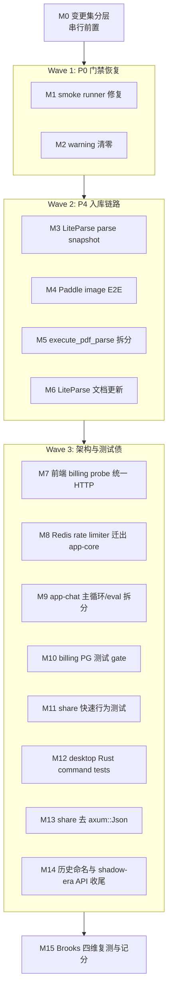

# Brooks 四维审计合并修复计划 — 2026-06-13（v6 · P4 后满分冲刺）

**目标：** 基于 2026-06-13 最新四份 Brooks 报告与人工 review 结论，把 PR / 技术债 / 测试 / 架构四个维度推进到各自口径下的 **100 分**，并把开发工作拆成目录互斥、可并行派发给 subagent 的 Stream。

本计划替代 2026-06-12 v4 计划的剩余执行部分。旧计划中已完成的 admin、contracts、HTTP 统一、common/auth 解耦等成果不重复派发；本轮只处理 **P4 LiteParse/Paddle 切换后新增问题** 与 **前一轮 Brooks 执行漂移**。

---

## 0. 输入报告与当前分数

| 维度 | 最新报告 | 当前分 | 主要差额 |
|------|----------|--------|----------|
| PR | [brooks-pr-review-2026-06-13-v6.md](./brooks-pr-review-2026-06-13-v6.md) | **48** | 2 Critical + 4 Warning + 2 Suggestion |
| 技术债 | [brooks-tech-debt-assessment-2026-06-13.md](./brooks-tech-debt-assessment-2026-06-13.md) | **57** | LiteParse/Paddle 链路、warning 门禁、文档漂移、PDF 主函数复杂度 |
| 测试 | [brooks-test-quality-review-2026-06-13.md](./brooks-test-quality-review-2026-06-13.md) | **68** | smoke runner 失败、billing PG 测试不可复现、share/desktop 测试缺口 |
| 架构 | [brooks-architecture-audit-2026-06-13.md](./brooks-architecture-audit-2026-06-13.md) | **88** | app-core Redis 具体实现、app-chat 千行文件、share axum 泄漏、dev 测试环 |

**人工 review 补充结论：**

- `cargo check --workspace` 与 Product E2E 编译可过，但 `RUSTFLAGS="-D warnings" cargo check -p app --features product-e2e` 会被 `ingestion` unused/dead code 卡住。
- `scripts/run-product-smoke-e2e.sh` 的模块清单解析会误判为空，真实 smoke 测试没有执行。
- 当前工作区再次有 staged / unstaged / untracked 混合风险，LiteParse 新文件、MinerU 删除、文档归档必须按主题完整入库。
- `agents/loop/mod.rs` 仍 1289 行，`run()` 仍是主热点；上一轮“完成 M2b”的结论偏乐观。
- `pg_admin_store` / `pg_share_store` 已按业务域拆分为 `shards.lst` 分片 + `build.rs` 拼装单一 trait impl（Rust 2024 下不可在 `impl` 内 `include!`）；分片清单以 `shards.lst` 为唯一事实源。

---

## 1. 合并后的统一问题清单

去重后，本轮共 **15 个独立问题域**。

| ID | 优先级 | 来源 | 问题 | Stream |
|----|--------|------|------|--------|
| D0 | P0 | PR Critical | Git 变更集分裂：staged / unstaged / untracked 不在同一完整层 | M0 |
| D1 | P0 | Test Critical / PR Critical | smoke runner 解析 `--list` 输出失败，真实 smoke 不执行 | M1 |
| D2 | P0 | Tech Warning / Test Suggestion | `ingestion` / worker / product_e2e warning 破坏 `-D warnings` 门禁 | M2 |
| D3 | P1 | Tech Scheduled / PR Warning | LiteParse PDF 正常路径重复 parse 3 次以上 | M3 |
| D4 | P1 | Tech Critical/Scheduled / PR Suggestion | 独立图片 `PaddleOcrImage` 缺 E2E / asset contract | M4 |
| D5 | P1 | Tech Warning | `execute_pdf_parse` 混合路由、OCR、fallback、metadata、状态写入 | M5 |
| D6 | P1 | Tech Warning / PR Warning | LiteParse 架构文档仍描述 shadow / rollout / MinerU 过渡期 | M6 |
| D7 | P1 | PR Suggestion / Tech Warning | `frontend_next/lib/billing/featureFlag.ts` 绕过统一 HTTP transport | M7 |
| D8 | P1 | Architecture Warning | `app-core` 同时定义 RateLimiter port 与 Redis 具体实现 | M8 |
| D9 | P1 | Architecture Warning / Tech Suggestion | `app-chat` `loop/mod.rs` 与 `eval/framework.rs` 仍千行级 | M9 |
| D10 | P2 | Test Warning | billing migration sqlx 测试依赖隐式外部 PG，本地包级测试不可复现 | M10 |
| D11 | P2 | Test Suggestion | share port contract 只覆盖 token，公开读 / invite / public chat 快速测不足 | M11 |
| D12 | P2 | Test Warning | desktop Rust command handler 只有 `cargo check`，无 Rust 行为测试 | M12 |
| D13 | P2 | Architecture Suggestion | `avrag-share` handler 返回 `axum::Json`，HTTP 类型泄漏进领域层 | M13 |
| D14 | P2 | Tech Suggestion | `EdgeParse` / `Mineru*` 历史枚举名与 P4 后真实语义漂移 | M14 |

---

## 2. 满分差额账本

### PR 48 → 100

| 分值 | 消除项 | Stream |
|------|--------|--------|
| +15 | 变更集完整性：删旧录新同层，按主题拆 PR | M0 |
| +15 | smoke runner 清单解析修复，门禁能跑到真实测试 | M1 |
| +5 | LiteParse PDF parse pass 合并 | M3 |
| +5 | P4 warning 清零，`-D warnings` 可用 | M2 |
| +5 | P4 命名 / 旧枚举语义说明 | M14 |
| +5 | 技术债报告事实源与分数重算 | M15 |
| +1 | `billing/featureFlag.ts` 迁统一 HTTP | M7 |
| +1 | 独立图片 E2E 补齐 | M4 |
| **=100** | | |

### 技术债 57 → 100

| 分值 | 消除项 | Stream |
|------|--------|--------|
| +15 | 独立图片 Paddle 产物保护 | M4 |
| +5 | LiteParse parse snapshot / 合并 parse pass | M3 |
| +5 | warning 清理与 `-D warnings` gate | M2 |
| +5 | LiteParse 文档去 shadow / MinerU 现行描述 | M6 |
| +5 | `execute_pdf_parse` 阶段拆分 | M5 |
| +5 | `billing/featureFlag.ts` HTTP 统一 | M7 |
| +1 | 历史枚举注释 / 命名迁移计划 | M14 |
| +1 | shadow-era API 注释 / 删除 | M14 |
| +1 | `agents/loop/mod.rs` 薄化 | M9 |
| **=100** | | |

### 测试 68 → 100

| 分值 | 消除项 | Stream |
|------|--------|--------|
| +15 | smoke runner 能执行真实 Product E2E smoke | M1 |
| +5 | billing PG migration 测试显式 gate / 本地 skip | M10 |
| +5 | Product E2E mock 路由表拆分 / 合同测试 | M1 / M11 |
| +5 | desktop Rust command handler 行为测试 | M12 |
| +1 | share public read / invite / public chat 快速测 | M11 |
| +1 | warning 噪声清理 | M2 |
| **=100** | | |

### 架构 88 → 100

| 分值 | 消除项 | Stream |
|------|--------|--------|
| +5 | Redis 限流器从 `app-core` 迁出 | M8 |
| +5 | `app-chat` 主循环 / eval 文件继续拆分 | M9 |
| +1 | share handler 去 `axum::Json` | M13 |
| +1 | app-chat dev-dependency 测试环隔离 | M12 / M16 |
| **=100** | | |

---

## 3. 总体执行拓扑



**并行原则：**

- Wave 1 的 M1 / M2 可并行，但必须在 M0 完成后启动。
- Wave 2 的 M3 / M4 / M5 / M6 可并行，因 M3/M5 都碰 worker PDF 路径，需文件级互斥。
- Wave 3 可多路并行，M8 与 M13/M11/M12 文件完全独立。
- M15 必须串行，且只在所有验收命令通过后执行。

---

## 4. Stream 明细

### M0 — 变更集完整性与 PR 分层（串行，P0）

**独占范围：** git staging / branch planning，不改源码。

**必须做：**

1. 用 `git status --short` 分出四个逻辑变更层：
   - Brooks docs / history / archive
   - LiteParse + MinerU 删除 + worker wiring
   - Product E2E / smoke runner
   - frontend transport / billing probe
2. 对每层执行 `git diff --name-status`，确认删除与新增成对出现。
3. 13 个 LiteParse `??` 文件必须二选一：
   - 属于 P4 PR：全部 `git add`，并与 MinerU 删除同层；
   - 不属于 Brooks PR：移到独立分支，当前 PR 不带引用。
4. 输出 PR 切分建议：每个 PR <80 文件，且独立可编译。

**验收：**

```bash
git status --short | grep '^??' | wc -l   # 0
git diff --name-status --cached
```

---

### M1 — Product smoke runner 真正执行测试（P0）

**独占文件：**

- `avrag-rs/scripts/run-product-smoke-e2e.sh`
- `avrag-rs/crates/app/tests/product_e2e/**/mock*`（仅脚本解析测试需要）
- `avrag-rs/docs/e2e-gates.md`

**必须做：**

1. 修 `assert_smoke_module_coverage` 的 `--list` 解析，接受 `product_e2e::smoke::<module>::...`。
2. 增加一个轻量脚本级解析测试，固定 `cargo --list` 样例。
3. 保持模块白名单机制：新 smoke 模块漏登记仍应失败。
4. 重跑 smoke，确认已经进入真实测试阶段。

**验收：**

```bash
cd avrag-rs
cargo test --test product_e2e -p app --features product-e2e smoke:: -- --list
./scripts/run-product-smoke-e2e.sh
docker ps --filter name=avrag-test- --format '{{.Names}}'  # 空
```

---

### M2 — ingestion / worker warning 清零与 `-D warnings` 恢复（P0）

**独占文件：**

- `avrag-rs/crates/ingestion/src/parser/**`
- `avrag-rs/bins/worker/src/pdf/**`
- `avrag-rs/bins/worker/src/pipeline/**`
- `.github/workflows/{smoke-e2e.yml,integration-e2e.yml}`（只改 warning gate）

**必须做：**

1. 清理 `ParseProbe` unused import、`router/stages/*::route` unused、`TEXT_QUAL_THRESHOLD` 等未用项。
2. 对历史兼容或未来保留代码，只允许加带理由的 `#[allow(dead_code)]`，不得无解释压 warning。
3. 清理 product_e2e fixture warning。
4. workflow 中 `RUSTFLAGS="-D warnings"` 只在 smoke compile 路径通过后保留。

**验收：**

```bash
cd avrag-rs
RUSTFLAGS="-D warnings" cargo check -p ingestion -p avrag-worker
RUSTFLAGS="-D warnings" cargo check -p app --features product-e2e
cargo test --no-run -p app --test product_e2e --features product-e2e
```

---

### M3 — LiteParse 单次解析快照（P1）

**独占文件：**

- `avrag-rs/crates/ingestion/src/parser/liteparse*.rs`
- `avrag-rs/crates/ingestion/src/parser/router/**`（只接 snapshot，不改 worker）

**必须做：**

1. 新增 `LiteParseParsedDocument` / `ParsedPdfSnapshot`，一次 parse 产出：
   - page probes
   - page dimensions
   - text blocks
2. `probe` / `page_dimensions` / `extract_blocks` 改为共享内部 snapshot，外部 API 可保留兼容壳。
3. 增加单元测试：同一 PDF 正常路径 parse 次数不超过 1 或 2（按实现可测性定）。

**验收：**

```bash
cd avrag-rs
cargo test -p ingestion liteparse
RUSTFLAGS="-D warnings" cargo check -p ingestion
```

---

### M4 — 独立图片 Paddle 产物保护（P1）

**独占文件：**

- `avrag-rs/crates/app/tests/product_e2e/**`
- `avrag-rs/bins/worker/src/pdf/paddle*.rs`（仅 fake 接缝必要时）

**必须做：**

1. 新增 fake Paddle image ingest 测试或 Product E2E fixture。
2. 上传 png，断言：
   - `doc_type=image`
   - `paddle_jobs_count=1`
   - 至少存在 searchable text chunk 或 Figure asset
   - metadata 标记 `PaddleOcrImage`
3. 不引入真实外部 Paddle 依赖。

**验收：**

```bash
cd avrag-rs
cargo test --test product_e2e -p app --features product-e2e image
```

---

### M5 — `execute_pdf_parse` 阶段拆分（P1）

**独占文件：**

- `avrag-rs/bins/worker/src/pdf/parse.rs`
- `avrag-rs/bins/worker/src/pdf/{mod.rs,tests.rs}`（必要时）

**必须做：**

1. 拆出 4 个阶段函数：
   - `collect_page_routes`
   - `run_ocr_pages`
   - `apply_text_fallbacks`
   - `attach_ingest_metadata_and_status`
2. 每个阶段返回结构化结果，不通过散落的局部变量传状态。
3. 保持行为不变，避免与 M3 重复改 LiteParse API。

**验收：**

```bash
cd avrag-rs
cargo test -p avrag-worker pdf
```

---

### M6 — LiteParse 文档与 runbook 真相源更新（P1）

**独占文件：**

- `avrag-rs/docs/liteparse-paddle-ingestion-architecture-2026-06-13.md`
- `avrag-rs/docs/runbooks/**`
- `avrag-rs/docs/README.md`

**必须做：**

1. 删除当前实现文档中的 shadow / rollout / 一键回退现行描述。
2. MinerU 配置迁到 archive / 历史迁移说明。
3. 当前文档改为“P4 后当前实现 + 已知缺口”。
4. 链接到本计划中的 M3 / M4 / M5。

**验收：**

```bash
rg 'LITEPARSE_ENABLED|LITEPARSE_SHADOW|LITEPARSE_ROLLOUT|MINERU_' avrag-rs/docs avrag-rs/docs/runbooks
# 只允许 archive 或明确“历史说明”段落命中
```

---

### M7 — `billing/featureFlag.ts` 统一 HTTP transport（P1）

**独占文件：**

- `frontend_next/lib/billing/featureFlag.ts`
- `frontend_next/lib/http/request.ts`（仅需要导出 helper 时）
- `frontend_next/tests/**`（对应测试）

**必须做：**

1. 不再从 `../auth/client` 导入 `buildApiUrl` / `ApiError`。
2. 复用 `lib/http/request.ts` 的 `request` / `fetchResponse` / `buildApiUrl`。
3. 保持 feature-disabled 200 envelope 判断。

**验收：**

```bash
cd frontend_next
rg 'from "../auth/client"' lib/billing
pnpm typecheck
pnpm vitest run
```

---

### M8 — Redis rate limiter 从 `app-core` 迁出（P1）

**独占文件：**

- `avrag-rs/crates/app-core/src/ports/rate_limit/**`
- `avrag-rs/crates/app-core/src/adapters/redis_rate_limiter.rs`（删除或迁出）
- `avrag-rs/crates/app-bootstrap/**` 或 `avrag-rs/crates/transport-http/**`（新 adapter 落点二选一）

**必须做：**

1. `app-core` 只保留 `RateLimiter` / `RateLimitDecision`。
2. `RedisFixedWindowRateLimiter` 迁到 bootstrap adapter 或 transport-http infra。
3. 调用方只接收 `Arc<dyn RateLimiter>`，不得引用 `app_core::adapters::*`。
4. `app-core/Cargo.toml` 移除 `redis` 生产依赖。

**验收：**

```bash
cd avrag-rs
cargo tree -p app-core | rg redis && exit 1 || true
cargo test -p app-core -p app-bootstrap -p transport-http
```

---

### M9 — app-chat 主循环与 eval 框架继续拆分（P1）

**独占文件：**

- `avrag-rs/crates/app-chat/src/agents/loop/**`
- `avrag-rs/crates/app-chat/src/eval/**`

**必须做：**

1. `loop/mod.rs` 只保留 `ReActLoop` 编排骨架。
2. `run` 的 preparation / retrieval loop / synthesis / fallback 移到同层模块。
3. `fallback` 策略迁入 `fallback.rs`。
4. `eval/framework.rs` 拆成：
   - `eval/types.rs`
   - `eval/compare.rs`
   - `eval/runner.rs`
   - `eval/metrics.rs`
   - `eval/llm_judge.rs`

**验收：**

```bash
cd avrag-rs
wc -l crates/app-chat/src/agents/loop/mod.rs crates/app-chat/src/eval/framework.rs
# 目标：loop/mod.rs <900；framework.rs <600 或变为 thin mod
cargo test -p app-chat
```

---

### M10 — billing PG migration 测试显式 gate（P2）

**独占文件：**

- `avrag-rs/crates/billing/tests/test_migration_0037.rs`
- `avrag-rs/crates/billing/tests/**`

**必须做：**

1. 对需要 live PG 的 `#[sqlx::test]` 增加显式 precheck。
2. 没有 `DATABASE_URL` 时 skip 并输出清晰原因，不能 PoolTimedOut。
3. CI DB gate 中仍要真实运行。

**验收：**

```bash
cd avrag-rs
unset DATABASE_URL
cargo test -p avrag-billing
```

---

### M11 — share public read / invite 快速行为测试（P2）

**独占文件：**

- `avrag-rs/crates/share/tests/storage_port_contract.rs`
- `avrag-rs/crates/share/tests/share_behavior.rs`（可新建）

**必须做：**

1. 在现有 in-memory fake 上补：
   - shared notebook payload mapping
   - public chat context mapping
   - owner invite 成功
   - non-owner invite 被拒
2. 不改 PG adapter。

**验收：**

```bash
cd avrag-rs
cargo test -p avrag-share
```

---

### M12 — desktop Rust command handler 行为测试（P2）

**独占文件：**

- `desktop/src-tauri/src/**`
- `.github/workflows/smoke-e2e.yml`（desktop job 命令）

**必须做：**

1. 抽纯函数测试 body 构造、错误映射、stream event 转换。
2. 增加 Rust `#[test]`。
3. CI desktop job 从 `cargo check` 提升到 `cargo test`。

**验收：**

```bash
cargo test --manifest-path desktop/src-tauri/Cargo.toml
```

---

### M13 — share handler 去 `axum::Json`（P2）

**独占文件：**

- `avrag-rs/crates/share/src/handlers.rs`
- `avrag-rs/crates/transport-http/src/routes/share*.rs`（如包装层在此）

**必须做：**

1. `handle_create_share_link` 返回 `Result<ShareTokenResponse, AppError>`。
2. HTTP route 层统一包装 `Json(...)`。
3. 不改变 wire payload。

**验收：**

```bash
cd avrag-rs
cargo test -p avrag-share -p transport-http
```

---

### M14 — P4 历史命名与 shadow-era API 收尾（P2）

**独占文件：**

- `avrag-rs/crates/ingestion/src/parser/**`
- `avrag-rs/contracts/**`（仅若 wire 类型需要注释）

**必须做：**

1. `EdgeParse` 若继续代表历史 wire 名，加注释说明当前语义为 LiteParse text。
2. `Mineru*` 枚举标为历史 IR only，不得在新代码中选择。
3. 删除或 `#[cfg(test)]` 化 `parse_json` / shadow diff API。
4. `rg 'shadow diff' crates/ingestion/src/parser` 为 0。

**验收：**

```bash
cd avrag-rs
rg 'shadow diff' crates/ingestion/src/parser
cargo test -p ingestion
```

---

### M15 — Brooks 四维复测与分数回写（串行收尾）

**独占文件：**

- `avrag-rs/docs/brooks-*.md`
- `.brooks-lint-history.json`
- `graphify-out/**`（自动更新）

**必须做：**

1. 跑全量验收命令。
2. `graphify update .`。
3. 分别重跑 PR / 技术债 / 测试 / 架构四维 Brooks。
4. 只有实测通过后，才更新 `.brooks-lint-history.json` 分数。
5. 未达 100 的残项开 M16 补丁 Stream，不手写乐观分数。

**验收：**

```bash
cd avrag-rs
cargo check --workspace
RUSTFLAGS="-D warnings" cargo check -p ingestion -p avrag-worker -p app --features product-e2e
cargo test --no-run -p app --test product_e2e --features product-e2e
./scripts/run-product-smoke-e2e.sh
cargo test -p app-chat -p app-bootstrap -p transport-http -p avrag-share -p avrag-billing
cd ../frontend_next && pnpm typecheck && pnpm vitest run
cd .. && graphify update .
```

---

## 5. 目录所有权矩阵

| 目录/文件 | Stream |
|-----------|--------|
| Git staging / PR 拆分 | M0 |
| `scripts/run-product-smoke-e2e.sh`、`product_e2e` mock routing | M1 |
| `crates/ingestion/src/parser/**` warning 清理 | M2 / M14（M2 优先，M14 收尾命名） |
| `bins/worker/src/pdf/**` warning / PDF orchestration | M2 / M5 |
| LiteParse parse snapshot | M3 |
| Paddle image E2E | M4 |
| LiteParse docs / runbooks | M6 |
| `frontend_next/lib/billing/featureFlag.ts` | M7 |
| `app-core` RateLimiter / Redis adapter | M8 |
| `app-chat/src/agents/loop/**`、`app-chat/src/eval/**` | M9 |
| `crates/billing/tests/**` | M10 |
| `crates/share/tests/**` | M11 |
| `desktop/src-tauri/src/**` | M12 |
| `crates/share/src/handlers.rs` + transport share route | M13 |
| Brooks docs / history / graphify | M15 |

---

## 6. Subagent 派发模板

```markdown
## 任务：Brooks v6 满分计划 Stream {M#}

**计划文档：** avrag-rs/docs/brooks-merged-fix-plan-2026-06-13-v6.md

**独占文件/目录：** {DIRS}

**目标：** 核销 {D# / 报告 finding}，不得扩大范围。

**必须做：**
1. 行为修复先补测试或复现命令。
2. 纯重构必须保持行为不变，拆一步跑一次测试。
3. 不修改独占范围外文件；如必须改，先停止并说明冲突。
4. 完成后运行验收命令，粘贴关键输出。

**禁止做：**
- 手写乐观 Brooks 分数。
- 用 `#[allow]` 静默压掉 warning，除非有一行明确历史兼容理由。
- 把未跟踪文件留在工作区。

**验收命令：** {COMMANDS}
```

---

## 7. 推荐执行顺序

1. **串行前置：** M0
2. **P0 并行：** M1 + M2
3. **P4 链路并行：** M3 + M4 + M5 + M6
4. **架构/测试债并行：** M7 + M8 + M9 + M10 + M11 + M12 + M13 + M14
5. **串行复测：** M15

**首批应派发的 3 个 subagents：**

- M1 smoke runner 修复
- M2 warning 清零
- M0 变更集分层（如允许 git 操作，可由主 agent 做；否则单独 agent 只出拆分清单）

---

## 8. 当前不再派发的已完成项

以下旧问题已在代码层闭环，除非新报告重新发现，不再作为 Stream：

- `AdminStorePort` 默认 stub 删除
- `set_org_blocked` `rows_affected` 检查
- audit `ilike` wildcard 转义
- `admin_api_contract` 迁 app_core wire 类型
- `x-mock-rag-query` 代码路径清零
- `common -> avrag-auth` 生产依赖解除
- `rag-core -> app-core` 生产依赖解除
- `atomic_tools` / `helpers` 拆目录
- `pg_share_store.rs` 单文件拆目录 + `port_impl` 域分片（`shards.lst` + `build.rs` 拼装，share 9 分片 / admin 7 分片）
- 前端大多数 client 统一 HTTP（剩 `billing/featureFlag.ts`）

---

## 9. 满分定义

本计划中的 **100 分** 只表示最新 Brooks 扫描口径下零 Critical / Warning / Suggestion，不表示代码永久完美。M15 之前不得更新 `.brooks-lint-history.json` 为 100；必须以复测报告为准。

