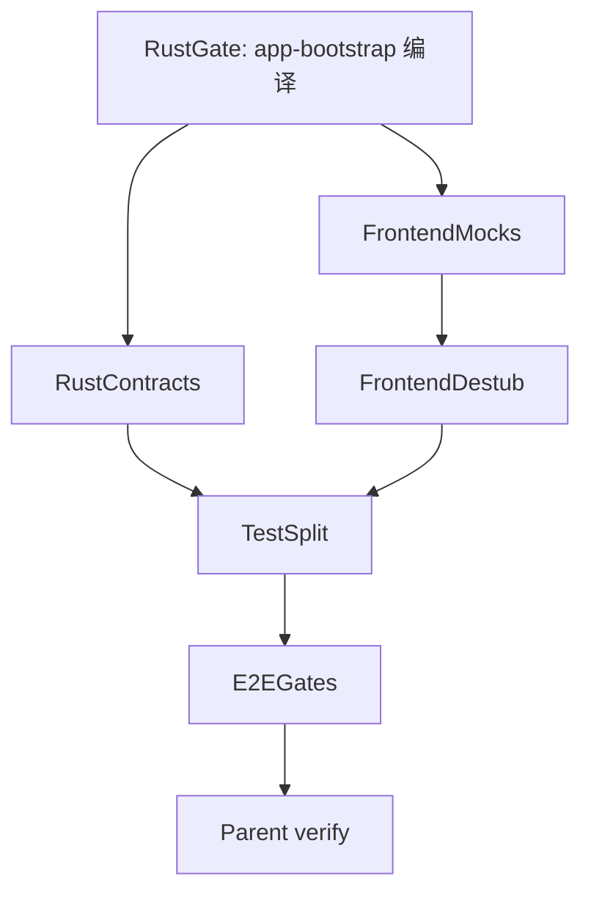

# Brooks 测试质量审查 — 2026-06-12

Brooks-Lint **Test Quality Review** 全仓库深度审计结论。范围：`avrag-rs` + `frontend_next` + `contracts`。

**Health Score:** 52/100  
**Trend:** 首次 Test Quality Review 运行（无历史对比）

**一句话结论：** 单元测试底座与 Product E2E 设计质量较高，但大规模 refactor 期间 Rust 测试无法编译；前端 Surface 测试过度 mock，存在「测过但测错层」的覆盖假象。

---

## 1. Test Suite Map

```
Unit tests:        ~1,084 cases
  Rust inline:     ~860 tests / ~120 files（含 app-chat agents 大量单测）
  Frontend Vitest:  224 tests / 47 files（本地 ~12s 全绿）
  Python SDK:       2 files

Integration tests: ~170 cases
  Rust tests/*.rs:  ~84 tests / 36 files（contract + module_surface）
  Product E2E mock: ~86 tests（smoke + integration，单线程）
  transport-http:   chat_stream / runtime_execute contract

E2E tests:         ~60 cases
  Playwright:       26 spec files（journey / billing / skills）
  llm_real:         #[ignore] nightly（真实 LLM）
  avrag-rs/e2e:     2 visual specs

Ratio:             Unit ~82% : Integration ~13% : E2E ~5%
                   （接近 Google 70:20:10，单元层偏厚，可接受）

Coverage areas:
  强: app-chat agents/loop/skills、rag-core runtime、guardrails、
      ingestion parsers、product_e2e TestContext + streaming_chat
  弱: storage-pg↔ingestion 边界、retrieval-data-plane（2 tests）、
      8 个 crate 仅 module_surface、adapter 层 refactor 后缺少新 contract
  盲区: app→app-chat 提取过程中无 Characterization Tests；
         前端 Surface 层 stub 子组件导致 chat/right-rail 变更不被父测覆盖
```

---

## 2. Findings

### 2.1 Critical

#### Coverage Illusion — Rust 测试套件无法编译，CI 门禁失效

| 字段 | 内容 |
|------|------|
| **Symptom** | 执行 `cargo test --no-run -p app` 失败。审计初期为 `avrag-storage-pg` 无法解析 `ingestion`；后续复测实际阻塞为 [`app-bootstrap`](../crates/app-bootstrap/Cargo.toml)：`Cargo.toml` 缺少 `common`、`async_trait`、`chrono`、`ingestion-types` 等依赖，adapter trait impl 存在 lifetime 不匹配（约 68 errors）。工作区处于 app/agents→app-chat、adapters 删除的大规模 refactor 中。 |
| **Source** | Feathers — *Working Effectively with Legacy Code*, Ch. 1; Google — *How Google Tests Software*, Ch. 11 |
| **Consequence** | Smoke E2E（PR 10 分钟）与 Integration E2E（main 45 分钟）在当前分支无法可靠运行；refactor 无安全网，回归依赖 nightly llm_real 或手工验证。 |
| **Remedy** | 优先修复 `app-bootstrap` 依赖链与 trait 对齐，恢复 `cargo test --no-run -p app`；在 app/app-chat 边界补 3–5 个 characterization/contract 测试后再继续模块迁移。 |

---

### 2.2 Warning

#### Mock Abuse — 前端 Surface 测试 mock 子组件，断言集中在「是否调用 mock」

| 字段 | 内容 |
|------|------|
| **Symptom** | [`workspace-surface.test.tsx`](../../frontend_next/tests/workspace/workspace-surface.test.tsx)（690 行）对 9 个模块 `vi.mock`，并将 `WorkspaceChatPane` / `WorkspaceRightRail` 替换为 stub。主断言含多处 `toHaveBeenCalled*`。[`admin-surfaces.test.tsx`](../../frontend_next/tests/admin/admin-surfaces.test.tsx) 一次性 mock 14 个 admin client 函数。 |
| **Source** | Osherove — *The Art of Unit Testing*; Meszaros — *xUnit Test Patterns*, Behavior Verification |
| **Consequence** | 子组件重构不会触发 Surface 测试失败；测试通过只说明 props 传递正确，不说明用户可见行为正确。 |
| **Remedy** | Surface 测试只 mock 网络/路由/auth 边界，保留真实子组件；主断言改为 DOM 可见结果；`toHaveBeenCalled` 仅保留在「交互本身即行为」场景。 |

#### Test Duplication — `mock-providers.ts` 存在但零引用

| 字段 | 内容 |
|------|------|
| **Symptom** | [`mock-providers.ts`](../../frontend_next/tests/helpers/mock-providers.ts) 提供工厂函数，但全仓库无测试文件 import。14 个 Surface 测试各自 `vi.hoisted` 复制 auth/router/workspace mock 块。 |
| **Source** | Meszaros — Test Code Duplication; Hunt & Thomas — DRY |
| **Consequence** | 修改 auth state 或 client API 时需同步改 14 处；遗漏即产生 Incomplete Mock。 |
| **Remedy** | 将 `vi.hoisted` 块迁移到 `mock-providers.ts`；每文件 mock 声明减至 ≤5 行。 |

#### Coverage Illusion — 8 个 crate 的 `module_surface.rs` 只验证 lib.rs 无 impl

| 字段 | 内容 |
|------|------|
| **Symptom** | `common`、`ingestion`、`billing`、`admin`、`search`、`share`、`transport-http`、`storage-pg` 的 `tests/module_surface.rs` 仅断言 `lib.rs` 不含 `pub fn`/`impl`。 |
| **Source** | Google — *How Google Tests Software*, Ch. 11; Feathers — legacy code definition |
| **Consequence** | crate 内部逻辑变更时 module_surface 仍绿，覆盖率数字高估真实保护力。 |
| **Remedy** | 保留 module_surface 作架构 guard，每 crate 至少补 1 个 behavioral contract test。 |

#### Architecture Mismatch — Product E2E 集成层单线程跑满 45 分钟 CI 预算

| 字段 | 内容 |
|------|------|
| **Symptom** | [`integration-e2e.yml`](../.github/workflows/integration-e2e.yml) `timeout-minutes: 45`，`--test-threads=1`。Smoke PR 10 分钟。86 用例各 bootstrap Docker PG/Milvus/worker/mock servers。 |
| **Source** | Google — 70:20:10 pyramid; Meszaros — Slow Tests |
| **Consequence** | 开发者本地很少跑完整 integration；反馈环从 Vitest 12s 跳到 10–45 分钟。 |
| **Remedy** | 将 SSE event-order 等 protocol 断言下沉到 `transport-http` contract tests；Product E2E 保留需真实 PG/Milvus 的路径。 |

#### Test Obscurity — `workspace-right-rail.test.tsx` General Fixture + Eager Test

| 字段 | 内容 |
|------|------|
| **Symptom** | 797 行 / 10 用例，单文件 runtime ~7.5s。`beforeEach` 重置 15 个 client mock + 全局 `workspaceUiStore`。用例一次覆盖多种无关操作。 |
| **Source** | Meszaros — General Fixture; Eager Test |
| **Consequence** | 失败需读大量 setup 才能定位；维护热点。 |
| **Remedy** | 按 tab/功能拆文件；提取 `renderRightRail()` helper；每 test 只验证一个用户故事。 |

#### Test Brittleness — Surface 测试 stub 子组件

| 字段 | 内容 |
|------|------|
| **Symptom** | `workspace-surface.test.tsx` 将 `WorkspaceChatPane` mock 为 stub，与 chat pane 1237 行测试完全隔离。 |
| **Source** | Osherove — Test isolation; Hunt & Thomas — Orthogonality |
| **Consequence** | rename prop 或改 callback 时 surface 测仍绿，生产 UI 可能已断。 |
| **Remedy** | 至少 1 条不 stub 子组件的 shell 集成测试；或 Playwright journey 覆盖 shell→chat 联动。 |

---

### 2.3 Suggestion

| 问题 | Symptom | Remedy |
|------|---------|--------|
| Eager Test | `workspace-chat-pane.test.tsx` 1237 行混合 transcript/streaming/composer | 拆为 `chat-pane-transcript/streaming/composer.test.tsx` |
| Coverage Illusion | Playwright search citation 用 `if (count > 0)` soft gate | mock/staging 子集 hard assert；soft 仅 nightly |
| Test Obscurity | `billing/api.test.ts` 命名如 `"throws on server error"` 缺 subject | 改为 `fetchUsageWindow_throwsOnServerError` 等 |

---

## 3. 亮点（可复制模式）

| 文件 | 说明 |
|------|------|
| [`frontend_next/tests/workspace/stream.test.ts`](../../frontend_next/tests/workspace/stream.test.ts) | 只 mock `fetch`，断言 SSE 解析后的完整 event 序列 |
| [`crates/app/tests/delegate_contract.rs`](../crates/app/tests/delegate_contract.rs) | 通过 `AppState` 公开 API 测 citation delegate |
| [`crates/app/tests/chat_service_contract.rs`](../crates/app/tests/chat_service_contract.rs) | 用 port fake（`FakeRagExecutor`），非 mock 调用链 |
| [`crates/app/tests/product_e2e/integration/streaming_chat.rs`](../crates/app/tests/product_e2e/integration/streaming_chat.rs) | 文档化覆盖 8 种 SSE event variant |
| [`crates/rag-core/src/runtime/tests.rs`](../crates/rag-core/src/runtime/tests.rs) | fake data plane + session context，测 retrieval 行为 |

---

## 4. 修复计划（Subagent 编排）

已制定分 wave 修复计划，详见 Cursor plan `Brooks Test Fixes`。摘要如下：



| Wave | Subagent | 目标 |
|------|----------|------|
| 1 | RustGate | 修复 `app-bootstrap` Cargo.toml + trait impl |
| 2a | FrontendMocks | 扩展 `mock-providers.ts`，迁移 16 个 `vi.hoisted` 文件 |
| 2b | RustContracts | `bootstrap_contract`、retrieval-data-plane tests、chat_stream 下沉 |
| 2c | FrontendDestub | 逐步移除 ChatPane/RightRail stub，改 DOM 断言 |
| 3a | TestSplit | 拆分 chat-pane/right-rail 大文件 + billing 命名 |
| 3b | E2EGates | Playwright citation hard gate + `e2e-gates.md` 同步 |
| 4 | Parent | `cargo test` smoke + `pnpm test run` + 更新 `.brooks-lint-history.json` |

**用户决策：** 前端 Surface 采用 **destub 增量方案**（去重 + 逐步移除子组件 stub，改 DOM 行为断言）。

---

## 5. 验收命令

```bash
# Rust（Wave 1 完成后）
cd avrag-rs
cargo test --no-run -p app
cargo test -p app --test delegate_contract -- --nocapture
cargo test -p app -p transport-http -p retrieval-data-plane

# Product E2E smoke
E2E_MODE=smoke cargo test -p app --test product_e2e smoke:: -- --test-threads=1

# Frontend
cd frontend_next && pnpm test run
```

---

## 6. 相关文档

- [E2E Quality Gates](./e2e-gates.md)
- [Product E2E Plan](./product-e2e-plan.md)
- [Health Optimization Handoff 2026-06-11](./HEALTH_OPTIMIZATION_HANDOFF_2026-06-11.md)
- [T13 App Split Inventory](./t13-app-split-inventory.md)
- 历史分数：[`.brooks-lint-history.json`](../../.brooks-lint-history.json)

---

## 7. Summary

当前最紧迫的问题是 **Rust 测试无法编译**——在 app→app-chat 迁移进行中，后端测试套件暂时失明。修复编译后，优先在模块边界补 characterization tests，而不是继续堆 module_surface 式「假覆盖」。

前端 Vitest 224 测 12 秒反馈优秀；主要债务在 Surface 层 mock 重复与子组件 stub。Product E2E 的 `TestContext` 与 streaming_chat 分层是后端测试亮点，但 45 分钟 integration 预算需要持续下沉 protocol 断言到更快的 contract 层。
