# Brooks-Lint Review

**Mode:** Architecture Audit
**Scope:** `avrag-rs` 主 Rust workspace（34 members，按 `cargo metadata --no-deps` 实测） + `desktop/` Tauri 独立 workspace + `frontend_next` 传输/合约接缝 + `contracts/` 跨语言边界。`avrag-rs/crates/web-sdk` 与 `avrag-rs/crates/web-ui` 含 `ARCHIVED.md` 且未列入 workspace members，已排除；`frontend_rust/` 按 CLAUDE.md 标记为废弃目录，本轮不纳入结论。
**Health Score:** 87/100
**Trend:** 88 → 87 (−1) over last 4 runs；旧两条 Warning（`app-core` Redis adapter / `app-chat` 千行文件）已核销，新两条 Warning 是 v5 之前未识别的结构性卫生项，整体复杂度净下降。

生产依赖图继续无环；`app-core` 已回收为纯 ports/config/domain，Redis adapter 迁到 `app-bootstrap`；`app-chat/loop/mod.rs` 与 `eval/framework.rs` 从千行级降至骨架级（218 行 / 8 行）。当前主要风险是两项结构性卫生 — 死的 `avrag-test-kit` workspace 成员，以及 `app-chat → app-bootstrap` 这条**未使用且制造 Cargo 环**的 dev-dependency。

---

## Module Dependency Graph

```mermaid
graph TD
  subgraph Clients
    Frontend["frontend_next<br/>(Next.js 16 / pnpm)"]
    Desktop["desktop<br/>(Tauri 2 独立 workspace)"]
  end

  subgraph CrossLanguage["Cross-language boundary"]
    Contracts["contracts<br/>(typeshare DTO 单源)"]
  end

  subgraph Entrypoints
    API["avrag-api (bin)"]
    Worker["avrag-worker (bin, fan-out: 13)"]
    OfficeJVM["office-parser-jvm (sidecar HTTP)"]
    E2EAnalyzer["e2e-analyzer (bin)"]
  end

  subgraph Transport
    TH["transport-http (fan-out: 9)"]
  end

  subgraph Composition
    Bootstrap["app-bootstrap<br/>(composition root, fan-out: 20)"]
    AppFacade["app (HTTP facade, fan-out: 16)"]
  end

  subgraph DomainApps["Domain apps (use-case orchestration)"]
    AppCore["app-core<br/>(ports/config/domain, fan-in: 11)"]
    AppChat["app-chat (fan-out: 16)"]
    AppDocs["app-documents"]
    AppAdmin["app-admin"]
    AppBilling["app-billing"]
  end

  subgraph Ports["Lightweight port crates"]
    RagPorts["avrag-rag-core-ports<br/>(无重 infra 依赖)"]
    IngestionTypes["ingestion-types"]
  end

  subgraph Core["Core types (no infra dep)"]
    Common["common<br/>(fan-in: 22)"]
    Auth["avrag-auth<br/>(fan-in: 18)"]
  end

  subgraph CrossCut["Cross-cutting"]
    Analytics["analytics (fan-in: 9)"]
    Telemetry["telemetry (fan-in: 9)"]
  end

  subgraph ProductCtx["Product contexts"]
    Share["avrag-share"]
    Billing["avrag-billing"]
    CodeInt["avrag-code-interpreter"]
    Memory["avrag-chatmemory"]
    Guard["avrag-guardrails"]
    Search["avrag-search"]
  end

  subgraph RagPipeline
    RagCore["avrag-rag-core"]
    RDP["avrag-retrieval-data-plane"]
    Ingestion["ingestion"]
  end

  subgraph Infra
    StoragePG["avrag-storage-pg"]
    StorageMilvus["avrag-storage-milvus"]
    StorageLocal["storage-local"]
    CacheRedis["avrag-cache-redis"]
    LLM["avrag-llm"]
  end

  subgraph Hygiene["Workspace hygiene"]
    TestKit["avrag-test-kit<br/>(fan-in: 0, dev-dep: 0) ⚠️"]
    RagQuality["rag_quality (integration tests)"]
  end

  Frontend -.->|HTTP/SSE| API
  Frontend -.->|Tauri IPC seam| Desktop
  Frontend --> Contracts

  Desktop --> Common
  Desktop --> Contracts
  Desktop --> StorageLocal
  Desktop --> Auth

  API --> AppFacade
  API --> TH
  Worker --> Bootstrap
  Worker --> AppCore
  Worker --> Ingestion
  Worker --> StoragePG
  Worker --> StorageMilvus
  Worker --> CacheRedis
  OfficeJVM --> Ingestion

  TH --> Bootstrap
  TH --> AppChat
  TH --> AppCore
  TH --> Share
  TH --> Billing
  TH -.->|dev-dep ok| Bootstrap

  AppFacade --> Bootstrap
  AppFacade -.->|feature=product-e2e| TH

  Bootstrap --> AppChat
  Bootstrap --> AppDocs
  Bootstrap --> AppAdmin
  Bootstrap --> AppBilling
  Bootstrap --> AppCore
  Bootstrap --> Share
  Bootstrap --> RagCore
  Bootstrap --> LLM
  Bootstrap --> StoragePG
  Bootstrap --> StorageMilvus
  Bootstrap --> CacheRedis
  Bootstrap --> Memory
  Bootstrap --> Guard
  Bootstrap --> Search

  AppChat --> AppCore
  AppChat --> AppDocs
  AppChat --> RagCore
  AppChat --> RDP
  AppChat --> CodeInt
  AppChat --> LLM
  AppChat --> Memory
  AppChat --> Guard
  AppChat -.->|unused dev-dep, cycle| Bootstrap

  AppDocs --> AppCore
  AppDocs --> Ingestion
  AppAdmin --> AppCore
  AppBilling --> AppCore
  Share --> AppCore
  Billing --> AppCore
  Memory --> AppCore

  AppCore --> Auth
  AppCore --> Common
  AppCore --> RagPorts
  AppCore --> RDP
  AppCore --> Ingestion
  AppCore --> LLM

  RagCore --> RagPorts
  RagCore --> RDP
  RagCore --> CacheRedis
  RagCore --> LLM
  RagCore --> CodeInt
  RagCore --> Auth
  RagCore --> Common
  RDP --> Auth
  StoragePG --> Common
  StoragePG --> Auth
  StoragePG --> IngestionTypes
  StorageMilvus --> RDP
  StorageLocal --> Common
  StorageLocal --> RagPorts
  Ingestion --> IngestionTypes
  Ingestion --> Common
  LLM --> CacheRedis
  LLM --> Common
  LLM --> Telemetry
  RagPorts --> Common
  RagPorts --> IngestionTypes

  TestKit --> Common
  RagQuality --> RagCore
  RagQuality --> LLM
  RagQuality --> Common

  classDef critical fill:#ff6b6b,stroke:#c92a2a,color:#fff
  classDef warning fill:#ffd43b,stroke:#e67700
  classDef clean fill:#51cf66,stroke:#2b8a3e,color:#fff
  classDef archived fill:#adb5bd,stroke:#495057,color:#fff,stroke-dasharray: 4 4

  class TestKit warning
  class AppChat warning
  class Frontend,Desktop,Contracts,API,Worker,OfficeJVM,E2EAnalyzer,TH,Bootstrap,AppFacade,AppCore,AppDocs,AppAdmin,AppBilling,RagPorts,IngestionTypes,Common,Auth,Analytics,Telemetry,Share,Billing,CodeInt,Memory,Guard,Search,RagCore,RDP,Ingestion,StoragePG,StorageMilvus,StorageLocal,CacheRedis,LLM,RagQuality clean
```



`cargo metadata --format-version 1 --no-deps` 复核：

- workspace members = 34
- 生产边图：**0 环**
- 全边图（含 dev）：仅一条 `app-bootstrap → app-chat → app-bootstrap`，来源是 `app-chat/Cargo.toml` 的 dev-dep
- 顶部生产 fan-in：`common:22`、`avrag-auth:18`、`app-core:11`、`analytics:9`、`avrag-llm:9`、`telemetry:9`
- 顶部生产 fan-out：`app-bootstrap:20`、`app:16`、`app-chat:16`、`avrag-worker:13`、`app-core:9`、`transport-http:9`

---

## Findings

### 🟡 Warning

**Accidental Complexity — `avrag-test-kit` 是死的 workspace 成员**

Symptom: `crates/test-kit/Cargo.toml` 声明 `name = "avrag-test-kit"`，但 `cargo metadata` 显示其生产 fan-in = 0 且**无任何 `dev-dependencies` 引用**它（在整个 workspace 跑 `rg "avrag-test-kit|test-kit|avrag_test_kit" -t toml -t rust` 后只命中自身定义和根 `Cargo.toml` 成员列表）。该 crate 暴露 `test_org_id()` / `test_user_id()` 等通用测试夹具，但所有 crate 都在自身 `tests/` 目录中各自构造测试数据。

Source: Fowler — *Refactoring* — Lazy Class；Ousterhout — *A Philosophy of Software Design* — Ch. 3: Strategic vs. Tactical Programming（“代码作为投资”的反例）

Consequence: 1）误导新成员（“是不是应该用 test-kit？”却找不到任何调用范例）；2）`cargo check --workspace` / `cargo test --workspace` / CI 都要构建并跑它的内部 unit 测试，浪费时间且阻挡 `-D warnings` 收紧；3）一旦后续真要建共享测试工具，需要先迁移旧定义、再判定旧 API 是否要保留，凭空增加一轮决策。

Remedy: 任选一项并落实：
- 若确认未来 90 天没有共享夹具需求 → 删除 `crates/test-kit/` 目录、从 `avrag-rs/Cargo.toml` 移除 `crates/test-kit` 行；
- 若决定保留 → 至少在 `transport-http`、`app-bootstrap`、`storage-pg` 中各添加一个真实 `dev-dependencies` 引用并用 `test_org_id()` 替换硬编码 UUID，建立“有人在用”的证据。

---

**Change Propagation — `app-chat → app-bootstrap` 是未使用且制造 Cargo 环的 dev-dependency**

Symptom: `crates/app-chat/Cargo.toml` 的 `[dev-dependencies]` 包含 `app-bootstrap = { path = "../app-bootstrap" }`，但：1）`crates/app-chat/tests/` 目录不存在；2）`rg "app_bootstrap" crates/app-chat` 只命中一行注释（`atomic_tools/tests/memory.rs:    // skip when no in-crate adapter is wired (app-bootstrap adapters are private).`）。同时 `app-bootstrap` 生产依赖 `app-chat`，结果 `cargo metadata` 全边图唯一一条环就是 `app-bootstrap → app-chat → app-bootstrap`。

Source: Martin — *Clean Architecture* — Acyclic Dependencies Principle (ADP)；Fowler — *Refactoring* — Speculative Generality

Consequence: 1）`cargo test -p app-chat` 必须先构建 `app-bootstrap` 整条链路（含 sqlx/redis/milvus），编译时间无谓上升；2）申报了一条不存在的协作关系，给后续打算往 `app-chat/tests/` 加测试夹具的人留下“可以直接 use app_bootstrap”的错觉，下一步就会把测试环升级为生产环；3）违反“生产图无环、测试图理应也指向生产”的方向性约束，且该违反不会被任何 lint 抓住。

Remedy: 删除 `app-chat/Cargo.toml [dev-dependencies]` 里的 `app-bootstrap = ...` 行。配合 v5 已经提到的方向：未来真要写跨 crate 测试夹具，统一搬到 `crates/test-kit`（先按上一条 Warning 给 `test-kit` 找到真实消费者）或 `app-chat/tests/support/` 模式，禁止 dev-dep 回指 composition root。

### 🟢 Suggestion

**Knowledge Duplication — `NotebookStore` trait 在 `app-core` 与 `app` 各暴露在两条路径**

Symptom: 同一个 `NotebookStore` trait 在 `avrag-rs/crates/app-core` 同时存在于：

- `src/ports/notebook_store.rs`（**唯一真定义**）
- `src/ports/notebooks/notebook_store.rs`（一行 `pub use crate::ports::notebook_store::NotebookStore;`）

并在 `crates/app` 镜像出第二份相同的“别名包装层”。`app-core/src/adapters/memory.rs` 走第一条路径，`crates/app/src/services/notebooks/service.rs` 与 `crates/app/tests/notebook_service_contract.rs` 走第二条。`ports/notebooks/mod.rs` 整个文件只有 `pub mod notebook_store;` 一行，是空壳目录。

Source: Hunt & Thomas — *The Pragmatic Programmer* — DRY；Fowler — *Refactoring* — Alternative Classes with Different Interfaces（同一接口、两条 import 路径的弱型版本）

Consequence: IDE/code search 同时给出两条命中；后续如果有人按其中一条路径加新方法到包装文件中（误以为是个独立 trait），就会出现“同名 trait 的两份”实际定义。这是典型的“正在做但没收尾”的 colocation 改造残骸。

Remedy: 选一条路径作为公共出口（建议保留 `ports::notebooks::notebook_store::NotebookStore`，与 `app/src/services/notebooks/` 命名空间对齐），把另一条删掉；同步更新 `adapters/memory.rs` 等少数现存 `use` 语句。

---

**Knowledge Duplication — Legal 版本号常量前后端各一份**

Symptom: `avrag-rs/crates/app-core/src/legal_versions.rs` 与 `frontend_next/lib/legal/versions.ts` 各定义一份 `PUBLISHED_TERMS_VERSION = "2026-06-13"` / `PUBLISHED_PRIVACY_VERSION = "2026-06-13"`，两边文件头注释互相 "keep in sync"。该项已在 `brooks-tech-debt-assessment-2026-06-13.md` 列为 Monitored（Pain 1 × Spread 2 = 2），本轮架构视角再确认未落地修复。

Source: Hunt & Thomas — *The Pragmatic Programmer* — DRY；Ousterhout — *A Philosophy of Software Design* — Ch. 5: Information Leakage

Consequence: 协议版本升级时漏改一边，会出现“前端记录旧版本但后端拒收”或“后端认为已升级但前端不弹再确认”。`validate_published_legal_versions` 只能验证后端自洽，无法跨语言守护。

Remedy: 与 tech-debt 报告口径一致的两个动作：（a）短期，CI 加 `scripts/verify-legal-versions.sh`，比较两文件字面值；（b）长期，把版本常量搬到 `contracts/src/legal.rs`，与 `chat.rs` / `billing.rs` 一样走 typeshare 生成到 `frontend_next/lib/contracts/generated/`。这是架构层 vs tech debt 层口径同源，本轮不重复扣分。

---

**Conceptual Integrity — 架构基准 / docs README 文本与现实漂移**

Symptom: 三处文档把已经发生的迁移当成未发生：

- `avrag-rs/docs/superpowers/specs/2026-05-12-architecture-baseline.md §2` 仍写 `crates/app: adapters/redis_rate_limiter.rs 直接使用 redis crate —— API 限流`；实测路径已是 `crates/app-bootstrap/src/adapters/redis_rate_limiter.rs`。
- `avrag-rs/docs/README.md` 把 v5 报告称为“当前架构健康分 88/100，重点风险为 app-core Redis adapter 泄漏与 app-chat 千行文件”，但这两条 Warning 已在 v6 hardening 流程中核销。
- 同 README 入库章节注脚仍把 v5 `brooks-architecture-audit-2026-06-13.md` 当作 current；本轮归档后链接将断。

Source: Brooks — *The Mythical Man-Month* — Ch. 4: Conceptual Integrity；Winters et al. — *Software Engineering at Google* — Ch. 11: Documentation as Code（“文档与代码一起变更”）

Consequence: 新成员读 baseline 会去 `crates/app` 找 Redis adapter；读 README 会以为 `app-chat/loop/mod.rs` 仍是千行文件并据此规划迁移工作。

Remedy: 1）随本轮报告同时更新 `docs/README.md` 指向 v6 report；2）在 baseline §2 加 2026-06-13 修订说明，把 Redis adapter 路径改为 `app-bootstrap`；3）保留旧 v5 报告在 `docs/archive/brooks-architecture-audit-2026-06-13-v5.md`（本轮已 mv）。

---

## Testability Seam Assessment

| 边界 | 状态 | 说明 |
|------|------|------|
| Auth | ✅ 保持 | `AuthStorePort` + `PgAuthStoreAdapter`；`avrag-auth` 是无 infra 的轻量 crate（fan-in 18） |
| Admin | ✅ 保持 | `AdminStorePort` 落 `app-core`，PG adapter 在 `app-bootstrap/adapters/pg_admin_store/` 按业务域分片 |
| Documents / Object | ✅ 保持 | `DocumentStorePort` / `ObjectStorePort` 清晰，`PgContentStore` / `PgDocumentStoreAdapter` / `ObjectStorePortAdapter` 分离 |
| Chat persistence | ✅ 保持 | `ChatPersistencePort` canonical 定义在 `avrag-rag-core-ports`，`app-core` 仅 re-export，desktop 不被拖入 rag-core 重链 |
| RAG cache | ✅ 保持 | `CachePort` 在 `avrag-rag-core-ports`；`storage-local` 依赖此 ports crate，桌面不接触 rag-core / llm / redis |
| Share persistence | ✅ 改善（清账） | `ShareStorePort` + `PgShareStoreAdapter` 保留；handler 已不再返回 `axum::Json`，`avrag-share/Cargo.toml` 移除 axum 依赖 |
| Rate limiting | ✅ 改善（清账） | `RateLimiter` port 留在 `app-core/ports/rate_limit/`，`RedisFixedWindowRateLimiter` 已迁到 `app-bootstrap/adapters/redis_rate_limiter.rs`，`transport-http/middleware.rs` 通过 `Arc<dyn RateLimiter>` 注入 |
| Desktop transport | ✅ 保持 | `frontend_next/lib/runtime/transport.ts` 在 Web SSE 与 Tauri IPC 之间分叉；UI 层不感知 |
| Layering 守护 | ✅ 自动化 | `scripts/check_layer_dependencies.sh` 守住「`transport-http` 不依赖 storage_pg/redis/storage_milvus；`app` 不依赖 transport_http（除 feature flag）」两条规则 |

Source: Feathers — *Working Effectively with Legacy Code* — Ch. 4: The Seam Model

无新增 seam 塌陷。`app` facade 的 `product-e2e` feature 允许 dev/test 时打开 `transport-http`，是受控的破例，由 layer check 脚本明确允许。

---

## Conway's Law

当前无可验证的多团队所有权信息（单 monorepo / 单团队），未观察到模块边界制造跨团队协调成本。Conway's Law 本轮跳过。

---

## Summary

本轮最重要的两个动作都是**结构性卫生**而非架构修复：1）决定 `avrag-test-kit` 的去留并落实（删除或补真实消费者）；2）删掉 `app-chat` 那条未使用却制造 Cargo 环的 dev-dep。v5 标记的两条主要 Warning（`app-core` Redis adapter、`app-chat` 千行文件）以及 `share` 的 axum 泄漏均已核销，依赖图保持无环、`app-chat/loop/mod.rs` 从 1289 行降至 218 行、`eval/framework.rs` 从 1633 行降至 8 行的成绩可固化为基线。

---

## 本轮核销对照

| v5 报告项 | 本轮状态 |
|----------|----------|
| Warning：`app-core` 同时承载 Redis adapter | ✅ 核销：`crates/app-core/src/adapters/` 只剩 `memory.rs`；Redis 实现迁到 `app-bootstrap/src/adapters/redis_rate_limiter.rs`；`app-core/Cargo.toml` 移除 `redis` 依赖 |
| Warning：`app-chat` 主循环与 eval 千行文件 | ✅ 核销：`agents/loop/mod.rs` 218 行，`eval/framework.rs` 8 行；`policy/config.rs` 拆为 `policy/config/{config_types,mode_loader,skill_catalog,tests,mod}.rs`；`iteration.rs` 拆为 `iteration/{assemble,content_dispatch,state,tests,mod}.rs`；`eval/` 拆为 `types/compare/runner/runner_tests/metrics/llm_judge/evaluator/mod.rs` |
| Suggestion：`avrag-share` handler 返回 `axum::Json` | ✅ 核销：所有 handler 返回纯领域类型，`avrag-share/Cargo.toml` 不再依赖 axum；`transport-http/routes/share.rs` 在路由层 `Json(...)` 包装 |
| Suggestion：`app-chat → app-bootstrap` dev-dep 测试环 | 🟡 升格为 Warning：进一步发现该 dev-dep 已 100% 未使用，应直接删除而非搬迁 |
| 生产依赖环 | ✅ 保持 0 环；唯一全图环是上一条 dev-dep |
| desktop 轻量依赖 | ✅ 保持：`desktop/src-tauri/Cargo.toml` 仍只 path 依赖 `common`、`contracts`、`storage-local`、`avrag-auth` |

---

## 验证摘录

```bash
cd avrag-rs
cargo metadata --format-version 1 --no-deps | python3 - <<'PY'
import json, sys
data = json.load(sys.stdin)
members = {p['name']: p for p in data['packages']}
print("members:", len(members))
PY
# members: 34

# 生产/全图 环检测
# prod_cycles=0
# all_cycles=1 (app-bootstrap -> app-chat -> app-bootstrap)
```

```bash
# 文件规模实测（与 v5 对比）
crates/app-chat/src/agents/loop/mod.rs               1289 -> 218  ✅
crates/app-chat/src/agents/loop/iteration.rs         767  -> 0 (拆为 iteration/ 4 文件)
crates/app-chat/src/agents/loop/policy/config.rs     669  -> 0 (拆为 policy/config/ 4 文件)
crates/app-chat/src/eval/framework.rs                1633 -> 8 (拆为 7 文件)
```

```bash
# 关键观察
rg -t toml -t rust "avrag[-_]test[-_]kit|test[-_]kit" avrag-rs
#   -> 只命中 crates/test-kit/Cargo.toml 与根 Cargo.toml workspace 成员行
rg "app_bootstrap" avrag-rs/crates/app-chat
#   -> 只命中 1 行注释；无生产/测试代码引用
ls avrag-rs/crates/app-core/src/ports/
#   -> chat/  mod.rs  notebook_store.rs  notebooks/  rate_limit/  (notebooks/ 是 1 行 re-export 空壳)
```

---

## 修订记录

| 日期 | 说明 |
|------|------|
| 2026-06-13 v6 | 本轮：v5 → archive；核销 `app-core` Redis、`app-chat` 千行文件、`share` axum 泄漏；新增 `avrag-test-kit` 死成员、`app-chat` 未用 dev-dep、`NotebookStore` 双路径、文档漂移 |
| 2026-06-13 v5 | 已归档 [archive/brooks-architecture-audit-2026-06-13-v5.md](./archive/brooks-architecture-audit-2026-06-13-v5.md) |
| 2026-06-13 v4 | [archive/brooks-architecture-audit-2026-06-13-v4.md](./archive/brooks-architecture-audit-2026-06-13-v4.md) |
| 2026-06-12 v3 | [archive/brooks-architecture-audit-2026-06-12-v3.md](./archive/brooks-architecture-audit-2026-06-12-v3.md) |
| 2026-06-12 v2 | [archive/brooks-architecture-audit-2026-06-12-v2.md](./archive/brooks-architecture-audit-2026-06-12-v2.md) |
| 2026-06-12 v1 | [archive/brooks-architecture-audit-2026-06-12-v1.md](./archive/brooks-architecture-audit-2026-06-12-v1.md) |
| 2026-06-10 | [archive/brooks-health-architecture-audit-2026-06-10.md](./archive/brooks-health-architecture-audit-2026-06-10.md) |
