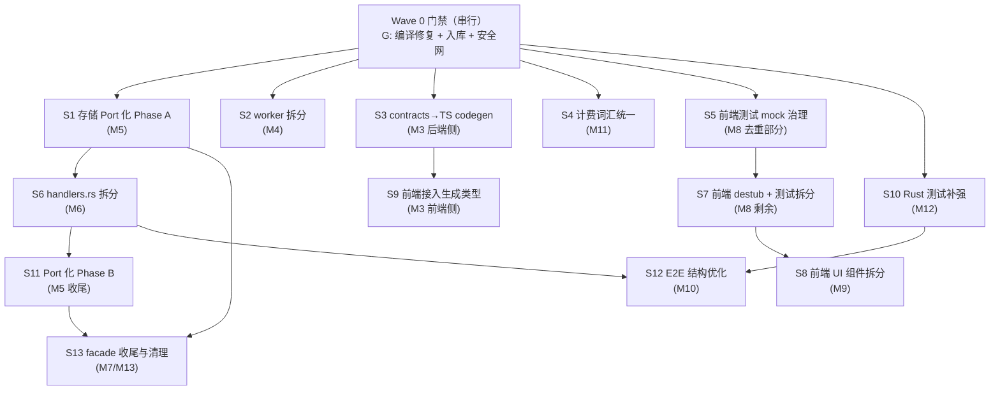

# Brooks 四维审计合并修复计划 — 2026-06-12

合并以下四份 Brooks 审计报告的全部结论，去重后按**目录边界解耦**为可并行开发的修复流（Stream），并给出依赖关系与集成门禁。

| 输入报告 | 维度 | 分数 |
|----------|------|------|
| [brooks-health-architecture-audit-2026-06-10.md](./brooks-health-architecture-audit-2026-06-10.md) | 健康度 + 架构 | 80 / 73 |
| [brooks-pr-review-2026-06-12.md](./brooks-pr-review-2026-06-12.md) | PR 可合并性 | 43 |
| [brooks-tech-debt-assessment-2026-06-12.md](./brooks-tech-debt-assessment-2026-06-12.md) | 技术债 | 34 |
| [brooks-test-quality-review-2026-06-12.md](./brooks-test-quality-review-2026-06-12.md) | 测试质量 | 52 |

**计划制定时实测状态（2026-06-12）：**

- `cargo check --workspace` 失败：`app-bootstrap` 68 errors（缺 `common` 等依赖、`storage-pg` `get_parsed_preview` 调用参数错位、trait impl 不匹配）——与测试报告 Critical 一致，**仍未修复**。
- 6 个新 domain crate（`app-core` / `app-chat` / `app-bootstrap` / `app-documents` / `app-admin` / `app-billing`）+ `ingestion-types` / `storage-local` 等**仍为未跟踪文件**。
- 巨型文件实测行数：`worker/main.rs` 3263、`handlers.rs` 1834、`test_context.rs` 1486、`messages.ts` 2519、`settings-surface.tsx` 1572、`chat-message-list.tsx` 1406。

---

## 1. 结论去重映射

四份报告对同一问题多次报告，合并后共 **13 个独立问题域**：

| # | 合并后问题 | 出现于 | 最高severity |
|---|-----------|--------|--------------|
| M1 | workspace 编译断裂（app-bootstrap 依赖链 + storage-pg 残留） | 健康 A1/P0 · PR Critical · 测试 Critical | **Critical** |
| M2 | 新 crate 未入库，PR 不完整不可审查 | PR Critical ×2 | **Critical** |
| M3 | 前后端 API 类型手工三层同步，无 codegen | 技术债 Critical（Priority 9） | **Critical** |
| M4 | worker `main.rs` 3263 行上帝文件 + worker→app 多余依赖 + URL 绕过 ParseRouter | 健康 R1/A3/A6/A7 · PR Warning · 技术债 Critical | **Critical** |
| M5 | `app-core`↔PG 强绑定：`pg()` 逃逸口、Port 泄漏行类型 | 健康 A2/A5/P1 · 技术债 Suggestion | Warning |
| M6 | `transport-http/handlers.rs` 1834 行单体 + NotebookAnalysisCollector 混杂 | PR Warning · 技术债 Warning | Warning |
| M7 | chat facade 双份维护（chat_delegates 透传 + ChatContext 重建 21 处）且无契约测试 | PR Warning ×2 | Warning |
| M8 | 前端 Surface 测试过度 mock / stub 子组件 / mock 块 14 处复制 | 测试 Warning ×4 | Warning |
| M9 | 前端巨型组件与重复逻辑（settings / chat-message-list / messages.ts / 定价 gate 6+ 处重复） | 健康 R2 · 技术债 Warning ×2 | Warning |
| M10 | E2E 结构债：test_context 1486 行上帝 fixture、streaming_chat 冷启动、45 分钟单线程预算 | 健康 T1 · 技术债 Warning · 测试 Warning | Warning |
| M11 | 计费层级词汇分裂（Enterprise vs Plus/Pro） | 技术债 Warning（Domain Distortion） | Warning |
| M12 | module_surface 假覆盖、retrieval-data-plane 仅 2 测、边界无 characterization test | 测试 Warning/盲区 | Warning |
| M13 | 低优清理：redteam/eval 未接生产、crate 级 `#![allow]`、CONTEXT.md 过期、AgentKind "general" 别名、common/contracts 双层类型 | 技术债/PR Suggestion ×5 | Suggestion |

---

## 2. 总体结构：1 个串行门禁 + 3 波并行

**解耦原则：每个 Stream 拥有独占目录边界，同一文件不会被两个并行 Stream 同时修改。** 存在文件冲突的任务用波次（Wave）排序隔离。



---

## 3. Wave 0 — 串行门禁（必须最先完成，阻塞一切并行）

**对应：M1 + M2 + M7 的安全网部分。这是唯一不可并行的阶段。**

| 步骤 | 任务 | 验收 |
|------|------|------|
| G1 | 修复 `app-bootstrap/Cargo.toml`：补 `common`、`async-trait`、`chrono`、`ingestion-types` 等缺失依赖 | `cargo check -p app-bootstrap` |
| G2 | 修复 adapter import：`app_core::config_helpers::map_pg_error`（私有路径）→ `app_core::map_pg_error`；对齐 trait impl lifetime；修复 `storage-pg` `get_parsed_preview` 调用参数错位 | 同上 |
| G3 | 修复 `app/src/lib_impl/state_methods.rs:80` 过期的 `crate::billing_context::BillingContext` → `app_billing::BillingContext` | `cargo check -p app` |
| G4 | `git add` 全部未跟踪新 crate 与配套文件（约 42 项），形成完整可审查基线 | `git status` 无关键 `??` |
| G5 | 全量基线：`cargo check --workspace` + `cargo test --no-run -p app` + `pnpm test run`（前端当前 224 测 12s 全绿，作对照基线） | 三者通过 |
| G6 | **安全网**：在 app/app-chat 边界补 3–5 个 characterization/contract 测试（`execute_chat` memory 模式、`execute_chat_stream`、`list_sessions`、`execute_rag_execute_plan`），断言错误码与 HTTP 入口一致 | `cargo test -p app --test delegate_contract` |

> G6 来自测试报告的明确要求：「补 characterization 测试后再继续模块迁移」。没有它，Wave 1 的所有移动式重构都没有回归保护。

---

## 4. Wave 1 — 五路并行（目录互斥，零交叉）

| Stream | 问题域 | 独占目录边界 | 任务要点 | 验收 |
|--------|--------|--------------|----------|------|
| **S1 存储 Port 化 Phase A** | M5 | `crates/app-core/`（ports）、`crates/app-bootstrap/src/adapters/`、`crates/app-documents/`、`crates/app-admin/` | 完成已起草的 `DocumentStorePort` / `AdminStorePort` / `BillingQuotaPort` wiring；`app-documents`/`app-admin` 全量 `pg()` → port；`pg()` 标 deprecated；URL imports 配额走 `BillingQuotaPort`（原 P3 合并入此） | `rg 'storage\.pg\(' crates/app-documents crates/app-admin` 为 0；`cargo test -p app-documents -p app-admin -p app-bootstrap -p app-core` |
| **S2 worker 拆分** | M4 | `bins/worker/`、`crates/ingestion/src/parser/router.rs` | 纯移动式重构：`PgTaskProcessor::process`、`run_document_pipeline`(~575行)、`execute_parse_plan` 移入 `pipeline/`（fetch→route→parse→index）；`main.rs` 只留 wiring（目标 ≤200 行，硬指标 <1800）；去掉 `worker → app` 依赖（改 `app-core`，删 `AppState::bootstrap` 用法）；URL 任务硬编码 `Local+Html` 改走 `ParseRouter::route`；`ocr_gating.rs` 重命名 | `cargo build -p avrag-worker`；`wc -l bins/worker/src/main.rs`；worker `Cargo.toml` 无 `app` 依赖；不改任何函数签名 |
| **S3 contracts→TS codegen** | M3 后端侧 | `contracts/`、`scripts/`、`frontend_next/lib/contracts/generated/`（新目录） | `typeshare`（fallback `ts-rs`）从 `contracts` 生成 TS；从 `contracts/tests/chat_json.rs` 导出 golden JSON fixture；新增 `pnpm generate:contracts` 脚本；**本阶段不改 `stream.ts`**（留给 S9，避免与前端冲突） | `cargo test -p contracts`；`pnpm generate:contracts` 产出文件 |
| **S4 计费词汇统一** | M11 | `crates/app-chat/src/agents/react_loop.rs`、`crates/billing/`、`frontend_next/components/admin/admin-i18n.ts` | tier enum 统一 `Free \| Plus \| Pro`（enterprise 仅作 DB migration alias）；react_loop budget 改读 billing policy；admin-i18n 对齐 | `cargo test -p avrag-billing -p app-chat`；migration 0037 测试必须 pass |
| **S5 前端测试 mock 治理** | M8 去重部分 | `frontend_next/tests/helpers/`、各 surface 测试文件的 mock 声明块 | 将 14–16 处 `vi.hoisted` 复制块迁入 `mock-providers.ts` 工厂；每文件 mock 声明 ≤5 行；**只动 mock 声明，不动断言**（destub 留给 S7） | `pnpm test run` 全绿；`mock-providers.ts` 被实际 import |
| **S10 Rust 测试补强** | M12 | 各 crate `tests/` 目录（不含 transport-http、不含 product_e2e） | 8 个 module_surface crate 各补 ≥1 个 behavioral contract test；`retrieval-data-plane` 补行为测试；`bootstrap_contract` 测试 | `cargo test -p retrieval-data-plane` 等新测试通过 |

**冲突说明：** S1 与 S10 都可能碰 `app-admin`/`app-documents` 的测试——约定 S10 不写这两个 crate 的测试（其行为测试由 S1 在迁移时顺带补），S10 专注 `common`/`ingestion`/`billing`/`search`/`share`/`storage-pg`/`retrieval-data-plane`。

---

## 5. Wave 2 — 四路并行（依赖 Wave 1 对应项合并）

| Stream | 问题域 | 依赖 | 独占目录边界 | 任务要点 | 验收 |
|--------|--------|------|--------------|----------|------|
| **S6 handlers.rs 拆分** | M6 | S1 合并后（避免与 Port 化改动撞 transport-http 调用点） | `crates/transport-http/src/` | 按 domain 拆 `handlers/chat.rs`、`handlers/documents.rs`、`handlers/notebooks.rs` 等，与 `routes/` 对齐；`NotebookAnalysisCollector` 移到 `notebook_analysis.rs` 或 `app-documents` | `cargo test -p transport-http`；`chat_stream_contract.rs` 通过 |
| **S7 前端 destub + 测试拆分** | M8 剩余 | S5 | `frontend_next/tests/`（workspace/admin surface 文件） | 逐步移除 `WorkspaceChatPane`/`RightRail` stub，改 DOM 行为断言（用户已决策：destub 增量方案）；`workspace-chat-pane.test.tsx`(1237行) 拆为 transcript/streaming/composer；`workspace-right-rail.test.tsx`(797行) 按 tab 拆 + `renderRightRail()` helper；billing 测试命名修正；至少 1 条不 stub 子组件的 shell 集成测试 | `pnpm test run`；surface 主断言为 DOM 可见结果 |
| **S8 前端 UI 组件拆分** | M9 | S7（拆出的 DOM 断言测试为重构护航） | `frontend_next/components/`、`frontend_next/lib/i18n/`、`frontend_next/app/(app)/`、`(marketing)/` 定价相关页 | `settings-surface.tsx` 拆 Tab 组件；`chat-message-list.tsx` 拆 `CitationRenderer`/`ProgressTimeline`；`messages.ts` 按 domain 拆 `messages/admin.ts` 等；定价改版 gate 6+ 处重复收敛为 `usePricingRevampGate` / `<PricingRevampGate>` | `pnpm typecheck`；`pnpm test run`；行数核查 |
| **S9 前端接入生成类型** | M3 前端侧 | S3 | `frontend_next/lib/workspace/stream.ts`、`lib/contracts/`、相关 tests | `stream.ts` 删除手写 `AnswerBlock`/`Citation`/`ToolResult`/`ChatTurnInput` 等，只保留 SSE 解析逻辑；接 golden fixture 做 cross-lang contract test；修正已知漂移（`ChatRequest.debug`、`GuardReport`、`PlannerOutput`） | `pnpm typecheck`；无重复手写 DTO；contract test 通过 |

**冲突说明：** S8 与 S9 都碰前端，但目录互斥（components/i18n vs lib/workspace/lib/contracts）。S7 与 S8 有顺序依赖不可并行同一组件域，可按组件域流水（chat 域先 destub→再拆分，settings 域同理错峰）。

---

## 6. Wave 3 — 收尾（依赖前两波）

| Stream | 问题域 | 依赖 | 目录边界 | 任务要点 | 验收 |
|--------|--------|------|----------|----------|------|
| **S11 Port 化 Phase B** | M5 收尾 | S1 + S6 | `crates/transport-http/`、`crates/app-core/Cargo.toml`、`crates/app-bootstrap/` | `transport-http` 去 `pg()`；object store 类型拆分或 `ObjectStorePort`；`app-core` Cargo 移除 `storage-pg` 依赖；删除 `pg()` 逃逸口 | `rg '\.pg\(\)' crates/transport-http` 为 0；`app-core/Cargo.toml` 无 storage-pg |
| **S12 E2E 结构优化** | M10 | S6 + S10 | `crates/app/tests/product_e2e/`、`.github/workflows/`、Playwright specs | `test_context.rs`(1486行) 按 profile 拆 `SmokeContext`/`RagContext`/`LlmRealContext` builder；`streaming_chat` 模块级共享 context、推广 `ready_rag` fixture；SSE event-order 等 protocol 断言下沉到 transport-http contract test；Playwright citation `if (count>0)` soft gate 改 hard assert（soft 仅 nightly）；同步 `e2e-gates.md` | `E2E_MODE=smoke cargo test -p app --test product_e2e -- --test-threads=1`；integration 时长下降 |
| **S13 facade 收尾与清理** | M7 + M13 | S1 + S11（多数调用方已迁走） | `crates/app/`、`crates/app-chat/`（redteam）、`CONTEXT.md`、`crates/common/` | bootstrap 时预构建 `ChatContext` 存入 `AppState`（消除 21 处重建）；`transport-http`/`worker` 改直接依赖 app-* crate，收缩 `app` facade；移除 crate 级 `#![allow(dead_code/deprecated/unused_mut)]`；redteam/eval_framework feature-gate 或移出；`CONTEXT.md` 路径/行数批量更新；E2E 改用 `"chat"` 后移除 AgentKind `"general"` 别名；明确 `contracts`=API 边界 / `common`=内部 runtime 类型的分层规则 | `cargo build --workspace` 无 dead_code 抑制下通过；CONTEXT.md 路径存在性检查 |

---

## 7. 目录所有权矩阵（防并行冲突的硬约束）

| 目录 | Wave 0 | Wave 1 | Wave 2 | Wave 3 |
|------|--------|--------|--------|--------|
| `crates/app-bootstrap/` | G1/G2 | S1 | — | S11 |
| `crates/app-core/` | — | S1 | — | S11 |
| `crates/app-documents/`、`app-admin/` | — | S1 | — | — |
| `crates/app/`（src + delegate 测试） | G3/G6 | — | — | S13 |
| `crates/app/tests/product_e2e/` | — | — | — | S12 |
| `bins/worker/` | — | S2 | — | S13（仅 Cargo 依赖） |
| `crates/ingestion/` | — | S2（仅 router） | — | — |
| `contracts/`、`scripts/` | — | S3 | — | — |
| `crates/app-chat/`、`crates/billing/` | — | S4 | — | S13（redteam） |
| `crates/transport-http/` | — | — | S6 | S11/S12（contract test） |
| `frontend_next/tests/` | — | S5/S10 | S7 | — |
| `frontend_next/components/`、`lib/i18n/` | — | S4（仅 admin-i18n） | S8 | — |
| `frontend_next/lib/workspace/`、`lib/contracts/` | — | S3（仅 generated/） | S9 | — |

---

## 8. 集成门禁（每个 Wave 结束执行）

```bash
# Rust
cd avrag-rs
cargo check --workspace
cargo test -p contracts -p app -p app-chat -p app-core -p app-bootstrap \
  -p app-documents -p app-admin -p transport-http -p avrag-billing -p avrag-worker

# Frontend
cd ../frontend_next
pnpm generate:contracts   # S3 之后
pnpm typecheck
pnpm test run

# 治理与 E2E
cd ../avrag-rs
../scripts/check_contract_governance.sh
E2E_MODE=smoke cargo test -p app --test product_e2e smoke:: -- --test-threads=1

# 结构变更后更新知识图谱
graphify update .
```

**复测目标（来自健康报告）：** Architecture ≥ 80、Composite ≥ 87；Change Propagation 与 Cognitive Overload 降级 Critical → Warning。

---

## 9. 风险与缓解（合并自各报告）

| 风险 | 缓解 |
|------|------|
| typeshare 不支持 `ChatEvent` tagged enum | fallback `ts-rs`；SSE 变体保留 thin TS wrapper（S3/S9） |
| worker 拆分引入行为变化 | S2 严格纯移动、不改签名；合并前跑 product_e2e smoke |
| S6 与 S11 同改 transport-http | 硬顺序：S6 merge → S11 rebase |
| Enterprise 用户 quota 回归 | S4 保留 DB row + alias 层；migration 0037 测试必须 pass |
| destub 后 surface 测试大量翻红 | S7 增量按文件推进，每文件独立 PR |
| 并行 Stream 同时 rebase 巨型基线 | Wave 0 G4 先入库形成稳定基线，之后各 Stream 从同一 commit 分支 |

---

## 10. 排期摘要

```
Wave 0（串行）：G1–G6 编译修复 + 入库 + 安全网          ← 唯一阻塞项，最优先
Wave 1（并行 ×6）：S1 / S2 / S3 / S4 / S5 / S10
Wave 2（并行 ×4）：S6 / S7 / S8 / S9
Wave 3（并行 ×3）：S11 / S12 / S13
每 Wave 结束：§8 集成门禁 + Brooks 复测记分
```
