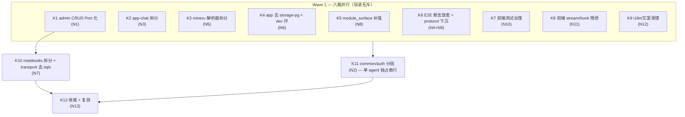

# Brooks 四维审计合并修复计划 — 2026-06-12（v3 第三轮）

合并四份 Brooks 审计报告（均为最新复测版）的剩余结论，去重后按**目录边界解耦**为可并行 subagent 工作流（Stream），并给出依赖关系与集成门禁。

| 输入报告 | 维度 | 分数 | 趋势 |
|----------|------|------|------|
| [brooks-architecture-audit-2026-06-12.md](./brooks-architecture-audit-2026-06-12.md)（v2 复测） | 架构 | **83** | 73→77→83 |
| [brooks-tech-debt-assessment-2026-06-12.md](./brooks-tech-debt-assessment-2026-06-12.md)（v3） | 技术债 | **70** | 34→58→70 |
| [brooks-test-quality-review-2026-06-12.md](./brooks-test-quality-review-2026-06-12.md)（Round 3） | 测试质量 | **82** | 52→62→82 |
| [brooks-pr-review-2026-06-12-v3.md](./brooks-pr-review-2026-06-12-v3.md)（v3） | PR | **93** | 43→83→93 |

**v3 计划时实测状态（2026-06-12）：**

- `cargo check --workspace` / `cargo test --no-run -p app` ✅ 全通过（Critical 清零）
- 前端 Vitest **254 测 / 60 文件**全绿；CI codegen drift 门禁已上线
- `transport-http` 零 `app::AppState`；auth 已 `AuthStorePort`；admin 系统路由已 Port 化
- worker `pipeline/helpers.rs` 255 行；前端巨型 surface 与 chat hook 均已拆分
- v2 计划的 Wave 0–3（G1/G2、S1–S12 主体）**已全部落地**

---

## 1. 本轮新增已偿还项（v2 计划执行成果，不再分配 Stream）

| 原问题域（v2 编号） | 证据 |
|----------|------|
| R1 `app` lib 测试 4×E0603 | `cargo test --no-run -p app` 通过 |
| R2 auth ~1400 行 SQL 直连 | `AuthStorePort` + `PgAuthStoreAdapter`；admin 系统路由走 `AdminStorePort` |
| R3 SSE 双轨 | `stream.ts` 经 `WireToWorkspace<ChatEvent>` 派生 |
| R4 UI `ChatMessage` 同名冲突 | `UiChatMessage` 在 `chat-session/types.ts` |
| R5 `pipeline/helpers.rs` 1273 行 | 拆为 `parse_route` 等，余 255 行 |
| R6 transport 经 `app::AppState` 门面 | 0 处；改依赖 `app-bootstrap` |
| R7 `PgContentStore` 位置 | 已迁 `app-bootstrap/adapters/` |
| R8 P2-13 假并发 | `tokio::join!` + 独立性断言 + bridge 断言；E2E 租户身份对齐（PR v3 主体已合入） |
| R9 前端测试治理 | streaming 拆 3 文件 + shared-mocks；Admin/Settings 改 DOM 断言 |
| R10 前端巨型 surface | share 100 / dashboard 337 / right-rail 41 / use-chat-session 95 行 |
| R11（部分）behavioral tests | 7 crate 已补 behavioral contract test |
| R13 CI codegen drift | `.github/workflows/frontend-unit.yml` |

---

## 2. 剩余结论去重映射（**13 个独立问题域**）

四报告交叉去重后：

| # | 合并后问题 | 出现于 | Severity | 优先级 |
|---|-----------|--------|----------|--------|
| N1 | admin CRUD 双轨：7 条路由仍 `repo_or_response!` → `postgres_repo`，未走 `AdminStorePort` | 架构 W（最高优先） | **Warning** | P1 |
| N2 | `common` 高扇入（24 crate / 163 文件）+ contracts re-export 混层；`avrag-auth` 扇入 20 | 架构 W + 技术债 W | **Warning** | P1 |
| N3 | app-chat 巨型子系统：`agents/loop/` 6009 行、`rag_prompts.rs` 1739、`eval_framework.rs` 1633、`chat_private.rs` 1119 | 架构 W + 技术债 W/S | **Warning** | P1 |
| N4 | `concurrent_query` flaky 风险：`assert_independent_citation_chunks` 对单文档 overlap 零容忍；HTTP 超时 180/120/60 魔数；worker env `NEXT_PUBLIC_*` 命名 | PR W + PR S×2 | **Warning** | P1 |
| N5 | `mineru.rs` 1886 行（workspace 最大生产文件）+ `router.rs` 852 行 | 技术债 W | **Warning** | P2 |
| N6 | `app` crate 残留 `storage-pg`/`sqlx` 生产依赖（`ObjectStoreHandle`、`PgStorageError`）+ app↔transport-http dev 环 | 架构 W + S | **Warning** | P2 |
| N7 | `handlers/notebooks.rs` 924 行 + transport-http 残留 `sqlx` 依赖（仅 `router_core` 一处 `sqlx::Row`） | 架构 S + 技术债 W | **Warning** | P2 |
| N8 | 8 crate `module_surface.rs` 假覆盖（仅断言 lib.rs 无 impl）；retrieval-data-plane 仅 3 behavioral | 测试 W | **Warning** | P2 |
| N9 | Product E2E 45 分钟单线程预算：protocol 断言应下沉 transport-http contract | 测试 W | **Warning** | P2 |
| N10 | 前端测试残债：`streaming.typewriter` 270 行偏大、surface `vi.mock` 块重复、`billing/api.test.ts` 命名缺 subject | 测试 W + S×2 | Warning/Sug | P3 |
| N11 | 前端 stream 残债：`kind` 映射层 ~200 行手写解析、`use-chat-stream.ts` 518 行 reducer 集中 | 技术债 S×2 | Suggestion | P3 |
| N12 | i18n/文案：`settings-share-messages.ts` 725 行平行体系、Plus 倍数 6×/10× 不一致、pricing gate layout 级收口 | 技术债 S + 架构 S | Suggestion | P3 |
| N13 | 低优清理：Playwright citation nightly hard assert、`UserTier` 别名移除、contracts 非 chat golden fixtures、domain crate 直连 storage-pg（8+ crate，长期） | 测试 S + 技术债 S×3 | Suggestion | P3 |

---

## 3. 总体结构：两波并行 + 一个串行收口

**解耦原则：** 每个 Stream 独占目录边界；同一文件不会被两个并行 Stream 同时修改。`common` 分层因波及全 workspace import，必须独占串行窗口。



---

## 4. Wave 1 — 八路并行（目录互斥，零交叉）

每个 Stream 可独立派给 1 个 subagent，从同一 baseline commit 分支。

| Stream | 问题域 | 独占目录 | Subagent 任务要点 | 验收 |
|--------|--------|----------|-------------------|------|
| **K1** | N1 | `crates/transport-http/src/routes/admin.rs`、`crates/app-core/src/admin_*.rs`、`crates/app-bootstrap/src/adapters/pg_admin_store.rs`、`crates/admin/` | 剩余 7 个 handler（list_orgs/get_org/list_users/delete_user/get_usage/block_org/audit_logs）迁入 `AdminStorePort`；删除 `repo_or_response!` 宏；`avrag_admin` 只留纯领域逻辑 | `rg 'repo_or_response!' crates/transport-http` 为 0；`cargo test -p transport-http -p app-admin` |
| **K2** | N3 | `crates/app-chat/src/` | ① `rag_prompts.rs` 拆 `prompts/` 目录（或外置模板）；② `eval_framework.rs` 移独立 crate 或 `tests/`；③ `agents/loop/` 绘制状态机单页文档，`config`/`exit_policy`/`disclosure_plan` 合并为 `LoopPolicy` 深模块（对外 ≤3 方法）；纯移动优先，不改行为 | `cargo test -p app-chat`；`wc -l` 单文件 <800 |
| **K3** | N5 | `crates/ingestion/src/parser/` | `mineru.rs` 按解析阶段（layout/table/figure/fallback）拆模块；`router.rs` 只做 dispatch；纯移动式 | `cargo test -p ingestion`；单文件 <500 行 |
| **K4** | N6 | `crates/app/`（含 Cargo.toml） | ① `secure_service_impls.rs` 的 `ObjectStoreHandle` 改 `app_core::ObjectStorePort`；② `PgStorageError` 映射收口 bootstrap adapter；③ 移除 `app/Cargo.toml` 生产依赖 `avrag-storage-pg`+`sqlx`；④ 依赖 transport-http 的测试迁顶层或删除 dev-dep | `rg 'avrag-storage-pg\|sqlx' crates/app/Cargo.toml` 无生产 dep；`cargo test -p app` |
| **K5** | N8 | `crates/{common,ingestion,billing,admin,search,share,storage-pg,retrieval-data-plane}/tests/` | 8 个仅 module_surface 的 crate 各补 ≥1 behavioral contract test；retrieval-data-plane 补至 ≥6；module_surface 保留作架构 guard；**不写** transport-http/tests（K6 独占） | `cargo test -p <各 crate>` 新增测试通过 |
| **K6** | N4+N9 | `crates/app/tests/product_e2e/`、`crates/transport-http/tests/`、`.github/workflows/{integration-e2e,smoke-e2e}.yml`、`docs/e2e-gates.md` | ① `assert_independent_citation_chunks` 放宽为「非完全相同集合」或改两文档 scope，失败时打印 `chunks_a/chunks_b`；② 提取 `HTTP_TIMEOUT_{RAG,REAL_LLM,DEFAULT}_SECS` 常量；③ `apply_worker_env` 旁注释 `NEXT_PUBLIC_*` 共用约定；④ SSE event-order 等 protocol 断言下沉 transport-http contract tests，product_e2e 仅留需真实 PG/Milvus 的路径 | `E2E_MODE=integration cargo test -p app --test product_e2e integration::concurrent_query`；smoke ≤10min |
| **K7** | N10 | `frontend_next/tests/`（不含 `workspace/stream.test.ts`、`chat-session/`） | ① `streaming.typewriter` 的 done-only/long-done 场景再拆或提取 `renderStreamingChatPane()` harness；② `installWorkspaceSurfaceMocks()` 封装 surface 测试重复 `vi.mock` 块；③ `billing/api.test.ts` 改 subject-first 命名 | `pnpm vitest run` 全绿 |
| **K8** | N11 | `frontend_next/lib/workspace/`、`frontend_next/hooks/chat-session/`、`frontend_next/tests/workspace/stream.test.ts` | ① 评估 reducer 直接消费 `ChatEvent`（`event` 字段）删除 `kind` 映射层（如风险高则仅文档化决策）；② `use-chat-stream.ts` 按 event type 提取 `handleTokenEvent`/`handleDoneEvent` 等 reducer 函数 | `pnpm typecheck`；`pnpm vitest run tests/workspace/` |
| **K9** | N12 | `frontend_next/lib/i18n/`、`frontend_next/lib/settings-share-messages.ts`、paywall/usage 相关 components | ① `settings-share-messages.ts` 合并进 i18n 域分片；② 查 pricing 页权威值后统一 Plus 倍数 6×/10×；③ layout 级包裹 `<PricingRevampGate>`，页面只读 gate 结果 | `pnpm typecheck`；`pnpm vitest run` |

**Wave 1 冲突说明：**

- K7 与 K8 都在 `frontend_next/tests/`，按文件清单互斥：K8 独占 `stream.test.ts` 与 chat-session 相关测试，K7 独占其余
- K5 与 K6 都写 Rust tests，互斥约定：K5 不碰 `transport-http/tests/` 与 `product_e2e/`
- K1 与 K6 都碰 transport-http，互斥约定：K1 只改 `src/routes/admin.rs` 及领域侧，K6 只改 `tests/`
- K2/K3/K4 各自独占一个 crate，零交叉

---

## 5. Wave 2 — 顺序收口（依赖 Wave 1 合并）

| Stream | 问题域 | 依赖 | 独占目录 | 任务要点 | 验收 |
|--------|--------|------|----------|----------|------|
| **K10** | N7 | K1 merge | `crates/transport-http/`（含 Cargo.toml） | ① `handlers/notebooks.rs` 924 行拆 `crud.rs` + `analysis.rs`；② 消除 `router_core.rs` 唯一 `sqlx::Row` 引用后从 Cargo.toml 删除 `sqlx`；③ `begin_auth_admin_tx` 测试残留处置 | `rg 'sqlx' crates/transport-http/Cargo.toml` 为 0；`cargo test -p transport-http` |
| **K11** | N2 | Wave 1 全部 merge（**独占串行窗口**，期间禁止其他 agent 改 Rust） | `crates/common/`、`crates/avrag-auth/` + 全 workspace import 修正 | ① `common` 拆 `common-types`（纯数据）+ `common-http`（ApiResponse）或最小化：移除 `pub use contracts::...` re-export，import 改直连 `contracts`；② auth 收敛最小导出面；③ 修正全 workspace 受影响 import | `cargo build --workspace`；`rg 'use common::contracts' crates/` 为 0 |
| **K12** | N13 | K10+K11 | `frontend_next/e2e/`、`crates/contracts/tests/`、`react_loop.rs` 别名行、`CONTEXT.md` | ① Playwright citation 在 nightly/staging 子集 hard assert（记录 `e2e-gates.md`）；② contracts 补 notebooks/billing/admin golden fixtures；③ 移除 `UserTier` 别名；④ 更新 CONTEXT 文档；⑤ Brooks 四维复测记分 | 复测 Architecture ≥88、Tech Debt ≥78、Test ≥85 |

> **N13 中「domain crate 直连 storage-pg（8+ crate）」为长期项**：本轮仅由 K4 解决 `app`，其余（app-chat/billing/share/chatmemory/admin）列入下一周期，避免单轮爆炸半径过大。

---

## 6. Subagent 派发模板

每个 Stream 启动 subagent 时使用以下 prompt 骨架（替换 `{STREAM}` / `{DIRS}` / `{ACCEPT}`）：

```markdown
## 任务：Brooks 修复 Stream {STREAM}

**独占目录（禁止修改其他目录）：** {DIRS}

**背景：** 见 avrag-rs/docs/brooks-merged-fix-plan-2026-06-12.md（v3）Wave {N} / {STREAM}

**必须做：**
1. 只改独占目录内文件
2. 纯移动式重构不改行为（若适用）
3. 完成后运行验收命令

**禁止做：**
- 修改独占目录外的文件（除非 Cargo.toml 最小依赖调整且已在计划中）
- 顺手重构无关代码
- 新增未请求功能

**验收：** {ACCEPT}
```

### 推荐并行批次

| 批次 | 同时派出的 Subagent | 预计冲突 |
|------|---------------------|----------|
| Batch 1 | K1–K9（最多 9 agents；资源有限时优先 K1/K2/K6） | 互斥约定见 §4 |
| Batch 2a | K10（1 agent，等 K1 merge） | — |
| Batch 2b | K11（1 agent **独占**，等 Wave 1 全 merge） | 全 workspace import，禁止并行 |
| Batch 3 | K12（1 agent） | 无 |

---

## 7. 目录所有权矩阵

| 目录 | Wave 1 | Wave 2 |
|------|--------|--------|
| `crates/transport-http/src/routes/admin.rs` | K1 | — |
| `crates/transport-http/src/handlers/`、Cargo.toml | — | K10 |
| `crates/transport-http/tests/` | K6 | — |
| `crates/app-core/`（admin port） | K1 | — |
| `crates/app-bootstrap/adapters/pg_admin_store.rs` | K1 | — |
| `crates/app-chat/` | K2 | — |
| `crates/ingestion/src/parser/` | K3 | — |
| `crates/ingestion/tests/` | K5 | — |
| `crates/app/` | K4 | — |
| `crates/{common,billing,admin,search,share,storage-pg,retrieval-data-plane}/tests/` | K5 | — |
| `crates/common/src/`、`crates/avrag-auth/` | — | K11（独占窗口） |
| `crates/app/tests/product_e2e/` | K6 | — |
| `crates/contracts/tests/` | — | K12 |
| `frontend_next/tests/`（除 stream/chat-session） | K7 | — |
| `frontend_next/lib/workspace/`、`hooks/chat-session/` | K8 | — |
| `frontend_next/lib/i18n/`、`settings-share-messages.ts` | K9 | — |
| `frontend_next/e2e/` | — | K12 |
| `.github/workflows/*e2e*` | K6 | — |

---

## 8. 集成门禁（每个 Wave 结束）

```bash
# Rust
cd avrag-rs
cargo check --workspace
cargo test --no-run -p app
cargo test -p contracts -p app -p app-chat -p app-core -p app-bootstrap \
  -p app-documents -p app-admin -p transport-http -p avrag-billing -p avrag-worker -p ingestion

# Frontend
cd ../frontend_next
pnpm check:contracts-drift
pnpm typecheck
pnpm vitest run

# 治理与 E2E
cd ../avrag-rs
../scripts/check_contract_governance.sh
E2E_MODE=smoke cargo test -p app --test product_e2e smoke:: -- --test-threads=1

# 结构变更后
graphify update .
```

**复测目标：** Architecture ≥88、Tech Debt ≥78、Test Quality ≥85、PR 维持 ≥90、Composite ≥85。

---

## 9. 风险与缓解

| 风险 | 缓解 |
|------|------|
| K11 common 分层波及全 workspace import | 独占串行窗口；先 `cargo build` 找全引用再机械替换；保留过渡 re-export 一个版本 |
| K2 loop 重构改变 agent 行为 | 纯移动优先；`LoopPolicy` 合并前后跑 `cargo test -p app-chat` + E2E smoke 对照 |
| K3 mineru 拆分破坏解析回归 | 纯移动式；以 ingestion parser 测试 + paddle_pdf_smoke 守护 |
| K6 放宽断言掩盖真实回归 | 失败消息打印双方 chunk 集；先在 integration CI 观察一轮再定放宽幅度 |
| K8 删除 kind 层影响所有消费方 | 先评估引用面；风险高则只做 reducer 提取并文档化决策 |
| K9 Plus 倍数需产品确认 | 先读 pricing 页权威值；无法确认则只列差异不改文案 |
| K1/K10 顺序错乱导致 transport 冲突 | K10 严格等 K1 merge；CI 上 rebase 验证 |

---

## 10. 排期摘要

```
Wave 1（最多 9 agents 并行）：K1–K9                    ← ~3–4 天
  优先级排序（资源受限时）：K1 → K6 → K2 → K4 → K3 → K5 → K7 → K8 → K9
Wave 2a（1 agent）：K10 notebooks + 去 sqlx             ← ~半天
Wave 2b（1 agent 独占）：K11 common/auth 分层           ← ~1 天
Wave 3（1 agent）：K12 收尾 + Brooks 四维复测           ← ~半天
每 Wave 结束：§8 集成门禁
```

---

## 修订记录

| 日期 | 说明 |
|------|------|
| 2026-06-12 v1 | 初版（基于未完成的 P0 编译债） |
| 2026-06-12 v2 | 四报告复测合并：14 项剩余问题，Wave 0–3 / S1–S12 |
| 2026-06-12 v3 | v2 计划全部落地后第三轮：标记 R1–R13 已偿还；基于架构 83 / 技术债 70 / 测试 82 / PR 93 重排为 13 项（N1–N13）、K1–K12 两波并行 + common 串行收口 |
| 2026-06-12 v3-K12 | **K1–K12 全部完成**。K12：Playwright `E2E_TIER` citation hard gate、`UserTier` 别名移除、contracts notebooks/billing/admin golden fixtures、CONTEXT 路径更新。N13 长期项（domain crate 直连 storage-pg）未纳入本轮。未执行 Brooks 四维全量复测记分。 |
