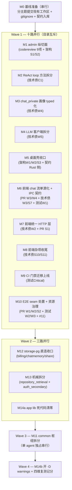

# Brooks 四维审计合并修复计划 — 2026-06-12（v4 第四轮 · 满分冲刺）

**目标：** 将四个 Brooks 评分维度全部推到 **100 分**（按各报告自身记分口径），并把全部工作按**目录互斥**解耦为可并行派发 subagent 的独立工作流（Stream）。

v3 计划的 K1–K12 已全部落地（见 [archive/brooks-merged-fix-plan-2026-06-12-v3.md](./archive/brooks-merged-fix-plan-2026-06-12-v3.md)）。本轮输入为四份最新复测报告 + 一份已逐项核验的 admin codereview 清单。

---

## 0. 输入与现状

| 输入报告 | 维度 | 当前分 | 距满分差额构成 |
|----------|------|--------|----------------|
| [brooks-pr-review-2026-06-12-v4.md](./brooks-pr-review-2026-06-12-v4.md) | PR | **78** | 4 Warning + 2 Suggestion |
| [brooks-architecture-audit-2026-06-12.md](./brooks-architecture-audit-2026-06-12.md)（v3 轮） | 架构 | **77** | 4 Warning（×5）+ 3 Suggestion（×1）= 23 |
| [brooks-tech-debt-assessment-2026-06-12.md](./brooks-tech-debt-assessment-2026-06-12.md)（v4） | 技术债 | **59** | 1 Critical（15）+ 4 Warning（×5）+ 6 Suggestion（×1）= 41（报告 §4.1 自带分值表） |
| [brooks-test-quality-review-2026-06-12.md](./brooks-test-quality-review-2026-06-12.md)（第 4 轮） | 测试 | **69** | 1 Critical（15）+ 3 Warning（×5）+ 1 Suggestion（×1）= 31 |
| **admin codereview（外部核验清单）** | 不计入现分 | — | 9 项属实（5 应修 + 4 程度被夸大但代码层面属实）；**不修则下一轮 PR/技术债复测必然成为新发现**，是守住满分的前置条件 |

> **100 分的含义**：本轮扫描口径下零发现，不是代码从此完美。维持机制见 §10。

### 0.1 admin codereview 核验锚点（编制本计划时已二次代码确认）

| # | 结论 | 代码锚点 | 状态 |
|---|------|----------|------|
| #4 | 封锁不存在的组织也返回成功（不查影响行数） | `pg_admin_store.rs` L790-807 `set_org_blocked` | ✔ 属实 |
| #6 | 组织列表无分页、每行 3 个相关子查询 | `pg_admin_store.rs` L628-651 `list_orgs` | ✔ 属实 |
| #9 | trait 默认实现返回 "not implemented" 恰好 8 个 | `app-core/src/admin_store.rs` L110-174 | ✔ 属实 |
| #11 | 冒烟脚本手写模块白名单，漏登记则 CI 静默跳过 | `scripts/run-product-smoke-e2e.sh` 两个数组 | ✔ 属实 |
| #3 | 审计搜索 5 处 `ilike` 不转义 `%` `_` | `pg_admin_store.rs` L184-195 | ✔ 属实 |
| #2 | CSV 公式注入（加固级，非可利用漏洞） | `app-core/src/admin_domain.rs` L90 `admin_audit_logs_to_csv` | ✔ 属实但夸大 |
| #5 | 删除不存在用户时先 commit 事务（整洁问题） | `pg_admin_store.rs` L720-728 | ✔ 属实但夸大 |
| #7 | 61 处一模一样的内联错误转换 + 3 个工具函数新旧两份 | `grep -c 'AppError::internal(error.to_string())' pg_admin_store.rs` = **61**；`crates/admin/src/audit.rs` 的 `usage_period_start`/`clamp_audit_per_page`/`audit_logs_to_csv` 与 `app-core/admin_domain.rs` 逐字重复 | ✔ 属实（部分过时项已剔除） |
| #8 | 新旧两套数据结构并存（旧 crate 166 行，仅 health 在用） | `crates/admin/` 共 166 行；生产引用仅 `transport-http` 一处 | ✔ 属实但影响小 |
| — | `impl AdminStorePort` 全仓仅 2 处（生产 adapter + app-admin 契约测试） | rg 确认 | ✔ #9 改造影响面封闭 |

**用户核验给出的优先序**（已织入 Stream 内部任务排序）：#4 → #11 → #6 → #3+#2 → #9/#7/#8/#5。

---

## 1. 四报告 + codereview 去重后的统一问题清单

跨报告重复先合并：

| 合并项 | 来源 | 归属 Stream |
|--------|------|-------------|
| `x-mock-rag-query` 双端死管道 | PR-W1 ＝ 测试-W2 | M10 |
| 桌面 IPC 契约群（取消失效 / ApiError 失配 / 第三份事件 schema / kind 层 / 零测试） | PR-W3 + PR-W4 + 测试-W1 + 技术债-W3 + 技术债-S7 | M5 + M6 |
| `avrag-admin` 空壳 ⊃ 重复工具函数 ⊃ 新旧结构并存 | 架构-S1 ⊃ codereview #7/#8 | M1 |
| app-chat 千行文件 | 架构-W4 ＝ 技术债-C1 + 技术债-W4 | M2 + M3 |
| 死代码警告（测试-S1） | admin 4 条→M1；billing 2 条→M12；fixture 2 条→M10；app lib 16 条→M14 | 分摊 |

去重后共 **24 个独立问题域**，分配到 **14 个 Stream + 1 个基线步骤（M0）**。

---

## 2. 满分差额账本（每维度逐项核销 → 100）

### 技术债 59 → 100（报告 §4.1 分值表）

| 报告任务# | 内容 | 分值 | Stream |
|----|------|------|--------|
| 1（Critical） | ReAct loop 两个 450+ 行方法拆分 | +15 | M2 |
| 2 | 前端 7 个 client.ts 统一 HTTP 层 | +5 | M7 |
| 3 | 桌面事件 schema 对齐 contracts | +5 | M5 + M6 |
| 4 | 记忆画像 typed 化 + 拆段 | +5 | M3 |
| 5 | LLM 客户端拆文件 | +5 | M4 |
| 6 | storage-pg 直连收口（4 crate） | +1 | M1（app-admin）+ M12（其余 3 个） |
| 7 | stream.ts kind 层删除 | +1 | M6 |
| 8 | repository_retrieval.rs 拆 3 域 | +1 | M13 |
| 9 | auth_secondary.rs 拆子域 | +1 | M13 |
| 10 | settings-share-messages shim 删除 | +1 | M8 |
| 11 | use-workspace-context-rail 拆分 | +1 | M8 |
| | | **= 100** | |

### 测试 69 → 100

| 发现 | 分值 | Stream |
|------|------|--------|
| Critical：4 层门禁 workflow 在 GitHub 永不读取的嵌套目录 | +15 | M9 |
| W1：桌面传输层零测试 | +5 | M6 |
| W2：死管道 seam + 引文独立性断言孤儿 | +5 | M10 |
| W3：fixture 泄漏 + 容器堆积 | +5 | M10 |
| S1：dead_code 警告常驻测试输出 | +1 | M1/M10/M12/M14 |
| | **= 100** | |

### 架构 77 → 100

| 发现 | 分值 | Stream |
|------|------|--------|
| W1：desktop 双 workspace 锁漂移 | +5 | M5（M9 提供 CI 兜底） |
| W2：227 行壳拉 558 包（CachePort 落点过重） | +5 | M5 |
| W3：common 枢纽含 rag_execute/tool_call 重型领域逻辑 | +5 | M11 |
| W4：app-chat 3 个千行文件 | +5 | M2 + M3 |
| S1：avrag-admin 空壳 | +1 | M1 |
| S2：app-admin 未使用的 storage-pg 生产依赖 | +1 | M1 |
| S3：desktop OnceCell 全局单例 | +1 | M5 |
| 卫生项：frontend_next/out/ 未忽略 | 计外 | M0 |
| | **= 100** | |

### PR 78 → 100

| 发现 | 分值 | Stream |
|------|------|--------|
| W：`x-mock-rag-query` 死管道 | +5 | M10 |
| W：concurrent_query 门禁弱化后续（命名失实 / 孤儿断言 / 决策回写） | +5 | M10 |
| W：`streamChatViaIPC` 忽略 AbortSignal（停止生成失效） | +5 | M5 + M6 |
| W：`requestViaIPC` 收窄 REST 契约（ApiError/headers/body） | +5 | M5 + M6 |
| S：api-access 孤儿 `decodeError`/Middle Man | +1 | M7 |
| S：PG/Milvus 释放路径不一致 + 超时静默 | +1 | M10 |
| | **= 100** | |

> PR 维度另有**过程性要求**（v4 报告批注"工作区混有两个不相关工作流"）：每个 Stream 独立分支/独立提交、提交信息引用本计划编号、不顺手改无关代码、每 PR 自带测试。M0 先把现存混合工作区拆成两个干净提交。

---

## 3. 总体结构：基线 → 十路并行 → 三路收口 → 串行 → 复测



---

## 4. M0 — 基线准备（串行，启动并行前必须完成，~0.5 天）

1. **现有工作区按主题拆成两个提交**（回应 PR-v4 混合工作流批注）：
   - 提交 A：`product_e2e` 4 文件 + `docs/e2e-gates.md`（E2E 稳定化工作流）
   - 提交 B：`frontend_next` 3 文件 + `pnpm-lock.yaml`（transport 收敛工作流；lockfile 同步是测试-W1 的佐证项，必须随提交）
2. `.gitignore` 增补：`frontend_next/out/`、`frontend_next/.serena/`、`.code-review/`、`.mimocode/`
3. `desktop/`、四份报告、归档文件、本计划入库（一个独立提交）
4. §6 跨流契约随本计划入库，作为全部 subagent 的共同依据

---

## 5. Stream 明细

### Wave 1（十路并行，目录互斥）

| Stream | 问题来源 | 独占文件/目录 | 任务要点（按优先序） | 验收 |
|--------|----------|----------------|----------------------|------|
| **M1 admin 纵切面** | codereview #2–#9 + 架构 S1/S2 + 测试 S1（admin 部分） | `crates/app-core/src/{admin_store.rs,admin_domain.rs}`、`crates/app-bootstrap/src/adapters/pg_admin_store.rs`、`crates/transport-http/src/routes/admin.rs` + `transport-http/Cargo.toml`、`crates/admin/`（删除）、`crates/app-admin/`（Cargo.toml + tests）、workspace `Cargo.toml`（members 移除 admin） | ① **#4** `set_org_blocked` 检查 `rows_affected()`，0 行返回 `not_found`（与 `get_org` 语义对齐），补行为测试；② **#6** `list_orgs` 改单条 `left join … group by` 聚合（消除每行 3 个相关子查询），路由加可选 `page`/`per_page`（缺省 100、上限 500，响应保持数组——现组织数远低于缺省值，前端无感知；分页 UI 列后续产品项）；③ **#3** 审计搜索入参转义 `%` `_` `\` 后再拼 `ilike` 模式，补含特殊字符的行为测试；④ **#2** `admin_audit_logs_to_csv` 对以 `= + - @ \t \r` 开头的单元格前置 `'`（OWASP 标准缓解）；⑤ **#9** 删除 trait 8 个默认实现转**必选方法**，更新全仓仅有的 2 个 impl 站点（编译期强制新实现覆盖）；⑥ **#7** 新增局部 `fn db_err(sqlx::Error) -> AppError`，61 处内联闭包机械替换；⑦ **#8+架构S1** 删除 `crates/admin`：`handle_health` 内联进 transport-http 路由，audit.rs/models.rs 残余与 app-core 重复者直接删、独有者并入 `app-admin`，旧 crate 测试随迁；⑧ **架构S2** `app-admin/Cargo.toml` 删生产依赖 `avrag-storage-pg`（保留 dev） | `cargo test -p app-core -p app-admin -p app-bootstrap -p transport-http`；`grep -c 'AppError::internal(error.to_string())' pg_admin_store.rs` ≤1；`ls crates/admin` 不存在；`rg 'not implemented' crates/app-core/src/admin_store.rs` = 0；封锁不存在组织的测试断言 404 |
| **M2 ReAct loop 拆分** | 技术债 C1（+15）+ 架构 W4 部分 | `crates/app-chat/src/agents/loop/**` | 不改任何行为，纯提取：`run()`（~465 行）内预算检查、turn-end 遥测、auto-fallback 触发各提取为 <60 行私有方法；`dispatch_skill_tool()`（~475 行）按 skill 类型拆 `dispatch_codegen`/`dispatch_search`/`dispatch_native` 等分发函数；现有 20+ 内嵌测试是安全网，**拆一步跑一次** | 单方法 <150 行；≥6 层缩进行数减半；`cargo test -p app-chat` 全绿 |
| **M3 chat_private 画像 typed 化** | 技术债 W4 + 架构 W4 部分 | `crates/app-chat/src/chat_private.rs`（+同 crate 新增子模块；与 M2 文件零交叉） | ① profile delta 在 `parse_structured_json_response` 后转 typed struct（serde Deserialize + default），使后续 8 处 `unwrap` 不可达后删除；② 补"LLM 返回畸形 JSON（profile 非 object / slot 非 array）"行为测试，断言不 panic；③ `build_rag_session_context`（~193 行）按 memory/quota/visibility 三段提取 | 画像链路生产 `unwrap` = 0；畸形输入测试通过；`cargo test -p app-chat` 全绿 |
| **M4 LLM 客户端拆分** | 技术债 W5 | `crates/avrag-llm/src/**` | `client.rs`（1262 行）拆出 `stream_parser.rs`（内嵌测试随迁）、`rate_limit.rs`；三个 `complete_*` 方法收敛共用 request-build / usage-record 路径；纯移动优先 | 单文件 <600 行；`cargo test -p avrag-llm` 全绿 |
| **M5 桌面壳收口（Rust 侧）** | 架构 W1/W2/S3 + 技术债 W3（emit 端）+ PR-W3/W4（command 端） | `desktop/**`、新建 `crates/rag-core-ports/`、`avrag-rag-core/src/ports.rs`（仅加 re-export shim）、`crates/storage-local/`（Cargo.toml + import）、`avrag-rs/Cargo.toml`（members） | ① 尝试将 `desktop/src-tauri` 并入 avrag-rs workspace members（相对路径 `../desktop/src-tauri`），`cargo metadata` 验证；若 cargo 拒绝 workspace 外成员，回退：保留独立 workspace + 立即 `cargo update` 同步锁 + 由 M9 的 desktop-check CI job 兜底（两种结局均核销架构-W1，报告原文即二选一）；② 新建轻量 `rag-core-ports` crate 安置 `CachePort`（零重依赖），rag-core `pub use` 兼容 re-export，`storage-local` 改依赖 ports crate，desktop 移除对 `avrag-rag-core` 的直接依赖；③ `OnceCell` 全局单例改 `app.manage(AppLocalState)` + `State<T>` 注入；④ `chat_stream` emit 端直接序列化 contracts `ChatEvent`（wire 同源，见契约 C1），删除手写 `{kind:...}` JSON；⑤ 新增 `chat_cancel` command（见契约 C2），占位实现也要正确终止事件流；⑥ `api_call` 失败改为结构化 Err（见契约 C3），占位路径返回 `status:501, code:"not_implemented"` 而非 Ok 包裹 | `cargo tree`（desktop）不含 avrag-llm/redis/code-interpreter；desktop 锁包数显著下降（目标 <350）；`cargo check`（desktop）通过；emit 负载与 SSE wire 格式一致（对照 contracts fixtures） |
| **M6 前端 chat 流单源化 + IPC 契约（TS 侧）** | PR-W3/W4（TS 侧）+ 技术债 W3/S7 + 测试 W1 | `frontend_next/lib/runtime/**`、`frontend_next/lib/workspace/stream.ts`、`frontend_next/hooks/chat-session/**`、`frontend_next/tests/runtime/**`（新建）、`frontend_next/tests/workspace/stream.test.ts` 及 chat-session 相关测试 | ① `streamChatViaIPC` 实现真实取消：`signal.addEventListener("abort", …)` 中 invoke `chat_cancel` 并立即 `unlisten()`，AbortError 语义与 Web 路径对齐；② `requestViaIPC` 把 Rust 结构化错误映射回 `new ApiError(status, code, message)`；非字符串 body 直接 `throw new TypeError`；transport.ts 模块注释明确"IPC 路径不支持自定义 headers"；③ IPC 事件解析复用 contracts `ChatEvent` 路径（`parseWireChatEvent` 或直接类型），删除 `as` 裸转；④ **技术债 S7**：删除 stream.ts ~200 行 kind 映射层，reducer 直接消费 `ChatEvent.event`（现有 stream.test.ts 断言绑定行为而非实现，上轮重构已验证，是安全网）；对组件层导出的 hook 接口保持不变，变化封闭在 chat-session + lib/workspace 内；⑤ **测试 W1**：新建 `tests/runtime/`——`vi.mock("@tauri-apps/api/core")` 覆盖 body 序列化（字符串/对象/空/FormData 抛错）、流事件转发顺序、abort 取消、`transport.ts` isTauri 两分支各一测 | `pnpm typecheck`；`pnpm vitest run` 全绿；`rg 'as WorkspaceChatStreamEvent' lib/runtime/` = 0；kind 层 ~200 行删除 |
| **M7 前端统一 HTTP 层** | 技术债 W2 + PR-S1 | `frontend_next/lib/http/`（新建）、`frontend_next/lib/{workspace,admin,share,settings,auth,dashboard,api-access}/client.ts`（`lib/query/client.ts` 先核实是否属 fetch 包装，不是则不动）、对应 client 单测文件 | ① 新建 `lib/http/request.ts`：token 注入、buildApiUrl、错误归一为 `ApiError`，**底层调 transport 的 `restRequest`（只 import 不修改，签名见契约 C4）**，IPC/HTTP 分叉只发生一次；② 7 个 client.ts 改为薄域层，删除各自手写 fetch+Authorization；③ **PR-S1**：删除 api-access 孤儿 `decodeError`/`ErrorEnvelope`，`request` 内联为直呼共享层；auth/client.ts 的 `decodeError` 并入统一错误归一 | `rg 'await fetch\(' frontend_next/lib/*/client.ts` = 0（仅 http/ 与 runtime/ 保留）；`pnpm typecheck` + `pnpm vitest run` 全绿 |
| **M8 前端杂项收尾** | 技术债 S10/S11 | `frontend_next/lib/settings-share-messages.ts`（删除）、share/settings 下 10 个 import 调用方（仅改 import 行）、`use-workspace-context-rail.ts` 及新子 hook、相关测试 | ① 一次 codemod 把 10 个调用方 import 切到 `lib/i18n/messages`，删除 14 行 shim；② `use-workspace-context-rail.ts`（750 行/39 hooks）按 selection/filter/expansion 拆子 hook，参照 chat-session/ 拆分先例 | shim 文件删除；单 hook 文件 <300 行；`pnpm typecheck` + `pnpm vitest run` 全绿 |
| **M9 CI 门禁迁移上线** | 测试 Critical（+15）+ 架构 W1 兜底 | 根 `.github/workflows/**`、`avrag-rs/.github/`（删除）、`frontend_next/.github/`（删除） | ① 将 `avrag-rs/.github/workflows/` 5 个（smoke-e2e / integration-e2e / nightly-llm-real / nightly-quality / weekly-regression）与 `frontend_next/.github/workflows/` 4 个（frontend-journey / frontend-skills / frontend-smoke / frontend-unit，与根同名的 frontend-unit 去重）迁至根 `.github/workflows/`；② 每个文件补 `defaults.run.working-directory` 与路径前缀（`paths: 'avrag-rs/crates/**'` 等）；③ 新增 `desktop-check` job（对 desktop 壳 `cargo check`，配合 M5 兜底锁漂移）；④ **用空提交 PR 实测触发**，`gh run list --workflow=<each>` 留痕；⑤ 删除两个嵌套 `.github` 目录 | 空 PR 上 smoke/frontend-unit 实际运行并绿；`ls avrag-rs/.github frontend_next/.github` 不存在；触发表与 e2e-gates.md 一致（文档由 M10 更新，文件名/触发语义按本计划预先固定，见契约 C7） |
| **M10 E2E seam 处置 + 资源治理** | PR-W1/W2/S2 + 测试 W2/W3 + codereview #11 | `crates/app/tests/product_e2e/**`、`scripts/run-product-smoke-e2e.sh`、`docs/e2e-gates.md` | ① **死管道处置（方案 b+c）**：删除 `test_context/http.rs` 两处 `x-mock-rag-query` 注入与 `mock_servers.rs` 的 `header_query` 参数链，在 builder 注释指明 messages 解析是唯一可靠注入路径；新增 `#[ignore]` llm_real 并发独立性变体，把孤儿 `assert_independent_citation_chunks` 挂进去（恢复产品意图的 gate 表达）；② 弱化后的 mock 测试重命名为 `concurrent_rag_queries_are_safe_on_codegen_bridge`（名实相符）；③ **#11** 脚本加模块覆盖守卫：用 `cargo test --test product_e2e --features product-e2e smoke:: -- --list` 枚举实际模块，与 NON_RAG/RAG_SERIAL 两数组的并集比对，缺失即 `exit 1`（新模块漏登记从静默跳过变成大声失败）；④ **测试 W3**：脚本加 `trap 'docker ps -aq --filter name=avrag-test- \| xargs -r docker rm -f' EXIT`（管道符为表格转义，脚本内写原样）；fixture keep-alive 字段加 `_` 前缀或 `#[allow(dead_code)]` 并注明意图；`shared_rag_fixture` 可见性对齐 `pub(crate)`；⑤ **PR-S2**：抽共用"停止 + slot 清理"收口函数统一 PG/Milvus 释放路径，`timeout` 超时打 `eprintln!` 日志；⑥ 更新 `e2e-gates.md`：触发表加"执行方式"列（按 M9 迁移后的事实）、死管道决策记录、本轮复跑结果回写 | `rg 'x-mock-rag-query' avrag-rs/` 仅余文档；`E2E_MODE=smoke` 脚本跑完后 `docker ps --filter name=avrag-test-` 为空；故意注释掉脚本数组一项时脚本失败；`cargo test … integration::concurrent_query` 绿 |

**Wave 1 冲突说明：**

- M2 与 M3 同在 `app-chat`，按文件互斥：M2 独占 `agents/loop/`，M3 独占 `chat_private.rs` 及其新子模块；先合并者优先，后者 rebase
- M5 与 M6 是同一契约的两端，**互不改对方文件**，按 §6 契约 C1–C3 并行开发
- M6 与 M7 都涉 transport：M6 拥有 `lib/runtime/**`，M7 只 import `restRequest`（契约 C4 冻结签名）
- M1 与 M13 都碰 transport-http：M1 独占 `routes/admin.rs` + Cargo.toml，M13（Wave 2）独占 `lib_impl/auth_secondary*`，无交叉
- M9 与 M10：M9 拥有 workflow YAML，M10 拥有脚本内容与 e2e-gates.md（契约 C7/C8）
- Rust 流合并时 `Cargo.lock` 冲突：按合并顺序 rebase 后 `cargo build` 重新生成

### Wave 2（三路并行，等 Wave 1 全部合并）

| Stream | 问题来源 | 独占文件/目录 | 任务要点 | 验收 |
|--------|----------|----------------|----------|------|
| **M12 storage-pg 直连收口** | 技术债 S6 剩余 + 测试 S1（billing 部分） | `crates/{billing,chatmemory,share}/`、`crates/app-core/`（新增 port 定义）、`crates/app-bootstrap/src/adapters/`（新增 adapter 文件，不碰 pg_admin_store.rs） | ① billing / chatmemory / share 三个 domain crate 照 app-chat 成例改经 repository port 注入，SQL 实现迁 bootstrap adapter；② 顺带清理 billing 2 条 dead_code 警告（`OrderStatus`/`BillingOrder`，port 化后仍无引用则删） | `cargo metadata` 中 storage-pg normal 依赖仅剩 app-bootstrap/worker；`cargo test -p avrag-billing -p chatmemory -p share -p app-bootstrap` 全绿；billing 编译零警告 |
| **M13 机械拆分** | 技术债 S8/S9 | `crates/storage-pg/src/lib_impl/repository_retrieval.rs`（→3 个 impl 文件）、`crates/transport-http/src/lib_impl/auth_secondary.rs`（→`auth/{profile,preferences,reset}.rs`） | 纯移动式拆分（Rust 允许跨文件 impl 同一类型；参照 notebooks/ 先例），不改任何行为 | 单文件 <600 行（storage-pg）/ <500 行（transport-http）；`cargo test -p avrag-storage-pg -p transport-http` 全绿 |
| **M14a app lib 死代码清零** | 测试 S1（app 16 条） | `crates/app/src/**` | 逐条三选一：确属孤儿→删；仅测试用→`pub(crate)`/`#[cfg(test)]`；有意保留→`#[allow(dead_code)]` + 一行理由注释 | `cargo test -p app` 编译输出 warning 计数 = 0 |

### Wave 3（单 agent 独占串行，期间禁止其他 agent 改 Rust）

| Stream | 问题来源 | 范围 | 任务要点 | 验收 |
|--------|----------|------|----------|------|
| **M11 common 枢纽拆分** | 架构 W3 | `crates/common/src/`、迁入目标 crate、全 workspace import 修正 | ① `rag_execute.rs`（626 行）与 `tool_call.rs`（605 行）迁出 common，优先迁入 `contracts`（如引入不可接受依赖则新建 `rag-contract` crate）；② 不留过渡 re-export，全 workspace import 机械替换一步到位；③ common 收敛为纯类型 + 错误定义 | common/src 内 `rag_execute`、`tool_call` 引用 = 0；common 总行数 2689 → ~1450；`cargo build --workspace` + 全量测试绿；desktop 传递依赖随之减重 |

### Wave 4（收尾，~0.5 天）

| Stream | 任务要点 | 验收 |
|--------|----------|------|
| **M14b 警告门禁 + 复测记分** | ① 全仓警告确认清零后，在根 workflows 的 Rust test job 设 `RUSTFLAGS="-D warnings"`；② `graphify update .`；③ Brooks 四维全量复测（PR Review 以本轮各 Stream 的最终 PR 为对象），分数写入 `.brooks-lint-history.json`；④ 本计划修订记录回写各项核销状态 | 四维复测 = 100/100/100/100；未达 100 的残项立即开补丁 Stream |

---

## 6. 跨流接口契约（并行不漂移的关键，M0 时随计划冻结）

| # | 契约 | 约束双方 |
|---|------|----------|
| C1 | 桌面 chat 事件：事件名 `chat://{request_id}`，负载 = contracts `ChatEvent` 的 serde JSON，**与 SSE `data:` 行 wire 格式逐字节同源**（contracts 单源，禁止手写 schema） | M5（emit）↔ M6（parse） |
| C2 | 取消命令：`chat_cancel { request_id: string }`，幂等；前端在 `signal` abort 时调用并立即 `unlisten()` | M5 ↔ M6 |
| C3 | `api_call` 失败 = Tauri invoke reject，值为 `{ status: number, code: string, message: string }`；前端据此构造 `ApiError`；占位接口返回 `status:501, code:"not_implemented"` 的 Err 而非 Ok | M5 ↔ M6 |
| C4 | `restRequest<T>(path, init?, token?)`（transport.ts L33）签名冻结；M7 只 import 不修改 | M6 ↔ M7 |
| C5 | `AdminStorePort` 8 个方法转必选；全仓 impl 站点仅 2 处且都在 M1 独占清单内，其他 Stream 不得新增该 trait 实现 | M1 |
| C6 | `list_orgs` 分页参数向后兼容（可选 query 参数、响应仍为数组）；本轮前端不改 admin 分页 UI | M1 ↔ M7 |
| C7 | workflow 迁移保持原文件名与触发语义（smoke-e2e=PR、integration-e2e=main、nightly-*=cron、frontend-unit=PR）；M10 据此预先更新 e2e-gates.md，无需等 M9 产出 | M9 ↔ M10 |
| C8 | 冒烟脚本内容归 M10，workflow 中对脚本的调用方式归 M9 | M9 ↔ M10 |

---

## 7. 目录所有权矩阵

| 目录/文件 | Wave 1 | Wave 2 | Wave 3/4 |
|-----------|--------|--------|----------|
| `crates/app-core/src/admin_*.rs` | M1 | — | — |
| `crates/app-bootstrap/src/adapters/pg_admin_store.rs` | M1 | — | — |
| `crates/app-bootstrap/src/adapters/`（新 adapter） | — | M12 | — |
| `crates/transport-http/src/routes/admin.rs` + Cargo.toml | M1 | — | — |
| `crates/transport-http/src/lib_impl/auth_secondary*` | — | M13 | — |
| `crates/admin/`（删）、`crates/app-admin/` | M1 | — | — |
| `crates/app-chat/src/agents/loop/**` | M2 | — | — |
| `crates/app-chat/src/chat_private.rs` | M3 | — | — |
| `crates/avrag-llm/` | M4 | — | — |
| `desktop/**`、`crates/rag-core-ports/`（新）、`crates/storage-local/` | M5 | — | — |
| `avrag-rag-core/src/ports.rs`（仅 re-export shim） | M5 | — | — |
| `crates/{billing,chatmemory,share}/` | — | M12 | — |
| `crates/storage-pg/src/lib_impl/repository_retrieval*` | — | M13 | — |
| `crates/app/src/**` | — | M14a | — |
| `crates/app/tests/product_e2e/**` | M10 | — | — |
| `crates/common/src/**` + 全仓 import | — | — | M11（独占窗口） |
| `scripts/run-product-smoke-e2e.sh`、`docs/e2e-gates.md` | M10 | — | — |
| 根 `.github/workflows/**` | M9 | — | M14b（-D warnings） |
| `frontend_next/lib/runtime/**`、`lib/workspace/stream.ts`、`hooks/chat-session/**`、`tests/runtime/**`、`tests/workspace/stream.test.ts` | M6 | — | — |
| `frontend_next/lib/http/`（新）、`lib/*/client.ts` 及其单测 | M7 | — | — |
| `frontend_next/lib/settings-share-messages.ts`、10 个 import 调用方、`use-workspace-context-rail*` | M8 | — | — |
| `.gitignore`、基线提交 | M0 | — | — |

---

## 8. Subagent 派发模板

```markdown
## 任务：Brooks 满分计划 Stream {M#}

**独占文件/目录（禁止修改其他位置）：** {DIRS}

**背景：** 见 avrag-rs/docs/brooks-merged-fix-plan-2026-06-12.md（v4）§5 / {M#}；
跨流契约见 §6（涉及本 Stream 的条目：{C#…}），契约内容不得擅改。

**必须做：**
1. 只改独占清单内文件；行为修复先写复现测试再修（#4/#3/#2 类）
2. 纯移动式重构不改行为（M2/M4/M13 类），拆一步跑一次测试
3. 完成后运行验收命令并在产出中粘贴结果
4. 独立分支独立提交，提交信息引用 Stream 编号

**禁止做：**
- 修改独占清单外的文件（Cargo.toml 最小依赖调整仅限计划已列明者）
- 顺手重构无关代码、新增未请求功能
- 改动 §6 契约中已冻结的接口签名/事件格式

**验收：** {ACCEPT}
```

**推荐并行批次：**

| 批次 | 同时派出 | 说明 |
|------|----------|------|
| Batch 0 | M0（主线执行，非 subagent） | 基线提交 + 契约冻结 |
| Batch 1 | M1–M10（最多 10 agents） | 资源受限时优先序：**M1 → M9 → M10 → M2 → M5 → M6 → M3 → M4 → M7 → M8**（用户核验优先级 #4/#6/#3/#2/#9/#7/#8/#5 全在 M1 内部按序执行，#11 在 M10） |
| Batch 2 | M12、M13、M14a（3 agents） | 等 Wave 1 全部合并 |
| Batch 3 | M11（1 agent 独占） | 期间禁止其他 agent 改 Rust |
| Batch 4 | M14b（1 agent） | 复测记分 |

---

## 9. 集成门禁（每个 Wave 结束执行）

```bash
# Rust
cd avrag-rs
cargo check --workspace
cargo test -p contracts -p app -p app-chat -p app-core -p app-bootstrap \
  -p app-documents -p app-admin -p transport-http -p avrag-billing -p avrag-llm \
  -p avrag-worker -p ingestion -p avrag-storage-pg
cargo check --manifest-path ../desktop/src-tauri/Cargo.toml   # M5 后

# Frontend
cd ../frontend_next
pnpm check:contracts-drift && pnpm typecheck && pnpm vitest run

# 治理与 E2E
cd ../avrag-rs
./scripts/check_contract_governance.sh
E2E_MODE=smoke ./scripts/run-product-smoke-e2e.sh          # M10 后自带容器清理与白名单守卫
docker ps --filter name=avrag-test- --format '{{.Names}}'  # 应为空

# CI 在线验证（M9 后，一次性）
gh run list --workflow=smoke-e2e.yml --limit 3

# 结构变更后
graphify update .
```

**PR 纪律（守住 PR 维度 100 分）：** 每 Stream 一个独立 PR；diff 内每一行可追溯到本计划条目；测试与生产改动同 PR；禁止混入无关格式化。

---

## 10. 风险与缓解

| 风险 | 缓解 |
|------|------|
| M5 workspace 合并方案被 cargo 拒绝（成员在根目录外） | 计划内置回退路径（独立 workspace + 锁同步 + M9 desktop-check job），两种结局都核销架构-W1 |
| M6 删除 kind 层波及 reducer 全链 | stream.test.ts / chat-session 测试为安全网（上轮重构已证明其断言绑定行为）；先迁移类型再删层，分两个提交 |
| M2 拆分意外改变 agent 行为 | 纯移动 + 每步 `cargo test -p app-chat` + Wave 1 结束跑 smoke E2E 对照 |
| M1 默认实现转必选破坏未知实现方 | 已核实全仓仅 2 个 impl 站点且均在 M1 清单内（§0.1 锚点） |
| M1 `list_orgs` 分页缺省值截断现有 UI | 缺省 100 远超当前组织数；契约 C6 明确响应形状不变；分页 UI 列后续产品项 |
| M9 迁移后 workflow 仍不触发（working-directory/paths 配置错） | 空 PR 实测列入硬验收，`gh run list` 留痕，失败即修不留尾巴 |
| M11 全仓 import 波及面大 | 独占串行窗口；先 `cargo build` 全量找引用再机械替换；一步到位不留过渡 re-export |
| 并行 Rust 流 Cargo.lock 冲突 | 合并采用固定顺序 rebase，lock 冲突一律 `cargo build` 重新生成 |
| 复测出现口径漂移（如方法级深挖再升级） | M14b 残项立即开补丁 Stream；维持机制：新文件 >500 行 / 新函数 >150 行在 PR review 拦截、`-D warnings` 防警告回潮、每阶段跑 Brooks 入库趋势 |

---

## 11. 排期摘要

```
M0  基线准备（串行）                       ← ~0.5 天
Wave 1（最多 10 agents 并行）：M1–M10      ← ~3–4 天
Wave 2（3 agents 并行）：M12 / M13 / M14a  ← ~1–1.5 天
Wave 3（1 agent 独占）：M11 common 拆分    ← ~1 天
Wave 4（1 agent）：M14b 复测记分           ← ~0.5 天
每 Wave 结束：§9 集成门禁全绿后进入下一波
```

**复测目标：架构 = 100、技术债 = 100、测试 = 100、PR = 100（Composite = 100）。**

---

## 修订记录

| 日期 | 说明 |
|------|------|
| 2026-06-12 v1 | 初版（基于未完成的 P0 编译债） |
| 2026-06-12 v2 | 四报告复测合并：14 项剩余问题，Wave 0–3 / S1–S12 |
| 2026-06-12 v3 | K1–K12 两波并行 + common 串行收口；**已全部完成** → [archive/brooks-merged-fix-plan-2026-06-12-v3.md](./archive/brooks-merged-fix-plan-2026-06-12-v3.md) |
| 2026-06-12 v4 | **满分冲刺轮**：合并四份 v4/第 4 轮报告（PR 78 / 架构 77 / 技术债 59 / 测试 69）+ admin codereview 九项核验结论；24 个问题域 → M0 + M1–M14，四波执行，新增跨流契约冻结机制（§6）；逐维度核销账本（§2）对齐各报告记分口径至 100 |
