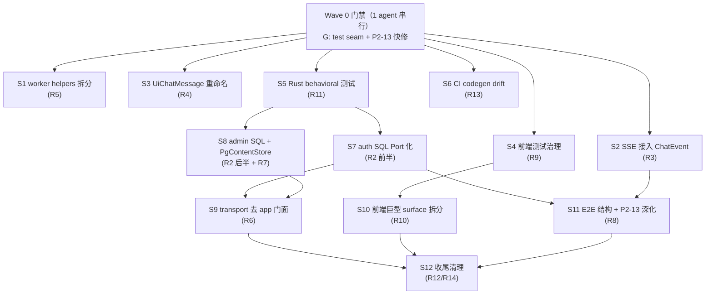

# Brooks 四维审计合并修复计划 — 2026-06-12（v2 复测版）

合并四份 Brooks 审计报告的全部结论，去重后按**目录边界解耦**为可并行 subagent 工作流（Stream），并给出依赖关系与集成门禁。

| 输入报告 | 维度 | 分数 | 趋势 |
|----------|------|------|------|
| [brooks-architecture-audit-2026-06-12.md](./brooks-architecture-audit-2026-06-12.md) | 架构 | **77** | 73→77 |
| [brooks-tech-debt-assessment-2026-06-12.md](./brooks-tech-debt-assessment-2026-06-12.md) | 技术债 | **58** | 34→58 |
| [brooks-test-quality-review-2026-06-12.md](./brooks-test-quality-review-2026-06-12.md) | 测试质量 | **62** | 52→62 |
| [brooks-pr-review-2026-06-12-v2.md](./brooks-pr-review-2026-06-12-v2.md) | PR（P2-13 专项） | **83** | 43→83 |

**v2 复测时实测状态（2026-06-12）：**

- `cargo check --workspace` ✅ 通过（P0 编译债已清）
- `cargo test --no-run -p app` ❌ 4 个 `E0603`（`lib_impl/tests.rs` 引用 private `app_bootstrap::adapters`）
- `worker/main.rs` **4 行**；债务转移至 `pipeline/helpers.rs` **1273 行**
- `transport-http` 仍 **12 处** `use app::AppState`；auth/admin 层 **~2400 行** SQL 未 Port 化
- `stream.ts` 仍维护手写 `WorkspaceChatStreamEvent`（codegen 管道已建但未接入 SSE 层）
- 前端 Vitest **232 测 ~17s 全绿**；Product E2E integration **45 分钟** CI 预算

---

## 1. 已偿还项（四报告共识，不再分配 Stream）

| 原问题域 | 证据 |
|----------|------|
| workspace 编译断裂（68 errors） | `cargo build --workspace` 通过 |
| worker `main.rs` 3263 行上帝文件 | `main.rs` = 4 行；逻辑在 `pipeline/` |
| worker → `app` 多余依赖 | 改依赖 `app-core` |
| URL 绕过 ParseRouter | `processor.rs` 统一 `ParseRouter::route` |
| `storage.pg()` 逃逸口 | 零匹配 + 契约测试守护 |
| `app-core` 生产依赖 `storage-pg` | Cargo 已解耦 |
| handlers.rs 1834 行单体 | 拆为 `handlers/{chat,documents,notebooks,...}.rs` |
| contracts→TS codegen 管道 | `pnpm generate:contracts` + golden fixtures |
| billing tier Enterprise/Plus 分裂 | `BillingTier::Free/Plus/Pro` + DB alias |
| settings/chat-pane/messages 巨型文件 | settings 25 行；messages 15 域分片；chat-pane 180 行 |
| E2E test_context 1486 行单文件 | 5 文件，最大 548 行 |
| mock-providers 零引用 | `globalThis.__mockProviders` 全局注入 |
| Workspace Surface stub 子组件 | integration 用例 + harness 已建 |
| AgentKind `"general"` API 别名 | `parse("general") → None` |

---

## 2. 结论去重映射（剩余 **14 个独立问题域**）

| # | 合并后问题 | 出现于 | Severity | 优先级 |
|---|-----------|--------|----------|--------|
| R1 | `app` lib 内联测试 4×E0603（private adapters） | 测试 Critical | **Critical** | P0 |
| R2 | transport-http ~2400 行 SQL 直连 PG（auth + admin） | 架构 Warning | **Warning** | P1 |
| R3 | SSE 解析层与 `ChatEvent` codegen 双轨（Pain×Spread=9） | 技术债 Warning | **Warning** | P1 |
| R4 | UI `ChatMessage` 与 contract 同名不同义（Pain×Spread=9） | 技术债 Warning | **Warning** | P1 |
| R5 | `pipeline/helpers.rs` 1273 行 ingestion 编排器 | 架构+技术债 Warning | **Warning** | P1 |
| R6 | transport-http 经 `app::AppState` 门面（12 处） | 技术债 Warning | **Warning** | P2 |
| R7 | `PgContentStore` 留在 app-documents（应迁 bootstrap） | 架构 Warning | **Warning** | P2 |
| R8 | Product E2E 45 分钟预算 + P2-13 假并发/弱断言 | 测试+PR Warning | **Warning** | P2 |
| R9 | 前端测试：Admin/Settings mock 主断言、streaming 658 行、vi.hoisted 重复 | 测试 Warning | **Warning** | P2 |
| R10 | 前端巨型 surface（share 1319 / dashboard 1057 / right-rail 930 / hook 912） | 技术债 Warning | **Warning** | P2 |
| R11 | 8 crate module_surface 假覆盖 + retrieval-data-plane 仅 3 测 | 测试 Warning | **Warning** | P2 |
| R12 | Playwright citation soft gate | 测试 Suggestion | Suggestion | P3 |
| R13 | CI 无 codegen drift check | 技术债 Suggestion | Suggestion | P2 |
| R14 | 低优清理：common/auth 扇入、app-chat 巨型 loop/prompts、notebooks 924 行、eval_framework、pricing gate 14 文件、Plus 倍数文案 6×/10× | 架构+技术债 Suggestion | Suggestion | P3 |

---

## 3. 总体结构：Wave 0 串行门禁 + 3 波并行 Subagent

**解耦原则：** 每个 Stream 独占目录边界；同一文件不会被两个并行 Stream 同时修改。存在冲突的目录用波次隔离。



---

## 4. Wave 0 — 串行门禁（1 subagent，阻塞 Wave 1）

| 步骤 | 任务 | 对应 | 验收 |
|------|------|------|------|
| G1 | `app-bootstrap` 公开 `test_support`（re-export adapter 或 `build_test_storage()`） | R1 | `cargo test --no-run -p app` 零错误 |
| G2 | `concurrent_query.rs`：删 `eprintln!`；`tokio::join!` 真并发；`assert_ne!` 答案/citation 独立性；对齐 `rag_smoke` bridge 断言 | R8 | `cargo test -p app concurrent_rag -- --nocapture` |
| G3 | 基线快照：`cargo test -p contracts -p transport-http` + `pnpm vitest run` | — | 全绿作对照 |

> G1 完成后，S5/S7/S8 才可安全改 `app-bootstrap/adapters/`。

---

## 5. Wave 1 — 六路并行（目录互斥，零交叉）

每个 Stream 可独立派给 1 个 subagent；**从 Wave 0 同一 commit 分支**。

| Stream | 问题域 | 独占目录 | Subagent 任务要点 | 验收 |
|--------|--------|----------|-------------------|------|
| **S1** | R5 | `bins/worker/src/pipeline/` | 纯移动式拆分 `helpers.rs` → `parse_route.rs` / `index_dispatch.rs` / `pg_side_effects.rs`；单文件 ≤400 行；**不改函数签名** | `cargo build -p avrag-worker`；`wc -l pipeline/*.rs` |
| **S2** | R3 | `frontend_next/lib/workspace/stream.ts`、`frontend_next/tests/workspace/stream.test.ts`、`frontend_next/tests/contracts/` | 删除手写 `WorkspaceChatStreamEvent`；消费 generated `ChatEvent`（thin adapter 处理 `event`↔`kind`）；扩展 golden 覆盖 decode 路径 | `pnpm typecheck`；`pnpm vitest run tests/workspace/stream.test.ts tests/contracts/` |
| **S3** | R4 | `frontend_next/hooks/use-chat-session.ts`、引用 UI `ChatMessage` 的 components | 重命名 UI 类型 → `UiChatMessage`；wire 类型统一从 `lib/contracts` 导入 | `pnpm typecheck` |
| **S4** | R9 | `frontend_next/tests/`（不含 `lib/`） | `installSurfaceMocks()` 封装 vi.mock（≤3 行/文件）；Admin/Settings 主断言改 DOM；`streaming.test.tsx` 按 SSE 事件类型再拆 | `pnpm vitest run` 全绿 |
| **S5** | R11 | `crates/{common,ingestion,billing,search,share,storage-pg,retrieval-data-plane}/tests/` | 每 crate 补 ≥1 behavioral contract test；**不写** transport-http / product_e2e / app-documents | `cargo test -p retrieval-data-plane -p avrag-billing ...` |
| **S6** | R13 | `scripts/generate-contracts.sh`、`.github/workflows/`、`frontend_next/package.json` | CI 加 `pnpm generate:contracts && git diff --exit-code lib/contracts/generated/` | workflow 绿 |

**Wave 1 冲突说明：**

- S2 与 S3 都碰 chat 类型，但目录互斥（`lib/workspace` vs `hooks/`+components）
- S5 与 Wave 2 的 S7/S8 **约定**：S5 不写 `app-bootstrap` adapters（由 G1 test_support + S7/S8 顺带补测试）

---

## 6. Wave 2 — 五路并行（依赖 Wave 0 G1 + Wave 1 部分合并）

| Stream | 问题域 | 依赖 | 独占目录 | Subagent 任务要点 | 验收 |
|--------|--------|------|----------|-------------------|------|
| **S7** | R2 前半 | G1 | `crates/transport-http/src/lib_impl/auth_*.rs`、`crates/app-bootstrap/src/adapters/`（auth 相关） | auth SQL 下沉 bootstrap；transport 仅调 Port/AppState 方法 | `cargo test -p transport-http` |
| **S8** | R2 后半 + R7 | G1 | `crates/transport-http/src/routes/admin.rs`、`crates/app-documents/`、`app-bootstrap/adapters/` | admin SQL 下沉；`PgContentStore` 迁至 bootstrap；documents 去 `storage-pg` 生产依赖 | `rg 'avrag-storage-pg' crates/app-documents/Cargo.toml` 无生产 dep |
| **S9** | R6 | S7+S8 merge | `crates/transport-http/`、`crates/app/` | 12 处 `app::AppState` → `app_bootstrap::AppState` 或 trait port；完成后评估移除 transport `sqlx` | `rg 'use app::AppState' crates/transport-http` 为 0 |
| **S10** | R10 | S4 | `frontend_next/components/share/`、`dashboard/`、`workspace-right-rail*`、`hooks/use-chat-session.ts` | 按 Tab/Panel 拆分巨型 surface；hook 提取 event reducer 子 hook | `pnpm typecheck`；行数核查 |
| **S11** | R8 | G2 + S2 | `crates/app/tests/product_e2e/`、`frontend_next/e2e/`、`.github/workflows/integration-e2e.yml` | protocol 断言下沉 transport-http contract；`streaming_chat` 共享 context；Playwright citation **hard assert**（staging 子集） | smoke ≤10min；`e2e-gates.md` 同步 |

**硬顺序（同目录）：** S7 → S8 → S9 必须 rebase 顺序合并到 `transport-http`（可两 agent 并行 auth vs admin，merge 后再 S9）。

---

## 7. Wave 3 — 收尾（2–3 路并行）

| Stream | 问题域 | 依赖 | 目录 | 任务 | 验收 |
|--------|--------|------|------|------|------|
| **S12a** | R14 架构 | S9 | `crates/common/`、`crates/app-chat/src/agents/` | common 分层文档化；`rag_prompts.rs` / loop 拆分规划（可只做 notebooks 924 行再拆） | `cargo build --workspace` |
| **S12b** | R12 + 低优 | S11 | `frontend_next/e2e/`、`lib/i18n/` | Playwright soft gate 仅 nightly；Plus 倍数文案统一；`settings-share-messages` 合并 | product 确认倍数 |
| **S12c** | R14 门面 | S9 | `crates/app/`、`CONTEXT.md` | 收缩 app facade；bootstrap 预构建 ChatContext；更新 CONTEXT 路径 | Brooks 复测 Architecture ≥85 |

---

## 8. Subagent 派发模板

每个 Stream 启动 subagent 时使用以下 prompt 骨架（替换 `{STREAM}` / `{DIRS}` / `{ACCEPT}`）：

```markdown
## 任务：Brooks 修复 Stream {STREAM}

**独占目录（禁止修改其他目录）：** {DIRS}

**背景：** 见 avrag-rs/docs/brooks-merged-fix-plan-2026-06-12.md Wave {N} / {STREAM}

**必须做：**
1. 只改独占目录内文件
2. 纯移动式重构不改行为（若适用）
3. 完成后运行验收命令

**禁止做：**
- 修改独占目录外的文件（除非 Cargo.toml 最小依赖调整且已在计划中）
- 顺手重构无关代码
- 新增未请求功能

**验收：** {ACCEPT}
```

### 推荐并行批次

| 批次 | 同时派出的 Subagent | 预计冲突 |
|------|---------------------|----------|
| Batch 0 | G1+G2+G3（单 agent 串行） | 无 |
| Batch 1 | S1 / S2 / S3 / S4 / S5 / S6（6 agents） | 无 |
| Batch 2a | S7 / S8 / S10 / S11（4 agents） | S7∥S8 不同文件，merge 需人工 |
| Batch 2b | S9（等 2a merge 后 1 agent） | — |
| Batch 3 | S12a / S12b / S12c（3 agents） | 无 |

---

## 9. 目录所有权矩阵

| 目录 | W0 | W1 | W2 | W3 |
|------|----|----|----|-----|
| `crates/app-bootstrap/` | G1 | — | S7/S8 | S12c |
| `crates/app/src/lib_impl/tests.rs` | G1 | — | — | — |
| `crates/app/tests/product_e2e/integration/concurrent_query.rs` | G2 | — | S11 | — |
| `bins/worker/src/pipeline/` | — | S1 | — | — |
| `frontend_next/lib/workspace/` | — | S2 | — | — |
| `frontend_next/hooks/` | — | S3 | S10 | — |
| `frontend_next/tests/` | — | S4 | — | — |
| `frontend_next/components/` | — | — | S10 | — |
| `crates/*/tests/`（见 S5 列表） | — | S5 | — | — |
| `scripts/`、`.github/workflows/` | — | S6 | S11 | — |
| `crates/transport-http/` | — | — | S7→S8→S9 | — |
| `crates/app-documents/` | — | — | S8 | — |
| `frontend_next/e2e/` | — | — | S11 | S12b |
| `crates/common/`、`app-chat/` | — | — | — | S12a |

---

## 10. 集成门禁（每个 Wave 结束）

```bash
# Rust
cd avrag-rs
cargo check --workspace
cargo test --no-run -p app                    # Wave 0 后必须零错误
cargo test -p contracts -p app -p app-chat -p app-core -p app-bootstrap \
  -p app-documents -p app-admin -p transport-http -p avrag-billing -p avrag-worker

# Frontend
cd ../frontend_next
pnpm generate:contracts
pnpm typecheck
pnpm vitest run

# 治理与 E2E
cd ../avrag-rs
../scripts/check_contract_governance.sh
E2E_MODE=smoke cargo test -p app --test product_e2e smoke:: -- --test-threads=1

# 结构变更后
graphify update .
```

**复测目标：** Architecture ≥85、Tech Debt ≥65、Test Quality ≥70、Composite ≥82。

---

## 11. 风险与缓解

| 风险 | 缓解 |
|------|------|
| SSE `event` vs `kind` 字段不兼容 | S2 thin adapter；golden fixture 覆盖 decode |
| S7/S8 并行改 transport-http merge 冲突 | 约定 auth agent 只碰 `auth_*`，admin agent 只碰 `routes/admin.rs` |
| helpers.rs 拆分引入行为变化 | S1 严格纯移动；merge 前跑 product_e2e smoke |
| destub/mock→DOM 测试大量翻红 | S4 按文件增量，每文件独立 PR |
| Plus 倍数 6×/10× 需产品确认 | S12b 先读 pricing 页权威值 |
| test_support 公开 API 膨胀 | G1 仅 re-export 测试所需类型，或 `#[doc(hidden)]` test module |

---

## 12. 排期摘要

```
Wave 0（1 agent 串行）：G1 test seam + G2 P2-13 + G3 基线     ← 最优先，~半天
Wave 1（6 agents 并行）：S1 / S2 / S3 / S4 / S5 / S6         ← ~2–3 天
Wave 2（4+1 agents）：S7∥S8∥S10∥S11 → merge → S9            ← ~3–5 天
Wave 3（3 agents 并行）：S12a / S12b / S12c                  ← ~2 天
每 Wave 结束：§10 集成门禁 + Brooks 四维复测
```

---

## 修订记录

| 日期 | 说明 |
|------|------|
| 2026-06-12 v1 | 初版（基于未完成的 P0 编译债） |
| 2026-06-12 v2 | 四报告复测合并：标记 14 项已偿还；重排 Wave；对齐 architecture/tech-debt/test/PR-v2 当前分数与实测 |
