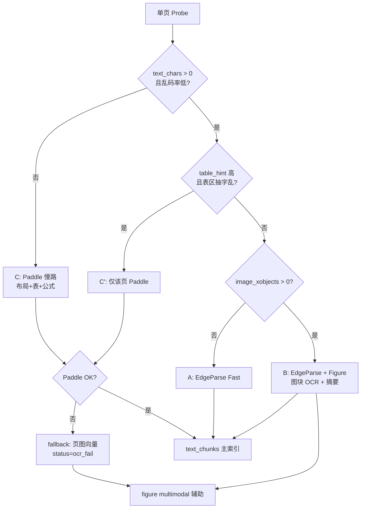

# 入库路由与 OCR 策略 —— 讨论纪要（2026-06-10）

> 本文记录与产品/工程侧关于 PDF 分流、Paddle OCR、Ingestion LLM 的**讨论结论与待定项**。  
> 关联：`docs/visual-pdf-ingest-requirements-2026-06-10.md`、`docs/adr/0002-ingestion-routing-and-retrieval.md`  
> 代码锚点：`crates/ingestion/src/parser/router.rs`、`bins/worker/src/main.rs`

---

## 0. 先对齐：当前代码 ≠「PDF 全走 MinerU」

### 0.1 历史测试印象 vs 现分支

| 时期 | PDF 主路径 | 说明 |
|------|-----------|------|
| 早期 E2E / 旧文档 | `EdgeParse` + **`MineruOcr`（按页）** | Antifragile 66 页低字 → MinerU；Black Swan 567 页全 OCR；慢 + 429 |
| **当前 `router.rs`（本分支）** | `EdgeParse` + **`VisualRaster`** | **PDF 已不再路由到 MinerU**；MinerU 仅用于独立图片文件（`.png` 等） |

因此「混合 PDF 测试时全走 MinerU」更准确地说是：**旧链路 / 按页 OCR 过重**；在现分支上应改写为：

- **扫描整本**：走 `VisualRaster`（页图 + 多模态向量），**无 OCR 正文** → 检索质量差（`context_text` ≈ `PDF page N`）
- **图文混合 / 插图多**：探针 `image_heavy_threshold=5` 会把**整页**标为 `VisualRaster`，**跳过该页 EdgeParse 抽字** → 示意图场景被「整页渲染」代替，确实偏重

### 0.2 当前 PDF 执行模型（worker `execute_pdf_parse`）

```
ParseProbe 逐页
  ├─ EdgeParse  → lopdf 抽字 → text_chunks
  └─ VisualRaster → pdf-renderer JPEG → page_raster multimodal_chunks
混合书：metadata pdf_route_mode=hybrid，两路 IR 合并
```

**缺口（与诉求直接相关）**：

1. **无「页内 Figure 抠图」**：`pdf.rs` EdgeParse 不提取 XObject 示意图；探针只数 XObject 用于**路由**，不产出 `Figure` block
2. **无扫描件 OCR**：`likely_scanned` → 仅 VisualRaster，不产出可 BM25 / text_dense 的正文
3. **插图页误判**：`image_hint_count > 5` → 整页 VisualRaster，丢失同页可抽文字

---

## 1. 议题一：PDF 场景分类与路由（你的提案）

### 1.1 你提出的三分法（讨论稿）

| 场景 | 判定 | 解析策略 | 索引策略 |
|------|------|----------|----------|
| **A. 数字 PDF + 正文为主** | 页有可抽文字，非扫描 | EdgeParse 抽字 | `text_chunks` + text_dense / BM25 |
| **B. 数字 PDF + 示意图/图表** | 有字，页内含插图（非扫描件） | **不要 MinerU 整页 OCR**；正文 EdgeParse，**插图单独多模态** | 插图 → `Figure` / `page_raster` multimodal；**不需版面 OCR** |
| **C. 纯扫描 / 无字 PDF** | 全书或单页 `text_chars ≈ 0` | **OCR（提议 Paddle）** →  Markdown/文本 | `text_chunks`（主）+ 可选页图 multimodal 辅助 |

### 1.2 与现实现状的对照

| 你的场景 | 现状 | 差距 |
|----------|------|------|
| A | ✅ EdgeParse + text | 基本满足 |
| B | ⚠️ 插图多 → **整页 VisualRaster**；无 Figure 抽取 | **场景未拆开**；MinerU 虽已退场，但「重」体现在整页渲染 |
| C | ⚠️ 仅 VisualRaster + 页码 caption | **缺 OCR 正文**；多模态向量对概念 query 弱 |

### 1.3 决议 v1（2026-06-10）— 已被 §1.4 修订

> v1 中 B 类「只插图向量化」与业界调研结论不一致，见下。

### 1.4 决议 v2（2026-06-10，业界调研收敛）

**产品定位（回答「精度 vs 吞吐」）**：

- **默认偏精度**：问答要能 cite 到**可读正文/表/图注**，不接受长期「只有页码」。
- **吞吐靠「快/慢双路径 + 按页升级」**，不靠整书一刀切 OCR，也不靠跳过图内文字。
- E2E/批量用 `INGESTION_PDF_MAX_PAGES`、Paddle **按页段分批** 控制耗时（spike：20 页 ≈ 19s）。

**四条路径（快 / 慢 / 图块 / 多模态辅助）**：

| 路径 | 何时走 | 做什么 | 检索主资产 |
|------|--------|--------|------------|
| **Fast（A）** | 有字、图少、表不乱 | EdgeParse 抽字 → text chunk | text_dense + BM25 |
| **Slow（C）** | 无字 / 字极差（扫描） | Paddle 布局 OCR（表+公式模块开） | text chunk（markdown/LaTeX） |
| **Figure（B）** | 有字 + 有插图 | 正文 Fast + **图块**：OCR 图内字 + 可选 Ingestion LLM 图注摘要 | **图文本块** + 可选 figure multimodal |
| **Multimodal 辅助** | 图密集或 OCR 失败兜底 | 图块/整页向量（已有 `Both`） | 辅助召回，**不替代** OCR 文本 |

**页级路由表（v2）**：

| 条件（单页） | 场景 | 解析 | 索引 |
|--------------|------|------|------|
| `text_chars == 0` 或乱码率极高 | **C** | Paddle job（建议开表格/公式/去畸变，按 API 文档） | text_chunks 主；Phase 2 可选页图向量 |
| `text_chars > 0`，有图，表不触发升级 | **B** | EdgeParse + Figure 抠图 → **图块 OCR + 短摘要** | text + figure 文本块 + multimodal |
| `text_chars > 0`，无图 | **A** | EdgeParse | text_chunks |
| `table_hint` 高且抽字乱 / 财报类 | **C′** | **仅该页** Paddle（不整书） | 表 → markdown 表块 + 表摘要 chunk |
| Paddle 失败（可重试后仍失败） | **fallback** | 整页图向量 + 标 `ocr_fail` | page_raster；标低质量 |

**相对 v1 的关键修订**：

| # | v1 | **v2（调研后）** |
|---|-----|------------------|
| **B 边界** | 只插图向量化 | **不整页 OCR**；图块要 **OCR 图内字 + 可选 VLM 摘要**，再 embedding；纯向量不够 |
| **D4 表格** | 延后 | 数字 PDF：**先抽字**；表乱/ `table_hint` 高 → **单页 Paddle**；扫描页随 C 走 Paddle 表模块 |
| **公式** | 未单列 | **C / C′**：随 Paddle 布局进 markdown/LaTeX；**B 图内公式**：随图块 OCR；**专用公式流水线 Phase 2**（见下） |
| **检索** | text + mm | **文本 chunk 主召回** + multimodal **联合召回**（已实现 `Both`） |

**公式策略（回答「是否一期要做公式检索」）**：

- **一期**：不单独做 Pix2Tex/Nougat 专线；**扫描页（C）** 依赖 Paddle 输出里的公式/正文 markdown；**图块（B）** 用图块 OCR 覆盖图内可见文字（含简单公式）。
- **二期**：STEM/财报专线、LaTeX 块独立索引、公式密度启发式（整页升级公式流水线）。

**页级状态（失败可观测）**：`ok | ocr_fail | figure_miss | partial | low_quality` — 写入 `parse_run` metadata。

**待定项 → 决议（更新）**：

| # | 决议 |
|---|------|
| **D1** | B **不**整页 `page_raster`；fallback 仅 C/C′ OCR 失败 |
| **D2** | 按页；低字有图 → B；零字 → C |
| **D3** | `image_heavy` → 触发 **Figure 管线**，不触发整页 VisualRaster |
| **D4** | 表：数字页先 EdgeParse；**升级单页 Paddle**；扫描页 C 默认 Paddle 表识别 |

**验收指标**：

- Antifragile：正文 citation 仍来自 `text_chunks`；插图题能 cite `Figure` chunk_id
- Black Swan：扫描版 citation 来自 **OCR text chunk**，而非仅 `PDF page N`
- 入库耗时：Black Swan 80 页 E2E < 20min（快速 profile 可配置）

**按页路由（决策树）**：



---

## 2. 议题二：扫描件 OCR —— PaddleOCR-VL（百度 AI Studio）

### 2.1 你的方案摘要

- 服务：`https://paddleocr.aistudio-app.com/api/v2/ocr/jobs`
- 模型：`PaddleOCR-VL-1.6`
- 流程：提交 job（本地文件或 URL）→ 轮询 `state` → `resultUrl.jsonUrl` → 按页 `layoutParsingResults[].markdown.text` + 图片资源
- 文档：<https://ai.baidu.com/ai-doc/AISTUDIO/Cmkz2m0ma>

> **安全提醒**：讨论中提供的 API Token **不得写入仓库**；应使用 `PADDLE_OCR_API_TOKEN` 环境变量。若 Token 已在聊天中暴露，建议在百度侧轮换。

### 2.2 与旧评估（`visual-pdf-ingest-requirements` §3.2）的差异

| 维度 | 旧结论（本地 Paddle） | 本次（云端 Job API） |
|------|----------------------|---------------------|
| 部署 | VPS 8GB+ 显存，不现实 | **无本地算力**，适合当前 VPS |
| 集成形态 | 未设计 | Job 异步 + JSONL 结果，类似 MinerU task |
| 成本/限流 | — | 待 Phase 0 实测 QPS、单页耗时、费用 |

**决议（v2）**：

- **C 类**：Paddle 云端 OCR（已 spike 验证），默认开布局+表+公式（以 API 为准），扫描页可开去畸变
- **B 类**：**不对整页**调 Paddle；**可对单个 Figure 区域**调 OCR/摘要（轻量），避免整页慢路
- **C′ 升级**：数字 PDF 单页表乱 → 只提交该页 PDF 段到 Paddle

### 2.3 建议集成设计（Rust worker）

```text
新 ParseBackend: PaddleOcrPdf（或 OcrServicePdf）

流程：
  1. 上传 PDF 或 presigned URL → POST /api/v2/ocr/jobs
  2. 轮询 GET /jobs/{jobId}（pending/running/done/failed）
  3. 下载 JSONL → 逐页解析为 DocumentIr blocks：
       - Paragraph/heading ← markdown.text
       - Figure ← markdown.images + outputImages（可选再建 multimodal）
  4. 产出 text_chunks（主） + 可选 Figure multimodal（若 JSONL 含图）
  5. parse_run metadata：ocr_backend=paddle, job_id, page_count
```

**环境变量（提议）**：

```env
PADDLE_OCR_BASE_URL=https://paddleocr.aistudio-app.com/api/v2/ocr
PADDLE_OCR_API_TOKEN=          # bearer，勿提交 git
PADDLE_OCR_MODEL=PaddleOCR-VL-1.6
PADDLE_OCR_POLL_INTERVAL_SECS=5
PADDLE_OCR_JOB_TIMEOUT_SECS=3600
```

**待定项 → 决议**：

| # | 决议 |
|---|------|
| **P1** | **分批 job**，页段对齐 `INGESTION_PDF_MAX_PAGES`（E2E 80）；失败可重试单段。 |
| **P2** | OCR 成功后 **默认不** 写 `page_raster`（`INGESTION_PAGE_RASTER_WITH_OCR=0`）。 |
| **P3** | JSONL 内图片 → multimodal：**Phase 2**；Phase 1 以 text 召回达标为准。 |
| **P4** | Paddle 上传 **整段 PDF**；`pdf-renderer` 仅服务 B 类 Figure 裁剪 / debug。 |

### 2.4 Phase 0 spike（已完成 2026-06-10）

- 脚本：`scripts/spike/paddle_ocr_spike.py`（`requests.Session(trust_env=False)` 绕过 WSL 代理 SSL 问题）
- 语料：Black Swan **p1–20**（`pdfseparate` + `pdfunite`）
- 产出：`docs/spike/paddle-black-swan-p1-20/report.json`

| 指标 | 结果 |
|------|------|
| job_id | `58419290363367424` |
| 墙钟耗时 | **19.2s**（20 页，约 **1s/页**） |
| 抽取页数 | 20/20 |
| 失败/限流 | 无 |
| 样例 p1 | `text_chars=267`，含书名 *THE BLACK SWAN*、作者 Taleb（非 `PDF page N`） |
| 样例 p4–5 | 目录/章节 map，可读 markdown |

**结论**：Paddle 云端 OCR **满足场景 C** 正文需求；速度远优于 MinerU 历史体验。可进入 **ING-2** 集成。

**注意**：WSL 若设 `https_proxy`，worker 侧调用也需 `trust_env=False` 或把 `paddleocr.aistudio-app.com` 加入 `NO_PROXY`。

---

## 3. 议题三：Ingestion LLM 换 DeepSeek v4 flash

### 3.1 范围

Worker 侧 LLM 副作用（均读 `INGESTION_LLM_*`）：

| 用途 | 代码位置（约） | 现 `.env` |
|------|----------------|----------|
| 文档 summary | `summary_generator` / worker | `gemini-3.1-flash-lite-preview` |
| section index | `section_index.rs` | 同左 |
| triplets（若开启） | worker triplet 阶段 | 同左 |
| VLM 页摘要（`INGESTION_VLM_SUMMARY_ENABLED`） | `maybe_enrich_visual_multimodal_summaries` | 同左 |

Agent 侧 `ANSWER_LLM` / `MEMORY_LLM` **不在本次范围**。

### 3.2 决议

| 项 | 结论 |
|----|------|
| 模型 | **`INGESTION_LLM_MODEL=deepseek-v4-flash`**（已写入 `.env` / `.env.example`） |
| Base URL | `https://www.dmxapi.cn/v1` |
| C 类是否用 VLM 替代 OCR | **否**；C 以 Paddle 正文为准；VLM 仅 B 类 Figure 摘要 / triplet（Phase 1.5） |
| 回归 | 开启 `INGESTION_VLM_SUMMARY` 时对 DeepSeek 多图消息抽测 1 次 |

---

## 4. 议题间优先级（讨论排序）

| 顺序 | 议题 | 理由 |
|------|------|------|
| **P0** | 场景分类写清 + 修 `image_heavy` 路由（议题一 D3） | 不改则混合 PDF 仍整页 VisualRaster |
| **P0** | Paddle OCR 接入场景 C（议题二） | Black Swan 类语料召回瓶颈 |
| **P1** | Figure XObject 抽取（议题一 B 类） | 示意图多模态的正确形态 |
| **P1** | `INGESTION_LLM` → DeepSeek（议题三） | 配置级，低风险快做 |
| **P2** | 弃用整页 VisualRaster 默认路径 / MinerU 物理删除 | 等 OCR + Figure 达标后 |

---

## 5. 讨论记录（按次追加）

### 2026-06-10 — 首轮

确认：MinerU 过重 → 改为场景 B/C 分流；Paddle 云端 OCR；Ingestion LLM → DeepSeek。

### 2026-06-10 — 第二轮（按序推进）

1. **§1.3 / §2.3 / §3.2 决议**已落盘（D1–D4、P1–P4）
2. **Paddle spike**已启动（Black Swan p1–20）
3. **配置**：`.env` / `.env.example` 已加 `PADDLE_OCR_*`、`INGESTION_LLM_MODEL=deepseek-v4-flash`

---

## 5.1 实现工单（ tracer-bullet ）

| ID | 优先级 | 标题 | 依赖 | 验收 |
|----|--------|------|------|------|
| **ING-1** | P0 | 路由：`image_heavy` 不再 → VisualRaster（有字页） | D3 | Antifragile 插图页仍产出 text_chunks；router 单测 |
| **ING-2** | P0 | `PaddleOcrClient` + worker 场景 C 接入 | spike 通过 | Black Swan 80p E2E 有 text_chunks、`parser_backend=paddle` |
| **ING-3** | P1 | Figure 抠图 → **图块 OCR + 可选摘要** + multimodal | ING-1 | 问「图里写了什么」有可读 text chunk，不只向量 |
| **ING-3b** | P2 | 单页表升级 Paddle（C′）+ 表 chunk 策略 | ING-2 | 乱表页有 markdown 表块 |
| **ING-3c** | P2 | 公式 LaTeX 专线 / 密度启发式 | 可选 | STEM 语料再开 |
| **ING-4** | P1 | C 类关闭默认 `page_raster`（`INGESTION_PAGE_RASTER_WITH_OCR`） | ING-2 | OCR 成功文档 multimodal 计数为 0（默认） |
| **ING-5** | P1 | Ingestion LLM DeepSeek 回归（VLM summary 1 例） | 配置已改 | worker 侧 VLM 页摘要不报错 |
| **ING-6** | P2 | 删除 MinerU PDF 残留 / 文档同步 | ING-2+3 达标 | 无 `MineruOcr` PDF 路径 |

建议实施顺序：**ING-1 → ING-2 → ING-4 → ING-3 → ING-5 → ING-3b → ING-6**（公式 ING-3c 二期）。

### 2026-06-10 — 第三轮（业界调研 A–G 收敛）

输入：用户整理的 A–G 检索结论（双路径、图块 OCR+摘要、表/公式、页级状态机）。

**对你两个确认问题的决议**：

1. **精度 vs 吞吐** → **精度优先 + 按页慢路**；吞吐用分页批处理与 `MAX_PAGES`，不牺牲扫描/图块可读性。  
2. **公式一期范围** → **不做专线**；C 类吃 Paddle 输出，B 类吃图块 OCR；Taleb 类散文为主，公式专线二期。

---

## 6. 附录：现网探针阈值（便于改路由时引用）

```rust
// crates/ingestion/src/parser/probe.rs ParseProbeConfig::default()
scanned_page_threshold: 100,   // 页 text_chars < 100 → likely_scanned
image_heavy_threshold: 5,      // 页 XObject 数 > 5 → VisualRaster（当前）
```

```rust
// router.rs：likely_scanned | image_heavy | table_heavy → VisualRaster
// 否则 → EdgeParse
```

---

## 7. 变更日志

| 日期 | 变更 |
|------|------|
| 2026-06-10 | 初稿：三议题讨论纪要 + 现码对齐 + 待定项 |
| 2026-06-10 | 第二轮：D/P 决议、路由表、工单 ING-1..6、Paddle spike 完成（20p/19s）、env 更新 |
| 2026-06-10 | 第三轮：调研收敛 → 决议 v2（B=图块OCR+摘要；表=单页升级；公式二期） |
