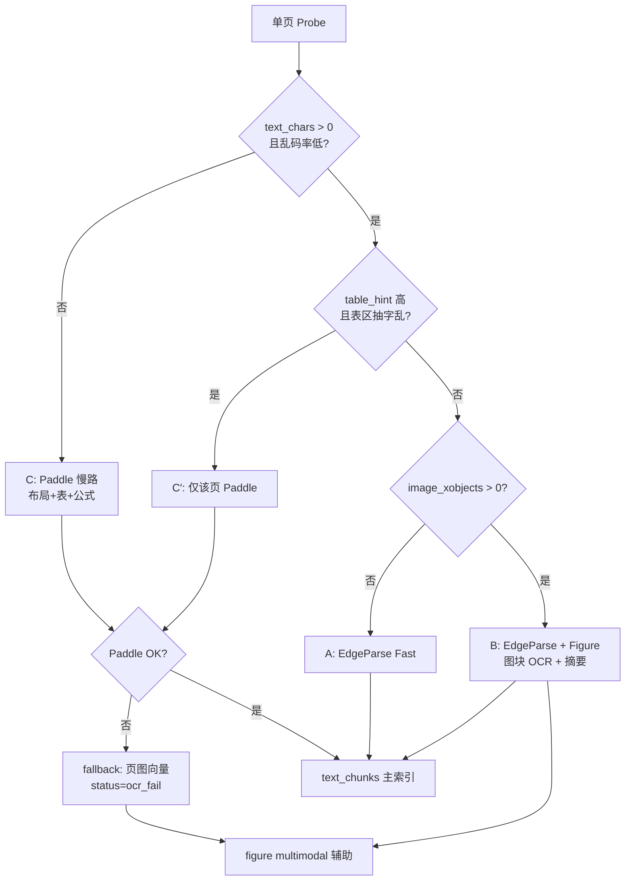

# 入库路由与 OCR 策略 —— 讨论纪要（2026-06-10）

> 本文记录与产品/工程侧关于 PDF 分流、Paddle OCR、Ingestion LLM 的**讨论过程**（P4 前语境）。  
> **路由与 OCR 现行结论（2026-06-13 P4 后）以 [`liteparse-paddle-ingestion-architecture-2026-06-13.md`](./liteparse-paddle-ingestion-architecture-2026-06-13.md) 为准**；文中 EdgeParse/MinerU 描述不代表当前实现。  
> 关联：`docs/archive/p4-mineru-shadow-migration-historical.md`、`docs/archive/visual-pdf-ingest-requirements-2026-06-10.md`  
> 代码锚点（P4 后）：`crates/ingestion/src/parser/router/`、`liteparse_probe_bridge.rs`、`bins/worker/src/pdf/`

---

## 0. 先对齐：当前代码 ≠「PDF 全走 MinerU」

### 0.1 历史测试印象 vs 现分支

| 时期 | PDF 主路径 | 说明 |
|------|-----------|------|
| 早期 E2E / 旧文档 | `EdgeParse` + **`MineruOcr`（按页）** | Antifragile 66 页低字 → MinerU；Black Swan 567 页全 OCR；慢 + 429 |
| **当前 P4 分支** | LiteParse PDF 主链 + **Paddle Jobs OCR** | PDF 不再路由到 MinerU；独立图片走 `PaddleOcrImage` |

因此「混合 PDF 测试时全走 MinerU」更准确地说是：**旧链路 / 按页 OCR 过重**；在现分支上应改写为：

- **扫描整本**：走 `VisualRaster`（页图 + 多模态向量），**无 OCR 正文** → 检索质量差（`context_text` ≈ `PDF page N`）
- **图文混合 / 插图多**：探针 `image_heavy_threshold=5` 会把**整页**标为 `VisualRaster`，**跳过该页 EdgeParse 抽字** → 示意图场景被「整页渲染」代替，确实偏重

### 0.2 当前 PDF 执行模型（worker `execute_pdf_parse`）

```
ParseProbe 逐页
  ├─ EdgeParse  → lopdf 抽字 → text_chunks
  └─ VisualRaster → pdf-renderer JPEG → page_raster multimodal_chunks
混合书：metadata pdf_route_mode=hybrid，两路 IR 合并
```

**缺口（与诉求直接相关）**：

1. **无「页内 Figure 抠图」**：`pdf.rs` EdgeParse 不提取 XObject 示意图；探针只数 XObject 用于**路由**，不产出 `Figure` block
2. **无扫描件 OCR**：`likely_scanned` → 仅 VisualRaster，不产出可 BM25 / text_dense 的正文
3. **插图页误判**：`image_hint_count > 5` → 整页 VisualRaster，丢失同页可抽文字

---

## 1. 议题一：PDF 场景分类与路由（你的提案）

### 1.1 你提出的三分法（讨论稿）

| 场景 | 判定 | 解析策略 | 索引策略 |
|------|------|----------|----------|
| **A. 数字 PDF + 正文为主** | 页有可抽文字，非扫描 | EdgeParse 抽字 | `text_chunks` + text_dense / BM25 |
| **B. 数字 PDF + 示意图/图表** | 有字，页内含插图（非扫描件） | **不要 MinerU 整页 OCR**；正文 EdgeParse，**插图单独多模态** | 插图 → `Figure` / `page_raster` multimodal；**不需版面 OCR** |
| **C. 纯扫描 / 无字 PDF** | 全书或单页 `text_chars ≈ 0` | **OCR（提议 Paddle）** →  Markdown/文本 | `text_chunks`（主）+ 可选页图 multimodal 辅助 |

### 1.2 与现实现状的对照

| 你的场景 | 现状 | 差距 |
|----------|------|------|
| A | ✅ EdgeParse + text | 基本满足 |
| B | ⚠️ 插图多 → **整页 VisualRaster**；无 Figure 抽取 | **场景未拆开**；MinerU 虽已退场，但「重」体现在整页渲染 |
| C | ⚠️ 仅 VisualRaster + 页码 caption | **缺 OCR 正文**；多模态向量对概念 query 弱 |

### 1.3 决议 v1（2026-06-10）— 已被 §1.4 修订

> v1 中 B 类「只插图向量化」与业界调研结论不一致，见下。

### 1.4 决议 v2（2026-06-10，业界调研收敛）

**产品定位（回答「精度 vs 吞吐」）**：

- **默认偏精度**：问答要能 cite 到**可读正文/表/图注**，不接受长期「只有页码」。
- **吞吐靠「快/慢双路径 + 按页升级」**，不靠整书一刀切 OCR，也不靠跳过图内文字。
- E2E/批量用 `INGESTION_PDF_MAX_PAGES`、Paddle **按页段分批** 控制耗时（spike：20 页 ≈ 19s）。

**四条路径（快 / 慢 / 图块 / 多模态辅助）**：

| 路径 | 何时走 | 做什么 | 检索主资产 |
|------|--------|--------|------------|
| **Fast（A）** | 有字、图少、表不乱 | EdgeParse 抽字 → text chunk | text_dense + BM25 |
| **Slow（C）** | 无字 / 字极差（扫描） | Paddle 布局 OCR（表+公式模块开） | text chunk（markdown/LaTeX） |
| **Figure（B）** | 有字 + 有插图 | 正文 Fast + **图块**：OCR 图内字 + 可选 Ingestion LLM 图注摘要 | **图文本块** + 可选 figure multimodal |
| **Multimodal 辅助** | 图密集或 OCR 失败兜底 | 图块/整页向量（已有 `Both`） | 辅助召回，**不替代** OCR 文本 |

**页级路由表（v2）**：

| 条件（单页） | 场景 | 解析 | 索引 |
|--------------|------|------|------|
| `text_chars == 0` 或乱码率极高 | **C** | Paddle job（建议开表格/公式/去畸变，按 API 文档） | text_chunks 主；Phase 2 可选页图向量 |
| `text_chars > 0`，有图，表不触发升级 | **B** | EdgeParse + Figure 抠图 → **图块 OCR + 短摘要** | text + figure 文本块 + multimodal |
| `text_chars > 0`，无图 | **A** | EdgeParse | text_chunks |
| `table_hint` 高且抽字乱 / 财报类 | **C′** | **仅该页** Paddle（不整书） | 表 → markdown 表块 + 表摘要 chunk |
| Paddle 失败（可重试后仍失败） | **fallback** | 整页图向量 + 标 `ocr_fail` | page_raster；标低质量 |

**相对 v1 的关键修订**：

| # | v1 | **v2（调研后）** |
|---|-----|------------------|
| **B 边界** | 只插图向量化 | **不整页 OCR**；图块要 **OCR 图内字 + 可选 VLM 摘要**，再 embedding；纯向量不够 |
| **D4 表格** | 延后 | 数字 PDF：**先抽字**；表乱/ `table_hint` 高 → **单页 Paddle**；扫描页随 C 走 Paddle 表模块 |
| **公式** | 未单列 | **C / C′**：随 Paddle 布局进 markdown/LaTeX；**B 图内公式**：随图块 OCR；**专用公式流水线 Phase 2**（见下） |
| **检索** | text + mm | **文本 chunk 主召回** + multimodal **联合召回**（已实现 `Both`） |

**公式策略（回答「是否一期要做公式检索」）**：

- **一期**：不单独做 Pix2Tex/Nougat 专线；**扫描页（C）** 依赖 Paddle 输出里的公式/正文 markdown；**图块（B）** 用图块 OCR 覆盖图内可见文字（含简单公式）。
- **二期**：STEM/财报专线、LaTeX 块独立索引、公式密度启发式（整页升级公式流水线）。

**页级状态（失败可观测）**：`ok | ocr_fail | figure_miss | partial | low_quality` — 写入 `parse_run` metadata。

**待定项 → 决议（更新）**：

| # | 决议 |
|---|------|
| **D1** | B **不**整页 `page_raster`；fallback 仅 C/C′ OCR 失败 |
| **D2** | 按页；低字有图 → B；零字 → C |
| **D3** | `image_heavy` → 触发 **Figure 管线**，不触发整页 VisualRaster |
| **D4** | 表：数字页先 EdgeParse；**升级单页 Paddle**；扫描页 C 默认 Paddle 表识别 |

**验收指标**：

- Antifragile：正文 citation 仍来自 `text_chunks`；插图题能 cite `Figure` chunk_id
- Black Swan：扫描版 citation 来自 **OCR text chunk**，而非仅 `PDF page N`
- 入库耗时（见 §1.10 **SLA 口径表**）：Black Swan 80 页 **全链路 E2E** < 20min（快速 profile）；**仅 Paddle OCR** 80 页 < 3min（spike 外推）

**按页路由（决策树）**：



---

## 2. 议题二：扫描件 OCR —— PaddleOCR-VL（百度 AI Studio）

### 2.1 你的方案摘要

- 服务根：`https://paddleocr.aistudio-app.com/api/v2/ocr`（客户端拼 `/jobs`、`/jobs/{id}`，见 §2.5）
- 模型：`PaddleOCR-VL-1.6`
- 流程：提交 job（本地文件或 URL）→ 轮询 `state` → `resultUrl.jsonUrl` → 按页 `layoutParsingResults[].markdown.text` + 图片资源
- 文档：<https://ai.baidu.com/ai-doc/AISTUDIO/Cmkz2m0ma>

> **安全提醒**：讨论中提供的 API Token **不得写入仓库**；应使用 `PADDLE_OCR_API_TOKEN` 环境变量。若 Token 已在聊天中暴露，建议在百度侧轮换。

### 2.2 与旧评估（`visual-pdf-ingest-requirements` §3.2）的差异

| 维度 | 旧结论（本地 Paddle） | 本次（云端 Job API） |
|------|----------------------|---------------------|
| 部署 | VPS 8GB+ 显存，不现实 | **无本地算力**，适合当前 VPS |
| 集成形态 | 未设计 | Job 异步 + JSONL 结果，类似 MinerU task |
| 成本/限流 | — | 待 Phase 0 实测 QPS、单页耗时、费用 |

**决议（v2）**：

- **C 类**：Paddle 云端 OCR（已 spike 验证），默认开布局+表+公式（以 API 为准），扫描页可开去畸变
- **B 类**：**不对整页**调 Paddle；**可对单个 Figure 区域**调 OCR/摘要（轻量），避免整页慢路
- **C′ 升级**：数字 PDF 单页表乱 → 只提交该页 PDF 段到 Paddle

### 2.3 Paddle HTTP 客户端约定

**Base URL 规范（修复 §2.3 / `.env.example` / spike 不一致）**：

```env
# 根路径，不含 /jobs；Rust/Python 客户端统一：
#   POST {BASE}/jobs
#   GET  {BASE}/jobs/{jobId}
PADDLE_OCR_BASE_URL=https://paddleocr.aistudio-app.com/api/v2/ocr
PADDLE_OCR_API_TOKEN=
PADDLE_OCR_MODEL=PaddleOCR-VL-1.6
PADDLE_OCR_POLL_INTERVAL_SECS=5
PADDLE_OCR_JOB_TIMEOUT_SECS=3600
PADDLE_OCR_BATCH_PAGES=80
PADDLE_OCR_C_PRIME_MAX_SINGLE_JOBS=10   # 单文档 C′ 散页 job 上限，超出则合并相邻页
```

> 旧 spike 脚本曾把 `BASE_URL` 设为 `.../ocr/jobs` 并直接 `POST JOB_URL`，与「根 + 拼接」模型冲突；已改为根路径。

**待定项 → 决议（更新）**：

| # | 决议 |
|---|------|
| **P1** | 见 §2.5 多批编排；`PADDLE_OCR_BATCH_PAGES=80`。 |
| **P2** | OCR 成功后 **默认不** 写 `page_raster`（`INGESTION_PAGE_RASTER_WITH_OCR=0`）。 |
| **P3** | JSONL 内图片 → multimodal：**Phase 2**；Phase 1 以 text 召回达标为准。 |
| **P4** | **C 类**：上传**连续页段** PDF（非整书一次）。**C′ 类**：见 §2.6（散页合并策略，非「每页一 job」默认）。 |

### 2.5 Worker 骨架：按路由分组 → 后端派发 → 按页回填（§评审缺口 #1）

现 `execute_pdf_parse` 只有 `edge_pages | visual_pages` 二元组（`main.rs:2386+`）。v2 需改为 **页级 `RouteDecision` → 执行计划 → 合并 IR**。

```text
execute_pdf_parse_v2(bytes, filename, document_id, plan: PdfRoutePlan)
│
├─ 1. 输入：probe 已为每页产出 route ∈ {A, B, C, C_prime, Fallback}
│
├─ 2. 分组（PageDispatchGroups）
│     a_pages      = route == A
│     b_pages      = route == B          // 仍走 EdgeParse，附加 figure 管线
│     c_segments   = 连续 C 页 → [start,end] 页段列表
│     cprime_segments = C′ 页合并策略（§2.6）
│     fallback_pages = ocr_fail 或 route==Fallback
│
├─ 3. 并行/串行派发
│     EdgeParse+Figure  → parse_pages(a_pages ∪ b_pages)     // 一期同 parser，B 后处理 figure
│     PaddleOcr         → for seg in c_segments ∪ cprime_segments:
│                             pdf_slice(bytes, seg) → submit_job → poll → parse jsonl
│     VisualRaster      → parse_pages(fallback_pages)        // 仅 fallback
│
├─ 4. 页号对齐（关键）
│     每个 Paddle job 的 JSONL 行 i 对应 **源 PDF 绝对页号**：
│       absolute_page = seg.start + i
│     写入 block.page / source_locator.page_no 时必须加 seg.start-1 偏移
│
├─ 5. 合并 DocumentIr
│     merge_by_page_number(digital_ir, paddle_ir, visual_ir)
│     冲突策略：同页若 Paddle 成功则 **Paddle 覆盖** EdgeParse 文本；B 类保留 EdgeParse 正文 + Paddle/C 的 figure blocks
│     metadata: pdf_route_mode = "hybrid_v2", page_routes: { "12": "C", "13": "A", ... }
│
└─ 6. parse_run 写入 page_status[]（§1.7）
```

**混合书示例**（前 40 页 C、后 40 页 A）：

```text
pages 1-40  → c_segments = [(1,40)]     → 1 个 Paddle job（或按 80 切为 1 段）
pages 41-80 → a_pages = [41..80]        → EdgeParse 一次
无 visual_pages（除非 fallback）
合并后 80 个 page slot 均有 blocks，按 page_no 排序
```

**`PdfPageBackend` 枚举扩展（router.rs）**：

```rust
enum PdfPageBackend {
    EdgeParse,      // A + B 正文
    PaddleOcr,      // C + C′（页来自 OCR job 回填）
    VisualRaster,   // Fallback only
}
// B 类 figure 不单独占 backend；记在 page_plan.extras: FigurePipeline
```

### 2.6 Paddle 多批 job 编排（§评审缺口 #2、#3）

**C 类连续页段**（主路径）：

```text
输入：c_pages = [1,2,3,...,40, 100,101]  // 可能不连续
步骤：
  1. 将 c_pages 按连续性拆段：[(1,40), (100,101)]
  2. 每段若 len > PADDLE_OCR_BATCH_PAGES，再切子段（每段 ≤80）
  3. 对每子段：pdfseparate/pdfunite 或 lopdf 提取 → 临时 PDF → POST /jobs
  4. 记录 PaddleJobSpec { job_id, source_start_page, page_count, state }
  5. 全部 done 后按 source_start_page 合并 JSONL → DocumentIr
失败：
  - 整 job failed → 该段重试 1 次 → 仍失败则段内每页标 ocr_fail → fallback VisualRaster
  - API 无「部分页成功」；不以单页重试同一 job
```

**C′ 散页策略**（解决与 P4 矛盾）：

| 策略 | 做法 | 适用 |
|------|------|------|
| **默认：相邻合并** | 表乱页 `[12,13,15,20]` → 合并为 `[(12,13), (15,15), (20,20)]` 或跨页 `(12,15)` 若间距 ≤2 | 财报连续表 |
| **上限** | 单文档 C′ 单页 job 数 ≤ `PADDLE_OCR_C_PRIME_MAX_SINGLE_JOBS`（默认 10）；超出则强制合并为 `(min_page, max_page)` 一段 | 防成本爆炸 |
| **禁止默认** | 不做「每乱表页一个 job」 | — |

**成本粗算**（待 spike）：C′ 10 个单页 job ≈ 10× 提交开销；合并为 2–3 段更优。ING-3b 验收前需对 1 份财报样例测 job 数与耗时。

### 2.7 `readable_ratio` 正式定义（§评审缺口 #4）

**一期（ING-1b-alpha，不依赖 CID/ToUnicode）**：

```text
输入：page 抽字字符串 text（lopdf extract_text，与现 probe 一致）

tokens = 正则切分：[A-Za-z]{2,} | CJK 单字
readable_ratio = len(tokens) / max(1, len(text.split()))   // 0..1

辅助信号（任一触发 → 与 readable_ratio  OR）：
  bigram_repeat_ratio = max_bigram_count / bigram_count
  watermark_hit = 匹配 WATERMARK_PATTERNS（如 "ePub Converter", "processtext.com"）
  unique_token_ratio = len(unique(tokens)) / len(tokens)

走 C（Slow OCR）若：
  text_chars == 0
  OR readable_ratio < TEXT_QUAL_THRESHOLD (0.3)
  OR bigram_repeat_ratio > 0.30
  OR watermark_hit
  OR unique_token_ratio < 0.4
```

**二期（ING-3c）**：CID/无 ToUnicode 占比、`CID_UNMAPPED_THRESHOLD`。

> Python 标定脚本 `probe_page_stats.py` 已实现一期公式；Black Swan p2 水印页因 `readable_ratio≈1` 曾误判为 B——**水印模式 + unique_token_ratio** 已纳入上式。

### 2.8 `figure_area_ratio` 分期实现（§评审缺口 #5）

| 阶段 | 实现 | 路由影响 |
|------|------|----------|
| **ING-1b-alpha** | 仅 `image_xobjects` 计数 + `image_heavy` 旧阈值废弃；B 暂用 `image_xobjects >= 2` **且** `text_chars > 0` | 先 unblock ING-1/ING-2 |
| **ING-1b-beta** | PyMuPDF/内容流 CTM 算 bbox → `figure_area_ratio` + 装饰图过滤 | 对齐 R3 精确阈值 |
| **ING-3** | B 类 figure 抠图用 bbox | 依赖 beta |

**不阻塞 P0**：ING-2（C 类 Paddle）不依赖 `figure_area_ratio`；ING-1 可先改「有字页不走 VisualRaster」，B 触发用保守计数阈值。

### 2.4 Phase 0 spike（已完成 2026-06-10）

- 脚本：`scripts/spike/paddle_ocr_spike.py`（`requests.Session(trust_env=False)` 绕过 WSL 代理 SSL 问题）
- 语料：Black Swan **p1–20**（`pdfseparate` + `pdfunite`）
- 产出：`docs/spike/paddle-black-swan-p1-20/report.json`

| 指标 | 结果 |
|------|------|
| job_id | `58419290363367424` |
| 墙钟耗时 | **19.2s**（20 页，约 **1s/页**） |
| 抽取页数 | 20/20 |
| 失败/限流 | 无 |
| 样例 p1 | `text_chars=267`，含书名 *THE BLACK SWAN*、作者 Taleb（非 `PDF page N`） |
| 样例 p4–5 | 目录/章节 map，可读 markdown |

**结论**：Paddle 云端 OCR **满足场景 C** 正文需求；速度远优于 MinerU 历史体验。可进入 **ING-2** 集成。

**注意**：WSL 若设 `https_proxy`，worker 侧调用也需 `trust_env=False` 或把 `paddleocr.aistudio-app.com` 加入 `NO_PROXY`。

---

## 3. 议题三：Ingestion LLM 换 DeepSeek v4 flash

### 3.1 范围

Worker 侧 LLM 副作用（均读 `INGESTION_LLM_*`）：

| 用途 | 代码位置（约） | 现 `.env` |
|------|----------------|----------|
| 文档 summary | `summary_generator` / worker | `gemini-3.1-flash-lite-preview` |
| section index | `section_index.rs` | 同左 |
| triplets（若开启） | worker triplet 阶段 | 同左 |
| VLM 页摘要（`INGESTION_VLM_SUMMARY_ENABLED`） | `maybe_enrich_visual_multimodal_summaries` | 同左 |

Agent 侧 `ANSWER_LLM` / `MEMORY_LLM` **不在本次范围**。

### 3.2 决议

| 项 | 结论 |
|----|------|
| 模型 | **`INGESTION_LLM_MODEL=deepseek-v4-flash`**（已写入 `.env` / `.env.example`） |
| Base URL | `https://www.dmxapi.cn/v1` |
| C 类是否用 VLM 替代 OCR | **否**；C 以 Paddle 正文为准；VLM 仅 B 类 Figure 摘要 / triplet（Phase 1.5） |
| 回归 | 开启 `INGESTION_VLM_SUMMARY` 时对 DeepSeek 多图消息抽测 1 次 |

---

## 4. 议题间优先级（讨论排序）

| 顺序 | 议题 | 理由 |
|------|------|------|
| **P0** | 场景分类写清 + 修 `image_heavy` 路由（议题一 D3） | 不改则混合 PDF 仍整页 VisualRaster |
| **P0** | Paddle OCR 接入场景 C（议题二） | Black Swan 类语料召回瓶颈 |
| **P1** | Figure XObject 抽取（议题一 B 类） | 示意图多模态的正确形态 |
| **P1** | `INGESTION_LLM` → DeepSeek（议题三） | 配置级，低风险快做 |
| **P2** | 弃用整页 VisualRaster 默认路径 / MinerU 物理删除 | 等 OCR + Figure 达标后 |

---

## 5. 讨论记录（按次追加）

### 2026-06-10 — 首轮

确认：MinerU 过重 → 改为场景 B/C 分流；Paddle 云端 OCR；Ingestion LLM → DeepSeek。

### 2026-06-10 — 第二轮（按序推进）

1. **§1.3 / §2.3 / §3.2 决议**已落盘（D1–D4、P1–P4）
2. **Paddle spike**已启动（Black Swan p1–20）
3. **配置**：`.env` / `.env.example` 已加 `PADDLE_OCR_*`、`INGESTION_LLM_MODEL=deepseek-v4-flash`

---

## 5.1 实现工单（ tracer-bullet ）

| ID | 优先级 | 标题 | 依赖 | 验收 |
|----|--------|------|------|------|
| **ING-1** | P0 | 路由：`image_heavy` 不再 → VisualRaster（有字页） | D3 | Antifragile 插图页仍产出 text_chunks；router 单测 |
| **ING-2** | P0 | `PaddleOcrClient` + worker 场景 C 接入 | spike 通过 | Black Swan 80p E2E 有 text_chunks、`parser_backend=paddle` |
| **ING-1b-α** | P0 | probe：`readable_ratio`、水印/unique_token（§2.7） | R1 | 与 `probe_page_stats.py` 一致；不依赖 bbox |
| **ING-1b-β** | P1 | probe：`figure_area_ratio`、装饰图 bbox（§2.8） | ING-1b-α | CTM/bbox；不阻塞 ING-2 |
| **ING-2b** | P0 | `execute_pdf_parse` 分组派发骨架（§2.5）+ 多批 Paddle（§2.6） | ING-2 | 混合书 40C+40A 合并 IR 单测 |
| **RET-1** | P1 | fallback chunk `retrieval_weight`（R17） | ING-4 | Milvus/重排读 chunk metadata 降权 0.4 |
| **ING-3** | P1 | A/B 页 Figure：VLM-first 摘要 + 条件 Paddle OCR + mm | ING-1 | figure text chunk + `related_*` 互链 |
| **ING-3a** | P1 | C 类复用 Paddle JSONL figure blocks（不重复抠图） | ING-2 | C 页 `chunk_type=figure` 来自 Paddle layout |
| **ING-3b** | P2 | C′ 单页表升级 + 整表/子表 chunk | ING-2 | `table_garbled_ratio` 触发 |
| **ING-3c** | P2 | CID/ToUnicode 检测、公式密度启发式 | 可选 | STEM 语料 |
| **ING-4** | P1 | C 类关闭默认 `page_raster`（`INGESTION_PAGE_RASTER_WITH_OCR`） | ING-2 | OCR 成功文档 multimodal 计数为 0（默认） |
| **ING-5** | P1 | Ingestion LLM DeepSeek 回归（VLM summary 1 例） | 配置已改 | worker 侧 VLM 页摘要不报错 |
| **ING-6** | P2 | 删除 MinerU PDF 残留 / 文档同步 | ING-2+3 达标 | 无 `MineruOcr` PDF 路径 |

建议实施顺序：**ING-1b-α → ING-1 → ING-2 + ING-2b → ING-4 → RET-1 → ING-3a → ING-3 → ING-5 → ING-1b-β → ING-3b → ING-6**。

### 2026-06-10 — 第三轮（业界调研 A–G 收敛）

输入：用户整理的 A–G 检索结论（双路径、图块 OCR+摘要、表/公式、页级状态机）。

**对你两个确认问题的决议**：

1. **精度 vs 吞吐** → **精度优先 + 按页慢路**；吞吐用分页批处理与 `MAX_PAGES`，不牺牲扫描/图块可读性。  
2. **公式一期范围** → **不做专线**；C 类吃 Paddle 输出，B 类吃图块 OCR；Taleb 类散文为主，公式专线二期。

### 2026-06-10 — 第五轮（可落地性评审修订）

输入：实现对齐评审（10 条）。已修订 §2.5–2.8、§1.10 SLA、schema 非破坏性扩展、RET-1、BASE_URL 统一。

| 评审项 | 处理 |
|--------|------|
| #1 派发骨架缺失 | §2.5 `execute_pdf_parse_v2` 分组→派发→页号回填 |
| #2 多批编排 | §2.6 连续段切分 + 失败重试 |
| #3 C′ vs P4 | §2.6 相邻合并 + `C_PRIME_MAX_SINGLE_JOBS` |
| #4 readable_ratio | §2.7 正式公式 + 水印/unique_token |
| #5 figure_area_ratio 成本 | §2.8 拆 ING-1b-α/β，不阻塞 P0 |
| #6 BASE_URL | 统一为 `/api/v2/ocr` 根；`.env.example` + spike 已改 |
| #7 80 页耗时 | §1.10 SLA 口径表 |
| #8 缺失常量 | 补 `TABLE_QUAL_THRESHOLD`；注明 C′ 一期行为 |
| #9 检索降权 | 新增 **RET-1** |
| #10 Token 安全 | 提醒轮换；`.env` 不入库 |

### 2026-06-10 — 第四轮（R1–R20 裁决落盘）

输入：用户对 R1–R20 调研问题的逐条结论。以下可直接映射到 `probe.rs` / `router.rs` 常量与 schema。

#### 1.5 可写进代码的阈值常量（初值）

| 常量 | 值 | 用途 |
|------|-----|------|
| `TEXT_QUAL_THRESHOLD` | `0.3` | `readable_ratio` 低于此 → C/C′ OCR，不走 Fast |
| `BIGRAM_REPEAT_THRESHOLD` | `0.30` | 水印页 2-gram 重复占比 |
| `CID_UNMAPPED_THRESHOLD` | `0.50` | 无 ToUnicode 映射字符占比（二期 probe 实现） |
| `PAGE_TEXT_THRESHOLD` | `100` | 页字数极低且可读率边缘 → C′（保留现 `scanned_page_threshold`） |
| `FIG_RATIO_THRESHOLD` | `0.15` | 图面积占页面积 >15% → B 候选 |
| `FIG_COUNT_THRESHOLD` | `2` | 或 `figure_area_ratio > 0.10` 且 `image_xobjects >= 2` |
| `DECORATIVE_AREA_RATIO` | `0.02` | 小于此且靠近页眉/页脚 → 装饰图，不计 B |
| `TABLE_GARBLE_THRESHOLD` | `0.30` | 表区 EdgeParse 乱码率 → 触发 C′ |
| `TABLE_QUAL_THRESHOLD` | `0.6` | EdgeParse 表结构质量分；**一期 `edgeparse_table_quality` 恒 1.0 → 此分支不触发，仅 `table_garbled_ratio` 生效（预期）** |
| `UNIQUE_TOKEN_THRESHOLD` | `0.4` | 水印/假字页：unique token 占比过低 → C |
| `MAX_TABLE_TOKENS` | `2000` | 表 chunk 上限；超出按逻辑子表切 |
| `PADDLE_OCR_C_PRIME_MAX_SINGLE_JOBS` | `10` | 单文档 C′ 散页 job 上限 |
| `PADDLE_OCR_BATCH_PAGES` | `80` | 单 job 页段（API 上限 1000 页，失败整批无部分成功） |
| `FALLBACK_RETRIEVAL_WEIGHT` | `0.4` | `ocr_fail` 页图向量降权 |
| `INGESTION_PDF_MAX_PAGES` | `500`（付费）/ `80`（免费 tier） | 与 E2E / 计费对齐 |

#### 1.6 路由伪代码（页级，取代现 `image_heavy → VisualRaster`）

```rust
fn route_page(page: &PageProbe, book: &BookStats) -> RouteDecision {
    // 全书标签仅影响默认参数，不参与分支
    let unwarp = book.likely_scanned_book;

    if page.text_chars == 0
        || page.readable_ratio < TEXT_QUAL_THRESHOLD
        || page.bigram_repeat_ratio > BIGRAM_REPEAT_THRESHOLD
        || (page.text_chars < PAGE_TEXT_THRESHOLD && page.readable_ratio < 0.5)
    {
        return RouteDecision::SlowOcr { unwarp }; // C
    }

    if page.table_hint_count > 0
        && (page.table_garbled_ratio > TABLE_GARBLE_THRESHOLD
            || page.edgeparse_table_quality < TABLE_QUAL_THRESHOLD)
    {
        return RouteDecision::SlowOcrSinglePage; // C′
    }

    if page.figure_area_ratio > FIG_RATIO_THRESHOLD
        && page.non_decorative_image_count >= FIG_COUNT_THRESHOLD
    {
        return RouteDecision::FastWithFigures; // B: EdgeParse + figure pipeline
    }

    RouteDecision::FastText // A
}
```

**B 类 Figure 管线（VLM-first，不绑定 Paddle OCR）**：

```text
1. Fast 路 EdgeParse 正文 → text_chunks
2. 对每个 non_decorative figure：
   a. DeepSeek VLM 读图 → vlm_summary → figure text chunk
   b. 若 summary 过短 / 低置信 / 财务数字图 → Paddle 图块 OCR → ocr_text
   c. 写 figure multimodal 向量（辅助召回）
3. caption 与 figure 互链（related_text_block_ids / related_figure_ids）
```

**C 类**：复用 Paddle JSONL 的 `layout figure blocks + images`，**不再**重复抠 XObject（ING-3 仅服务 A/B 页）。

#### 1.7 Schema 扩展

**PageProbe 输出**（`probe.rs`）— **非破坏性扩展**：

```rust
struct PdfPageProbeResult {
    page_number: u32,
    #[serde(alias = "extracted_text_chars")]  // 保留旧字段名，避免序列化断裂
    extracted_text_chars: usize,
    readable_ratio: Option<f32>,           // 一期 None = 未计算，路由用旧逻辑
    bigram_repeat_ratio: Option<f32>,
    unique_token_ratio: Option<f32>,
    watermark_hit: bool,
    image_hint_count: usize,               // 保留现字段名（= image_xobjects）
    figure_area_ratio: Option<f32>,        // beta 前 None
    non_decorative_image_count: Option<usize>,
    table_hint_count: usize,
    table_garbled_ratio: Option<f32>,
    edgeparse_table_quality: f32,           // 初版恒 1.0
    likely_scanned: bool,                   // 保留现字段名
}
struct BookStats {
    avg_text_per_page: usize,
    likely_scanned_book: bool,
}
```

> **迁移**：不将 `extracted_text_chars` 改名为 `text_chars`；新指标用 `Option` 追加。`ParseProbeResult.pdf_page_probes` 消费方（router、测试）逐个适配。

**source_locator**（citation）：

```json
{ "type": "pdf", "file_id": "...", "page_no": 12, "bbox": [x,y,w,h], "block_id": "layout-3" }
```

Phase 1 可先只写 `page_no`；Paddle `layouts[].position` 预留 `bbox`。

**parse_run metadata**（R18）：

```json
{
  "job_id": "...",
  "route_path": "A|B|C|C_prime",
  "ocr_backend": "none|paddle",
  "page_status": [
    { "page_no": 1, "status": "ok", "duration_ms": 920, "route": "C" }
  ]
}
```

#### 1.8 R1–R20 裁决摘要表

| ID | 裁决（一句话） |
|----|----------------|
| R1 | Fast 看 `readable_ratio`，不看 `text_chars > 0`；水印页走 C′ |
| R2 | **页级** probe 决定路由；全书 `likely_scanned` 仅 metadata |
| R3 | B 触发：`figure_area_ratio > 0.15` 且 `non_decorative_images >= 2` |
| R4 | B 类 **VLM-first**；低置信再 Paddle 图块 OCR |
| R5 | C 类 **复用 Paddle figure blocks**；ING-3 只管 A/B 页 |
| R6 | caption 与 figure **互链**，不强行拼一块 |
| R7 | C′：`table_hint > 0` **且** 表区乱码率高 |
| R8 | 表 chunk：整表 + 摘要；超 `MAX_TABLE_TOKENS` 再切子表 |
| R9 | 扫描书默认开 unwarping + 公式；散文书公式保留不丢弃 |
| R10 | `PADDLE_OCR_BATCH_PAGES=80`；失败整批重试再拆页 |
| R11 | citation 预留 `bbox`；Paddle layouts 可提供 |
| R12 | 云端 Paddle + 可切换后端抽象；密钥仅 env |
| R13 | 扫描书 **text 主检索**；页图向量仅 fallback + 降权 |
| R14 | B 类写 **figure multimodal**；不整页 VisualRaster |
| R15 | 公式默认开；Taleb 语料 <1% 页，保留 LaTeX |
| R16 | 一期不区分图内/正文公式；统一 Paddle LaTeX |
| R17 | fallback `retrieval_weight ≈ 0.4` |
| R18 | `parse_run` 含 `page_status[]` + 耗时分布 |
| R19 | SLA：80p <3min，500p <15min；MAX_PAGES 按 tier |
| R20 | B 类 **不绑定** Paddle；VLM 可替代摘要部分 |

#### 1.9 阈值标定脚本

`scripts/spike/probe_page_stats.py` — 对指定 PDF 抽 30 页统计 `readable_ratio`、`figure_area_ratio`、预测路由分布。用法见 `docs/spike/README.md`。

#### 1.10 SLA 口径表（§评审缺口 #7）

| 指标 | 范围 | 目标 | 备注 |
|------|------|------|------|
| Paddle OCR only | 80 页扫描段 | **< 3 min** | spike 20p/19s 外推；不含 embedding |
| 入库 worker | 80 页，快速 profile | **< 10 min** | 含 chunk+embed，关 triplet/VLM |
| 全链路 E2E | 80 页 llm_real | **< 20 min** | 含 ingest+检索+合成；§1.4 验收 |
| 付费 tier 全书 | 500 页 OCR 段 | **< 15 min** OCR only | R19；embed 另计 |

§1.4 与 R19 **不矛盾**：前者是全 E2E，后者是 OCR 子阶段 SLA。

---

## 6. 附录：现网探针阈值（便于改路由时引用）

```rust
// crates/ingestion/src/parser/probe.rs ParseProbeConfig::default()
scanned_page_threshold: 100,   // 页 text_chars < 100 → likely_scanned
image_heavy_threshold: 5,      // 页 XObject 数 > 5 → VisualRaster（当前）
```

```rust
// router.rs：likely_scanned | image_heavy | table_heavy → VisualRaster
// 否则 → EdgeParse
```

---

## 7. 变更日志

| 日期 | 变更 |
|------|------|
| 2026-06-10 | 初稿：三议题讨论纪要 + 现码对齐 + 待定项 |
| 2026-06-10 | 第二轮：D/P 决议、路由表、工单 ING-1..6、Paddle spike 完成（20p/19s）、env 更新 |
| 2026-06-10 | 第三轮：调研收敛 → 决议 v2（B=图块OCR+摘要；表=单页升级；公式二期） |
| 2026-06-10 | 第四轮：R1–R20 裁决 → §1.5–1.9 常量/伪代码/schema；ING-1b/3a |
| 2026-06-10 | 第五轮：评审修订 → §2.5–2.8 派发骨架/多批/C′/readable_ratio；SLA 表；RET-1；BASE_URL 规范 |
| 2026-06-11 | Brooks Health 修复：worker `pdf/` 模块拆分；`RouteReason::route_label()`；RET-1 `ocr_fail` 降权 + ING-4 索引门控；`page_status` 写入 `parse_run`；E2E `smoke/paddle_pdf_smoke`（Black Swan p1–20，`--ignored`）验收 ING-2 |
