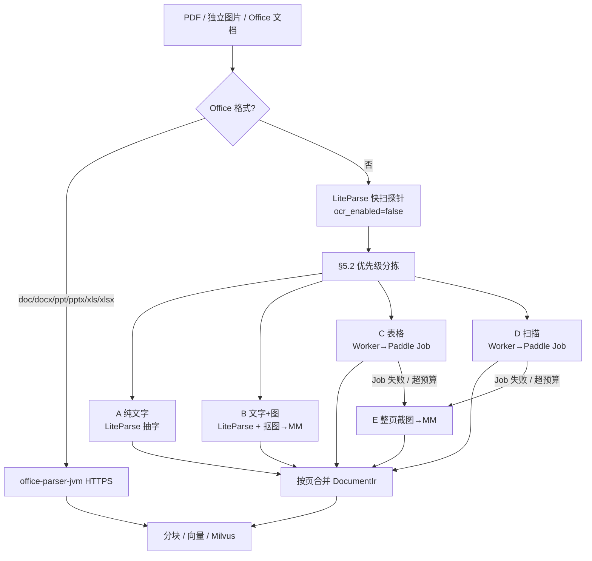

# LiteParse + Paddle Jobs 统一入库架构

> **Status:** P4 已实现（2026-06）；本文描述**当前实现 + 已知缺口**  
> **日期:** 2026-06-13（v1.3 — doc/docx/ppt/pptx 改 office-parser 直连，2026-06-15 对齐）  
> **取代范围:** 以本文为准，覆盖 `docs/ingestion-routing-discussion-2026-06-10.md` 中关于 MinerU、Paddle 慢线、EdgeParse/lopdf 主路径的待定项  
> **关联:** `docs/adr/0002-ingestion-routing-and-retrieval.md`（图文 IR 仍有效；MinerU 路由已 supersede）、[`docs/archive/p4-mineru-shadow-migration-historical.md`](./archive/p4-mineru-shadow-migration-historical.md)（shadow/灰度/MinerU 历史）  
> **代码锚点:** `crates/ingestion/src/parser/{liteparse*.rs,liteparse_probe_bridge.rs,router/,probe.rs,paddle_ocr.rs,paddle_cache.rs}`、`bins/worker/src/pdf/`、`bins/worker/src/pipeline/`

---

## 0. 当前实现概览（P4 后）

文档级路由由 `router/mod.rs` 的 `ParseRoute` 决定（`Pdf` / `OfficeService` / `PaddleOcrImage` / `Local`）。**Office 格式**（doc/docx/ppt/pptx/xls/xlsx）走 `OfficeService` → `office-parser-jvm` HTTPS，产出 `DocumentIr` 后进入统一分块/索引流水线。PDF 页内路由分三阶段：

| 阶段 | 模块 | 职责 |
|------|------|------|
| **Hybrid 探针** | `liteparse_probe_bridge.rs` + `probe.rs` | `probe_pdf_hybrid`：lopdf 结构 hint + LiteParse 字数/质量 overlay → `ParseProbeResult.pdf_page_probes`；产出可复用 `ParsedPdfSnapshot` |
| **页级分拣** | `router/page_routes.rs` | `classify_page_routes` 按 §5.2 优先级（D→C→B→A，可叠加）产出 `PageRouteKind` |
| **执行计划** | `router/pdf_plan.rs` | `build_pdf_parse_plan` → 每页 `PdfPagePlan`（`backend` + `route_kinds`） |
| **Worker 执行** | `bins/worker/src/pdf/parse.rs` | 薄编排：`collect_page_routes` → `probe_pdf_content_from_snapshot` → `run_ocr_pages` → `apply_text_fallbacks` → `attach_ingest_metadata_and_status` |

**无 shadow / 灰度 / 回滚开关。** MinerU 与 `LITEPARSE_*` 切流 env 已删除；历史说明见 [archive/p4-mineru-shadow-migration-historical.md](./archive/p4-mineru-shadow-migration-historical.md)。

### 0.1 已知缺口（Brooks v6 跟踪）

| Stream | 缺口 | 状态 |
|--------|------|------|
| [M3](./archive/brooks-merged-fix-plan-2026-06-13-v6.md#m3--liteparse-单次解析快照-p1) | 同一 PDF 在 probe / `page_dimensions` / `extract_blocks` 多次 `parse_input` | ✅ `ParsedPdfSnapshot` + router `liteparse_snapshot` → worker 复用；正常路径 **1 次** LiteParse parse（2026-06-15） |
| [M4](./archive/brooks-merged-fix-plan-2026-06-13-v6.md#m4--独立图片-paddle-产物保护-p1) | 独立图片 `PaddleOcrImage` Product E2E 产物 contract | ✅ `integration::paddle_image_e2e` + `smoke::paddle_image_smoke`（2026-06-15） |
| [M5](./archive/brooks-merged-fix-plan-2026-06-13-v6.md#m5--execute_pdf_parse-阶段拆分-p1) | `execute_pdf_parse` 混合路由、OCR、fallback、metadata | ✅ 四阶段函数 + 薄 `execute_pdf_parse` 编排（2026-06-15） |

**实现锚点（M3/M5）：**

- `crates/ingestion/src/parser/liteparse.rs` — `parse_pdf_document` → `ParsedPdfSnapshot`（probes + dimensions + blocks）
- `crates/ingestion/src/parser/liteparse_probe_bridge.rs` — `probe_pdf_hybrid` 附带 snapshot；`ParseRouteDecision.liteparse_snapshot` 传入 worker
- `bins/worker/src/pdf/parse.rs` — `probe_pdf_content_from_snapshot` / `apply_text_fallbacks` 从 snapshot 取块，无二次 `parse_input`
- Office→PDF 重路由等无 snapshot 场景：worker 本地 **至多 1 次** `parse_pdf_document`

> `LiteParseService::probe` / `page_dimensions` / `extract_blocks` 仍保留兼容壳，各自触发独立 parse；**生产热路径应使用 snapshot**，勿在单请求内串联调用三者。

---

## 1. 背景与目标

### 1.1 为什么要改

| 现网问题 | 目标 |
|----------|------|
| 解析后端多（lopdf、Paddle 慢线、VisualRaster、MinerU、Office JVM） | **一条主解析引擎 + 一种 Paddle 接入方式** |
| MinerU API 并发低，不适合生产 | **彻底退役 MinerU** |
| 图多页整页 VisualRaster，同页文字丢失 | **页内拆分：字 / 图 / 表各走一路** |
| 扫描 PDF 仅多模态、几乎无可搜正文 | **扫描页 OCR 出文本索引** |
| Tesseract 占 VPS CPU、慢 | **不使用 Tesseract** |

### 1.2 一句话架构

**LiteParse 做统一探针与数字 PDF 抽字；示意图走 MM Embedding；表与扫描走 Paddle AI Studio Jobs API（免费额度）；Office 文档（doc/docx/ppt/pptx/xls/xlsx）走 office-parser-jvm HTTPS 直连；MinerU 与旧 PDF 路由后端删除。**

### 1.3 读者指引

| 角色 | 优先阅读 |
|------|----------|
| 产品 / PM | §1、§4、§5.1–5.2、§17、§18 |
| 后端工程 | §3、§5.3–5.4、§6、§8、§14、§17 |
| 运维 / SRE | §12、§13、§15、§14.3 |
| QA | §17、§18、§16 |

---

## 2. 设计原则

1. **按页、按区域分工**，禁止「图多就整页当图片」默认行为。  
2. **Paddle 只保留 Jobs 异步 API**（免费额度无单独同步接口）。  
3. **少调 Jobs**：计量单位是 **Job 次数**；默认 **1 页 / 1 表区 = 1 Job**。  
4. **下游不变**：所有路径仍汇入 `DocumentIr` → 分块 → 文本/多模态向量 → Milvus。  
5. **可降级**：OCR 失败有明确兜底 ladder（E 类 VisualRaster）；LiteParse/Paddle 不可用时任务失败，不做 lopdf 探针降级。
6. **P4 已完成（2026-06）**：全量 LiteParse 主链；MinerU/shadow/灰度开关已删除；验收以 product E2E 为门禁。

---

## 3. 术语澄清（避免工程误解）

本文中「退役」「保留」指不同层次，实施前必须对齐：

| 术语 | 含义 | 现网对应 | 目标态 |
|------|------|----------|--------|
| **Paddle 慢线（退役）** | 作为 **PDF 页级路由后端** 的 `PdfPageBackend::PaddleOcr` + `execute_pdf_parse` 分流逻辑 | `bins/worker/src/pdf/parse.rs`、`PdfPageBackend::PaddleOcr` | **删除路由**；不再按探针把整页交给 Paddle 慢路径 |
| **Paddle Jobs OCR 模块（保留并升格）** | 调用 AI Studio Jobs API 的 **共享客户端** + 按页/表区提交 Job 的能力 | `crates/ingestion/src/parser/paddle_ocr.rs` | **保留代码**，重构为 `PaddleJobsOcrService`（名称待定），供 Worker C/D 类页调用 |
| **EdgeParse / lopdf（退役）** | 数字 PDF 快抽字 | `PdfPageBackend::EdgeParse`（**wire 名保留**） | 执行语义为 **LiteParse 抽字**；lopdf 仅结构 hint |
| **VisualRaster 常规路由（退役）** | 图多页整页 raster | `PdfPageBackend::VisualRaster` | 仅 **E 类兜底** |
| **MinerU（已删除）** | 外部图片/复杂版面解析 | — | P4 已移除代码与 `MINERU_*` |
| **Office JVM（保留）** | 结构化 Office 解析 | `OfficeParserServiceClient` | **doc/docx/ppt/pptx/xls/xlsx** HTTPS 直连；**不再** LibreOffice→PDF |

**一句话：** 退役的是「旧路由形态」，不是「Paddle Jobs 能力本身」。Jobs 客户端从「慢线后端」升级为「唯一 OCR 算力模块」。

### 3.1 目标态 `ParseBackend` 映射（实现时扩展 enum）

| 来源 | 建议 `ParseBackend` | 说明 |
|------|---------------------|------|
| LiteParse 抽字 | `liteparse_pdf`（新增） | A/B 类正文块 |
| Paddle Jobs OCR | `paddle_jobs_pdf`（或由 `paddle_ocr_pdf` 语义重命名） | C/D 类页 |
| MM 图块 / E 类兜底 | `visual_raster_pdf` 或 `liteparse_figure` | 仅 Figure / PageRaster |
| Excel Office | `poi_xlsx` / `poi_xls`（保留） | xls/xlsx |
| Word Office | `docx4j_docx` / `poi_doc`（保留） | doc/docx |
| PPT Office | `poi_pptx` / `poi_ppt`（保留） | ppt/pptx |
| 本地文本/Html/代码 | `text_local` 等（保留） | 不变 |

---

## 4. 文件类型路由（文档级）

| 文件类型 | 路由 | 说明 |
|----------|------|------|
| **PDF** | LiteParse 主链 | 见 §5 页内路由 |
| **doc / docx** | **Office 服务（`ParseRoute::OfficeService`）** | `office-parser-jvm` HTTPS → `DocumentIr`；不走 LibreOffice、不转 PDF |
| **ppt / pptx** | **Office 服务（同上）** | 幻灯片 IR（`slide_text` / `slide_image` / `slide_render`）；不走 LibreOffice、不转 PDF |
| **xls / xlsx** | **Office 服务（保留）** | 结构化 Sheet/单元格；**禁止** LiteParse+LibreOffice 转 PDF |
| **png / jpg / …** | **Paddle Job**（`ParseRoute::PaddleOcrImage`）→ 文本 + 图块 MM | 1 文件 = 1 Job；无 MinerU、无 LiteParse 抽字 |
| **txt / md / html / 代码** | 本地轻量解析（现网 Local） | 不引入 LiteParse |
| **URL 抓取** | Html 本地解析 | 不变 |

---

## 5. PDF 页内路由（核心）

LiteParse **快扫探针**（`ocr_enabled=false`，不用 Tesseract）产出每页信号；Worker **按 §5.2 优先级** 定路线并执行。

### 5.1 页型定义

| 页型 | 判定概要 | 处理 | Job 消耗 |
|------|----------|------|----------|
| **A — 纯文字** | 可抽字、无表、图占比低 | LiteParse 抽字 → 文本索引（带 bbox） | 0 |
| **B — 文字 + 示意图** | 有字 + 非装饰图超阈值 | LiteParse 抽字 + 抠图 → MM；**禁止整页 VisualRaster** | 0 |
| **C — 表格** | 表区信号或抽字乱码率高 | **1 表区或 1 页 = 1 Paddle Job** → Markdown/文本 → 文本索引 | 1 |
| **D — 扫描/无字** | 几乎无可抽文字 | **1 页 = 1 Paddle Job** → 文本索引 | 1 |
| **E — 兜底** | C/D Job 失败或超 Job 预算 | 整页截图 → MM + `ParseWarning` | 0（本地渲染） |

同一页可 **组合** 多种处理（如 A+B、A+C、B+C），并行产出块后按 §9 合并。

### 5.2 路由优先级 v0（判定顺序）

对每一页 **按序评估**，命中即标记对应处理线（可叠加，除 E 仅作失败兜底）：

```
1. D — 扫描/无字？
     extracted_text_chars < LITEPARSE_SCANNED_PAGE_THRESHOLD
     OR readable_ratio < LITEPARSE_TEXT_QUAL_THRESHOLD（若已计算）

2. C — 表格/乱码？
     table_hint_count > 0 AND table_garbled_ratio > LITEPARSE_TABLE_GARBLE_THRESHOLD
     OR（非 D 且 table_hint_count > LITEPARSE_TABLE_HEAVY_THRESHOLD）

3. B — 示意图？
     figure_area_ratio > LITEPARSE_FIG_RATIO_THRESHOLD
     AND non_decorative_image_count >= LITEPARSE_FIG_COUNT_THRESHOLD

4. A — 其余有字页
     extracted_text_chars >= LITEPARSE_SCANNED_PAGE_THRESHOLD

5. E — 仅当 C/D 的 Paddle Job 失败或 Job 预算耗尽时触发
```

**冲突示例：**

| 页面特征 | 标记 | 执行 |
|----------|------|------|
| 有字 + 大图 + 表格乱码 | B + C | LiteParse 抽字 + 抠图 MM + **1 Job** 整页/表区 OCR |
| 扫描整页 | D | **1 Job**；不做 A |
| 有字无图无表 | A | 仅 LiteParse |
| C Job 失败 | C → E | Paddle 失败后整页 MM + warning |

### 5.3 默认阈值 v0（可配置，初值对齐现网探针）

| 配置项 | 默认值 | 含义 | 现网参考 |
|--------|--------|------|----------|
| `LITEPARSE_SCANNED_PAGE_THRESHOLD` | `100` | 低于此视为扫描页 | `ParseProbeConfig.scanned_page_threshold` |
| `LITEPARSE_TABLE_GARBLE_THRESHOLD` | `0.30` | 表区乱码率 → 触发 C | `TABLE_GARBLE_THRESHOLD` |
| `LITEPARSE_TABLE_HEAVY_THRESHOLD` | `10` | 表结构 hint 过多 | `table_heavy_threshold` |
| `LITEPARSE_FIG_RATIO_THRESHOLD` | `0.15` | 图占页面积比 | `FIG_RATIO_THRESHOLD` |
| `LITEPARSE_FIG_COUNT_THRESHOLD` | `2` | 非装饰图最少数量 | `FIG_COUNT_THRESHOLD` |
| `LITEPARSE_TEXT_QUAL_THRESHOLD` | `0.5` | 可读性过低 → 倾向 D/C | `TEXT_QUAL_THRESHOLD` |
| `LITEPARSE_DECORATIVE_MAX_AREA` | `0.03` | 小于此面积比的 XObject 忽略 | 新增 |

探针实现：**hybrid 探针** = lopdf 结构 hint + LiteParse 字数 overlay；LiteParse 探针失败则路由失败（不做 lopdf 降级）。

### 5.4 流程图



---

## 6. DocumentIr 输出契约

所有解析路径必须产出符合本节的 `DocumentIr`，供 `chunker`、索引与前端引用共用。

### 6.1 坐标系约定

- **bbox 格式（全链路统一）：** `SourceLocator.bbox = [x1, y1, x2, y2]`，原点左上角，单位 **PDF 点（pt）**，与 LiteParse / Paddle 输出对齐后写入。  
- **禁止** 混用 `[x, y, width, height]`；适配层负责转换。  
- 页级 `PageIr.width` / `PageIr.height` 必须填充（来自 LiteParse 或渲染器）。

### 6.2 字段映射表

| 上游产出 | `DocumentIr` 落点 | 规则 |
|----------|-------------------|------|
| office-parser docx | `BlockIr` | `block_type=Paragraph` 等；`parser_backend=docx4j_docx` |
| office-parser pptx | `BlockIr` + `AssetIr` | `slide_text` / `slide_image` + 每页 `slide_render` 资产（§6.2.1） |
| office-parser xlsx | `BlockIr` | 表格/单元格块；`parser_backend=poi_xlsx` |
| LiteParse 页 metadata | `PageIr` | `page_number`、`width`、`height`、`text_char_count`、`backend=liteparse_pdf` |
| LiteParse 文本块 + bbox | `BlockIr` | `block_type=Paragraph`（或 Heading/ListItem）；`modality=TextOnly`；`source_locator.bbox` 必填 |
| LiteParse 探针/cache | `PageIr.metadata` / 文档 `metadata` | `page_routes`（如 `text+figure+table_ocr`）、`probe_version` |
| Paddle Job markdown 全文 | `BlockIr` | C 类：`block_type=Table`；D 类：`block_type=Paragraph`；`parser_backend=paddle_jobs_pdf` |
| Paddle Job 图 URL | `AssetIr` + `BlockIr` | 可选：下载后存对象存储；Figure 块 + MM 索引 |
| 抠图（B 类） | `AssetIr` + `BlockIr` | `block_type=Figure`；`storage_path`=对象存储 key（**非**长期 data URL）；`alt_text`/caption 可选 VLM |
| E 类整页截图 | `BlockIr` | `block_type=PageRaster`；`supports_multimodal_chunking=true` |
| OCR/解析异常 | `ParseWarning` | `code`、`message`、`page`、`backend` |
| Paddle Job 追溯 | `BlockIr.metadata` / `PageIr.metadata` | `paddle_job_id`、`paddle_job_state`（不含 token） |

### 6.3 文档级 metadata（必填项）

| 键 | 说明 |
|----|------|
| `ingest_route_version` | 如 `liteparse-v1` |
| `pdf_route_mode` | PDF：`liteparse_hybrid`；Office：`office_parser`；独立图片：`paddle_image` |
| `paddle_jobs_count` | 本文档消耗的 Job 数 |
| `ocr_backend` | 固定 `paddle_jobs`（当存在 OCR 页或图片 ingest 时） |

### 6.4 分块与索引约束

- `BlockType::Table` / `Paragraph` → `supports_text_chunking()` → 文本 BM25 + dense。  
- `BlockType::Figure` / `PageRaster` → `supports_multimodal_chunking()` → MM dense。  
- 同一页 **同时** 可有文本块与 Figure 块；禁止仅 PageRaster 而无文本块（除非 E 类且 OCR 已失败）。

### 6.2.1 PPTX presentation 契约（office-parser / mock E2E 共用）

`ir_validator` 对 `DocumentType::Ppt|Pptx` 强制：

- 至少一个非空 `slide_text` 或 `slide_notes` 块  
- 至少一个 `slide_image` 块，且引用该页唯一的 `slide_render` 资产  
- 每页恰好一个 `AssetKind::SlideRender`

不满足则 Worker 入库失败并重试；**不**回退 LibreOffice 或 LiteParse。

---

## 7. Paddle API：仅 Jobs（免费额度）

### 7.1 事实约束

- AI Studio **免费额度没有单独的同步 `layout-parsing` 接口**；生产只认 **Jobs 异步 API**。  
- 百度文档中的同步 `/layout-parsing` 适用于**自建部署**，**不纳入本方案**。  
- 现网 `PADDLE_OCR_*` + `paddle_ocr.rs` 为 Jobs 客户端实现基础。

### 7.2 Jobs 调用方式

```
POST  {PADDLE_OCR_BASE_URL}/jobs
      Authorization: bearer {PADDLE_OCR_API_TOKEN}
      multipart: file + model + optionalPayload
      或 JSON: fileUrl + model + optionalPayload

GET   {PADDLE_OCR_BASE_URL}/jobs/{jobId}
      轮询直至 state = done | failed

GET   resultUrl.jsonUrl
      JSONL → layoutParsingResults[].markdown.text / images
```

**推荐 optionalPayload：**

```json
{
  "useDocOrientationClassify": true,
  "useDocUnwarping": true,
  "useChartRecognition": false
}
```

### 7.3 与 LiteParse OCR 规范的区别

LiteParse 可选 OCR 期望 **同步** `POST /ocr`。**不能**将 `PADDLE_OCR_BASE_URL` 直接填入 `LITEPARSE_OCR_SERVER_URL`；需 OCR 网关包装 Jobs（§8.1）。

---

## 8. Paddle 接入：Worker 主路径 + 可选网关

| 层级 | 调用方 | 场景 | Job 频率 |
|------|--------|------|----------|
| **主路径（默认）** | Worker → `PaddleJobsOcrService` | C/D 类整页或整表区 | **1 页/表区 = 1 Job** |
| **辅路径（可选，Phase 4+）** | LiteParse → OCR 网关 → Jobs | LiteParse 内部 selective OCR | **尽量少用** |

### 8.1 OCR 网关（辅路径，可选）

对外：[LiteParse OCR API](https://github.com/run-llama/liteparse/blob/main/OCR_API_SPEC.md) 的 `POST /ocr`；对内：提交 Jobs → 轮询 → 转 `{ results: [{ text, bbox, confidence }] }`。

**约束：** 每次 `/ocr` = 1 Job；禁止对同一页多次小块调用。

### 8.2 Worker 主路径（推荐默认）

对 C/D 类页：

1. 渲染页为 PNG，或裁剪 **一张** 表区图。  
2. 调用 `PaddleJobsOcrService`（自现网 `paddle_ocr.rs` 重构）。  
3. `markdown.text` → `BlockIr`（Table / Paragraph）。  
4. `markdown.images` 可选 → 下载 → MM。

A/B 类由 LiteParse 并行完成，**不依赖** LiteParse 内置 OCR。

---

## 9. 同页合并与冲突规则

| 情况 | 规则 |
|------|------|
| LiteParse 抽字 + Paddle OCR 文本 | **C/D 覆盖**重叠区 LiteParse 文本；保留不重叠 LiteParse 块 |
| 文字块 + 图块 | 追加 Figure，不删正文 |
| 表 OCR → Markdown | `block_type=Table`；可选 Ingestion LLM 整理 |
| bbox 重叠 | 以 **面积更大或 OCR 来源** 优先写入 `source_locator` |
| metadata | 每页 `page_routes` 记录组合标签 |
| Job 失败 | → E 类；`ParseWarning` + 文档级 `degraded=true`（可选） |

---

## 10. 示意图与多模态（MM Embedding）

- **B 类：** 复用 `extract_page_images` 或 LiteParse 页截图 + bbox 裁剪 → MM。  
- **过滤：** 面积 &lt; `LITEPARSE_DECORATIVE_MAX_AREA` 或重复 Logo → 不 embedding。  
- **VLM 摘要（可选）：** `INGESTION_LLM_*` 生成 caption → 写入 `alt_text`，供 BM25。  
- **VisualRaster：** 仅 **E 类** 与运维抽检；需配置 `PDF_RENDERER_BASE_URL`。

---

## 11. 退役与迁移清单

| 组件 | 状态（P4 后） |
|------|----------------|
| MinerU | **已删除**（代码 + `MINERU_*`） |
| Paddle 慢线路由 | **已删除**；Jobs 客户端保留 |
| EdgeParse / lopdf 主解析 | **已退役**；lopdf 仅用于 PDF 切片、结构 hint |
| Tesseract | 从不启用 |
| Office JVM（doc/docx/ppt/pptx/xls/xlsx） | **保留**；`office-parser-jvm` HTTPS 直连 |
| LibreOffice doc/ppt→PDF | **已退役**；`OFFICE_EXTENSIONS` 为空，Worker 不再调用 |
| VisualRaster 常规路由 | 仅 E 类兜底 |

---

## 12. 配置项

### 12.1 LiteParse / Worker

| 变量 | 说明 | 建议初值 |
|------|------|----------|
| `LITEPARSE_OCR_ENABLED` | LiteParse 内置 OCR（辅路径） | `0` |
| `LITEPARSE_OCR_SERVER_URL` | OCR 网关（辅路径） | 空 |
| `LITEPARSE_OCR_LANGUAGE` | OCR 语言 | `zh` |
| §5.3 阈值项 | 页型判定 | 见 §5.3 表 |

> **已删除（P4）：** `LITEPARSE_ENABLED`、`LITEPARSE_SHADOW_MODE`、`LITEPARSE_ROLLOUT_PERCENT`。历史说明见 [archive/p4-mineru-shadow-migration-historical.md](./archive/p4-mineru-shadow-migration-historical.md)。

### 12.2 Paddle Jobs

| 变量 | 说明 |
|------|------|
| `PADDLE_OCR_BASE_URL` | `https://paddleocr.aistudio-app.com/api/v2/ocr` |
| `PADDLE_OCR_API_TOKEN` | AI Studio Token（**禁止入库/日志**） |
| `PADDLE_OCR_MODEL` | 如 `PaddleOCR-VL-1.6` |
| `PADDLE_OCR_POLL_INTERVAL_SECS` | 默认 `5` |
| `PADDLE_OCR_JOB_TIMEOUT_SECS` | Worker 整页 `3600`；网关 `60–120` |
| `PADDLE_OCR_MAX_JOBS_PER_DOCUMENT` | 单文档 Job 上限，如 `50` |
| `PADDLE_OCR_MAX_CONCURRENT_JOBS` | 全局并发，如 `3–5` |
| `PADDLE_OCR_RESULT_CACHE_ENABLED` | 是否缓存 Job 结果 | `1` |
| `PADDLE_OCR_RESULT_CACHE_TTL_SECS` | 缓存 TTL | `86400` |

### 12.3 Office（doc/docx/ppt/pptx/xls/xlsx）

| 变量 | 说明 |
|------|------|
| `OFFICE_PARSER_BASE_URL` | `office-parser-jvm` 基址，如 `http://127.0.0.1:9090` |
| `OFFICE_PARSER_TIMEOUT_MS` | 单次解析超时（默认 30000） |

---

## 13. Job 预算、幂等与监控

### 13.1 计量

- **额度单位 = Paddle Job 次数**。  
- 指标：`paddle_jobs_submitted`、`paddle_jobs_failed`、`paddle_jobs_latency_ms`、`jobs_per_document`、`paddle_cache_hits`。

### 13.2 预算策略

1. 单文档 Job 数 &gt; `PADDLE_OCR_MAX_JOBS_PER_DOCUMENT` → 后续 C/D 页降级为 A（仅 LiteParse）或 E。  
2. 全局并发达上限 → 排队 + 指数退避。  
3. 月度额度告警阈值由运维在 AI Studio 控制台设定。

### 13.3 Job 幂等与缓存

- **缓存键：** `sha256(file_bytes) + page_number + optionalPayload_hash + model`。  
- **命中缓存：** 跳过 Jobs 提交，直接复用 JSONL 解析结果。  
- **重试：** 同一页 **最多 1 次** Job 重试（扩大裁剪或原图重传）；**不**无限轮询同一 `jobId`。  
- **失败 `jobId`：** 写入 `ParseWarning`，便于工单排查。

### 13.4 任务取消与租约

- 调用 Paddle 前必须通过 `ensure_ingestion_side_effects_allowed`（现网 `ingestion_guard`）。  
- 文档删除 / 任务租约丢失 → **中止**轮询，不再写入索引。  
- 已提交但未完成的 Job：**不**远程取消（API 不支持时），本地标记 abandoned，结果丢弃。

### 13.5 日志脱敏

- 禁止日志输出：`PADDLE_OCR_API_TOKEN`、完整 `jsonUrl`（可记录 host + jobId）。  
- 用户文档 `presigned` URL 仅记录 object key。

---

## 14. 执行编排（P4 已完成）

- **现网唯一主链：** LiteParse hybrid 探针 → `router/page_routes` 分拣 → Worker 执行；无 shadow、无灰度、无 env 回滚。
- **验收门禁：** `scripts/run-liteparse-staging-e2e.sh`（product E2E，`phase0-mini.pdf`）；Office 直连见 `scripts/run-staging-ingest-e2e.sh`（docx/pptx/xlsx）。
- **扩展样本集（§18.1）** 暂不在 CI 中强制；按需 staging 手工验证。
- **历史迁移路径**（Shadow / 灰度 / MinerU 开关）见 [archive/p4-mineru-shadow-migration-historical.md](./archive/p4-mineru-shadow-migration-historical.md)。

---

## 15. 部署清单

| 依赖 | 用途 | 部署位置 | 备注 |
|------|------|----------|------|
| **PDFium**（LiteParse 内置） | PDF 解析 | Worker 镜像 | 确认 glibc / musl 兼容 |
| **Paddle Jobs API** | C/D 类 PDF 页 + 独立图片 OCR | 外部 SaaS | `PADDLE_OCR_*` |
| **Paddle AI Studio** | Jobs OCR | 云端 | Token 走密钥管理 |
| **pdf-renderer** | E 类整页截图 | Sidecar 或现有服务 | 非常规路径 |
| **office-parser-jvm** | doc/docx/ppt/pptx/xls/xlsx | 独立 JVM 服务 | `OFFICE_PARSER_BASE_URL`；Worker HTTPS 客户端 |

> **LibreOffice 已退役（2026-06-15）：** Worker 不再将 doc/ppt 转 PDF；`bins/worker/src/pdf/office_convert.rs` 中 `OFFICE_EXTENSIONS` 为空。

### 15.1 Office 解析失败边界

| 场景 | 行为 |
|------|------|
| `office-parser-jvm` 不可达 / HTTP 非 2xx | 文档 `Failed` + `ParseWarning`；任务按重试策略 requeue |
| PPTX IR 校验失败（缺 `slide_image` / `slide_render` 等） | 文档 `Failed`；**不** fallback 至 LibreOffice 或 LiteParse |
| doc/docx 复杂样式 | 以 office-parser 产出的 `DocumentIr` 为准，非 WYSIWYG 编辑 |
| PPT 动画/备注/隐藏页 | **不保证**保留；以保证可检索正文与幻灯片结构为主 |

---

## 16. 降级 ladder（OCR 失败）

```
表区 Job 失败
  → 扩大裁剪重试 1 次（仍 1 Job）
  → 失败：表区截图 → MM（可选）+ warning

扫描页 Job 失败
  → 重试 1 次
  → 失败：整页截图 → MM（E 类）+ warning

LiteParse 抽字失败
  → 该页尝试 1 次 Paddle Job（D 类）
  → 仍失败 → E 类

Job 预算耗尽
  → 剩余 C/D 页降级为 A 或 E（按配置）
```

---

## 17. 实现分期

| 阶段 | 内容 | 状态 |
|------|------|------|
| **P0** | LiteParse 库 + `DocumentIr` 适配器（§6）；离线样本 | ✅ 已完成 |
| **P1** | A/B 类：LiteParse 抽字 + 抠图 MM | ✅ 已完成 |
| **P2** | C/D 类：`PaddleJobsOcrService` 按页 Job；§9 合并 | ✅ 已完成 |
| **P4** | 删 MinerU、全量 LiteParse、png→Paddle、删 shadow/rollout | ✅ 已完成 |
| **P5** | 监控大盘、扩展 E2E 样本；M3/M5 技术债 | M3/M5 ✅（2026-06-15）；**监控大盘规划**（见下）与更多 E2E 样本待办 |

**P5 监控大盘（规划，未实施）**

| 面板 | PromQL / 数据源 | 目的 |
|------|-----------------|------|
| Ingestion 吞吐 | `rate(worker_tasks_completed_total{task="ingestion"}[5m])` | LiteParse/Paddle 队列健康 |
| 解析失败率 | `rate(worker_tasks_completed_total{status="failed"}[5m])` / completed | 回归告警 |
| OCR 延迟 | `histogram_quantile(0.95, worker_task_duration_ms_bucket{task="paddle_ocr"})` | Paddle 路径 SLO |
| 依赖 503 | `rate(dependency_failures_total[5m])` by dependency | 外部服务降级 |
| 降级率 | `rate(degrades_total[5m])` by reason | RAG/WebSearch 质量 |

实施顺序：先复用 `telemetry/src/prometheus.rs` 已有指标做 Grafana JSON；ingestion 任务 label 不足时再补 exporter。

> **历史说明：** 原计划 P2.5（Shadow）与 P3（灰度）已跳过，直接以 product E2E 门禁进入 P4。见 [archive/p4-mineru-shadow-migration-historical.md](./archive/p4-mineru-shadow-migration-historical.md)。

---

## 18. 验收标准

### 18.1 样本集

| 样本 | 验证点 |
|------|--------|
| 纯文字研报 PDF | A 类抽字、延迟 |
| 双栏论文 | 阅读顺序、bbox |
| 图文混排技术文档 | B 类：字 + 图 MM，无整页 raster |
| 财报 PDF（表格） | C 类：Job 次数、表格可搜 |
| 中文扫描 PDF | D 类：正文索引 |
| 100+ 页大文件 | Job 预算、P95 耗时 |
| xlsx | Office 结构化不变 |
| docx | office-parser 直连 → `DocumentIr` → 分块索引 |
| pptx | office-parser 直连 → 幻灯片 IR → 分块索引 |
| 独立 png | Paddle Job + MM（`paddle_image`）；无 MinerU |

### 18.2 量化通过线（v0，staging 首测后可微调）

| 指标 | 通过线 | 测量方式 |
|------|--------|----------|
| 数字 PDF 抽字率 | ≥ 现网 lopdf 或 +5% 相对提升 | 样本人工标注字符数对比 |
| 扫描 PDF 关键词召回 | Top-5 命中 ≥ 80% 固定问句集 | 产品 E2E 检索 |
| 混合 PDF 同页文字块 | 100% 样本页存在可搜文本块 | DocumentIr 断言 |
| 整页 VisualRaster 误用率 | 0（除 E 类） | `page_routes` 审计 |
| Jobs / 文档（中位数） | ≤ 扫描页数 + 表页数 + 10% 缓冲 | Worker metrics |
| 单文档 P95 入库耗时 | ≤ 现网 × 1.3（同页数档） | 任务 trace |
| OCR Job 失败率 | &lt; 5%（staging） | `paddle_jobs_failed / submitted` |

---

## 19. 风险与对策

| 风险 | 对策 |
|------|------|
| Jobs 延迟高 | 按页 Job；缓存；避免网关小块 OCR |
| 免费额度耗尽 | Job 上限 + 告警 + E/A 降级 |
| 复杂表格弱于 MinerU | Markdown + Ingestion LLM；产品预期管理 |
| Excel 误走 LiteParse | 路由硬编码 + 单测 |
| LiteParse 原生依赖 | Docker 统一打包；P0 验证镜像 |
| 术语混淆导致误删 Paddle 客户端 | §3 术语表 + Code review checklist |

---

## 20. 与历史文档关系

| 文档 | 关系 |
|------|------|
| `docs/ingestion-routing-discussion-2026-06-10.md` | 讨论过程；**路由结论以本文为准** |
| `docs/adr/0002-ingestion-routing-and-retrieval.md` | 图文 IR、多模态召回仍有效 |
| `docs/archive/p4-mineru-shadow-migration-historical.md` | P4 前 shadow/灰度/MinerU 迁移历史 |
| `docs/archive/visual-pdf-ingest-requirements-2026-06-10.md` | 视觉路径讨论背景；P4 当前路由以本文为准 |

---

## 21. 决策记录

### 2026-06-15（Office 直连）

| 决策 | 结论 |
|------|------|
| doc/docx/ppt/pptx | **office-parser-jvm HTTPS 直连**；退役 LibreOffice→PDF |
| xls/xlsx | 继续 Office 直连（与 Word/PPT 同服务） |
| E2E | `office_docx_e2e`、`office_pptx_e2e`（mock）；staging：`office_*_staging_e2e` |

### 2026-06-13（P4 LiteParse 主链）

| 决策 | 结论 |
|------|------|
| 主解析引擎 | LiteParse |
| OCR 引擎 | Paddle AI Studio **Jobs only**；不用 Tesseract |
| 免费额度 API | **无单独同步接口** |
| MinerU | **退役**（P4 删代码） |
| Paddle 慢线路由 | **退役**；**Paddle Jobs OCR 模块保留** |
| 示意图 | MM Embedding（页内抠图） |
| 表格 / 扫描 | Worker **按页/表区 Jobs** |
| Excel | **单独保留 Office 服务**（仅 xls/xlsx；2026-06-15 起扩展为全 Office 直连，见上节） |
| Word/PPT | LiteParse 转 PDF（**2026-06-15 已 supersede** 为 office-parser 直连） |
| VisualRaster | 仅 E 类兜底 |
| 上线策略 | **P4 全量完成**（无 shadow/灰度/env 回滚；历史见 archive） |

---

## 22. 附录：LiteParse OCR 网关响应映射（辅路径）

Paddle Jobs JSONL → LiteParse `/ocr`：

```json
{
  "results": [
    {
      "text": "# 表格\n| A | B |\n...",
      "bbox": [0, 0, 1024, 768],
      "confidence": 1.0
    }
  ]
}
```

若 `prunedResult` 含分块坐标，**按块展开** 为多条 `results`；bbox 写入前转换为 `[x1,y1,x2,y2]`（§6.1）。
