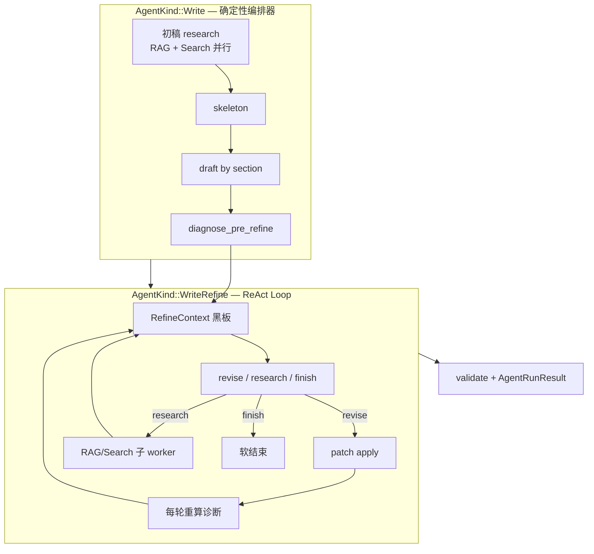

# WriteRefine Agent Loop — 变更文档

> **状态：已实施（review 修复轮已合入 2026-07-07）**  
> **决策日期：2026-07-07**  
> **关联规格：** [`2026-07-06-heavytail-writer-v2-design.md`](../superpowers/specs/2026-07-06-heavytail-writer-v2-design.md) §10（精修段）、§11（退出策略）  
> **取代：** 精修 Agent Loop 方案中的「MVP 嵌入式 loop（路径 A）」；实现采用嵌入式 loop 复用 loop 工具函数（见本文 §9a「架构偏差」）。  
> **实施位置：** `crates/app-chat/src/writer/refine_loop.rs`（runner + handler）、`material_pack.rs`、`writer/mod.rs`（orchestrator 集成）、`agents/skills/builtin/write_refine.rs`（tool 契约）、`crates/app-chat/src/bin/refine-experiment.rs`（M4 对比 arm）。

---

## 0. 决策摘要

| 决策项 | 结论 |
|--------|------|
| Agent 形态 | 注册 **`AgentKind::WriteRefine`**，与 `Chat` / `Rag` / `Search` 同一套 react loop 框架 |
| 精修动作 | 注册 **3 个 LLM-facing native tool**：`write_refine_revise`、`write_refine_research`、`write_refine_finish` |
| 补检索 | **开放** `research`；精修 loop 内按需调用 RAG / Web 子 worker，**全程上限 5 次**（与初稿调研分开记账） |
| 结束策略 | **软结束**：Agent 调用 `finish` 即收工；Band 未全过则带 `validation_warning`，不阻塞交付 |
| 代码守门 | 断句、Band 诊断、优先句/词、patch 校验与应用仍由 **Orchestrator 确定性代码** 执行 |
| 初稿调研 | 不变：`Write` orchestrator 前置 `research → skeleton → draft → diagnose`，再 **启动** `WriteRefine` loop |

---

## 1. 背景与动机

### 1.1 现状

HeavyTail Writer v2 精修段当前实现为 `heavytail::refine::refine()`：

- 固定 `max_rounds`（默认 5）机械循环；
- 每轮：代码诊断 → LLM 输出 patch 行 → 应用 → 重算；
- 初稿调研产出的 `MaterialCard` / `reservoir` 在精修中可见性弱；
- loop 内 **无法** 按需补检索；
- 结束条件仅为 `bands_passed` 或轮次耗尽，Agent 无「收工」语义。

### 1.2 目标

1. 精修升级为 **带记忆的 Agent Loop**：LLM 根据上轮效果决定继续改稿、补检索或结束；
2. RAG / Web 背景在 loop 内 **持续可见**，并可增量补充；
3. 与现有 **统一 Agent 内核**（ADR-0006/0007）对齐，避免 `WriterOrchestrator` 内再写一套平行 loop；
4. 用户已拍板：**开放 research（≤5）**、**软结束**。

### 1.3 非目标

- 不改变 `Write` 用户入口（前端仍选 `write` mode）；
- 不把 skeleton / draft 阶段并入 react loop；
- 不在精修 loop 暴露 `dense_retrieval` / `web_search` 等通用 tool（精修专用 tool 封装子 worker）；
- 不改动 Band 指标定义与 validator 硬 fail 阈值（仅改变 **退出语义**）。

---

## 2. 架构总览



**职责划分（延续 v2「确定性瞄准 + LLM 执行」）：**

| 层 | 职责 |
|----|------|
| `Write` Orchestrator | 阶段切换、checkpoint、启动/回收 `WriteRefine`、最终 validate 与 citation 组装 |
| `WriteRefine` Loop | 多轮对话、tool call 解析、调用 revise/research/finish handler |
| 确定性内核 | `DraftWorkspace`、patch 语法、`diagnose_pre_refine`、`validator`、best-version 保留 |
| Research 子 worker | 复用 `SubagentInvoker` + `AgentKind::Rag` / `AgentKind::Search` |

---

## 3. `AgentKind::WriteRefine` 注册

### 3.1 枚举与字符串契约

在 `crates/app-chat/src/agents/mod.rs` 增加变体：

```rust
pub enum AgentKind {
    Chat,
    Rag,
    Search,
    Write,
    WriteRefine,  // 新增：canonical "write_refine"
}
```

| 方法 | 值 |
|------|-----|
| `as_canonical_str()` | `"write_refine"` |
| `AgentKind::parse("write_refine")` | `Some(WriteRefine)` |
| 大小写 | 与现有 kind 一致，`to_ascii_lowercase()` 解析 |

**注意：** `WriteRefine` **不是**用户可选的前端 mode；仅作为 orchestrator 内部子 loop 的 `AgentRequest.kind`，与初稿 research 子 worker 用法对称。

### 3.2 路由与调度

| 入口 | 行为 |
|------|------|
| `pipeline_steps.rs` `AgentKind::Write` | 不变 → `writer::run_write_mode` |
| `UnifiedAgentService::run` | 新增 `WriteRefine` 分支 → `WriteRefineLoopRunner`（新模块） |
| `unified/mod.rs` 当前 `Write => Err(...)` | 保持；`WriteRefine` 单独实现，不走 unified 占位错误 |

### 3.3 Mode 配置：`modes/write_refine.yaml`

新增专用 mode YAML（与 `rag.yaml` / `search.yaml` 同级）：

```yaml
mode: write_refine
system_prompt_base: prompts/orchestrators/write-refine-system.md
tool_pool:
  - write_refine_revise
  - write_refine_research
  - write_refine_finish
skill_catalog:
  retrieve:
    - heavytail-metrics
    - heavytail-priming
  synthesis: []
  mandatory:
    retrieve:
      - heavytail-metrics
budget:
  max_iterations: 8          # ReAct 轮次上限（含 revise/research/finish 混合）
  by_user_tier:
    free: 5
    pro: 8
    enterprise: 8
temperature: 0.4
loop_exit:
  require_evidence: false    # 精修不强制检索证据
  allow_content_early_stop: true
  skip_synthesis_on_direct_answer: true   # 无 synthesis 阶段；finish 即产出
```

`max_iterations` 与 `WriterBudget.max_rounds` 关系：

- **ReAct iteration**（loop 框架计数）：≤ mode budget（默认 8）；
- **revise 有效轮**（patch 成功应用）：仍受 `WriterBudget.max_rounds`（默认 5）约束，防止单轮多次 revise tool 刷 patch；
- **research 次数**：独立计数，**≤ 5**，不受 `max_iterations` 替代。

### 3.4 CapabilityRegistry

`crates/app-chat/src/agents/capability/schemas.rs`：

```rust
pub fn write_refine_mode_schema() -> ModeSchema {
    ModeSchema {
        id: "write_refine".to_string(),
        external_tools_used: vec!["web_search".to_string()], // research(web) 间接依赖
        requires_internet: true,
    }
}
```

`standard_mode_schemas()` 扩展为 5 个 mode；`write_mode_schema` 保持 `write` 入口不变。

### 3.5 Billing

`ReactLoopAgentMode` **暂不**增加 `WriteRefine` 变体（精修 token 走 `write:refine` feature 标签 + `WriterBudget.total_token_cap`）。

若后续需要 tier 差异化，在 `billing/src/tier.rs` 增加 `WriteRefine` 条目；本变更不阻塞 MVP。

---

## 4. Tool Call 注册与契约

### 4.1 设计原则

- 遵循 ADR-0007：**LLM-facing native tool** 注册在 `CapabilityRegistry`，通过 `tool_pool` 按 mode 披露；
- 精修 loop **仅**暴露下列 3 个 tool，不直接暴露 `dense_retrieval` / `web_search`；
- Tool 名带 `write_refine_` 前缀，避免与 RAG/Search mode 工具冲突；
- Schema 定义在 `contracts`（或 `app-chat` builtin skill 组件），与现有 `WebSearchSkill` 模式一致。

### 4.2 `write_refine_revise`

**用途：** 修改一个或多个已编号句子。

```json
{
  "name": "write_refine_revise",
  "version": "1",
  "description": "Apply sentence-level patches to the numbered draft.",
  "input_schema": {
    "type": "object",
    "required": ["patches"],
    "properties": {
      "patches": {
        "type": "array",
        "minItems": 1,
        "maxItems": 12,
        "items": {
          "type": "object",
          "required": ["id", "text"],
          "properties": {
            "id": { "type": "string", "pattern": "^s[0-9]+$" },
            "text": { "type": "string", "minLength": 2 }
          }
        }
      },
      "note": { "type": "string", "maxLength": 200 }
    }
  }
}
```

**Handler 行为：**

1. 校验 `id` 属于 `DraftWorkspace` live 句；
2. 校验 `text` 以 `。！？` 结尾、长度合理；
3. 转为内部 patch 行 `s<id>| <text>`，走现有 `parse_patch` / `apply_patch`；
4. 成功后重算 `PreRefineDiagnosis`，将 delta 写入 observation；
5. 失败返回 tool error（可重试），不计入 revise 有效轮。

### 4.3 `write_refine_research`

**用途：** 精修 loop 内按需补检索（RAG 或 Web）。

```json
{
  "name": "write_refine_research",
  "version": "1",
  "description": "Fetch additional grounding material during refinement.",
  "input_schema": {
    "type": "object",
    "required": ["kind", "query"],
    "properties": {
      "kind": { "type": "string", "enum": ["rag", "web"] },
      "query": { "type": "string", "minLength": 4, "maxLength": 500 },
      "reason": { "type": "string", "maxLength": 200 }
    }
  }
}
```

**Handler 行为：**

1. 检查 `RefineContext.research_calls_used < 5`；否则返回 `budget_exhausted`；
2. `kind=rag` → `SubagentInvoker` + `AgentKind::Rag`；`kind=web` → `AgentKind::Search`；
3. 子 worker `max_iterations: 2`，`per_research_worker_tokens: 4_000`（比初稿调研小）；
4. 新卡片合并进 `MaterialPack`，更新 `reservoir`；
5. Observation 返回压缩摘要（≤3 张新卡 + 术语列表），**不**回传全文；
6. `research_calls_used += 1`。

**预算常量（新增 `RefineLoopBudget`）：**

```rust
pub struct RefineLoopBudget {
    pub max_rounds: usize,                 // 默认 5 — revise 有效轮
    pub max_react_iterations: usize,       // 默认 8 — loop 框架轮
    pub max_on_demand_research: usize,     // 默认 5 — 用户定案
    pub per_research_worker_tokens: usize, // 默认 4_000
    pub max_refine_tokens: usize,          // 默认 40_000
}
```

初稿 `WriterBudget.research_tokens_per_worker` 与精修 `per_research_worker_tokens` **分开记账**。

### 4.4 `write_refine_finish`

**用途：** Agent 申请结束精修（软结束）。

```json
{
  "name": "write_refine_finish",
  "version": "1",
  "description": "End refinement and return the best draft version.",
  "input_schema": {
    "type": "object",
    "required": ["reason"],
    "properties": {
      "reason": { "type": "string", "minLength": 4, "maxLength": 500 },
      "bands_satisfied": { "type": "boolean" }
    }
  }
}
```

**Handler 行为（软结束）：**

1. **接受** `finish`，立即退出 `WriteRefine` loop；
2. 取 `WriterState.best_version`（按 composite S）或当前 workspace；
3. 跑 `validator::validate`；
4. 若 `!validation.passed`：
   - 设置 `validation_warning: true`；
   - `degrade_trace` 追加 `{ stage: "write:refine", reason: Other("validation_warning"), impact: "..." }`；
   - **仍交付** `answer` 与 citations；
5. `bands_satisfied` 仅作 telemetry，**不**作为硬门禁（与旧方案「finish 但 Band 未过则继续」相反）。

**硬结束（非 Agent 触发）：**

| 条件 | 行为 |
|------|------|
| `react_iteration >= max_react_iterations` | 软结束 + `degrade: refine_iteration_cap` |
| `tokens_used >= max_refine_tokens` | 软结束 + `degrade: refine_token_cap` |
| `revise 有效轮 >= max_rounds` 且 Agent 未 finish | 软结束 + best-version |
| 用户 cancel | 中断 + checkpoint |

---

## 5. 数据模型：`RefineContext` 与 `MaterialPack`

### 5.1 `MaterialPack`（`app-chat/src/writer/material_pack.rs`）

从 `ResearchOutcome` + loop 内增量检索构建，每轮附在 prompt 的「背景资料附录」：

```rust
pub struct MaterialPack {
    pub rag_cards: Vec<MaterialCardView>,
    pub web_cards: Vec<MaterialCardView>,
    pub reservoir: Vec<String>,
    pub citation_index: Vec<CitationRef>,
}

pub struct MaterialCardView {
    pub id: String,
    pub kind: String,           // 事实 / 引用 / 术语 / 数据
    pub content: String,        // ≤80 字摘要
    pub source_label: String,   // 「用户文档：…」/ 「网络：…」
    pub rare_terms: Vec<String>,
    pub used_in_draft: bool,    // 代码扫描正文
}
```

### 5.2 `RefineContext`（`app-chat/src/writer/refine_context.rs`）

```rust
pub struct RefineContext {
    pub workspace: DraftWorkspace,
    pub diagnosis: PreRefineDiagnosis,
    pub bands_passed: bool,
    pub material_pack: MaterialPack,
    pub research_calls_used: usize,
    pub revise_rounds_used: usize,
    pub react_iteration: usize,
    pub tokens_used: usize,
    pub patches_applied: Vec<RoundPatchRecord>,
    pub parent_checkpoint_dir: PathBuf,
}
```

Checkpoint 路径：`{job_dir}/refine/` — `context.json`、`rounds/`、`material_pack.json`。

### 5.3 与 `WriterState` 的关系

- `Write` orchestrator 在 `diagnose` 后构造 `RefineContext`，调用 `WriteRefine` loop；
- Loop 结束后将 `workspace`、`rounds`、`best_version`、`tokens_used` 写回 `WriterState`；
- `heavytail::refine::refine()` **保留**为 `feature = "legacy-refine"` 或实验 CLI 路径，生产默认走 `WriteRefine`。

---

## 6. Prompt 与 Skill

### 6.1 System prompt

新文件：`prompts/orchestrators/write-refine-system.md`

要点：

- 四项 Band 指标目标（引用 `heavytail-metrics` skill）；
- 三 tool 用法与预算（research ≤5）；
- 背景附录优先，缺事实再 `write_refine_research`；
- 关键事实不得捏造；可改述，不可虚构；
- 认为可读性足够时调用 `write_refine_finish`（软结束合法）。

### 6.2 每轮 User 包

| 轮次 | 内容 |
|------|------|
| Round 1 | 全量：诊断报告 + 背景附录 + 编号正文 |
| Round 2+ | 增量：上轮指标 delta + 新 patch 列表 + 更新优先句/词 + 附录（仅追加检索时变化） |

渲染函数：`heavytail::diagnosis::render_refine_turn_zh(ctx, delta: Option<MetricDelta>)`。

### 6.3 Skill

| Skill ID | 阶段 | 说明 |
|----------|------|------|
| `heavytail-metrics` | retrieve | 已有；指标业务含义 |
| `heavytail-priming` | retrieve | 已有；风格 |
| `heavytail-refine` | retrieve | **新增**；何时 revise / research / finish |

---

## 7. `WriterOrchestrator` 变更

### 7.1 流水线

```text
research → skeleton → draft → diagnose_pre_refine
    → WriteRefineLoop::run(refine_context)
    → validate → AgentRunResult
```

替换当前：

```rust
heavytail::refine::refine(...)
```

为：

```rust
WriteRefineLoopRunner::new(service, invoker)
    .run(refine_context, refine_budget, sink)
    .await?;
```

### 7.2 SSE 事件

| 事件 | 时机 |
|------|------|
| `activity: refine` | Loop 开始 |
| `activity: refine_round` | 每次 react iteration |
| `tool_call` / `tool_result` | revise / research / finish（与 RAG mode 同形） |
| `activity: refine_research` | 子 worker 启动 |
| `done` | orchestrator 最终 validate 后 |

### 7.3 Debug payload 扩展

```json
{
  "write_result": {
    "refine_agent": "write_refine",
    "react_iterations": 6,
    "revise_rounds": 4,
    "research_calls": 2,
    "validation_warning": true,
    "finish_reason": "agent_finish",
    "bands_passed": false
  }
}
```

---

## 8. 对 v2 规格的修订

| v2 章节 | 原内容 | 本变更 |
|---------|--------|--------|
| §6.1 | 不把 writer 实现为第四 react mode | **修订**：`Write` 仍为 orchestrator；**精修子阶段**注册为 `WriteRefine` react loop |
| §10 | 固定 evaluator-optimizer 双 pass | **修订**：Agent 自主选 revise / research / finish；诊断仍确定性 |
| §11 | Fail → 下一轮；耗尽 → best + warning | **保留**耗尽逻辑；**新增** Agent `finish` 触发同等软结束 |
| §10 research | 仅初稿阶段 | **扩展**：精修 loop 内 `write_refine_research`，≤5 次 |

在 `2026-07-06-heavytail-writer-v2-design.md` 头部追加：

> **Amended by:** [`2026-07-07-write-refine-agent-loop.md`](../plans/2026-07-07-write-refine-agent-loop.md) — 精修段改为 `AgentKind::WriteRefine` + 三 tool + 软结束。

---

## 9. 实施清单

> 实施状态更新于 2026-07-07（见 review 修复轮）。`[x]` 已落地并测试，`[~]` 部分落地，`[ ]` 待办。

### Phase 1 — 契约与注册

- [x] `AgentKind::WriteRefine` + parse/display/serde 测试
- [x] `modes/write_refine.yaml` + `write-refine-system.md`
- [x] `CapabilityRegistry` 注册三 tool + `write_refine_mode_schema`
- [x] builtin skill 三件套（`skills/builtin/write_refine.rs`）
- [x] `write_mode_contract` / `unified_agent_contract` 增补 `write_refine` 解析测试

### Phase 2 — Loop 运行时

- [x] `material_pack.rs` — 附录渲染（review 后：`merge_new_cards` 返回真实插入 views）
- [x] `RefineContext` 黑板 + checkpoint（`refine_loop.rs` 内；`{job_dir}/refine/context.json` 已实现）
- [x] `WriteRefineLoopRunner`（见下方「架构偏差」：内嵌 loop，复用 loop 工具函数，非统一 ReAct 主状态机）
- [x] 三 tool handler：`revise` / `research` / `finish`（review 后：revise 仅 `!changed.is_empty()` 计有效轮 + 每轮 record best）
- [x] 每轮 User 包渲染（`render_round_user_message`，复用 `render_diagnosis_brief_zh`）
- [x] `prompts/clusters/heavytail-refine/SKILL.md`

### Phase 3 — 集成与观测

- [x] `WriterOrchestrator` 切换至 `WriteRefineLoopRunner`
- [x] SSE `tool_call` + `tool_result` 双事件透传（review 后补 `tool_call`）
- [x] `validation_warning` + `degrade_trace` 软结束路径
- [x] WriteRefine M4 对比 arm：`refine-experiment --refine`（app-chat 侧，heavytail 不能依赖 app-chat）
- [x] E2E：`write_real`（nightly + ignored）骨架

### Phase 4 — 验证

- [x] 单元：research 第 6 次拒绝、budget、软结束带 warning、best-snapshot 还原、checkpoint 写入
- [~] 集成：M4 十题 band pass 率对比（legacy `heavytail-experiment --refine` vs `refine-experiment --refine`）— 工具就绪，待实跑
- [ ] 成本：记录 `research_calls` 分布，确认 ≤5 可控（需实跑统计）

### Review 修复轮（2026-07-07）

- [x] P1.1 best_version 交付：每轮有效 revise 记录 + 退出从历史最优还原（`BestSnapshot`）
- [x] P1.2 research observation 报告真实新增卡片（`merge_new_cards` 返回插入 views）
- [x] P1.3 revise 有效轮仅在 `!changed.is_empty()` 时计数
- [x] P2.4 tier max_iterations 接入（`mode.budget.resolve_max_iterations`）
- [x] P2.5 `AgentEvent::ToolCall` 事件 + SSE 映射
- [x] P2.6 无 tool_call 连续 3 轮注入纠错并软退出
- [x] P2.7 RefineContext checkpoint（`{job_dir}/refine/{context,material_pack}.json`）
- [x] P2.8 WriteRefine M4 对比二进制 + legacy 注释修正
- [x] P3 陈旧 Phase 2 注释 / finish schema 字段名 / 本 checklist 对齐

---

## 9a. 架构偏差（实现 vs 设计）

变更文档原文写「挂接 `agents/loop` 统一 ReAct 框架」。实际实现为 **orchestrator 内嵌的轻量 loop**：

- **复用**：`load_mode_config`、`build_assistant_message_with_tool_calls`、`build_tool_message`、`WriterLlm::complete_with_tools`、`resolve_max_iterations`、`assembler::build_iteration_budget_hint`。
- **未复用**：统一 `ReActLoop` 主状态机、`exit_policy`、`disclosure_plan` 轮次披露、synthesis 阶段。

即更接近原「路径 A 嵌入式 loop」，只是借用了 loop 层的工具函数。功能上与设计等价（三 tool + 软结束 + 子 worker），但**不是** top-level unified agent。`UnifiedAgentService` 对 `WriteRefine` 返回 `write_refine_not_top_level` 是有意为之（内部子 loop，非用户可选 mode），`pipeline_steps` 也正确拦截了顶层路由。后续若要完全统一，需把 `WriteRefine` 接入 `ReActLoop` 主状态机并支持 tool-call 拦截钩子——列为独立改造，不阻塞当前 MVP。

---

## 10. 风险与缓解

| 风险 | 缓解 |
|------|------|
| Agent 过早 `finish` 导致 band 不达标 | 软结束显式 `validation_warning`；UI 可展示指纹报告；best-version 保留 |
| research 5 次仍爆 token | `per_research_worker_tokens` + `max_refine_tokens` 双 cap |
| react loop 与 orchestrator 状态分裂 | `RefineContext` 单 checkpoint 源；loop 结束一次性写回 `WriterState` |
| Band 校准问题（hapax/zipf 系统性失败） | 与 M4 实验并行；本变更不替代 band 重标定 |
| 实现复杂度高于嵌入式 loop | 长期与 RAG/Search 维护成本更低；复用 parse-retry、SSE、billing |

---

## 11. 开放问题（实施前可并行推进）

1. **Band 重标定**：中文语料 hapax/zipf 系统性 out-of-band 是否调整 `StyleParams` 或 validator band（独立于本 loop 变更）。
2. **`heavytail-refine` skill 披露轮次**：首轮全量 vs 第二轮补披露 finish 指南。
3. **前端**：是否在精修阶段展示 `tool_call`（research 进度）——建议与 RAG mode 一致，默认展示。

---

## 12. 参考文件

| 文件 | 说明 |
|------|------|
| `crates/app-chat/src/agents/mod.rs` | `AgentKind` 定义 |
| `crates/app-chat/src/writer/mod.rs` | Write orchestrator |
| `crates/app-chat/src/writer/invoker.rs` | 子 worker 调用 |
| `crates/heavytail/src/refine.rs` | 当前 legacy 精修（保留） |
| `crates/heavytail/src/diagnosis.rs` | 预诊断与 brief |
| `crates/app-chat/src/agents/capability/registry.rs` | Tool 注册 |
| `docs/superpowers/specs/2026-07-06-heavytail-writer-v2-design.md` | 母规格 |
