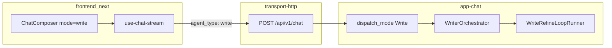

# Write 模式上线计划 — API + 最小 UI + 产品文档

> **状态：待实施**  
> **决策日期：2026-07-08**  
> **关联规格：** [`2026-07-06-heavytail-writer-v2-design.md`](../superpowers/specs/2026-07-06-heavytail-writer-v2-design.md) §6.1（`write` 与 chat/rag/search 并列）  
> **关联实施：** [`2026-07-07-write-refine-agent-loop.md`](2026-07-07-write-refine-agent-loop.md)、[`2026-07-07-persona-layer-design.md`](2026-07-07-persona-layer-design.md)  
> **验证数据：** `heavytail-out/1783430709`（10 topic persona gate，8/10 band 过关）

---

## 0. 决策摘要

| 决策项 | 结论 |
|--------|------|
| 上线范围 | **API 可用** + **前端最小模式按钮** + **产品/Agent 文档** |
| 用户入口 | `agent_type: "write"`（与 `chat` / `rag` / `search` 同级） |
| 精修 / Persona | **不单独暴露**；内嵌于 Write 流水线（WriteRefine 子 loop + 随机 Persona） |
| 产品化 | **本轮不做**：Pro gating、用量弹窗、Persona 高级开关、指纹 debug 面板 |
| 文档 | 新建 `/docs/write-mode.md`；Help 页人类导读；补丁 `api-access-for-agents.md` |

---

## 1. 背景

### 1.1 已完成能力（后端）

Write 全流程已在 `crates/app-chat/src/writer/mod.rs` 落地：

```
research → skeleton → draft → diagnose → WriteRefine → validate → AgentRunResult
```

- 路由：`pipeline_steps.rs` 在 `agent_type == "write"` 时调用 `run_write_mode`。
- Persona：默认 `generate_persona`（每篇随机人格）；`persona_seed` / `persona_replay` 仅 `AgentRequest.metadata`（**当前 `ChatRequest` 无 metadata 字段，UI/API 暂不暴露**）。
- WriteRefine：6 轮 ReAct 硬上限、gate 下 3 次有效 revise、末轮 hapax/zipf 未过强制 `write_refine_lexical`（见 `refine_loop.rs`）。
- SSE：`activity` 阶段 `research` / `skeleton` / `draft` / `diagnose` / `refine` / `validate`；`debug=true` 时 `done` 含 `write_result`。

`write_refine` **不可**作为顶层 `agent_type`（`pipeline_steps.rs` 返回 `write_refine_not_user_selectable`）。

### 1.2 缺口（前端）

`frontend_next` 对话 composer 仅三种模式：

```ts
// chat-composer.tsx
const CHAT_MODE_ORDER: WorkspaceChatMode[] = ["rag", "search", "chat"];
```

`use-chat-stream.ts` 将 `effectiveChatMode` 原样作为 `agent_type` 发出，**无 `write` 分支**。用户在产品 UI 中无法触发写作流水线。

### 1.3 验证结论（可写进文档的用量锚点）

`scripts/persona-10topic-gate.sh` 跑批（`RUN_ID=1783430709`）：

| 指标 | 结果 |
|------|------|
| 4/4 band 过关 | **8/10** |
| 平均 post S | **0.838** |
| 平均 ΔS（精修段） | **+0.059** |
| 精修 token/篇 | **约 23k–108k**（`refine-experiment` 仅精修段；全流水线更高） |
| 精修墙钟 | **约 1.5–3 分钟/篇**；完整 Write 预估 **2–5 分钟** |
| compliance | 全部 100% |

> 文档中的「全文 token」应写 **约 10万–20万/篇**（精修 + 调研 + 骨架 + 多节初稿），精修段单独引用上表。

---

## 2. 目标与非目标

### 2.1 目标

1. **API 上线**：`POST /api/v1/chat`（REST/SSE）`agent_type: "write"` 有稳定文档与冒烟验收。
2. **最小 UI**：工作区 composer 增加第 4 模式「长文写作」，能发请求、看进度、历史消息带模式标签。
3. **产品文档**：中英文说明功能、特点、用量预期、限制与降级语义。

### 2.2 非目标（本轮明确不做）

- Pro 套餐 / 付费墙 / 写作专用用量 UI
- Persona 种子、回放、`no_persona` 开关
- `write_refine` 独立按钮或模式
- 指纹 band 可视化、精修轮次调试面板
- MCP `workspace.chat` 扩展 write（仍用 REST/SSE）
- `GET /api/v1/agent/operation-guides/write`（可 Phase 0 可选补丁，非阻塞）
- 追求 gate 10/10 band（当前 8/10 已验收）

---

## 3. 架构与调用路径



**与现有模式对比**

| 模式 | agent_type | 典型调用数 | 联网 | 输出 |
|------|------------|------------|------|------|
| chat | `chat` | 1–2 | 否 | 短答 |
| rag | `rag` | 2–6 | 否* |  grounded 答 |
| search | `search` | 2–6 | 是 | 网页综合答 |
| **write** | **`write`** | **10–20** | **是** | **长文 + 引用** |

\* RAG 本身不强制联网；Write 的 web research worker 需要 `web_search`。

---

## 4. 实施阶段

### Phase 0 — 后端发布前核对（0.5 人天）

**任务**

| # | 项 | 说明 |
|---|-----|------|
| 0.1 | 契约测试 | `cargo test -p app write_mode_contract` |
| 0.2 | 真 LLM 冒烟（nightly） | `cargo test -p app write_real -- --ignored` |
| 0.3 | SSE 字段 | `answer_start.agent_type=write`；`activity.phase` 覆盖各阶段；`done` 有正文 |
| 0.4 | 计费标签 | 确认 `WriterLlm::with_phase` 写入 usage `feature`（设置页用量可归类，无需新 UI） |
| 0.5 | （可选）operation guide | `handlers/mod.rs` 的 `operation_guide_agent_type` 加入 `"write"` |

**手工冒烟**

```bash
curl -N -H "Authorization: Bearer $JWT" \
  -H "Content-Type: application/json" \
  -d '{
    "query": "用五百字介绍 KV 缓存，面向工程师",
    "workspace_id": "<uuid>",
    "agent_type": "write",
    "stream": true
  }' \
  https://<host>/api/v1/chat
```

**验收**：流式收到 `activity` → `token`（正文）→ `done`；`agent_type` 为 `write`。

---

### Phase 1 — API / Agent 文档（0.5 人天）

#### 4.1.1 新建 `frontend_next/public/docs/write-mode.md`

稳定链接：`/docs/write-mode.md`（与 `api-access-for-agents.md` 同级）

**必选章节**

1. **概述** — Write 是什么；与 chat/rag/search 的差异。
2. **流水线阶段** — research → skeleton → draft → WriteRefine → validate；Persona / WriteRefine 为内置能力，无独立 API。
3. **REST/SSE 调用**

```json
POST /api/v1/chat
{
  "query": "<写作主题，非闲聊>",
  "workspace_id": "<workspace uuid>",
  "agent_type": "write",
  "doc_scope": [],
  "stream": true,
  "debug": false
}
```

| 字段 | 说明 |
|------|------|
| `query` | 主题或写作任务描述 |
| `workspace_id` | 工作区 ID |
| `doc_scope` | 可选；限制知识库调研范围（传给 RAG worker） |
| `stream` | 建议 `true`（耗时长） |
| `debug` | `true` 时 `done` 含 `write_result`（指纹、revise 轮次、token 等） |

**禁止**：`agent_type: "write_refine"`（400）。

4. **SSE 事件**

| event | 写作模式要点 |
|-------|----------------|
| `activity` | `phase`: `research` / `skeleton` / `draft` / `diagnose` / `refine` / `validate`；`title` 为英文阶段说明 |
| `token` | 文章正文流式输出（节间可能有停顿） |
| `citations` | 调研来源引用 |
| `done` | `agent_type=write`；可选 `degrade_trace` |
| `trace` | `debug=true` 时含 `tool_result.write_refine_*` |

5. **特点（对外宣传用）**

- **随机 Persona**：每篇自动生成人格小传，降低跨篇同质腔调（用户不可配）。
- **指纹精修**：统计 band（cv / hapax / zipf / burstiness）驱动 WriteRefine；软结束，band 未全过仍可交付。
- **双路调研**：并行 RAG（知识库）+ Search（网络），压缩为 MaterialCard。
- **需联网**：`web_search` 用于调研与精修内补检索。

6. **用量与预期**（引用 gate `1783430709`）

| 指标 | 典型范围 | 备注 |
|------|----------|------|
| LLM 调用 | 10–20 次/篇 | 含 2 路调研 worker |
| Token（全文） | 约 10万–20万/篇 | 精修段 alone 约 3.5万–11万 |
| 墙钟 | 2–5 分钟 | 视主题与网络 |
| 相对 chat/RAG | 约 8–15× 单次问答 token | 量级参考 |
| Band 过关率 | gate 8/10（4/4） | 未全过时有 `validation_warning` |

7. **降级与 trace**

| stage | 含义 |
|-------|------|
| `write:research` | `research_degraded` — 单路调研失败 |
| `write:refine` / `write:validate` | 指纹 band 未全过 |
| `write:persona` | `persona:leak` — 人格术语泄漏 |

8. **高级参数（内部 / 后续）**

`persona_seed` / `persona_replay` / `no_persona` 经 `AgentRequest.metadata` 解析，**当前 `ChatRequest` 无 metadata**。文档注明「默认自动；回放仅实验脚本」，不在公开 API 承诺 v1 字段。

#### 4.1.2 更新 `frontend_next/public/docs/api-access-for-agents.md`

- REST 表补充 `agent_type: write` 说明。
- 增加指向 `/docs/write-mode.md` 的链接。
- MCP 一节注明：个人 Agent 长文写作优先 `POST /api/v1/chat`，非 `workspace.rag_query`。

---

### Phase 2 — 最小 UI（1–1.5 人天）

#### 4.2.1 类型与状态机

**`lib/workspace/ui-store.ts`**

```ts
export type WorkspaceChatMode = "rag" | "search" | "chat" | "write";
```

| 规则 | 行为 |
|------|------|
| 用户选中 `write` | 同时设 `chatModePreference: "manual"` |
| `auto` 偏好 | **不**把 write 纳入默认轮询；`getDefaultWorkspaceChatMode` 仍为 rag/chat |
| 有 doc_scope + auto | 不覆盖用户已 manual 选的 write |

`normalizeChatMode` / `normalizeMessageMode` 识别 `"write"`。

#### 4.2.2 Composer 与消息展示

| 文件 | 改动 |
|------|------|
| `components/workspace/chat-composer.tsx` | `CHAT_MODE_ORDER` 追加 `"write"`；`getModeLabel` / `getModeCode` |
| `components/workspace/workspace-chat-pane.tsx` | 同步 mode 标签 |
| `components/workspace/chat-message-list.tsx` | 历史 assistant 消息显示「长文写作」 |
| `lib/i18n/messages/workspace.ts` | `workspaceChatModeWrite`（zh: 长文写作 / en: Write） |

**Composer 文案（最小）**

- 选中 write 时 placeholder：`输入写作主题，例如：大模型 KV 缓存科普`
- 模式 code 展示：`write`（与后端 `agent_type` 一致）

#### 4.2.3 流式与进度

| 文件 | 改动 |
|------|------|
| `hooks/chat-session/use-chat-stream.ts` | 无需改 agent_type 映射逻辑（已是 `effectiveChatMode`） |
| `hooks/chat-session/helpers.ts` | `normalizeMessageMode("write")`；扩展 `isResearchMode` 或新增 `showsProgressPanel(mode)` 含 write |
| `hooks/chat-session/use-progress-tracker.ts` | write 模式 `show()` 时初始化 progress；消费后端 `activity` |
| `hooks/chat-session/stream-event-handlers.ts` | write 使用长任务提示（非 chat 轻量「思考中」） |

**进度面板**：直接展示 SSE `activity.title` / `phase`（英文可原样；i18n 映射表为 P2）。

**明确不做**

- 指纹 / band 面板
- Persona 开关
- Token 倒计时 / 预估条

#### 4.2.4 测试

| 文件 | 用例 |
|------|------|
| `tests/workspace/workspace-chat-pane.modes.test.tsx` | 选 write → 请求 `agent_type=write` |
| `tests/workspace/ui-store.test.ts` | write + manual 不被 auto 切回 rag |
| `lib/workspace/ui-store.ts` | normalize 与 resolve 单测 |

**E2E（可选）**：`e2e/pom/chat-panel-page.ts` 支持 `setMode("write")`；只测 UI 与请求字段，不跑真 LLM 全流水线。

---

### Phase 3 — 产品文档（对人，0.5 人天）

#### 4.3.1 Help 入口

| 路径 | 内容 |
|------|------|
| `app/(app)/help/write/page.tsx` | 人类可读「长文写作」说明页 |
| `app/(app)/help/page.tsx` | 新增 section + 链接 `/help/write` |
| `lib/i18n/messages/help.ts` | `helpSectionWriteTitle`、`helpItemWrite1..3` 等 |
| `components/api-access/workspace-api-access-surface.tsx` | Agent 文档区增加「写作模式」链到 `/docs/write-mode.md` |

#### 4.3.2 对用户三句话（Help 页核心）

1. **干什么**：根据主题自动写长文（调研、大纲、分段写作、统计指纹润色）。
2. **怎么用**：工作区对话 → 模式选「长文写作」→ 输入主题发送。
3. **花多少**：比问答慢、耗 token 多；一篇通常几分钟、十万级 token；详见文档用量表。

中英文各一版（i18n + write-mode.md 英文节）。

---

### Phase 4 — 发布与门禁（0.5 人天）

| 门禁 | 命令 |
|------|------|
| 后端契约 | `cargo test -p app write_mode_contract` |
| 前端单测 | `cd frontend_next && pnpm vitest run tests/workspace/workspace-chat-pane.modes.test.tsx tests/workspace/ui-store.test.ts` |
| Nightly（CI 可选） | `cargo test -p app write_real -- --ignored` |
| 手工 | UI 选写作 → 真跑 1 篇 → activity + 正文 + 设置页用量 |

**发布顺序**

1. 后端（已具备，无破坏性变更）可先部署。
2. 前端 + 文档同一 PR 合并。
3. 无需 feature flag。

---

## 5. 文件清单

```
# 文档（Phase 1 + 3）
frontend_next/public/docs/write-mode.md                    [新建]
frontend_next/public/docs/api-access-for-agents.md         [改]
frontend_next/app/(app)/help/write/page.tsx                [新建]
frontend_next/app/(app)/help/page.tsx                      [改]
frontend_next/lib/i18n/messages/help.ts                    [改]
frontend_next/components/api-access/workspace-api-access-surface.tsx [改]

# 前端 UI（Phase 2）
frontend_next/lib/workspace/ui-store.ts
frontend_next/components/workspace/chat-composer.tsx
frontend_next/components/workspace/workspace-chat-pane.tsx
frontend_next/components/workspace/chat-message-list.tsx
frontend_next/lib/i18n/messages/workspace.ts
frontend_next/hooks/chat-session/helpers.ts
frontend_next/hooks/chat-session/use-progress-tracker.ts
frontend_next/hooks/chat-session/stream-event-handlers.ts

# 测试
frontend_next/tests/workspace/workspace-chat-pane.modes.test.tsx
frontend_next/tests/workspace/ui-store.test.ts
frontend_next/e2e/pom/chat-panel-page.ts                     [可选]

# 后端（Phase 0 可选）
avrag-rs/crates/transport-http/src/handlers/mod.rs           [operation_guide write]
```

---

## 6. 风险与对策

| 风险 | 对策 |
|------|------|
| 用户不知写作很贵 | 文档 + Help 明确 token/耗时；composer placeholder 提示「长文、较慢」 |
| auto 模式覆盖 write | 选 write 时强制 `manual` |
| 精修 band 未全过 | 文档说明 `validation_warning`；正文仍交付（软结束） |
| activity 英文 title | 最小 UI 原样展示；P2 可加 phase→i18n 表 |
| Persona 高级 API 需求 | v2 在 `ChatRequest` 增 `metadata`；本轮不承诺 |
| MCP 无 write | 文档写清走 REST/SSE |

---

## 7. 工期估算

| 阶段 | 人天 |
|------|------|
| Phase 0 后端核对 | 0.5 |
| Phase 1 API 文档 | 0.5 |
| Phase 2 最小 UI | 1.0–1.5 |
| Phase 3 Help 页 | 0.5 |
| Phase 4 测试发布 | 0.5 |
| **合计** | **3.0–3.5** |

---

## 8. 实施检查清单

复制到 PR 描述或 issue：

- [ ] Phase 0：`write_mode_contract` 绿；手工 SSE 冒烟 1 次
- [ ] Phase 1：`write-mode.md` 上线；`api-access-for-agents.md` 已链入
- [ ] Phase 2：composer 第 4 模式「长文写作」；`agent_type=write` 请求
- [ ] Phase 2：`ui-store` write + manual 不被 auto 覆盖
- [ ] Phase 2：vitest modes / ui-store 通过
- [ ] Phase 3：`/help/write` 可访问；Help 首页有入口
- [ ] Phase 3：API Access 页有写作文档链接
- [ ] Phase 4：UI 真跑 1 篇长文验收（activity + 正文）
- [ ] 文档用量数字与 gate `1783430709` 一致

---

## 9. 参考

| 资源 | 路径 |
|------|------|
| Writer orchestrator | `avrag-rs/crates/app-chat/src/writer/mod.rs` |
| WriteRefine loop | `avrag-rs/crates/app-chat/src/writer/refine_loop.rs` |
| 模式路由 | `avrag-rs/crates/app-chat/src/chat/pipeline_steps.rs` |
| 能力注册 | `avrag-rs/crates/app-chat/src/agents/capability/schemas.rs` |
| Gate 脚本 | `avrag-rs/scripts/persona-10topic-gate.sh` |
| Gate 产物 | `avrag-rs/heavytail-out/1783430709/` |
| 设计规格 | `avrag-rs/docs/superpowers/specs/2026-07-06-heavytail-writer-v2-design.md` |
