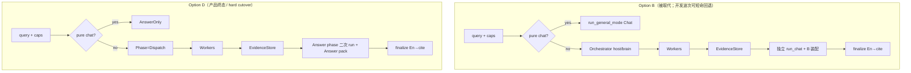

# Option D：统一 Product Agent（Dispatch / Answer 两阶段）

| 项目 | 内容 |
|------|------|
| 状态 | **产品已拍板 + 代码 hard cutover 已落地（2026-07-20）**；测试对齐见 [`2026-07-20-option-d-test-gap-and-drift.md`](./2026-07-20-option-d-test-gap-and-drift.md) |
| 取代关系 | 有检索时的 **Option B（编排 host + 独立 Chat exit 子 agent）** → **同一 Product Agent 运行时按 Phase 换装（二次 phase run）**；无检索时行为对齐今日 pure chat |
| 关联文档 | [编排提示词优化](./2026-07-20-orchestrator-prompt-engineering-optimization.md)（P0–P3 已落地）、[提示词叠层诊断（full_eval 后，供复核）](./2026-07-20-prompt-stack-diagnosis-post-full-eval.md)、`docs/adr/0007-product-apps-composition-root.md`、T1–T8（`AGENTS.md`） |
| 关键代码基线 | `app-chat/src/chat/pipeline_steps.rs`、`orchestrator/{host,brain,chat_exit,store,workers}.rs`、`mode_assemble.rs`、`agent-loop/.../assembler.rs`、`modes/{chat,orchestrator,rag,search}.yaml`、`prompts/orchestrators/*` |
| 前置事实 | 入库 chunk **512 token**；证据条数由 **RAG 管道动态 TOPK/TOPN** 决定；`EvidenceStore` **只去重 + 赋 En，不二次截断** |
| **产品拍板** | **OQ-Cite=A**（`[[E:n]]`+finalize）；**OQ-Rollout=B hard cutover**；**OQ-Tools=效用工具目录**（计算器/天气/定位等，非 codegen/memory 主叙事） |
| **上线形态** | **Hard cutover**：终态 **仅 Option D 路径**；不以长期运维双路径 / 灰度 flag 为产品方案 |
| **工程安全落地** | 开发波次内可用 **短命内部开关** 做单测/本地验证；**Cutover PR 删除双路径或使 D 为唯一入口**；回滚 = git revert（可选极短紧急 kill-switch，非产品灰度故事） |

---

## 1. Motivation / 问题陈述

### 1.1 产品意图（必须保留）

1. **有 capabilities（rag 和/或 search）**：仅在 **回答阶段（Answer）** 注入作答规则、skill 目录/正文、**效用 tool 目录**（§5.3.2）；**派活阶段（Dispatch）** 不写长作答协议。
2. **无 capabilities**：query 进来后直接注入 chat 回答规则 + pure chat tool/skill（含未来效用 tools），**不经编排 / 不经 Dispatch**。
3. Orchestrator **可以**替代 pure-chat 的独立装配心智：入口统一为 **一套 Product Agent 运行时**，用 **装配包 / Phase** 区分，而不是两套互不相干的 agent。
4. 证据：chunk 512；条数管道定；store 只去重不二次截断。

### 1.2 今日 Option B 的痛点（代码事实）

| 痛点 | 现状锚点 | 后果 |
|------|----------|------|
| **双 agent handoff 贵** | `host.rs` → `OrchestratorExecutor::run_chat` 起独立 Chat agent；证据经 `chat_exit::render_synthesize_context` **写入 agent query**；system = pure `chat-base` + `answer_rule_parts` | 第二套 system + 全量证据再贴一次；Dispatch 多轮历史不进 Chat，但双身份/双装配仍在 |
| **协议易丢** | Chat exit 与 orchestrator 上下文断裂 | 装瞎、`[[E]]` 乱写、再检索幻觉 |
| **入口心智双轨** | `dispatch_agent_mode`：pure → `run_general_mode`；否则 `run_orchestrator_v1` | 产品上是两条路径 |
| **合成阶段无 tool** | `ContextAssembler::assemble_synthesis` 固定 `tools: vec![]` | 回答阶段只有 skill **文本**披露 |
| **exit 语义绑在「另一同事」** | `orchestrator-base.md` + `delegate_chat` | 与「同一 Product Agent 运行时换装」叙事冲突 |

### 1.3 本文范围

- 本文是 **设计稿**（review-ready），给出可实施的阶段契约、模块落点、Key Decisions、PR Plan。
- **不**在本文落地代码；实现以 Open Questions 拍板后的 PR 顺序为准。

---

## 2. Goals

| # | 目标 | 可验收表现 |
|---|------|------------|
| G1 | **单一 Product Agent 运行时心智** | 有 cap 路径：Dispatch → Answer 由同一 runtime 概念驱动；无 cap：**行为** = AnswerOnly（代码薄包装可 post-D5，见 NG-10 / §5.1） |
| G2 | **无 cap = AnswerOnly 行为** | 不创建编排 host/brain；system = chat 回答规则 + 现 pure chat tool/skill；行为 ≡ 今日 pure chat |
| G3 | **有 cap = Dispatch → Answer 换装** | Dispatch 只派活；exit 时 **整包替换 system/tools + 新 phase run**，禁止「只编排」句与作答积木叠在同一 system |
| G4 | **作答积木按 store 有料** | 仅库 / 仅网 / 双源 / 空结果，选型看 listings 实际材料（DocProfile 不算），不看用户勾选硬套 |
| G5 | **证据契约不变** | store 去重 + En；Answer **query** 注入整段 `full_text`；管道定条数；chunk 512 |
| G6 | **引用可评测** | Answer 输出后仍 `finalize` 成产品 cite，并把 store 映成 `dense_retrieval` tool_results |
| G7 | **Hard cutover 可回滚** | 终态唯一 D 路径；回滚靠 git revert（或极短紧急开关，非长期双路径运维） |
| G8 | **遵守 T1–T8** | 无新业务方法堆 `AppState`；execute 仍经 conversation / ToolCatalog；`workspace` 唯一产品真值；无 product `org` |

---

## 3. Non-Goals

| # | 非目标 | 说明 |
|---|--------|------|
| N1 | 取消 workers | 检索仍由 RAG/Search worker 执行 |
| N2 | 入库 chunk 改 256 | 保持 `TARGET_CHUNK_TOKENS = 512` |
| N3 | store 恢复硬 TOPK=24 / full_text=4000 | 已否决 |
| N4 | Answer 开放再检索 / `dense_*` / `delegate_*` | 与「证据定稿」冲突；**不等于**效用工具禁令 |
| N5 | 删除「纯聊天」产品能力 | 无 cap 仍是 chat 行为 |
| N6 | 合并 RAG+Search 为一个 worker | 通道保持分离 |
| N7 | 改写全部 cluster / **codegen** skill 正文 | Codegen **不在** Answer 阶段产品意图内 |
| N8 | 本设计波次改 Write-refine 车道 | Write 仍走独立 `PipelineLane`（T2） |
| N9 | ~~待拍 OQ~~ | **已拍板**（§14） |
| **NG-10** | **v1 强制改写 pure-chat 入口类型名** | 行为已是 AnswerOnly；薄包装可与 cutover 同波或紧随 |
| N11 | 真·mid-flight 单 loop 换 system | v1 用二次 `agent_service.run`（KD-4） |
| N12 | 长期运维双路径（unset=B / =1=D） | **产品否决**；见 OQ-Rollout=B |
| N13 | 为 cutover **阻塞**去发明计算器等效用工具 | 无注册工具时 `tools:[]` 可上线；有则进白名单 |

---

## 4. Architecture overview

### 4.1 目标形态

```text
                    ┌─────────────────────────────────────┐
  用户 query        │  Product Agent 运行时（唯一主概念）   │
  + capabilities    └─────────────────────────────────────┘
                                      │
              ┌───────────────────────┴───────────────────────┐
              │                                               │
     无 capabilities[]                              有 rag 和/或 search
              │                                               │
              ▼                                               ▼
    ┌─────────────────────┐                    ┌──────────────────────────┐
    │ Phase = AnswerOnly  │                    │ Phase = Dispatch（可多轮） │
    │ pack = chat         │                    │ pack = orchestrator_dispatch│
    │ chat-base + tools   │                    │ + capability 派发节         │
    │ （行为 ≡ pure chat） │                    │ + delegate_* 等 tools      │
    └─────────────────────┘                    │ 证据进 EvidenceStore       │
              │                                └────────────┬─────────────┘
              │                                               │ exit → 二次 phase run
              │                                               ▼
              │                                  ┌──────────────────────────┐
              │                                  │ Phase = Answer           │
              │                                  │ （新 agent_service.run；  │
              │                                  │  不携带 Dispatch 消息史） │
              │                                  │ system: 见 §5.3           │
              │                                  │ query: 证据全文等（§5.3）  │
              │                                  │ tools: 效用工具白名单     │
              │                                  │ （无注册则 []）            │
              │                                  └──────────────────────────┘
              │                                               │
              └───────────────────────┬───────────────────────┘
                                      ▼
              finalize_answer_evidence（synthesize 路径；mode=direct 跳过）
                                      ▼
                               用户可见最终答案
```

### 4.2 概念伪代码

```text
// dispatch_agent_mode（cutover 后唯一路径）
if !caps.rag && !caps.search {
    // AnswerOnly；v1 可仍 run_general_mode（NG-10）
    run_general_mode(... chat pack ...)  // utility tools 随产品注册进入 pool
} else {
    // Option D only
    run_dispatch_phase(...)              // workers + store；直至 ExitSignal
    run_answer_phase(handoff, store)     // 二次 agent_service.run / 共享 run_chat 内 Answer pack
    if handoff.mode == Synthesize {
        finalize_answer_evidence(...)
    }
}
// 开发波次：可选短命内部开关绕回 B 仅供本地/单测；Cutover PR 删除
```

**入口仍可叫 chat API**；内部 **一套 Product Agent 运行时** + Dispatch / Answer / Chat 装配包。

### 4.3 与 Option B 控制流对比



### 4.4 阶段枚举（运行时）

```rust
// 概念类型
pub enum ProductPhase {
    AnswerOnly, // 无 cap
    Dispatch,   // 有 cap，派活中
    Answer,     // 有 cap，写用户答案（二次 run）
}
```

| Phase | 何时进入 | 何时离开 |
|-------|----------|----------|
| `AnswerOnly` | `!rag && !search` | 回合结束 |
| `Dispatch` | 有 cap（cutover 后唯一编排入口） | exit 信号 / 预算强制 / O1 首波后合成决策 |
| `Answer` | 从 Dispatch 结束信号触发 **新一次** `agent_service.run` | 写出最终答案 |

**话术约束：** 「同 agent 热切换」= **同一 Product Agent 运行时 + 同一 store + 二次 phase run**；**不是** mid-flight 保留 Dispatch tool 消息史（§9.2、KD-4）。

---

## 5. Phase specs

### 5.1 Phase = AnswerOnly（无 capabilities）

| 项 | 规范 |
|----|------|
| **触发** | `CapabilitySet::is_pure_chat()` ⇔ `!rag && !search` |
| **不注入** | `orchestrator-base`、任何 `capability-*`、作答积木 `answer-from-*`、Evidence 块 |
| **system** | 仅 **`chat-base.md`** 作为 system 零件；`writing`/`format` 为 **可选** synthesis 簇（DisclosurePlanner），**无** `mandatory_synthesis: [chat]`（PR-A 2026-07-20：避免 `synthesis/chat.md` 英文长文叠挂） |
| **tools** | 效用白名单 `user_context` + `calculator` + `weather_query`；memory 披露后 history/profile load |
| **loop / ModeConfig** | `modes/chat.yaml` / `assemble_mode(pure)`：`prose_only`、`allow_content_early_stop`、`require_evidence=false`、`mandatory.synthesis=[]` |
| **证据** | 无；不跑 En finalize |
| **代码落点（v1）** | **行为** ≡ 今日 `run_general_mode` + `assemble_mode(pure)`。**不要求** PR-D1/D2 必须改入口函数名（NG-10）。可选：PR-D1 增加注释或 `run_product_agent_answer_only` → 调 `run_general_mode` 的一行包装，非阻断 |

### 5.2 Phase = Dispatch（有 capabilities）

| 项 | 规范 |
|----|------|
| **触发** | `rag \|\| search`，且尚未 exit |
| **system** | ① `orchestrator-base.md` ② 已物化通道 capability **`## 给任务分配者`** ③ 运行时状态块 |
| **不注入** | 作答积木、Evidence **全文**、`chat-base` 作答口吻、synthesis 写作 skill 全文 |
| **tools** | `delegate_rag` / `delegate_search`；`evidence_fetch`；exit 工具（`finish_answer`，alias `delegate_chat`）；可选 memory |
| **约束** | 不写用户最终长文；finish-gate：每通道至少派发一次 |
| **证据** | Worker → store：**去重 + En**；无二次 TOPK / 无 full_text 腰斩 |
| **O1 host** | 首波 `dispatch_channel` 保留；完成后 **不**走 Option B 独立 Chat 叙事，改为构造 `ChatHandoff` + **Answer phase run** |
| **V2 brain** | 多跳保留；exit 调用同一 `run_chat`（Answer pack 与 O1 共享，KD-19）。调度侧（exit 名/文案、`mode=direct`、metadata）在 **PR-D3** 收束；见 §9.5 |

### 5.3 Phase = Answer（有 capabilities，exit 后）

| 项 | 规范 |
|----|------|
| **触发** | ① exit / `finish_answer`（含 `delegate_chat` alias）；② 预算强制 finish；③ O1 首波后合成 |
| **换装原则** | **整包替换** system + tools；**新** `agent_service.run`；**禁止**与 Dispatch system 字符串拼接 |
| **ModeConfig（锁定）** | **= pure chat 配置**（`assemble_mode(default)` / `modes/chat.yaml`）。覆盖 `system_prompt_parts`、query、**效用 tool 白名单**；禁止 rag/search 的 `require_evidence` / unified JSON 作 Answer 默认 |
| **system 组装顺序（锁定，PR-B 修订）** | ① **`product-answer-base.md`**（身份/voice + memory 簇请求格式 + 听写作说明 + grounding，P1-1/P1-2 合并后唯一基座）② **作答积木**（§6，有料时）③ skill 正文经 DisclosurePlanner（**无 mandatory synthesis/chat**；PR-A 显式 `mandatory.synthesis.clear()`）。**不再叠挂完整 `chat-base`**（其「你不执行检索」叙事在 Answer 阶段助长拒答话术，full_eval Q129） |
| **query 组装（锁定，KD-16）** | **证据与 handoff 在 agent `query`**（同今日 `query_for_agent`）；**不**进 system |
| | `mode=Synthesize`：`render_synthesize_context`（含 **### Evidence** 全文 + citation contract 等） |
| | `mode=Direct`：§5.3.1 — 无 Evidence 段 |
| **删除（不得出现在 Answer system）** | 「不写给用户的最终长文」「只分配不行动」「移交写答案的同事」等 Dispatch 句 |
| **tools** | 见 **§5.3.2 效用工具策略**（产品意图）；代码可先 `[]` 直至产品注册效用工具 |
| **loop** | 有 utility tools 时走 **可 tool 的 complete**；无工具时走现 synthesis/`tools:[]` 路径即可 |
| **输出 + 后处理** | 用户可见答案；`Synthesize` → `finalize_answer_evidence`；`Direct` → 跳过 En 桥 |

#### 5.3.1 `delegate_chat` / `finish_answer` 的 `mode`（V2，锁定）

与现 `brain.rs` 一致，exit 参数含 `mode`：

| `mode` | Handoff | Answer system | Answer query | finalize |
|--------|---------|---------------|--------------|----------|
| **`synthesize`**（默认） | `synthesize_handoff`：listings + instruction + notes | `product-answer-base` + **按 store 有料的积木** | `render_synthesize_context`（含 Evidence） | **是** En→cite + 评测桥 |
| **`direct`** | `direct_handoff`：空 listings、无证据块 | `product-answer-base`；**不**注入 `answer-from-*` / dual | 用户问题为主（无 `### Evidence`）；可选极短「本轮无检索定稿集，按对话直接答」 | **否**（无 En；不要求 store 评测桥） |

`mode=direct` **不是**入口级 pure chat（用户仍可能勾了 cap、Dispatch 可能已跑过）；它是 **协调者决定不写材料合成答案**。若 Direct 时 store 非空，**仍不注入**证据（尊重 direct 语义）；产品若要「有料却 direct」的告警可后续加 telemetry，v1 不阻断。

#### 5.3.2 Answer / AnswerOnly 工具策略（产品拍板 · OQ-Tools）

产品所说的「回答阶段 tool 目录」指 **效用 / 世界工具（utility tools）**，例如：

| 类别 | 示例 | Answer / AnswerOnly |
|------|------|---------------------|
| **效用工具（产品意图）** | 计算器、天气、定位/地理 等轻副作用 helper | **允许**：注册进 ToolCatalog / 产品 pool 后进入 Answer 与 pure-chat 白名单 |
| **Memory（正交）** | `conversation_history_load` / `user_profile_load` | **非本 OQ 焦点**；继续按今日 pure chat **cluster 披露**路径工作，不写成 Answer「主 tool 目录」 |
| **Codegen** | 代码生成相关 tool/skill | **不在** Answer 阶段产品意图内（N7） |
| **检索 / 派活（禁止）** | `dense_search` / `lexical_search` / `graph_search` / `delegate_*` | **禁止**；会改写或绕过证据定稿集 |
| **evidence_fetch** | 按 En 深读已有条 | **工程可选**（只读、不 insert 新 citable）；**不是**产品「tool 目录」主叙事 |

**设计目标（产品）：** Answer 与 AnswerOnly **可暴露效用 tool 目录**。  
**工程落地：** 若当前仓库 **尚未注册** 计算器/天气等 utility tools，实现上 `tools: []`（或仅 user_context + 披露后 memory）**不阻塞 cutover**；一旦产品在 ToolCatalog 注册，**自动/配置纳入** Answer 白名单（经 ToolCatalog，无新 `AppState` 方法）。  
**禁止**把「tools 永久为空」写成产品终态目标。

### 5.4 三阶段对照总表

| | AnswerOnly | Dispatch | Answer (synthesize) | Answer (direct) |
|--|------------|----------|---------------------|-----------------|
| cap | 无 | 有 | 有 | 有 |
| system 核 | `chat-base` | `orchestrator-base`+派发节 | `product-answer-base`+积木 | `product-answer-base` |
| 作答积木 | 否 | 否 | 按有料 | 否 |
| Evidence 全文 | 否 | 否 | **query 侧** | 否 |
| tools | 效用白名单 + 正交 memory | delegate_* / fetch / exit | **效用白名单**（禁止检索/派活） | 同左 |
| 写用户长文 | 是 | 禁止 | 是 | 是 |
| 派 worker | 否 | 是 | 禁止 | 禁止 |

---

## 6. Answer blocks matched to store materials

与 [提示词优化 §0.1](./2026-07-20-orchestrator-prompt-engineering-optimization.md) 及现 `host.rs::answer_rule_parts` 一致：**按 store 实际材料**，不按用户勾选。

### 6.1 选型算法（锁定）

```text
// 仅 mode=Synthesize 使用；mode=Direct 跳过本节，积木列表 = []
// PR-B（P1-1）：follow-brief 层已并入 product-answer-base，本节只剩按材料条件注入
has_doc = listings 中存在 channel=Rag 且 kind != DocProfile
has_web = listings 中存在 channel=Search

if has_doc:
    inject answer-from-workspace.md
if has_web:
    inject answer-from-web.md
if has_doc && has_web:
    inject answer-dual-source.md
if !has_doc && !has_web:
    // 空结果：不注入 answer-from-* / dual 文件
    // 空结果规则的**唯一来源** = render_citation_contract 的 no-evidence 段
    // （已在 query 侧 synthesize 块内，见 KD-17）
    // 不要再在 system 叠一份「短空结果规则」
    system_answer_blocks = []
```

| 本轮有料 | system 注入文件 | query 侧空结果文案 |
|----------|-----------------|-------------------|
| 仅工作区 | from-workspace | （有 cite 规则） |
| 仅公网 | from-web | （有 cite 规则） |
| 双源 | 上两者 + dual-source | （有 cite 规则） |
| 无可引用块（synthesize） | **无** answer-* 文件 | **`render_citation_contract` no-evidence 段**（单源） |
| direct | 无 answer-* | 无 Evidence 段 |

**无 capabilities（AnswerOnly）** 不注入 workspace/web/dual 积木。

### 6.2 为何不看用户勾选

| 用户勾选 | 实际 store | 应注入 |
|----------|------------|--------|
| rag+search | 仅 doc | 仅工作区积木 + web 未命中 notice（query 侧） |
| rag+search | 仅 web | 仅公网积木 + 工作区未命中 notice |
| 仅 rag | 空 | 无积木文件；query citation contract 禁止 cite |

`DocProfile`：**不算 has_doc**。

### 6.3 共享函数

抽取 `answer_rule_parts(handoff|store)` 供 Option B `run_chat` 与 Option D Answer pack 共用；空列表行为与上表一致（**不**在此函数内复制 no-evidence 长文）。

---

## 7. Evidence & citation rules

### 7.1 定稿集生命周期

```text
Worker tool_results
    → EvidenceStore.insert_*（去重 + E{n}）
    → listings() / full_text 完整 chunk
    → Answer phase：**query** 注入整段 full_text（KD-16）
    → 模型输出 [[E:n]]（**OQ-Cite=A 已拍板**）
    → finalize_answer_evidence → 产品标记 + Citation[]
    → store.as_retrieval_tool_results() prepend（评测）
```

| 规则 | 说明 |
|------|------|
| 定稿责任 | 管道 + worker top_k；store 不二次 TOPK、不腰斩 full_text |
| Chunk | 入库 **512 token** |
| Answer 注入槽位 | **`AgentRequest.query`**；`### Evidence` 仅在 query |
| 预览 | `preview` 仅日志/UI |
| 引用（**OQ-Cite=A 决议**） | **`[[E:n]]` + host `finalize_answer_evidence`**；v1 **不做**模型直接 `[[cite:uuid]]` |
| evidence_fetch | Dispatch 可深读；Answer 仅工程可选只读，**非**效用 tool 主叙事 |

### 7.2 动态条数参考

| 函数 | 位置 | 作用 |
|------|------|------|
| `dynamic_rough_recall` / `dynamic_final_feed` | `rag-core/src/runtime.rs` | 粗召与最终条数 clamp ≈ 10–30 |
| Worker `top_k` | capability / tool | 通道侧上限 |

---

## 8. Comparison：Option B vs Option D

| 维度 | Option B（现） | Option D（本设计） |
|------|----------------|-------------------|
| 主运行时 | 编排 + **独立** Chat exit run | **Product Agent 运行时** + workers |
| 无 cap | `run_general_mode` | 同行为（AnswerOnly）；入口包装可后置 |
| 有 cap 写答案 | `run_chat` 二次 run + pure chat system + query 证据 | **Answer phase** 二次 run + `product-answer-base`+积木（PR-B：无 chat-base） + **同槽位** query 证据 |
| 派活 / 作答约束 | 分属两 agent | Dispatch / Answer 分 phase 包 |
| 回答阶段 tool | 无（合成 `tools:[]`） | **效用工具白名单**（无注册则 `[]`；禁检索/派活） |
| Token | 双装配 | **略低**（见 §8.1）；**证据 token 仍付一次** |
| 上线 | 现状 | **Hard cutover** 唯一 D；回滚 git revert |

### 8.1 Token 节省边界（勿过度宣称）

| 仍支付 | 不再支付（相对 B 的额外浪费） |
|--------|------------------------------|
| Answer 时 **全量证据正文**（与 B 相同量级） | Dispatch **多轮 tool 消息史** 不进入 Answer context |
| Answer system：`product-answer-base`（含 voice/memory）+ 积木 | Answer system **无** `orchestrator-base` / capability **派发节** 全文 |
| | 无「编排身份 + 聊天身份」双套互相矛盾的 system 叠放 |

**不声称**「去掉证据 token」。收益主要是上下文更干净与略短的 Answer system，而非免证据。

### 8.2 为何不选「继续 Option B 只优化 prompt」

P0–P3 **已落地**（见关联文档），Option B 装配质量已提升；Option D 解决的是 **运行时结构 / 入口心智**，不是再写一版 prompt。

---

## 9. Runtime / integration sketch

### 9.1 变更地图

| Crate / 路径 | 变更性质 | 说明 |
|--------------|----------|------|
| `pipeline_steps.rs` | 入口闸 | cutover 后：pure→AnswerOnly；有 cap→D only（删 B 分支） |
| `orchestrator/host.rs` | O1 | 首波后 Answer phase（§9.3） |
| `orchestrator/brain.rs` | V2 | PR-D3：调度侧 finish_answer / mode=direct |
| `orchestrator/chat_exit.rs` | 复用 | query 侧证据渲染 |
| `orchestrator/store.rs` | 原则上不动 | 只去重 + En |
| `orchestrator/workers.rs` | finalize 保留 | En→cite（OQ-Cite=A） |
| `mode_assemble.rs` | Answer pack | pure ModeConfig + parts |
| `agent-loop/assembler.rs` | 效用 tools | 有注册则 Answer 白名单非空；经 ToolCatalog |
| `prompts/orchestrators/product-answer-base.md` | 新建 | 短 Answer 相位说明 |
| `orchestrator-base.md` | 小改 | exit 措辞 |
| 测试 | 新增 | §13、PR Plan |

### 9.2 Phase switch 状态表（KD-4 落地契约）

Answer phase **二次** `agent_service.run` 的输入/重置：

| 传入 Answer run | 来源 | 说明 |
|-----------------|------|------|
| `base_request` 克隆 | 入口 `AgentRequest` | auth、session、stream、cancellation、docscope、debug 等 |
| `ChatHandoff` | host/brain 构造 | mode、query、instruction、listings、targeted、notes、notices |
| `EvidenceStore` | 同 turn 可变 store | **finalize 用**；Direct 可空操作 |
| `sink` | 流式出口 | 与今日 `run_chat` 相同 |
| Answer 装配 | `AnswerPack::from_handoff` | system parts + ModeConfig + tools 策略 |

| **不**传入 / **重置** | 说明 |
|----------------------|------|
| Dispatch 多轮 LLM messages / tool transcripts | **丢弃**；新 run 干净对话 |
| `orchestrator-base` / capability 派发节 | 不进 Answer system |
| Worker 内部 agent 状态 | 不共享 |

叙事：**同一 Product Agent 运行时的第二 phase run**，不是 mid-flight mutate 同一 ReAct 会话。

### 9.3 Trait / 接口偏好（PR-D2，降低 mock 爆破半径）

**推荐（PR-D2）— 共享 `run_chat` Answer pack（原 review Option A）：** 保留 `OrchestratorExecutor::run_chat` 签名；**内部装配改为 Answer pack**（`product-answer-base` + 积木；query 仍 `query_for_agent`；PR-B 起不再叠挂 `chat-base`）。O1 与 V2 共用该出口 → **Answer 同时为 D**，无需 caller marker。

Cutover 后无「flag 门控装配」——**始终** Answer pack。开发波次若需对照，可用 **短命内部开关** 暂时恢复 B 装配，**Cutover PR 删除**。

```text
AnswerPack::from_handoff(handoff) {
  mode_config = assemble_mode(CapabilitySet::default()).config
  system_prompt_parts = [
    product-answer-base, ...answer_rule_parts(handoff)   // PR-B: no chat-base, no follow-brief
  ]
  query = query_for_agent(handoff)
  tools = utility_tool_whitelist()  // 无注册则 []；+ 正交 memory 披露
}
```

### 9.4 与 ToolCatalog / T 规则

- **效用工具**与其它产品 tool **仅经** `ToolCatalog` / `dispatch_tool`（T3）。
- `delegate_*` / `evidence_fetch` / exit：**host 拦截**，不堆 `AppState`（T1）。
- Memory：既有 memory_dispatch ports；**非** OQ-Tools 主叙事。
- **禁止** `AppState::phase_switch` 类业务方法。
- Write-refine 不在本设计（T2）。

### 9.5 波次内 interim（Answer vs V2 调度）与 hard cutover

| 阶段 | Answer 装配（`run_chat`） | V2 brain 调度表面 | 入口 |
|------|--------------------------|-------------------|------|
| 开发：PR-D2 合入后 | **D**（O1+V2 共享） | 可仍旧文案/工具名 | 可短命开关对照 B |
| 开发：PR-D3 后 | D | **D**（finish_answer、direct 契约） | 同上 |
| 开发：PR-D4 测试绿 | D | D | 准备 cutover |
| **PR-D5 Cutover（产品）** | D | D | **仅 D**；删 B / 删长期 flag |

**不**以「运维设 `PRODUCT_AGENT_OPTION_D=1` 长期灰度」为产品故事。紧急回滚：git revert；若留 kill-switch 须标注 **emergency-only**、默认 off、非双路径产品方案。

metadata（可选）：`dispatch_surface: o1|v2`、`answer_assembly: option_d`。

### 9.6 pure-chat 入口（G1 边界）

v1 **不强制**重命名 `run_general_mode`（NG-10）。可与 Cutover PR 同波薄包装；G1 以 **有 cap 路径** runtime 统一为准。

---

## 10. Key Decisions

| ID | 决策 | 选择 | 理由 |
|----|------|------|------|
| **KD-1** | 运行时统一 | 一套 Product Agent 运行时 + Phase/装配包 | 产品意图 3 |
| **KD-2** | 无 cap | AnswerOnly 行为；不经 Dispatch | 拍板 A（提示词 §0） |
| **KD-3** | Exit 语义 | 结束 Dispatch → Answer **二次 run**；`finish_answer` 主名，`delegate_chat` alias；**含 `mode=synthesize\|direct`**（§5.3.1） | 复用 finish-gate；保留 V2 direct |
| **KD-4** | 热切换实现 | **二次 `agent_service.run`**；不 mid-flight | 对齐今日 `run_chat`；状态表 §9.2 |
| **KD-5** | System 叠放 | 禁止 Dispatch+Answer 拼接 | 防拒写/空话 |
| **KD-6** | 作答积木 | 仅看 store 有料 | 与 P2 一致 |
| **KD-7** | 证据 store | 只去重 + En；全文进 Answer | 已修断链 |
| **KD-8** | Answer tools | **产品：效用 tool 白名单**（计算器/天气/定位等）；**禁止**检索/派活/codegen 作答目录。Memory 正交。代码无注册时可 `[]`，**不**把永久空 tools 当产品目标 | 产品澄清 OQ-Tools；§5.3.2 |
| **KD-9** | 引用 | **OQ-Cite=A：`[[E:n]]` + `finalize_answer_evidence`**；v1 不做直接 `[[cite:uuid]]` | **产品拍板** |
| **KD-10** | 上线 | **OQ-Rollout=B hard cutover**：终态 **仅 Option D**；开发可用短命内部开关；**Cutover PR** 删双路径；回滚 git revert（非长期运维灰度） | **产品拍板** |
| **KD-11** | Workers | 保留 | N1 |
| **KD-12** | 提示词 / 人格 | **PR-B 修订：`product-answer-base` 唯一基座**（自带身份/voice + memory 簇请求格式 + 听写作说明）+ 积木；**不再叠挂 `chat-base`**（pure chat 专用）。原「保留 chat-base 继承 memory/身份」由 product-answer-base 内的 memory 协议行承接 | 原：继承 P1 memory/身份；修订：Q129 拒答话术 + 叠层诊断 |
| **KD-13** | 合成 skill | DisclosurePlanner：**可选** writing/format；**无** mandatory `chat` / `rag-answer` / `search-answer` 主路径挂载（PR-A 2026-07-20）。Worker 终点 = handoff JSON（ProseOnly + early-stop），非 monomode unified envelope | **修订 PR-A** |
| **KD-14** | O1 vs V2 | Answer pack **共享** `run_chat`（PR-D2 起双路径同 D 装配）。V2 **调度表面** PR-D3 收束。Cutover 后无 B | §9.5 |
| **KD-15** | T 规则 | host 拦截；ToolCatalog；无 AppState 业务方法 | T1/T3 |
| **KD-16** | 证据消息槽位 | **query 侧**；system 无 `### Evidence` | 对齐现 Chat exit |
| **KD-17** | 空证据文案 | 仅 query 内 citation-contract no-evidence | 防双注入 |
| **KD-18** | Answer ModeConfig | **pure chat `ModeConfig`** | 防 rag contract |
| **KD-19** | Trait | 保留 `run_chat`；内装 Answer pack；O1+V2 共享；**无** marker 双装配 | 最小分叉 |
| **KD-20** | pure-chat 入口重写 | 非 v1 阻断（NG-10） | YAGNI |

**OQ-Tools / OQ-Cite / OQ-Rollout 均已产品拍板**（§14）。

---

## 11. Alternatives Considered

| 方案 | 描述 | 优点 | 缺点 | 结论 |
|------|------|------|------|------|
| **Option B 维持 + 更好 prompt** | 只改文案 | 风险低 | 双 agent 仍在 | **有 cap 终态否决**；P0–P3 已完成该路径的 prompt 侧（关联文档） |
| **纯双 agent 优化 handoff** | 仍两 agent | 改动小 | 不满足统一 runtime | 否决为终态 |
| **Single flat agent** | 自检索自答 | 简单 | 已删扁平旁路 | **否决** |
| **mid-flight 单 loop** | 会话内 mutate phase | 叙事纯 | 侵入大 | **延后** |
| **Answer 开放 dense_*/delegate_*** | 作答期再检索 | 灵活 | 打穿定稿 | **否决**（≠ 效用工具） |
| **OQ-Cite=B 直接 cite uuid** | 去 En | 少一步 | 幻觉 UUID | **产品否决 v1**（选 A） |
| **长期 flag 双路径运维灰度** | unset=B / =1=D | 可慢滚 | 双维护 | **产品否决**（选 hard cutover） |
| **product-answer-base 替换 chat-base** | 更短 system | 省 token | 丢 memory/身份 | 原 **否决**（KD-12）；**PR-B 采纳**：memory/身份并入 product-answer-base 后替换成立 |
| **证据放 system** | 旧草稿 | 单槽 | 偏离 Chat exit | **否决**（KD-16） |
| **Answer tools = 仅 memory/codegen** | 旧 OQ 误读 | — | 非产品所指 | **否决**；见 §5.3.2 效用工具 |

---

## 12. Risks & mitigations

| 风险 | 影响 | 缓解 |
|------|------|------|
| System 叠「只派活」+「请写答案」 | 拒写/空话 | KD-5；单测互斥短语 |
| Answer 再检索打穿定稿 | cite 漂移 | 禁止 dense_*/delegate_*；契约测试 |
| 超长上下文流失败 | 无答案 | 管道控条数；降级；不 store 腰斩 |
| **Hard cutover 后回归** | 发布受阻 | PR-D4 测绿再 D5 cutover；git revert 回滚 |
| exit rename 破坏调用 | tool 失败 | `delegate_chat` alias 一版 |
| **二次 run 仍付证据 token** | 收益被高估 | §8.1 |
| 误读 V2 interim | 测试打架 | §9.5：Answer 共享 D；调度 PR-D3 |
| skill / memory 协议丢失 | UX 回退 | KD-12（PR-B）：memory 簇请求格式内嵌 product-answer-base；chat-base 继续服务 pure chat |
| `mode=direct` 漂移 | 错误 cite | §5.3.1 + PR-D3 测试 |
| 空证据双注入 | 噪声 | KD-17 |
| e2e 误读 internal_error | 排障噪音 | PR-D4 fail-fast |
| 效用工具与检索工具混淆 | 错误开放 dense_* | §5.3.2 分类表 + 禁止列表测试 |
| 短命开发开关残留 | 双路径复活 | Cutover PR **必须删除** 或标 emergency-only |

---

## 13. Acceptance Criteria

**Cutover 后（产品终态）— 2026-07-20 代码 + T1–T4 测试对齐后：**

- [x] **无 capabilities**：不注入 orchestrator-base / capability-* / 作答积木；行为 ≡ pure chat；效用 tools 按注册暴露
- [x] **有 capabilities**：Dispatch 可派 worker；**仅 Answer** 含积木（有料）+ **query** 含证据全文（synthesize）
- [x] Answer **system** 无「只编排」句、**无 `### Evidence`**；synthesize **query 含 `### Evidence`**
- [x] Dispatch system 无全量 Evidence / `answer-from-*`
- [x] 积木按 store 有料；空证据：`answer_rule_parts=[]` + citation-contract 单源
- [x] ModeConfig = pure chat；Answer system 含 `product-answer-base`，**不含**完整 `chat-base`（PR-B / P1-2）
- [x] Store 无二次 TOPK / 无 full_text 腰斩；chunk 512
- [x] synthesize：`[[E:n]]` → finalize 正确 + 评测桥；direct：跳过 En 桥
- [x] Answer **禁止** dense_*/delegate_*；**允许**已注册效用 tools（经 ToolCatalog）；无注册时 `[]` 可接受
- [x] O1 与 V2 Answer system 均含 `product-answer-base`
- [x] V2 调度：finish_answer 叙事 + mode=direct 契约
- [x] **入口无长期 Option B 产品路径**（cutover 完成）
- [x] 单测：短语互斥；finish-gate；direct 无 Evidence
- [x] e2e：`error`/`internal_error` fail-fast（harness 分类；真机跑次另验）
- [x] `cargo test -p app-chat --lib` 等相关绿（2026-07-20：170 passed）

---

## 14. Open Questions（含已拍板）

> **命名：** 产品问题 **OQ-***；合并 PR **PR-D***。

| # | 问题 | **决议** | 状态 |
|---|------|----------|------|
| **OQ-Tools** | Answer 阶段 tools 指什么 | **效用工具目录**（计算器、天气、定位等）。**非** codegen / 非以 memory 为主叙事。禁止 Answer 检索/派活。Memory 正交（今日 pure chat 披露）。无注册时实现可 `[]`，不阻塞 cutover；有则白名单 + ToolCatalog。详见 §5.3.2 / KD-8 | **已拍板** |
| **OQ-Cite** | 引用协议 | **A：`[[E:n]]` + host `finalize_answer_evidence`**；v1 不做直接 `[[cite:uuid]]` | **已拍板** |
| **OQ-Rollout** | 上线方式 | **B：hard cutover** — 终态仅 Option D；非长期 flag 双路径运维灰度。开发可用短命开关；Cutover PR 唯一化入口；回滚 git revert | **已拍板** |
| OQ-ExitName | exit 工具名 | `finish_answer` + `delegate_chat` alias 一版 | 工程默认 |
| ~~证据槽位~~ | — | KD-16 = query | 已决议 |
| ~~chat-base~~ | — | KD-12（PR-B）：Answer 不再叠挂；pure chat 专用 | 已决议 |
| ~~mode=direct~~ | — | §5.3.1 | 已决议 |
| OQ-EmptyFile | 空证据独立 md | 否（KD-17） | 工程默认 |
| OQ-OrchYaml | load orchestrator.yaml | 暂不 | 工程自决 |

---

## 15. PR Plan（hard cutover）

> 每个 PR 可独立 review、按序 merge。  
> **产品：OQ-Cite=A，OQ-Rollout=hard cutover，OQ-Tools=效用工具。**  
> **不**以「运维长期设 flag=1」为 rollout 主故事。

### PR 总览

```text
PR-D0  文档（本文；含产品拍板）
  │
  ▼
PR-D1  ProductPhase 脚手架 +（可选）短命内部开发开关
  │         ※ 开关仅供本地/单测；非产品灰度
  ▼
PR-D2  Answer pack：run_chat 内 D 装配（O1+V2 共享）+ product-answer-base
  │         ※ 开发期可经短命开关对照；默认朝 D 实现
  ▼
PR-D3  V2 调度 D 化（finish_answer、mode=direct、orchestrator-base）
  │    PR-D3b 可选提示词 polish
  ▼
PR-D4  测试矩阵 + 评测桥 + internal_error fail-fast
  │         ※ 测的是 D 行为；cutover 前金线
  ▼
PR-D5  **Cutover（必达）**：入口唯一 Option D；删除 Option B 产品路径
  │         ※ 删除长期双路径 / 开发开关或降为 emergency-only
  │         ※ 可选 pure-chat 入口薄包装
  ▼
PR-D6  （可后置）Answer/AnswerOnly **效用 tool 白名单**接线
           ※ 不阻塞 D5；有 ToolCatalog 注册时再做
```

---

### PR-D0 — 文档与契约

| 项 | 内容 |
|----|------|
| **标题** | `docs: Option D Product Agent（hard cutover + 效用 tools 拍板）` |
| **依赖** | 无 |
| **文件** | 本 plan |
| **验收** | OQ 三项决议写入；KD-8/9/10；PR Plan 为 cutover |

---

### PR-D1 — 脚手架（非长期 dual-path 产品）

| 项 | 内容 |
|----|------|
| **标题** | `feat(app-chat): ProductPhase scaffold for Option D` |
| **依赖** | PR-D0 |
| **描述** | `ProductPhase` 类型；可选 **短命** `OPTION_D_DEV` 类开关仅 CI/本地。**禁止**文档化为运维灰度主路径 |
| **验收** | 类型与探测可测；默认实现方向指向 D |

---

### PR-D2 — Answer pack（共享出口）

| 项 | 内容 |
|----|------|
| **标题** | `feat(app-chat): Option D answer pack in run_chat (shared O1/V2)` |
| **依赖** | PR-D1 |
| **文件** | `run_chat` 内装配；`product-answer-base.md`；`chat_exit` 复用 |
| **描述** | Answer pack = product-answer-base + chat-base + 积木；query 证据；ModeConfig pure chat；O1+V2 共享 |
| **验收** | system/query 契约 §13；含 product-answer-base；禁检索 tools |

---

### PR-D3 — V2 调度表面

| 项 | 内容 |
|----|------|
| **标题** | `feat(app-chat): Option D V2 dispatch-surface (finish_answer, mode=direct)` |
| **依赖** | PR-D2 |
| **描述** | 非「首次接 Answer pack」；exit 语义 + §5.3.1 测试 |
| **验收** | synthesize/direct 契约 |

### PR-D3b — 提示词 polish（可选）

不阻断 D4/D5。

---

### PR-D4 — 回归

| 项 | 内容 |
|----|------|
| **标题** | `test(app-chat): Option D phase matrix + eval bridge + error envelope` |
| **依赖** | PR-D2；V2 完整矩阵依赖 PR-D3 |
| **验收** | §13；internal_error fail-fast；**为 D5 cutover 提供绿灯** |

---

### PR-D5 — Hard cutover（**产品必达**）

| 项 | 内容 |
|----|------|
| **标题** | `refactor(app-chat): hard-cutover to Option D only` |
| **依赖** | PR-D4 绿 |
| **描述** | `dispatch_agent_mode` / host / brain **仅 D**；删除 Option B Chat-exit 产品路径；移除长期双路径 flag 或标 emergency-only 且默认 D；文档/注释更新 |
| **验收** | 无 cap 与有 cap 均 D 行为；**无** unset→B 产品语义；git 可 revert |

---

### PR-D6 — 效用 tool 白名单（可后置，不阻塞 cutover）

| 项 | 内容 |
|----|------|
| **标题** | `feat: Answer-phase utility tool whitelist (calc/weather/geo/…)` |
| **依赖** | PR-D2+；**不依赖**先发明新工具——有注册才接线 |
| **描述** | 从 ToolCatalog/产品 pool 纳入 Answer/AnswerOnly；**禁止** dense_*/delegate_*；memory 保持正交披露；无新 AppState 方法 |
| **验收** | 有 utility 时 tools 非空且可调；禁止列表测试；无 utility 时 `[]` 仍合法 |

---

### PR ↔ 波次映射

| 波次 | PR | 内容 |
|------|-----|------|
| D0 | PR-D0 | 文档 + 产品拍板 |
| D1 | PR-D1 | 脚手架 |
| D2 | PR-D2 | Answer pack |
| D3 | PR-D3（+可选 D3b） | V2 调度 |
| D4 | PR-D4 | 测试 |
| **Cutover** | **PR-D5 必达** | **唯一 D 路径** |
| 后置 | PR-D6 | 效用 tools |

---

## 16. Revision history

| 日期 | 说明 |
|------|------|
| 2026-07-20 | 初稿：统一 Product Agent；Dispatch→Answer；波次 D0–D4 |
| 2026-07-20 | 扩展完整设计稿：KD、PR Plan、模块落点等 |
| 2026-07-20 | 评审修订：KD-16 query、chat-base、mode=direct、OQ 命名等 |
| 2026-07-20 | 评审 round 2：run_chat 共享 Answer pack（Option A）；§9.5 拆分 Answer/调度 |
| 2026-07-20 | **产品拍板**：OQ-Cite=**A**（`[[E:n]]`+finalize）；OQ-Rollout=**hard cutover**；OQ-Tools=**效用工具**（计算器/天气/定位等，非 codegen/memory 主叙事）。重写 KD-8/9/10、§5.3.2、§9.5、PR Plan（D5 cutover 必达；D6 效用 tools 后置）、header/G7/acceptance |
| 2026-07-20 | **Implementation status**：代码 hard cutover 已落地；§13 验收与 T1–T4 测试对齐见 `2026-07-20-option-d-test-gap-and-drift.md` |
| 2026-07-20 | **PR-A 提示词双轨拆除**：Worker/cap 路径 `ProseOnly` + early-stop；摘 `rag-answer`/`search-answer`/`chat` mandatory；Answer 清空 inherited synthesis；修订 §5.1 / KD-13。诊断见 `2026-07-20-prompt-stack-diagnosis-post-full-eval.md` |
| 2026-07-20 | **PR-B Answer 叠层合并（诊断 P1）**：follow-brief 并入 `product-answer-base`（P1-1）；Answer pack 不再叠挂完整 `chat-base`，memory/voice 内嵌 product-answer-base（P1-2，修订 KD-12 / §5.3 / §5.4 / §6.1 / §8 / §9.3 / §13）；from-workspace/from-web 引用格式教学收敛为 chat_exit 单源（P1-3）；`chat-base` 转为 pure-chat 专用 |

## Implementation status（2026-07-20）

| 项 | 状态 |
|----|------|
| 产品代码 Option D Answer pack / finish_answer / utility pool | **已落地** |
| Hard cutover（无长期 PRODUCT_AGENT 双路径） | **已落地** |
| 单测 T1–T2（G-01…G-09） | **已补**（见 gap 文档关闭表） |
| mock_llm / full_eval harness / golden option_d_* | **已补** |
| Worker monomode 合成双轨拆除（PR-A） | **已落地**（assemble + yaml + Answer skill_catalog） |
| 真机 full_eval 全量跑通 | **未在本波次强制** |

---

## Appendix A — 现状代码锚点速查

| 符号 / 文件 | 角色 |
|-------------|------|
| `dispatch_agent_mode` | pure chat vs orchestrator |
| `run_orchestrator_v1` / `run_orchestrated_turn` | Option D O1 structural host |
| `run_llm_orchestrated_turn` | Option D V2 brain |
| `OrchestratorExecutor::run_chat` | O1 与 V2 共用 **Answer phase**；内部 Answer pack（KD-19） |
| `query_for_agent` / `render_synthesize_context` | **证据在 query** |
| `answer_rule_parts` | 按材料选积木；空→`[]` |
| `ChatExitMode::{Direct,Synthesize}` | V2 exit 模式 |
| `EvidenceStore` / `finalize_answer_evidence` | 去重 En / cite 桥 |
| `assemble_synthesis` | `tools: vec![]` |
| `TARGET_CHUNK_TOKENS = 512` | 入库 chunk |

实现时请同步更新仍写「仅 Option B」的 host 模块头注释。

## Appendix B — 错误信封（评测注意）

e2e / full_eval 见 `error` / `internal_error` 应 **fail-fast**，勿套 `agent_operation_guide`。PR-D4 验收显式包含此条。

## Appendix C — 产品拍板摘要（2026-07-20）

| OQ | 决议 |
|----|------|
| **OQ-Cite** | **A** — `[[E:n]]` + `finalize_answer_evidence` |
| **OQ-Rollout** | **B hard cutover** — 终态仅 Option D |
| **OQ-Tools** | **效用工具**（计算器/天气/定位…）；非 codegen/memory 主叙事；禁 Answer 检索/派活 |
