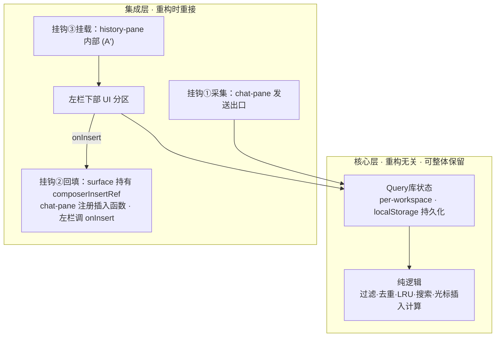
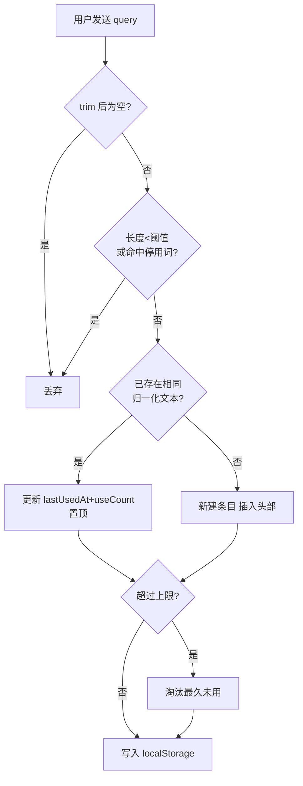
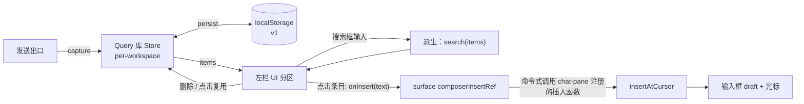
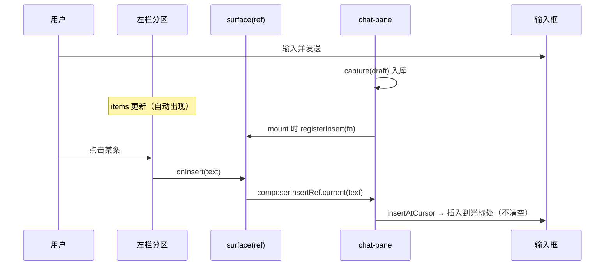

# 自动 Query 库（提示词库）— 设计稿 v3

> 日期：2026-06-14 ｜ 状态：定稿（含深度调研后的修订，待你 review/否决）
> 范围：`frontend_next` 纯前端，第一版零后端、仅桌面端
> 表达约定：**只用伪代码 / 流程图 / 设计图**，不绑定具体类型签名与实现，方便前端重构后沿用。
> 背景：作为「记忆检索空壳 GAP」（见 `memory-recall-gap-2026-06-13.md`）的人机交互侧解法——不靠系统猜 query 价值，把"复用历史表达"的控制权交还用户。
>
> ⚠️ **v3 关键修订（基于 4 路只读调研 + 设计复盘）**：
> 1. **挂载方案 B → A'**：原"在 surface 并列、不改 history-pane"在 CSS 上不成立（见 §6.0 证据），改为"在 history-pane 内部、session 列表之后渲染分区"。
> 2. **插入桥 → surface 命令式回调**：去掉 zustand+nonce 的事件总线，改用更简单的命令式回调（见 §6.2），消除 per-workspace nonce 簿记。
> 3. 回填了调研发现的真实难点（§9）。

---

## 0. 设计分层（应对前端重构）

把功能切成**核心层**（与界面/框架无关）和**集成层**（与当前组件结构相关）。重构时核心层原样保留，只重接集成层的 3 个挂钩。



**原则**：核心层只吃/吐纯数据，不 import 任何组件、布局、CSS。这是设计能在重构里存活的关键。

---

## 1. 功能规格

**做**
- 自动存：每次发送的 query 自动入库，无需手动收藏。
- 源头粗过滤：极短 / 停用词 query 不入库（零判断成本降噪）。
- 去重：相同 query 不重复，命中则更新"最近使用"并置顶。
- 容量上限 + LRU：超限淘汰最久未用。
- 删除管理：可删任意条目（以删代 pin，库即用户认可集合）。
- 模糊搜索：分词、词序无关的关键字匹配（中文局限见 §3.2）。
- 点击插入：插入到输入框**光标处**，不清空，支持连点拼接。
- 长文折叠 + 悬浮展开。
- workspace 级、跨 session 汇总。

**第一版不做**
- 跨设备同步（先 localStorage，后可升 PG）。
- pin / 分组 / 标签 / 编辑条目。
- 拼写容错 fuzzy（先做分词子串）。
- 存 agent 回答（只存 user query）。
- 索引 `resolved_query`（见 §11）。
- 触屏 / 移动端适配（仅桌面端）。
- 两区高度可拖拽（仅固定高度 + 自身滚动，见 §5）。
- streaming（AI 回复中）期间插入（直接忽略，见 §6.2）。

---

## 2. 数据模型

### 单条 query 的字段（语义，非类型定义）

| 字段 | 含义 | 用途 |
| --- | --- | --- |
| id | 唯一标识 | 渲染 key / 删除定位 |
| text | 原 query 原话（仅 trim，不改写） | 展示 + 回填 |
| createdAt | 首次入库时间 | 备查 |
| lastUsedAt | 最近"发送或点击复用"时间 | 排序 + LRU 淘汰依据 |
| useCount | 复用次数 | 次级排序（可选展示） |

存储结构：`workspaceId → { 该 workspace 的 query 列表（按 lastUsedAt 降序，长度 ≤ 上限）}`。

### 存储约定（照搬 `lib/workspace/ui-store.ts` 模式）

| 项 | 约定 |
| --- | --- |
| 持久化 | zustand `persist` + localStorage |
| 创建 | vanilla `createStore` + 模块级单例（同 ui-store） |
| key | `context-os.query-library.v1`（版本号便于迁移） |
| 隔离 | 按 `workspaceId`，与 `WorkspaceUiData` 同构 |
| SSR | `window` 未定义时 storage 返回 undefined（不 rehydrate，用默认初值） |
| 迁移 | **照 ui-store 的"惰性归一化"**（读取时检测旧形状并修正），不依赖 persist `version`/`migrate` |
| hydration | 无需 `skipHydration`：`useStore` 服务端快照走 `getInitialState()`，与 SSR 一致，无 mismatch（仅首帧"空→填充"一闪） |

### 可调参数（已确认）

| 参数 | 取值 | 说明 |
| --- | --- | --- |
| 单 workspace 上限 | 200 | 超出按 lastUsedAt 淘汰最旧 |
| 最小长度 | trim 后 < 4 字符不入库 | 源头降噪（主力过滤手段） |
| 列表折叠行数 | 2 行 | 超出 hover 展开 |
| 停用词（精简版） | 见下 | min-length 已覆盖多数中文短词，故停用词表只补"≥4 字符仍是噪音"的词 |

> **停用词精简（v3 决策⑥）**：原长表里多数中文词（继续/算了/换一个/然后呢/重来…）都 < 4 字，已被 min-length=4 拦截，与停用词表功能重叠。故 v3 把停用词表收缩为"min-length 拦不住、但确属噪音"的少量词，主要是英文长词：
> - 英文：`continue`、`go ahead`、`never mind`、`try again`、`do it again`
> - 中文（≥4 字噪音）：`继续继续`、`好的好的`（按需增补）
> 多数情况下 **min-length=4 单独即可**，停用词表作为可选增强项。

---

## 3. 核心流程与伪代码

### 3.1 采集（发送时）



伪代码（语言无关）：

```text
capture(items, raw, now):
    text ← trim(raw)
    if text 为空: return items
    norm ← normalize(text)            # 小写 + 折叠空白(+全角转半角)
    if len(norm) < MIN_LENGTH or norm ∈ STOPWORDS:
        return items                  # 源头降噪
    if 存在 it ∈ items 使 normalize(it.text) = norm:
        it.lastUsedAt ← now; it.useCount += 1; 将 it 移到头部
    else:
        在头部插入新条目(text, now)
    if len(items) > CAP:
        按 lastUsedAt 升序删除尾部多余项   # LRU
    return items
```

### 3.2 搜索（模糊匹配，第一版无第三方库）

```text
search(items, query):
    tokens ← split(normalize(query)) 去空
    if tokens 为空: return items（已按 lastUsedAt 降序）
    命中 it ⇔ 每个 token 都是 normalize(it.text) 的子串   # 分词 AND，词序无关
    return 命中项（按 lastUsedAt 降序）
```

> ⚠️ **中文局限（v3 决策⑤：接受并标注）**：中文无空格分词，对纯中文 query 整句被当作单个 token，"分词、词序无关"对中文**基本退化为整串子串匹配**——并不比现有 history 搜索更"模糊"。本产品以中文为主，这是已知局限。
> - V1：**接受**此局限（实现成本最低，对"英文/含空格"仍有分词收益）。
> - 增强（§11）：中文双字 n-gram 切分或引入 Fuse.js，可显著提升中文召回，但增复杂度，留后续。

### 3.3 点击插入到光标处

```text
insertAtCursor(draft, snippet, start, end):
    start,end 收敛到 [0, len(draft)]
    nextDraft   ← draft[0:start] + snippet + draft[end:]   # 原样插入，不加任何分隔符
    nextCursor  ← start + len(snippet)
    return (nextDraft, nextCursor)
```

> DOM 副作用（设光标 + 聚焦）在受控 textarea 更新后的下一帧执行（已知坑，全仓无先例），归集成层处理（§6.2）。

---

## 4. 数据流与状态



Query 库 Store 对外动作（职责，非签名）：

| 动作 | 触发 | 效果 |
| --- | --- | --- |
| capture | 发送 query | 过滤→去重→插入→LRU |
| remove | 点删除 | 删除该条 |
| touch | 点击复用 | 更新 lastUsedAt+useCount，置顶 |
| clear | 清空入口（可选） | 清空该 workspace |

> 搜索结果**不入 store**，由 UI 用 `search(items, 关键字)` 实时派生，避免冗余状态。
> 插入**不经 store**——它是一次性命令，走 §6.2 的命令式回调，不污染状态层。

---

## 5. UI 布局与交互

左栏（"history rail"）下部新增分区，位于 session 列表之后：

```text
┌─ 左栏 railPanel（改为 flex 纵列）─┐
│ [＋ 新建会话]   [🔍 搜索]        │  ← 现有 railHeader（flex:0）
│ ───────────────────────────── │
│  session 1                     │
│  session 2 (active)            │  ← historyList（改为 flex:1，撑满剩余 + 自身滚动）
│  session 3                     │
│ ═══════════════════════════════│
│  提示词库            [清空]      │  ← 新增分区（flex:0 + 固定/上限高度 + 自身滚动）
│  [🔍 搜索提示词…………………]        │
│  ┌───────────────────────┐    │
│  │ 帮我把这段……（截断2行）  [×] │ │  ← 条目：主体=插入，× =删除
│  │ 用更正式的语气重写……      [×] │ │      hover 整项 → 浮层看全文
│  └───────────────────────┘    │
│  （空：发送过的提问会自动出现在这里）│
└────────────────────────────────┘
```

**两区高度（v3 决策④：固定高度，不拖拽）**：
- `railPanel` 改为 flex 纵列；`railHeader` flex:0（按内容）。
- `historyList`（session）改为 `flex:1 1 0; min-height:0; overflow:auto`——占满剩余、自身滚动、永远是主角。
- 提示词库分区：`flex:0 0 auto` + `max-height`（约左栏 40% 或 ~280px）+ `min-height:0` + 内部 `overflow:auto`。库内容多时**靠搜索 + 自身滚动**，不挤占 session。
- 不做可上下拖拽（投入高、收益薄；后续真有需求可仿 `rightRailSplitRatio` 补，成本低）。
- 备选灵活度：分区"可折叠"（点标题收起/展开）比拖拽轻得多，列为可选增强，非 V1 必须。

三个热区互不打架：

| 操作 | 触发区 | 行为 |
| --- | --- | --- |
| 插入 | 条目主体 | `onInsert(text)`（命令式回调）+ touch 置顶 |
| 看全文 | hover 整项 → 浮层 | 仅展示，不改输入框 |
| 删除 | 条目内 × | 删除（阻止冒泡，不触发插入） |

**平台**：第一版**仅桌面端**（hover 展开全文）；不做触屏/移动降级。

**红利**：因为"插入到光标处且不清空"，**连点多条会在光标处依次拼接**——无需任何拖拽/拼接 UI，零成本拿回了最初设想的"积木拼装"。（不自动加分隔符；需要换行时由用户自己敲。）

---

## 6. 集成点（位置 + 改动意图，不贴实现）

### 6.0 为什么挂载方案从 B 改成 A'（CSS 证据）

原决策"方案 B = 在 `surface` 并列渲染、不改 history-pane"在布局上不成立：

- `.railPanel{ height:100% }`（`workspace-shell.module.css:851`）——history-pane 根节点撑满父高。
- `.historyList{ flex:0 1 auto }`（`:922`，无 `flex:1`）——session 列表"可收缩、不撑满"。
- `.desktopHistoryRail{ overflow:hidden }`（`:746`），桌面媒体查询是 `display:block`（非 flex，`:1140-1145`）。

后果：即便 surface 把新分区作为 `historyPane` 的兄弟塞进 aside，`railPanel` 仍 `height:100%` 独占全高，新分区被推到 aside 之外、被 `overflow:hidden` **裁掉看不见**。要修，**必然要改 `railPanel` 的 `height:100%` 和 aside 的布局**——这已经是在改 history-pane 共用样式。

既然 B 也躲不开改 history-pane，不如直接走 **A'**：在 history-pane 内部、`historyList` 之后渲染分区，整块用一致的 flex 布局（§5）。改动内聚在一个组件 + 其 CSS，行为最稳。

### 6.1 三个挂钩

| 挂钩 | 位置 | 现状 | 改动意图 |
| --- | --- | --- | --- |
| ① 采集 | `workspace-chat-pane.tsx` `handleSend`（约 L128-131） | `send(draft); 清空 draft` | 发送前用 `draft` 调一次 `capture` |
| ② 回填 | `workspace-surface.tsx`（持 ref）+ `workspace-chat-pane.tsx`（注册插入函数，已有 `handleEditMessage` L104-107 作 setDraft+focus 先例） | 无 | surface 持 `composerInsertRef`；chat-pane mount 时注册插入函数；左栏调 `onInsert` → surface 调 ref（见 §6.2） |
| ③ 挂载 | `workspace-history-pane.tsx` 内部、`historyList` 之后；其 CSS 改 flex（§5） | history-pane 无 `workspaceId`/`onInsert` | **A'**：给 history-pane 加 `workspaceId` + `onInsert` 两个 prop，内部渲染新分区 |

> `historyPane` 是同一 JSX 变量、桌面与移动 drawer 共用（surface `:390`/`:467`）。A' 把分区放进 history-pane 后，移动 drawer 也会带上它——但分区本身仅桌面交互（hover），移动端可用 CSS（`@media`）隐藏，契合"仅桌面"。

### 6.2 兄弟组件通信：surface 命令式回调（取代插入桥）

左栏与 chat-pane 互不为父子，`draft`/`textareaRef` 封装在 chat-pane 内。**v3 用 surface 持有的命令式回调**解耦，而非 zustand 事件总线：

```text
# surface（左栏与 chat-pane 的共同父）
composerInsertRef = ref(null)
registerInsert(fn): composerInsertRef.current = fn      # 传给 chat-pane，mount 时调用
onInsert(text):      composerInsertRef.current?.(text)  # 传给 history-pane → 库分区

# chat-pane（mount 时把自己的插入能力注册上去）
register( insert(text):
    if isStreaming: return                              # V1：流式中直接忽略（§决策③）
    (nextDraft, nextCursor) ← insertAtCursor(draft, text, selStart, selEnd)
    setDraft(nextDraft)
    下一帧: textarea.setSelectionRange(nextCursor); focus()
)

# 左栏点击条目
onClickItem(text):
    touch(item.id)        # Query 库：更新使用、置顶
    onInsert(text)        # 命令式：直接驱动 chat-pane 的 insert
```

> **为什么回调而非插入桥（zustand+nonce）**：插入是**一次性命令**，不是持续共享状态。用状态容器 + nonce 去重来表达事件，在本仓**无先例**（全仓 `.subscribe` 零命中），还会引入"切 workspace 不 remount → lastConsumedNonce 要 per-workspace 簿记"的连带复杂度。命令式回调直接同步调用，**没有 store、没有 nonce、没有消费/簿记**，语义更贴、更易维护。代价是一个命令式 ref + 注册时机（左栏与 chat-pane 同在 surface 下、总是同时挂载，注册先于点击，安全）。
> 备选（状态上提 draft 到 surface）侵入 chat-pane 状态所有权，不推荐。

挂钩数据流：



---

## 7. i18n 文案

落点：`lib/i18n/messages/workspace.ts` 的 `workspaceMessages`；扁平 camelCase key，值为 `{ zh, en }`。
**约束**：`formatUiMessage` 的 key 是类型安全的 `UiMessageKey`，新 key 必须先在此注册才能在组件中使用（否则 `typecheck` 不过）。

| key（建议） | zh-CN | en |
| --- | --- | --- |
| `workspaceQueryLibraryTitle` | 提示词库 | Prompt library |
| `workspaceQueryLibrarySearchPlaceholder` | 搜索提示词… | Search prompts… |
| `workspaceQueryLibraryEmpty` | 发送过的提问会自动出现在这里 | Your sent prompts will appear here |
| `workspaceQueryLibraryNoMatch` | 没有匹配的提示词 | No matching prompts |
| `workspaceQueryLibraryInsert` | 插入到输入框 | Insert into composer |
| `workspaceQueryLibraryDelete` | 删除 | Delete |
| `workspaceQueryLibraryClear` | 清空 | Clear all |

---

## 8. 测试清单

**纯逻辑（重点、无 DOM；抄 `tests/workspace/isSafeHttpUrl.test.ts` 表驱动）**
- 采集：空/短/停用词被过滤；正常入库置顶；去重更新而不新增；超上限淘汰最旧。
- 搜索：分词 AND；词序无关；空 query 返回全部；大小写/空白归一化；**中文整句退化为整串**（如实断言局限）。
- 插入：中间插入；越界收敛；原样插入不加分隔；连点光标累计正确。

**store（抄 `tests/workspace/ui-store.test.ts`：工厂 + 唯一 name 隔离 + removeItem/JSON.parse 断言 persist）**
- per-workspace 隔离；persist 落盘；刷新（重建同名 store）后保留。

**组件（抄 `workspace-history-pane.test.tsx`：搜索框 + 列表 + 回调 + i18n，mock `useUiPreferences` 固定 locale）**
- 点击条目触发 `onInsert(text)` + 置顶；删除 `stopPropagation` 不触发插入；搜索过滤；空状态文案。

**集成（1–2 条 happy-path 烟测即可，其余下放单测，避免 jsdom textarea 选区 flaky）**
- 发送后该 query 出现在分区顶部。
- 单次点击 → chat-pane 在光标处插入、不清空。

---

## 9. 边界与风险（含调研回填）

| 项 | 处理 |
| --- | --- |
| SSR | storage 守卫（同 ui-store）；`useStore` server snapshot=`getInitialState()`，无 hydration mismatch |
| **光标时序（无先例）** | `setSelectionRange`/`selectionStart` 全仓零命中。`setDraft` 异步，设光标须延到下一帧（`useLayoutEffect`/`rAF`），并与 auto-resize effect（`chat-composer.tsx:82-98`，会先把高度归 0）协调。**实现前先写一个最小探针确认行为。** |
| **切 workspace 不 remount** | `[workspace_id]/page.tsx` 无 `key`、该段无 layout → 切换不 remount。回调方案下 chat-pane 随 `workspaceId` prop 重渲、insert 闭包用当前 draft/ref，**无 nonce 簿记问题**（这正是弃用插入桥的收益）。 |
| **hover 浮层被双层 overflow 裁切** | 库列表 `overflow:auto` + aside `overflow:hidden` 双裁。浮层须用 `position:fixed`+`getBoundingClientRect` 或 `createPortal` 到 body，并随滚动/resize 更新位置。这是 UI 最不确定点。 |
| **流式期间插入** | textarea `disabled={isStreaming}`（`:338`），禁用态无法 focus/设光标。**V1：直接忽略**（insert 函数首行 `if isStreaming return`）。 |
| 中文搜索 | 退化为整串子串（§3.2），V1 接受并标注。 |
| 多标签页 | 第一版不跨 tab 同步；后续可听 `storage` 事件 |
| 隐私 | 仅本地 localStorage；提供清空入口；升 PG 时纳入"记忆可见可删" |
| Tauri 桌面 | 无需特殊处理；localStorage 已被 auth/ui-store 在静态导出下验证可用；200 条短文本远低于配额 |
| 配额 | 上限 200 + 单条不长，体量极小 |
| 现有 e2e 回归 | 改了左栏布局 + composer，须跑 `frontend-smoke/journey/skills` Playwright 确认选择器未破 |

---

## 10. 改动清单（实现时范围）

**新增 · 核心层（重构无关）**
- 纯逻辑模块：过滤 / 去重 / LRU / 搜索 / 光标插入计算 + 常量 + 精简停用词。
- Query 库状态：zustand store + per-workspace + persist（照 `ui-store.ts`，含 SSR 守卫 + 惰性归一化）。
- ~~插入桥 store~~（v3 删除，改命令式回调）。

**新增 · 集成层**
- 左栏下部"提示词库"分区组件（搜索框 + 列表 + 删除 + 折叠 + hover 浮层）。
- CSS：`railPanel` 改 flex 纵列、`historyList` 改 `flex:1`、新分区 `max-height`+`overflow`（§5）；hover 浮层 fixed/portal。

**修改 · 集成层（3 处）**
- `chat-pane`：采集挂钩（capture）+ 注册插入函数（insertAtCursor，含 streaming 忽略 + 下一帧设光标）。
- `history-pane`：新增 `workspaceId` + `onInsert` 两个 prop，内部渲染分区；其 module.css 改 flex 布局。
- `surface`：持 `composerInsertRef` + 透传 `registerInsert`（给 chat-pane）与 `onInsert`（给 history-pane）。
- `i18n`：`workspace.ts` 新增 §7 文案。

---

## 11. 可选增强（第一版不做，预留）

1. **中文搜索增强**：双字 n-gram 切分或引入 Fuse.js，显著提升中文召回（替换 §3.2 的分词子串）。
2. **索引 `resolved_query`**：条目附带"消解后文本"仅供搜索（不展示），命中率更高；需后端下发。
3. **跨设备同步**：localStorage → PG 表（user+workspace+text+时间戳），store 改走 react-query；key 版本号已预留。
4. **历史消息一键入库**：在消息动作里加"存入提示词库"，补齐上线前的历史。
5. **分区可折叠 / 可拖拽分割**：折叠轻、拖拽重（仿 `rightRailSplitRatio`），按真实反馈再加。

---

## 12. 验收标准

- 发正常 query → 左栏下部出现；发"嗯""ok""continue"不出现。
- 重复发同一 query 不重复、且置顶。
- 搜索分词关键字可过滤；清空恢复全部。
- 点击条目 → 插入到当前光标处，不清空，焦点回输入框。
- 连点两条在光标处依次拼接。
- 流式（AI 回复中）点击条目无副作用（被忽略）。
- 删除即时消失且持久（刷新仍删除）。
- 刷新后保留；切 workspace 互不串扰。
- 左栏 session 多/少两种态下，提示词库分区都可见且可滚动（布局不被裁）。

---

## 决策结论

### 第一轮（交互/范围，2026-06-14 · 用户拍板）

1. ~~挂载：方案 B~~ → **见第二轮修订为 A'**。
2. 停用词表 + 最小长度 4：采用（停用词表第二轮精简）。
3. 单 workspace 上限 200：采用。
4. 插入**不补换行**：原样插入到光标处。
5. **不支持触屏**：第一版仅桌面端。
6. 分区标题文案：**"提示词库"**。

### 第二轮（深度调研 + 设计复盘后的修订，2026-06-14 · 我按推荐落定，**待你 review/否决**）

1. **挂载 B → A'**：原"不改 history-pane"在 CSS 上不成立（§6.0），改为 history-pane 内部渲染 + flex 布局改造。⚠️ 这条**改动了你第一轮的"B"选择**，请重点确认。
2. **插入桥 → surface 命令式回调**（§6.2）：去 zustand+nonce 事件总线，消除 per-workspace nonce 簿记。
3. **streaming 中点击**：V1 直接**忽略**（禁用态无法设光标）。
4. **两区高度**：提示词库**固定高度 + 自身滚动**，session 占其余；**不拖拽**（折叠列为可选增强）。
5. **中文搜索**：V1 **接受**"近整串"局限并标注；n-gram 留增强。
6. **停用词**：**精简**为 min-length 主导 + 少量英文噪音词。
