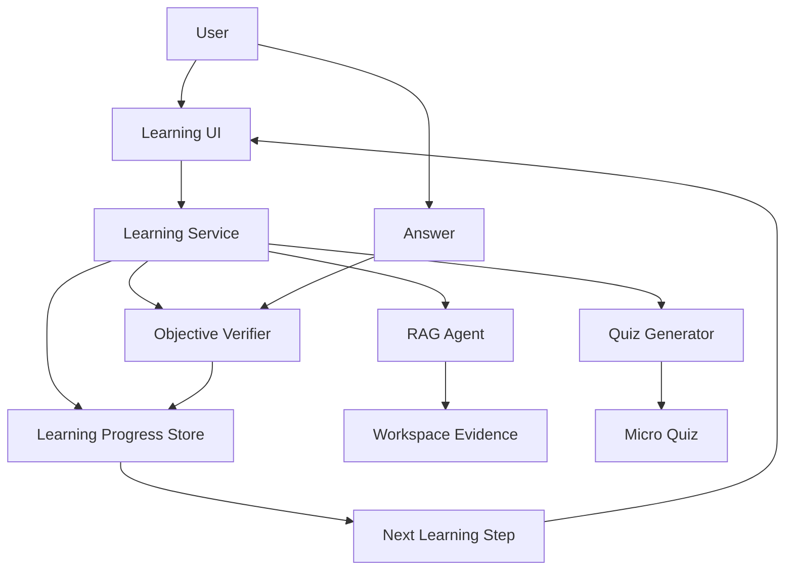

# Learning Loop 教学模式设计 (2026-06-25)

> 状态：设计草案  
> 范围：workspace 内知识学习、微测验、掌握度追踪  
> 非目标：通用 Agent Harness、后台代办系统、跨应用自动化

---

## 1. 背景

用户希望把 `goal/loop` 能力用于一种教学模式：系统帮助用户学会当前 workspace 内的知识，并用考试、测验等方式检验目标是否达成。这个需求与通用长任务 agent 不同，它的核心不是“AI 连续执行更多动作”，而是建立一个可验证的学习闭环。

参考 `loops.pdf` 后，本设计采用三个原则：

1. **Verify 是 loop 的心脏**：没有真实检验，就只是模型自我重复。
2. **State 让 loop 学习**：每轮必须记录已经讲过什么、用户错在哪里、下次该补哪里。
3. **Stop condition 控制成本**：每个知识点都要有通过、重试、放弃或转人工的退出规则。

当前项目曾明确回撤通用 Agent Harness，产品核心是知识库检索和网络检索。因此 Learning Loop 应该是一个面向学习的产品模式，而不是重新引入多 agent 协作、后台任务管理或跨应用动作。

---

## 2. 产品边界

### 2.1 目标

Learning Loop 帮用户完成一件事：在指定 workspace 范围内逐步掌握知识。

第一版支持：

- 从 workspace 文档中抽取学习单元和关键概念。
- 对每个概念进行短讲解。
- 每个概念后进行 1-3 个微测验。
- 用客观题优先的方式自动评分。
- 把错题映射为知识盲点。
- 依据盲点补讲并复测。
- 按用户 + workspace 持久化掌握度、错题、尝试次数和复习状态。

### 2.2 非目标

第一版不做：

- 通用任务执行 agent。
- 自动创建文档、发消息、调用外部系统。
- 复杂主观作文式评分。
- 高风险考试防作弊。
- 完整 LMS 系统，如班级、作业、教师后台。

### 2.3 用户场景

典型路径：

1. 用户在 workspace 中上传材料。
2. 用户进入 Learning Loop，选择“学习当前 workspace”或“学习选中文档”。
3. 系统生成学习地图：主题、概念、建议顺序。
4. 系统讲解第一个概念，引用 workspace 证据。
5. 系统出 1-3 个微测验。
6. 用户作答。
7. 系统自动评分，记录掌握度。
8. 答错时系统补讲盲点，再复测。
9. 所有概念达标后，系统给出学习完成报告和复习建议。

---

## 3. 现有代码约束

当前后端模式是 `chat/rag/search` 三个显式模式：

- `contracts/src/chat.rs` 的 `ChatRequest.agent_type` 是字符串，但后端实际解析到封闭的 `AgentKind`。
- `avrag-rs/crates/app-chat/src/agents/mod.rs` 只定义 `Chat/Rag/Search`。
- `avrag-rs/crates/app-chat/src/agents/unified/mod.rs` 按 `AgentKind` 加载 `modes/chat.yaml`、`modes/rag.yaml`、`modes/search.yaml`，并调用统一 `ReActLoop`。
- `avrag-rs/crates/app-chat/src/chat/mod.rs` 明确要求动态行为留在 agent 层，chat pipeline 保持线性。
- `avrag-rs/docs/superpowers/specs/2026-05-12-agent-harness-upgrades.md` 明确回撤通用 Agent Harness。

这意味着 Learning Loop 不能只加一个前端按钮。若作为一等模式，需要补齐：

- `AgentKind` 枚举和解析。
- 新 mode 配置，例如 `modes/learn.yaml`。
- 新 orchestrator prompt。
- `ChatEvent` 或独立学习事件。
- 学习状态持久化。
- 前端模式入口和学习进度 UI。
- 计费、审计、测试和 E2E 验收。

---

## 4. 推荐方案

推荐采用 **Learning Service + Workspace Learning Mode** 的组合。

### 4.1 为什么不是纯 ReActLoop

普通 ReActLoop 适合“检索/搜索/合成”。Learning Loop 需要强状态：

- 概念树。
- 微测验题目。
- 用户答案。
- 每题判定。
- 盲点标签。
- 掌握度。
- 复习计划。

这些不是一次回答的临时上下文，应该由业务服务持久化并驱动下一步。

### 4.2 为什么仍然复用现有 RAG

讲解、题目生成和补救内容必须锚定 workspace 文档。Learning Service 不应该重新实现检索，而应该调用现有 RAG 能力取得证据：

- 学习地图生成：用文档摘要、chunk、标题和已有 RAG 检索。
- 概念讲解：用 RAG 证据回答。
- 题目生成：题干和正确答案必须能追溯到 chunk。
- 补救讲解：基于错题关联的 chunk 重新讲。

### 4.3 推荐架构



Learning Service 是新的业务编排层；RAG Agent 仍负责证据和解释；Verifier 负责硬判定。

### 4.4 具象产品形态

第一版不新增独立学习页面，不把 workspace 跳转到另一个产品。保持现有 workspace 三栏页面骨架：

- 顶栏新增一个显式按钮：`教学 Loop` / `退出教学 Loop`。
- 普通状态下，中间栏仍是 `WorkspaceChatPane`。
- 进入教学 Loop 后，中间栏切换为 `LearningLoopPane`。
- 左侧历史栏仍保留 workspace 会话入口；第一版不强行改成课程目录。
- 右侧资料栏仍保留文档、选中文档、引用和来源预览，作为教学证据面板。
- URL 可以保持 `/dashboard/{workspace_id}`，用 workspace UI state 或 query 参数 `?mode=learning` 记录当前展示模式。

这个按钮不是 chat/rag/search 的第四个下拉模式。它是 workspace 的产品模式切换：用户明确进入“系统带我学习”的体验，而不是把一条消息发给 chat agent。

推荐前端状态：

```ts
type WorkspaceExperienceMode = "chat" | "learning";
```

推荐入口行为：

1. 用户点击 `教学 Loop`。
2. 前端打开 `LearningLoopPane`。
3. 如果当前 workspace 没有 active learning goal，面板展示启动卡片：
   - 学习整个 workspace。
   - 学习已选文档。
   - 继续上次学习。
4. 用户确认范围后，前端调用学习 API 创建或恢复 goal。
5. 后端返回当前 `LearningAction`，前端渲染讲解、题目、反馈或完成报告。

### 4.5 后端落地形态

后端不建议把 `learn` 直接加入 `AgentKind` 并走普通 `/chat` pipeline。原因是教学 loop 的主状态不是聊天上下文，而是学习目标、学习步骤、题目、作答、掌握度和审计日志。

第一版新增独立业务能力：

```text
LearningLoopService
  -> LearningStore
  -> WorkspaceEvidenceProvider
  -> TutorGenerator
  -> QuizGenerator
  -> ObjectiveVerifier
  -> MasteryUpdater
```

职责边界：

- `LearningLoopService`：决定下一步是讲解、出题、补救、复习还是完成。
- `LearningStore`：保存 goal、concept、question、attempt、mastery、run、event。
- `WorkspaceEvidenceProvider`：复用现有 RAG/runtime 获取 workspace 证据。
- `TutorGenerator`：基于证据生成短讲解。
- `QuizGenerator`：基于证据生成可判定题目。
- `ObjectiveVerifier`：硬判定用户答案，不依赖开放式 LLM 评分。
- `MasteryUpdater`：把评分结果写入掌握度和复习状态。

可以把它理解为“Claude Code 风格的 agent loop”，但它只在学习域内跑：

```text
load run state
-> inspect goal/concept/mastery/evidence
-> decide next phase
-> produce one structured action
-> persist event + state diff
-> stop at user boundary
```

关键约束：每次 API 调用最多推进到一个需要用户响应的边界。例如讲解后可以返回题目，但不能在用户没作答前继续猜测下一轮。这样成本可控，状态可回放，也更适合前端交互。

### 4.6 Loop 日志与契约

Learning Loop 必须有 append-only 运行日志。它不是普通 chat transcript，而是后端判断、生成、评分、状态变化的审计账本。

最小日志模型：

```text
LearningRun
  run_id
  goal_id
  user_id
  notebook_id
  status
  current_phase
  current_concept_id
  iteration
  started_at
  ended_at

LearningRunEvent
  event_id
  run_id
  seq
  phase
  event_type
  input_contract
  output_contract
  evidence_chunk_ids
  state_patch
  usage
  error
  created_at
```

`LearningRunEvent` 的作用：

- 前端刷新后可以恢复当前教学状态。
- 后端可以排查“为什么给了这道题”。
- 审计可以确认题目和讲解是否有 workspace 证据。
- 失败重试时可以用 `seq` 和幂等键避免重复记分。
- 未来可以把一次学习过程回放成报告。

每个 loop step 都必须遵守 JSON contract。第一版建议从两个契约开始。

输入契约：

```json
{
  "contract_version": "learning.loop.input.v1",
  "command": "next",
  "goal_id": "goal_123",
  "run_id": "run_123",
  "notebook_id": "notebook_123",
  "doc_scope": ["source_1"],
  "user_answer": null
}
```

输出契约：

```json
{
  "contract_version": "learning.loop.action.v1",
  "action": "quiz",
  "run_id": "run_123",
  "concept_id": "concept_1",
  "title": "概念标题",
  "body": "先用一句话回顾要点...",
  "question": {
    "question_id": "question_1",
    "type": "single_choice",
    "prompt": "下面哪一项最符合文档定义？",
    "options": [
      { "id": "A", "text": "..." },
      { "id": "B", "text": "..." }
    ]
  },
  "evidence": [
    { "chunk_id": "chunk_1", "label": "source.pdf p.3" }
  ],
  "ui_state": {
    "awaiting_user": true,
    "progress_label": "第 1/6 个概念"
  }
}
```

契约不是为了形式化而形式化。它给前端一个稳定渲染对象，也给后端一个可测试、可回放的 loop 边界。

### 4.7 从 Claude Code Harness 借鉴的 Loop 机制

`learn-claude-code` 的关键启发不是“把 Claude Code 复制成教育产品”，而是把 agent 产品拆成两层：

```text
Agent = 模型能力
Harness = 工具 + 知识 + 观察 + 行动接口 + 权限边界
```

教学 Loop 应该把工程重点放在教育 harness 上，而不是试图用 if-else 写出“智能老师”。模型负责解释、改写和生成候选题；harness 负责给它清晰的学习环境、状态、证据、评分器和停止条件。

可吸收的机制：

- **单一主循环**：不要为讲解、出题、补救分别做互相嵌套的流程引擎。保持一个 `LearningLoopService.next()`，由状态决定下一步动作。
- **工具挂载，不写死进循环**：RAG 检索、题目生成、客观评分、掌握度更新都作为 loop 可调用能力，主循环只负责编排和记录。
- **先计划再行动**：第一次进入时先生成 `LearningPlan`，每轮只执行当前 concept 的下一步，避免边讲边临时发散。
- **按需加载知识**：不要把整个 workspace 全塞进 prompt。先生成概念地图，再按当前 concept 拉取必要 chunk。
- **上下文压缩**：长期学习时不能把全部历史塞给模型。保留结构化 mastery、blind spots、recent attempts，把旧讲解压缩成摘要。
- **记忆筛选**：不是所有对话都写长期记忆。只沉淀掌握度、错因、复习时间、用户偏好和稳定概念关系。
- **错误恢复**：生成题目失败、证据不足、答案 key 不唯一时，不直接给用户一个坏题；应记录 event，降级为重新检索、换题型或提示回看原文。
- **权限与边界**：教学 Loop 只能读 workspace 证据和写学习状态；第一版不允许自动改文档、发消息、调用外部系统。
- **生命周期事件**：每次 `next`、`submit_answer`、`mastery_updated` 都应写 append-only event，形成可恢复的过程数据。
- **固定通信协议**：前后端、生成器、评分器之间都用 JSON contract，不让 UI 或评分器解析自然语言猜状态。

不建议第一版照搬的机制：

- **子 agent 团队**：教学闭环第一版不需要多个 agent 互相发消息，会增加调试成本。
- **worktree 隔离**：这是编程任务隔离，对 workspace 学习无直接价值。
- **后台长任务自跑**：学习是用户参与式 loop，不应该在用户没作答时持续往后推进。
- **MCP 工具池扩展**：第一版证据来源限定在 workspace，外部工具扩展应等学习闭环稳定后再做。
- **心跳/cron 常驻助手**：可以用于后续 spaced review，但不应作为第一版教学主循环。

映射到本设计：

| Claude Code Harness 机制 | Learning Loop 对应物 |
|--------------------------|----------------------|
| messages + tool loop | `LearningLoopService.next()` |
| tool handlers | RAG、QuizGenerator、ObjectiveVerifier、MasteryUpdater |
| Todo/task graph | `LearningPlan` + concept 顺序 |
| append-only task events | `LearningRunEvent` |
| context compact | 学习历史摘要 + mastery/blind spot 结构化状态 |
| memory selection | 只保存掌握度、错因、复习计划 |
| permissions | 只读 workspace、只写 learning state |
| team protocol | learning JSON contract |

因此，Teaching Loop 的最小工程原则是：**一个循环，多个教育工具，强状态，硬验证，事件可回放。**

---

## 5. Loop 模型

Learning Loop 使用以下循环：

```text
Discover -> Plan -> Teach -> Verify -> Remediate -> Iterate
```

### 5.1 Discover

从 workspace 文档中发现学习范围：

- 文档、章节、标题。
- 高频概念。
- 用户选择的 doc_scope。
- 现有会话中用户提出过的问题。

输出：候选 `LearningConcept[]`。

### 5.2 Plan

把候选概念组织成学习顺序：

- 先基础后应用。
- 先定义后比较。
- 把过大的主题拆成 3-7 个学习单元。
- 每个单元必须有可出题的证据。

输出：`LearningPlan`。

### 5.3 Teach

对当前概念进行短讲解：

- 讲解不超过一个小节。
- 必须引用 workspace chunk。
- 不一次性倾倒整份文档。
- 结尾进入微测验，而不是继续长篇讲授。

### 5.4 Verify

第一版采用客观题优先：

- 单选题。
- 多选题。
- 填空题。
- 匹配题。
- 关键词短答。

每题必须有：

- `question_id`
- `concept_id`
- `evidence_chunk_ids`
- `answer_key`
- `blind_spot_tags`
- `difficulty`

### 5.5 Remediate

答错后不直接给下一题，而是：

1. 标出错因。
2. 回到对应证据。
3. 用更短、更具体的方式补讲。
4. 生成同概念变体题复测。

### 5.6 Iterate

下一步由状态决定：

- 当前概念通过：进入下一概念。
- 当前概念未通过：补讲 + 复测。
- 连续失败：降低难度或建议回看原文。
- 达到重试上限：标记为待复习，不阻塞整条学习路径。

---

## 6. 数据模型

第一版建议新增持久化模型。具体表名可在实现计划阶段再定，设计上需要这些实体。

### 6.1 LearningGoal

表示用户在某个 workspace 的学习目标。

| 字段 | 说明 |
|------|------|
| `goal_id` | 学习目标 ID |
| `org_id` | 租户边界 |
| `user_id` | 学习者 |
| `notebook_id` | workspace |
| `doc_scope` | 选中文档范围 |
| `title` | 目标标题 |
| `status` | `active/completed/paused/abandoned` |
| `created_at/updated_at` | 时间戳 |

### 6.2 LearningConcept

表示一个可教学、可检验的知识点。

| 字段 | 说明 |
|------|------|
| `concept_id` | 概念 ID |
| `goal_id` | 所属目标 |
| `title` | 概念名 |
| `summary` | 简短说明 |
| `source_chunk_ids` | 证据来源 |
| `prerequisite_ids` | 前置概念 |
| `order_index` | 学习顺序 |

### 6.3 LearningMastery

按用户 + workspace + concept 保存掌握度。

| 字段 | 说明 |
|------|------|
| `mastery_id` | 掌握记录 ID |
| `user_id` | 用户 |
| `notebook_id` | workspace |
| `concept_id` | 知识点 |
| `score` | 0-100 |
| `status` | `unseen/learning/mastered/review_due/stuck` |
| `attempt_count` | 尝试次数 |
| `last_seen_at` | 最近学习时间 |
| `next_review_at` | 下次复习时间 |

### 6.4 LearningAttempt

记录每次微测验作答。

| 字段 | 说明 |
|------|------|
| `attempt_id` | 作答 ID |
| `concept_id` | 概念 |
| `question_id` | 题目 |
| `user_answer` | 用户答案 |
| `is_correct` | 是否正确 |
| `blind_spot_tags` | 盲点 |
| `feedback` | 反馈 |
| `created_at` | 时间 |

### 6.5 LearningRun

记录一次可恢复、可审计的教学 loop 运行。一个 `LearningGoal` 可以有多次 run，例如用户今天学一半，明天继续。

| 字段 | 说明 |
|------|------|
| `run_id` | 运行 ID |
| `goal_id` | 学习目标 |
| `org_id` | 租户边界 |
| `user_id` | 学习者 |
| `notebook_id` | workspace |
| `status` | `active/waiting_for_user/completed/paused/failed/cancelled` |
| `current_phase` | `discover/plan/teach/quiz/score/remediate/review/complete` |
| `current_concept_id` | 当前概念 |
| `iteration` | 当前 loop 轮次 |
| `idempotency_key` | 前端重试去重 |
| `started_at/ended_at` | 时间戳 |

### 6.6 LearningRunEvent

append-only 事件日志。业务表保存当前状态，event 表保存“怎么走到这里”。

| 字段 | 说明 |
|------|------|
| `event_id` | 事件 ID |
| `run_id` | 所属 run |
| `seq` | run 内递增序号 |
| `phase` | 当前阶段 |
| `event_type` | `state_loaded/action_emitted/answer_submitted/attempt_scored/mastery_updated/error` |
| `input_contract` | 本步输入 JSON |
| `output_contract` | 本步输出 JSON |
| `evidence_chunk_ids` | 本步使用的证据 |
| `state_patch` | 本步对 goal/concept/mastery 的状态更新 |
| `usage` | 模型、token、耗时、缓存命中 |
| `error` | 失败信息 |
| `created_at` | 时间 |

写入规则：

- 每个 API 命令至少写一条 event。
- 每次生成题目、评分、更新掌握度都写 event。
- 同一个 `run_id + seq` 不能重复。
- 有 `idempotency_key` 的提交重复到达时，返回已有结果，不重复记分。
- `output_contract` 是前端恢复 UI 的依据，不能只存在模型文本里。

---

## 7. API 与事件

第一版建议不要把全部学习状态塞进普通 `/api/v1/chat`。可以保留 chat/RAG 作为内部能力，但对前端暴露学习专用 API。

### 7.1 REST API 草案

| 方法 | 路径 | 用途 |
|------|------|------|
| `POST` | `/api/v1/notebooks/{id}/learning/goals` | 创建学习目标 |
| `GET` | `/api/v1/notebooks/{id}/learning/goals/{goal_id}` | 获取学习目标与进度 |
| `POST` | `/api/v1/notebooks/{id}/learning/goals/{goal_id}/runs` | 创建或恢复一次教学 run |
| `POST` | `/api/v1/notebooks/{id}/learning/runs/{run_id}/next` | 推进到下一步教学动作 |
| `POST` | `/api/v1/notebooks/{id}/learning/runs/{run_id}/answers` | 提交微测验答案并评分 |
| `GET` | `/api/v1/notebooks/{id}/learning/runs/{run_id}/events` | 获取 run 日志，用于恢复和排查 |
| `GET` | `/api/v1/notebooks/{id}/learning/mastery` | 查看掌握度地图 |

### 7.2 学习动作

`next` 返回一个结构化动作。前端不解析自由文本来猜 UI，而是按 `action` 渲染。

```json
{
  "action": "teach",
  "run_id": "run-1",
  "concept_id": "concept-1",
  "title": "概念标题",
  "content": "短讲解...",
  "evidence": [{"chunk_id": "chunk-1", "label": "source.pdf p.3"}],
  "next_action": "quiz"
}
```

动作类型：

- `teach`
- `quiz`
- `feedback`
- `remediate`
- `review`
- `complete`

### 7.3 是否复用 SSE

第一版可以不流式化微测验本身。讲解内容较长时可复用 chat SSE，但学习状态更新必须是结构化事件：

- `learning_plan_created`
- `learning_concept_started`
- `learning_quiz_ready`
- `learning_attempt_scored`
- `learning_mastery_updated`
- `learning_goal_completed`

如果后续要把 Learning Loop 做成流式体验，再扩展 `contracts/src/chat.rs` 或新增 `learning_event.rs`，避免污染现有 chat 协议。

### 7.4 命令式 API 边界

前端和后端之间建议使用命令式边界，而不是把用户意图拼进 prompt。

启动学习：

```json
{
  "doc_scope": ["source_1", "source_2"],
  "goal_title": "学习当前 workspace",
  "target_level": "foundational"
}
```

获取下一步：

```json
{
  "command": "next",
  "idempotency_key": "client-generated-key"
}
```

提交答案：

```json
{
  "command": "submit_answer",
  "question_id": "question_1",
  "answer": { "selected_option_ids": ["A"] },
  "idempotency_key": "client-generated-key"
}
```

返回值始终是 `LearningAction`，常见类型：

| action | 前端渲染 |
|--------|----------|
| `setup` | 选择学习范围、继续上次学习 |
| `plan` | 学习地图和建议顺序 |
| `teach` | 短讲解 + 证据 |
| `quiz` | 微测验 |
| `feedback` | 判定、错因、盲点 |
| `remediate` | 补讲 + 变体题 |
| `review` | 复习提醒 |
| `complete` | 完成报告 |

第一版不需要后台长时间自跑。服务端每次最多运行到下一个 `awaiting_user=true` 的动作，然后停止。

---

## 8. 评分与掌握度规则

第一版采用硬规则。

### 8.1 题目通过

| 题型 | 判定方式 |
|------|----------|
| 单选 | 精确匹配选项 ID |
| 多选 | 选项集合完全匹配 |
| 填空 | 规范化后匹配答案集合 |
| 匹配 | 映射完全匹配 |
| 关键词短答 | 命中必需关键词集合 |

短答题不使用开放式 LLM 评分作为第一版主路径。

### 8.2 概念通过

建议默认规则：

- 最近一轮微测验正确率 `>= 80%`。
- 至少答对 2 道题，避免单题误判。
- 没有未修复的关键盲点。

### 8.3 停止条件

每个概念最多：

- 3 轮补救。
- 6 道微测验。
- 超过后标记为 `stuck` 或 `review_due`。

整个目标最多：

- 每次学习会话默认 20-30 分钟。
- 每轮生成成本受用户 tier 限制。
- 连续低收益时提示休息或切换复习。

---

## 9. 前端体验

第一版建议在现有 workspace 页面内新增 Learning 主体面板，而不是新建独立页面，也不是塞进普通聊天消息流。

### 9.1 布局

- 顶栏：新增 `教学 Loop` 按钮。进入后按钮变为 `退出教学 Loop`。
- 左侧：保留历史栏。后续可在 Learning 模式下切换为学习 run 列表，但第一版不做。
- 中间：`WorkspaceChatPane` 与 `LearningLoopPane` 二选一。
- 右侧：保留资料栏，展示当前讲解/题目的证据来源、选中文档和引用。

`LearningLoopPane` 的内部区域：

- 顶部：当前目标、进度、暂停/继续。
- 主体：当前 `LearningAction`，例如讲解、题目、反馈或补救。
- 底部：主要操作按钮，例如 `提交答案`、`下一步`、`重学这个概念`、`跳过`。
- 侧边摘要：当前概念掌握度、错因标签、已用轮次。

### 9.2 交互

用户可以：

- 显式进入或退出教学 Loop。
- 开始学习当前 workspace。
- 选择文档范围。
- 继续上次未完成的 learning run。
- 回答微测验。
- 查看为什么错。
- 重学当前概念。
- 跳过当前概念。
- 查看学习报告。

进入教学 Loop 不会清空 chat 会话；退出后回到原 workspace 对话。学习 run 和 chat session 是两个不同状态，不互相覆盖。

### 9.3 反馈语气

系统应像 tutor，而不是判卷机器：

- 明确指出错因。
- 不羞辱用户。
- 不直接长篇灌输。
- 补讲后马上给低难度变体题。

### 9.4 最小前端改动清单

第一版推荐触点：

- `WorkspaceTopBar`：增加 `教学 Loop` 按钮。
- `WorkspaceSurface`：增加 workspace experience mode，根据模式渲染 `WorkspaceChatPane` 或 `LearningLoopPane`。
- `workspace ui-store`：持久化 `experienceMode`，不要复用 `chatMode`。
- `LearningLoopPane`：新增主体组件，负责调用 learning API 和渲染 `LearningAction`。
- `lib/learning/client.ts`：封装 learning API。
- `lib/learning/model.ts`：定义 `LearningGoal`、`LearningRun`、`LearningAction`、`LearningQuestion` 等前端类型。

---

## 10. 安全、隐私与成本

### 10.1 证据边界

教学内容和题目默认必须来自 workspace 证据。若使用通识知识补充，必须显式标注“文档中没有直接证据”。

### 10.2 隐私

学习进度属于用户个人数据：

- 按 `user_id + notebook_id` 隔离。
- workspace 共享成员不自动互看掌握度。
- 管理员统计只能看聚合数据，除非用户显式分享。

### 10.3 成本控制

Learning Loop 比普通问答更容易放大成本，因为每个概念都可能讲解、出题、评分、补救。必须有：

- 每会话轮数限制。
- 每目标概念数限制。
- 题目生成缓存。
- 证据检索缓存。
- 失败后硬停止。

---

## 11. 评估指标

产品指标：

- 学习目标完成率。
- 每个概念首次通过率。
- 补救后通过率。
- 用户主动退出率。
- `stuck` 概念占比。
- 复习回访率。

质量指标：

- 题目是否可由文档证据支持。
- 答案 key 是否唯一。
- 错题盲点标签是否准确。
- 讲解引用是否真实。
- 题目难度是否递进。

成本指标：

- 每完成一个概念的 token 成本。
- 每完成一个目标的平均模型调用数。
- 题目缓存命中率。
- RAG 检索缓存命中率。

---

## 12. 分阶段落地

### Phase 0：契约验证

- 定义 `LearningAction`、`LearningRunEvent`、answer payload 的 JSON contract。
- 用一份 workspace 文档手工跑通 `teach -> quiz -> submit_answer -> feedback`。
- 人工检查题目是否能由证据支持、答案是否可硬判定。
- 不做真实 UI，只用测试或临时脚本验证 contract。

验收：

- 每一步都有 input/output contract。
- 每一步都能写入 append-only event。
- 刷新后可从最后一个 output contract 恢复当前动作。

### Phase 1：Workspace 入口与 run 记录

- workspace 顶栏新增 `教学 Loop` 按钮。
- `WorkspaceSurface` 在 chat 和 learning 主体之间切换。
- 新增 `LearningLoopPane`，先支持创建/恢复 goal 和 run。
- 后端新增 learning API、`LearningRun`、`LearningRunEvent` 持久化。
- `next` 可以返回 mock 或固定 contract，用于打通前后端边界。

验收：

- 用户能从 workspace 显式进入/退出教学 Loop。
- 后端能创建 run 并记录事件。
- 前端刷新后仍能恢复当前 learning action。

### Phase 2：最小可用教学闭环

- 从 workspace 文档生成 3-7 个概念的学习地图。
- 对当前概念生成短讲解和 1-3 道客观题。
- 支持提交答案、硬判定、写入 attempt 和 mastery。
- 错题返回 `feedback`，正确进入下一概念。

验收：

- 一个 workspace 可以完成至少 3 个概念的学习。
- 每道题都有 `evidence_chunk_ids` 和 `answer_key`。
- 概念掌握度能随答题结果变化。

### Phase 3：自适应补救

- 错题映射盲点。
- 自动生成补救讲解。
- 按盲点复测。
- 引入 spaced review。

### Phase 4：高级评估

- 开放简答 rubric 评分。
- 综合考试。
- 学习报告。
- 个人学习偏好。

---

## 13. 未决问题

1. 新模式命名使用 `learn`、`study` 还是 `learning`。
2. 顶栏按钮文案使用 `教学 Loop`、`学习模式` 还是 `Tutor`。
3. `experienceMode` 使用 local storage，还是同步到 URL query。
4. 学习地图是否允许用户编辑。
5. 题目生成是实时生成还是先批量生成。
6. 是否需要把学习进度暴露给 MCP 外部 agent。

---

## 14. 推荐结论

第一版应构建“可验证的学习闭环”，而不是“会讲课的 chat prompt”。

最小可行形态是：

- Learning Service 负责状态。
- RAG 负责证据。
- Objective Verifier 负责硬判定。
- Progress Store 负责长期记忆。
- LearningRunEvent 负责可回放日志。
- 前端通过 workspace 顶栏按钮进入 LearningLoopPane，以学习地图 + 微测验呈现。

这样既符合 `loops.pdf` 的 loop 原则，也尊重当前项目不做通用 Agent Harness 的产品边界。
