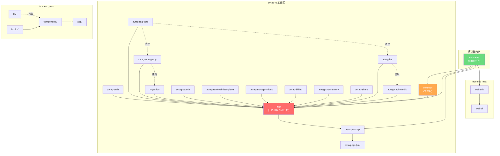

# 代码库健康仪表盘与优化路线图（Brooks-Lint）

> 日期：2026-06-11
> 范围：`/home/chuan/context-osv6`（`avrag-rs`、`frontend_next`、`frontend_rust`、`contracts`）
> 方法：Brooks-Lint 三维度扫描（架构 / 技术债务 / 测试质量）
> 状态：审查结论已落盘，待按"优化路线图"分阶段执行

---

## 一、综合评分

| 维度 | 得分 | 最严重发现 |
|------|------|-----------|
| 架构（Architecture） | 65/100 | `app` crate 是上帝模块（扇出 17，已核验） |
| 技术债务（Tech Debt） | 60/100 | 135 行神函数混合 7+ 抽象层级 |
| 测试质量（Test Quality） | 46/100 | 所有前端 API 客户端零错误路径测试 |
| **综合** | **55/100** | 后端结构性债务 + 前端测试质量双瓶颈 |

**一句话结论**：后端的核心问题是"上帝模块 + 基础设施反向侵入领域核心"，前端的核心问题是"测试只覆盖 happy path + 大规模 mock 重复"。架构维度影响面最大，测试维度数量最多。

> 核验说明（2026-06-11）：`app` 的 17 个内部依赖、`rag-core` 直接依赖 `storage-pg`/`llm`/`code-interpreter`（实测还含 `cache-redis`/`auth`）、`web-sdk` 不在 workspace members —— 均已对照 `Cargo.toml` 核实。其余按行号引用的发现未逐行复核。

---

## 二、模块依赖图

**四条依赖违规（方向倒置）**：

| # | 违规边 | 问题 |
|---|--------|------|
| V1 | `storage_pg → ingestion` | 存储层反向依赖业务解析层 |
| V2 | `rag_core → storage_pg` | 领域核心依赖具体存储适配器 |
| V3 | `rag_core → llm` | 领域核心依赖具体 LLM 实现 |
| V4 | `llm → cache_redis` | 通用 LLM 层耦合具体缓存实现 |
| V5 | `lib → components`（前端） | 低层 `lib` 反向导入高层 React 组件 |

---

## 三、核心发现（20 项，按严重程度）

### 🔴 严重（4 项）

**1. [R5] 依赖紊乱 —— `app` crate 是上帝模块，扇出 17（已核验）**
- 症状：`avrag-rs/crates/app/Cargo.toml` 声明 17 个内部 crate 依赖。任何基础设施变更都强制重编 `app` 及其全部下游。
- 后果：无法隔离测试单一关注点；新人无法从接口理解模块用途。
- 建议：拆为 `app-chat` / `app-documents` / `app-admin` / `app-billing` 编排器，`app` 退化为薄门面。

**2. [R5] 依赖紊乱 —— `rag-core` 直接依赖具体基础设施**
- 症状：`avrag-rs/crates/rag-core/Cargo.toml` 直接依赖 `avrag-storage-pg`、`avrag-llm`、`avrag-code-interpreter`（实测还含 `avrag-cache-redis`、`avrag-auth`）。
- 后果：无法替换存储/LLM 后端；单测需要真实 PostgreSQL 与真实 LLM。
- 建议：在 `rag-core` 内定义 trait 端口（ports），适配器在 `app` 启动时注入。

**3. [R1] 认知超载 —— `get_workspace_analysis_handler` 是 135 行神函数**
- 症状：`transport-http/src/handlers.rs:569-703`，单函数编排 notebook 检查、源列表、会话列表、偏好、笔记、共享计数、API key 计数、告警构建，7 个顺序 `await`。
- 后果：新增任一指标需在 2-3 处改动并理解全部既有逻辑；测试需 mock 整个 AppState。
- 建议：提取 `WorkspaceAnalysisCollector`，每维度一个方法（`collect_sources` / `collect_threads` / `collect_notes` / `collect_access`）。

**4. [T5] 覆盖率幻觉 —— 前端 API 客户端零错误路径测试**
- 症状：`frontend_next/tests/workspace/client.test.ts` 仅 mock 200，无 401/403/404/500/超时/畸形 JSON。
- 后果：服务端报错时前端静默失败，用户见空白页而非错误提示。
- 建议：补 `throws on 401` / `throws on 500` / `throws on network timeout` 等用例。

### 🟡 警告（11 项）

**5. [R1] `WorkspaceSurface` 是 600 行组件，15+ useState**
`workspace-surface.tsx:158-760` 一个组件揽下加载、会话 CRUD、账单轮询、桌面栏调整、移动端检测、键盘处理、重命名、用量提示。建议拆出 `useWorkspaceSessions` / `useUsagePolling` / `useDesktopRailResize` / `useMobileDetection`。

**6. [R2] `notebook_id`→`workspace_id` 重命名仪式重复 20 次**
`frontend_next/lib/workspace/client.ts:188-592`，每个 API 函数都解构再重命名。建议 `mapWorkspaceResponse<T>()` 工具函数，或在契约层直接统一为 `workspace_id`。

**7. [R2] `ChatSession` 在 `contracts` 与 `common` 双重定义**
`contracts/src/notebooks.rs:48` 与 `common/src/chat.rs:6` 相同定义，`CitationLookupRequest` 同样重复。建议 `contracts` 为唯一真相源，`common` 用 `pub use` 重导出。

**8. [R3] 文本分割管道在 `chunker.rs` 复制粘贴 3 次**
`ingestion/src/chunker.rs:86-113 / 304-331 / 491-521` 重复，已有 `split_text_segments` 却未被前两处复用。建议 `chunk_page`、`build_chunk_plan` 改调用该 helper。

**9. [R4] `ExecutePlanRequest` 保留 3 个死兼容垫片**
`common/src/rag_execute.rs:383-448`，`to_chat_request_compat()` / `to_rag_plan_compat()` / `doc_ids()` 共存，注释称已被 `doc_ids()` 取代却未删旧的。建议迁移调用方后删除两个 compat 方法。

**10. [R5] 前端 `lib/` 向上导入 `components/`**
`frontend_next/lib/billing/usage-limit-adapter.ts:3` 从 `components/billing/UsageMeter` 导入类型。建议把 `UsageMeterProps` 提取到 `lib/billing/types.ts`。

**11. [R6] `Document.status` 是 `String` 而非枚举**
`contracts/src/documents.rs:7,12,24,72`，后端有 `DocumentStatus` 枚举但契约层未用。建议在 contracts 定义枚举并 `#[serde(rename_all = "snake_case")]`。

**12. [T2] 测试断言 CSS 类名**
`workspace-chat-pane.test.tsx:145-148` 用 className 字符串匹配 `messageUser` 等。建议改 `data-testid` 或语义角色。

**13. [T3] 相同 mock 设置在 8+ 文件复制粘贴**
`vi.hoisted()` 模式重复 mock `next/navigation`、`auth/context` 等，每文件 10-30 个 mock 变量。建议提取 `tests/helpers/mock-providers.ts`。

**14. [T4] `workspace-surface.test.tsx` mock 11 模块 / 25+ 变量**
230 行 mock 先于任何测试逻辑，`WorkspaceChatPane` mock 单独 56 行。建议用 RTL 配真实子组件做集成测试。

**15. [R1] `mock_llm_handler` 是 180 行条件分发**
`app/tests/product_e2e/mock_servers.rs:790-973`，按系统/用户提示、工具名、全局静态标志嵌套匹配，成了与真实 LLM 契约同步维护的"平行实现"。建议路由解析改声明式配置，或引入 VCR 模式。

### 🟢 建议（5 项）

| # | 发现 | 建议 |
|---|------|------|
| 16 | [R5] `web-sdk` 从 avrag-rs workspace 孤立（已核验：members 仅含 `web-ui`） | 加入 members 或确认被 `frontend_rust/crates/web-sdk` 取代后删除 |
| 17 | [R5] `frontend_next` 缺 `@/` 路径别名，48+ 处 `../../../` | `tsconfig.json` 加 `"paths": { "@/*": ["./*"] }`，渐进迁移 |
| 18 | [R6] `Workspace.name` vs `Workspace.title` 命名漂移 | 废弃其一，文档化规范显示名 |
| 19 | [T1] `client.test.ts` 单 `it()` 链 14 个断言 | 拆为每方法一个 `it()` |
| 20 | [T2] 测试读取 zustand store 内部状态 | 断言渲染输出而非 store 结构 |

---

## 四、优化路线图（分阶段、可验证）

按"低风险高收益先行、域解耦居中、上帝模块拆分压轴"排序。每阶段给出**验收门槛**，达标后再进下一阶段。

### 阶段 0 —— 即时止血（低风险，可并行，~1 周）

目标：堵住静默失败与重复劳动，先拿回测试维度分数。

| 行动 | 对应发现 | 验收 |
|------|----------|------|
| 前端 API 客户端补错误路径测试（401/403/404/500/超时/畸形 JSON） | #4 | 每个 client 方法至少 1 条错误路径用例，CI 绿 |
| 提取 `tests/helpers/mock-providers.ts` 共享 mock 工厂 | #13 | 8+ 文件改用工厂，重复 mock 行数下降 >60% |
| 删除 `ExecutePlanRequest` 三个死兼容方法（迁移调用方到 `doc_ids()`） | #9 | `rg to_chat_request_compat\|to_rag_plan_compat` 无业务调用 |
| `chunker.rs` 三处复用 `split_text_segments` | #8 | 分割逻辑单点化，现有 chunk 测试不回归 |
| `web-sdk` workspace 归位或删除 | #16 | `cargo metadata` 无孤立 crate |
| 前端 `lib→components` 反向依赖：抽 `lib/billing/types.ts` | #10 | `lib/` 不再 import `components/` |

### 阶段 1 —— 契约统一与领域解耦（中风险，~1-2 周）

目标：消除序列化漂移风险，为后端依赖倒置铺路。

| 行动 | 对应发现 | 验收 |
|------|----------|------|
| `contracts` 设为类型唯一真相源，`common` 改 `pub use` 重导出（`ChatSession`、`CitationLookupRequest`） | #7 | 类型定义仅存一份，跨 crate 编译通过 |
| `Document.status` 在 contracts 枚举化 | #11 | 前后端按枚举穷尽匹配，无裸字符串比较 |
| 在 `rag-core` 定义 trait 端口（Storage/Llm/CodeInterpreter ports），适配器移到 `app` 注入 | #2 / V2、V3 | `rag-core/Cargo.toml` 移除对 `storage-pg`/`llm`/`code-interpreter` 的直接依赖 |
| 修复 `storage_pg → ingestion` 反向依赖 | V1 | 存储层不再依赖 ingestion |

> 说明：trait 端口是本路线图的"地基"。按 AGENTS.md「不要为单一实现引入 seam」，端口应仅覆盖**当前确有替换/测试隔离诉求**的边界（测试用 mock 适配器即第二个实现，使 seam 成立），不做投机抽象。

### 阶段 2 —— 拆分上帝模块（高风险，大改，~2-4 周，依赖阶段 1）

目标：降低 `app` 扇出与编译/认知半径。

| 行动 | 对应发现 | 验收 |
|------|----------|------|
| `app` 拆为 `app-chat` / `app-documents` / `app-admin` / `app-billing`，`app` 退为薄门面 | #1 / V 全部 | 各编排器扇出显著下降，单关注点可独立测试 |
| `get_workspace_analysis_handler` 提取 `WorkspaceAnalysisCollector` | #3 | 函数 <40 行，每维度方法可单测 |
| `WorkspaceSurface` 拆自定义 hooks | #5 | 组件主体 <200 行，hooks 可独立测试 |
| `mock_llm_handler` 改声明式路由/VCR | #15 | 新增用例改配置而非改分支逻辑 |

### 阶段 3 —— 测试与前端工程化收尾（低-中风险，~1 周）

| 行动 | 对应发现 | 验收 |
|------|----------|------|
| CSS 类名断言 → `data-testid`/语义角色；不再读 store 内部 | #12 / #20 | CSS 重命名不再破坏测试 |
| `workspace-surface.test.tsx` 改 RTL + 真实子组件集成测试 | #14 | mock 模块数显著下降 |
| 拆分 14 连断言为单方法用例 | #19 | 失败可定位到具体方法 |
| 前端引入 `@/` 路径别名并渐进迁移 | #17 | 新代码禁用 `../../../` |
| `Workspace.name/title` 收敛、`notebook_id/workspace_id` 统一 | #18 / #6 | 单一显示名字段；契约层不再做重命名仪式 |

### 阶段目标分（预期）

| 阶段 | 测试 | 技术债务 | 架构 | 综合 |
|------|------|----------|------|------|
| 现状 | 46 | 60 | 65 | 55 |
| 完成阶段 0 | ~58 | ~66 | 65 | ~62 |
| 完成阶段 1 | ~62 | ~70 | ~75 | ~69 |
| 完成阶段 2 | ~65 | ~78 | ~85 | ~76 |
| 完成阶段 3 | ~78 | ~80 | ~87 | ~81 |

> 分数为基于发现修复比例的估算，仅用于排期参考，非承诺值。

---

## 五、优先级建议（管理视角）

- **P1（最高爆炸半径）**：阶段 1 的 `rag-core` 端口化 + 阶段 2 的 `app` 拆分。这两项决定后续所有改动的隔离性与可测性。
- **P2（最高速度损耗）**：阶段 0 的错误路径测试 + 共享 mock 工厂。当前前端测试既不可信又难维护，拖慢每次迭代。
- **P3（防数据漂移）**：阶段 1 的 `common`/`contracts` 类型去重 + `Document.status` 枚举化，杜绝静默序列化丢失。

**下一步**：测试维度数值最低，建议对其单独跑 `brooks-test` 拿到逐文件的细化整改清单，作为阶段 0/3 的执行依据。

---

## 变更日志

| 日期 | 变更 |
|------|------|
| 2026-06-11 | 初稿：Brooks-Lint 三维度健康仪表盘 + 依赖图 + 20 项发现 + 四阶段优化路线图；关键架构事实已对照 Cargo.toml 核验 |
