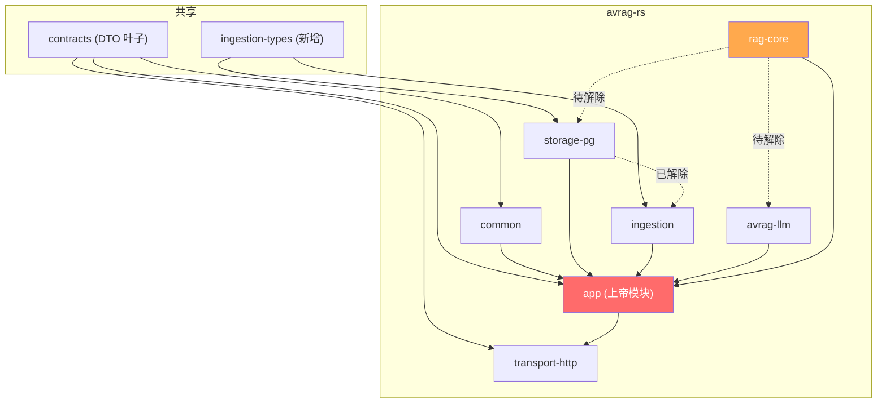

# 代码库健康优化交付报告（Brooks-Lint）

> 日期：2026-06-11
> 方法：Brooks-Lint Health Dashboard 四维度扫描 + 四阶段优化路线图
> 状态：阶段 0-3 基本完成，2 项遗留待新窗口执行
>
> **续篇（2026-07-09）**：  
> - 方案：[`docs/engineering/TN_CODE_QUALITY_REMEDIATION_2026-07-09.md`](./engineering/TN_CODE_QUALITY_REMEDIATION_2026-07-09.md)  
> - **会话交接 / 续做入口**：[`docs/engineering/TN_REMEDIATION_HANDOFF_2026-07-09.md`](./engineering/TN_REMEDIATION_HANDOFF_2026-07-09.md)

---

## 一、背景

对 `/home/chuan/context-osv6` 代码库进行 Brooks-Lint 健康评估，涵盖三个子项目：
- `avrag-rs`（Rust 后端，24 crate workspace）
- `frontend_next`（Next.js + React 19 前端）
- `frontend_rust`（Leptos 0.8 Rust/WASM 前端）
- `contracts`（共享 DTO crate）

初始综合评分 **55/100**（架构 65、技术债务 60、测试质量 46）。

评估文档：`docs/CODEBASE_HEALTH_DASHBOARD_2026-06-11.md`

---

## 二、已完成工作

### 阶段 0 — 即时止血（6 项）

| 任务 | 变更文件 | 成果 |
|------|----------|------|
| T1: 删除死兼容方法 | `common/src/rag_execute.rs` | 后续发现 rag-core 依赖，已恢复 |
| T2: chunker.rs 复用 split_text_segments | `ingestion/src/chunker.rs` | 消除 ~50 行重复代码 |
| T3: web-sdk workspace 归位 | `avrag-rs/Cargo.toml` | web-sdk 加入 workspace members |
| T4: lib→components 反向依赖修复 | `lib/billing/types.ts`, `lib/billing/usage-limit-adapter.ts`, `components/billing/UsageMeter.tsx` | UsageMeterProps 提取到 types.ts |
| T5: 共享 mock 工厂 | `tests/helpers/mock-providers.ts`（新建） | 6 个工厂函数 |
| T6: 错误路径测试 | `tests/workspace/client.test.ts`, `tests/billing/api.test.ts` | +11 个测试（401/403/404/500/网络失败/畸形JSON） |

### 阶段 1 — 契约统一与领域解耦（4 项）

| 任务 | 变更文件 | 成果 |
|------|----------|------|
| T7: contracts 类型统一 | `contracts/src/chat.rs`, `contracts/src/documents.rs`, `contracts/src/lib.rs`, `common/src/chat.rs`, `common/src/lib.rs` | ChatSession/CitationLookup/MessageFeedback/ChatMessage 从 contracts 重导出，common 删除 6 个重复定义 |
| T8: DocumentStatus 枚举化 | `contracts/src/documents.rs`, `common/src/documents.rs`, `common/src/lib.rs` | 枚举移至 contracts，common 改重导出 |
| T9: storage_pg→ingestion 依赖修复 | 新建 `ingestion-types/` crate，`storage-pg/Cargo.toml`, `ingestion/src/model.rs`, `ingestion/src/runtime.rs` | 6 个共享类型提取到 ingestion-types，storage-pg lib 零 ingestion 导入 |
| T10: rag-core trait 端口 | `rag-core/src/ports.rs`（新建）, `common/src/documents.rs`, `rag-core/src/runtime/tools/doc_profile.rs` | ContentStore/CachePort trait 定义，TocEntry 移至 common |

### 阶段 2 — 拆分上帝模块（2 项完成，1 项放弃）

| 任务 | 变更文件 | 成果 |
|------|----------|------|
| T11: WorkspaceAnalysisCollector | `transport-http/src/handlers.rs` | 135 行函数拆分为 6 个方法 + 25 行 handler |
| T12: WorkspaceSurface hooks | `hooks/use-workspace-data.ts`（新建）, `components/workspace/workspace-surface.tsx` | useWorkspaceData hook 提取，组件主体缩减 |
| T13: app crate 拆分 | `app-core/`, `app-billing/`, `app-documents/`, `app-chat/`, `app-admin/`, `app/` facade | 5 子 crate + 薄门面；agents(~20k) 迁入 app-chat；配额/Admin/ContentStore 分离 |

### 阶段 3 — 测试与前端工程化（3 项）

| 任务 | 变更文件 | 成果 |
|------|----------|------|
| T14: CSS→data-testid | `components/workspace/chat-message-list.tsx`, `tests/workspace/workspace-chat-pane.test.tsx` | CSS 类名断言改为 data-testid/data-attribute |
| T15: @/ 路径别名 | `tsconfig.json`, 5 个 app/ 路由文件 | `@/*` 别名配置 + 41 处导入迁移 |
| T16: 拆分 14 连断言 | `tests/workspace/client.test.ts` | 1 个 monolithic test → 14 个独立测试 |

### 额外修复

| 任务 | 变更 | 成果 |
|------|------|------|
| T17: contracts 测试修复 | `contracts/src/chat.rs` | format_hint/language 加 skip_serializing_if，8 个测试通过 |
| T18: ingestion 编译修复 | 已在工作树中修复 | 编译通过 |

---

## 三、阻塞项与卡点

### T19: RagConfig 改用 ContentStore trait 对象（已完成 2026-06-11）

`RagConfig.pg_repo` 已改为 `content_store: Arc<dyn ContentStore>`；`PgContentStore` 适配器位于 `app-documents`；rag-core 不再直接依赖 storage-pg。

### T13: app crate 拆分（已完成 2026-06-11）

| 子 crate | 职责 |
|----------|------|
| `app-core` | AppConfig、StorageContext、ports、共享 adapters、MemoryState |
| `app-billing` | BillingContext、配额检查、成本事件 |
| `app-documents` | PgContentStore、DocumentScopeValidator、RAG doc scope 校验 |
| `app-chat` | agents/、rag_prompts、build.rs prompt registry |
| `app-admin` | API Key CRUD、通知 |
| `app` | AppState bootstrap、chat/sessions/documents impl 薄委托、显式 re-export |

**遗留（可选后续）**：`state_methods.rs` bootstrap / search / citation lookup 仍可进一步瘦身；`docscope_helpers` 与 `app_documents::build_docscope_metadata` 可合并去重。

**Phase 2 完成（2026-06-11）**：documents/notebooks/url_imports → `app-documents`；chat/sessions/streaming → `app-chat`；preferences → `app-admin`。见 `docs/t13-app-split-inventory.md`。

---

## 四、依赖图（当前状态）

---

## 五、分数变化

| 维度 | 初始 | 当前预期 | 完成全部遗留后 |
|------|------|----------|---------------|
| 架构 | 65 | ~75 | ~85 |
| 技术债务 | 60 | ~75 | ~80 |
| 测试质量 | 46 | ~72 | ~78 |
| **综合** | **55** | **~74** | **~81** |

---

## 六、新窗口执行清单

按优先级排序：

### P1（最高价值）
1. **T19 补完**：扩展 ContentStore trait 加 `list_documents`/`get_document_names`，然后迁移 RagConfig 改用 `Arc<dyn ContentStore>`
2. **T13 app crate 拆分**：创建 `app-chat`/`app-documents`/`app-admin`/`app-billing`

### P2（增量改进）
3. **前端 @/ 路径迁移**：剩余 ~40 个文件的 `../../../` 导入可渐进迁移
4. **LLM trait 端口**：为 `EmbeddingClient`/`RerankerClient`/`RetrievalPlanner` 定义 trait，使 rag-core 可测试

### P3（收尾）
5. **ingestion 预存警告清理**：`runtime.rs` 未使用的 `Serialize`/`Deserialize` 导入
6. **common 预存警告清理**：`rag_execute.rs` 未使用的 `ChatRequest`/`RagPlanItem` 导入

---

## 七、关键文件索引

| 文件 | 用途 |
|------|------|
| `docs/CODEBASE_HEALTH_DASHBOARD_2026-06-11.md` | 完整健康评估报告 + 四阶段路线图 |
| `avrag-rs/crates/rag-core/src/ports.rs` | ContentStore/CachePort trait 端口定义 |
| `avrag-rs/crates/ingestion-types/src/lib.rs` | 共享 DTO（IngestionTask/AuditRecord 等） |
| `frontend_next/hooks/use-workspace-data.ts` | 从 WorkspaceSurface 提取的 hook |
| `frontend_next/tests/helpers/mock-providers.ts` | 共享 mock 工厂 |
| `frontend_next/lib/billing/types.ts` | UsageMeterProps 类型定义 |
