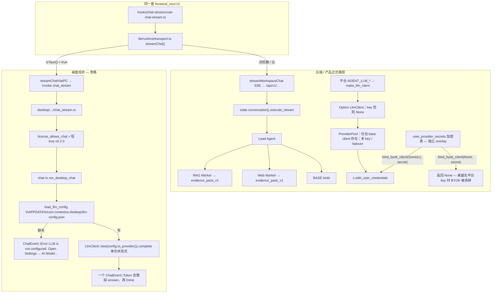
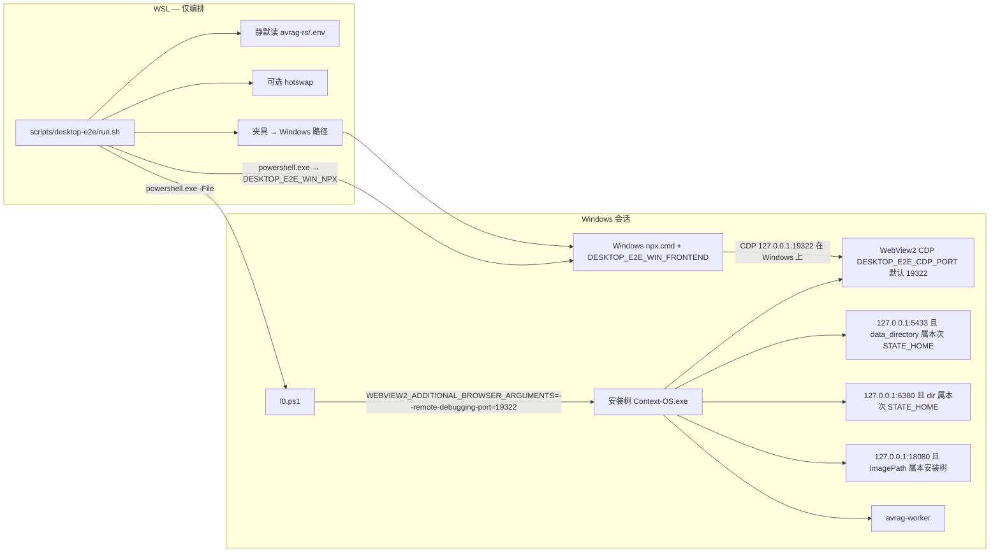
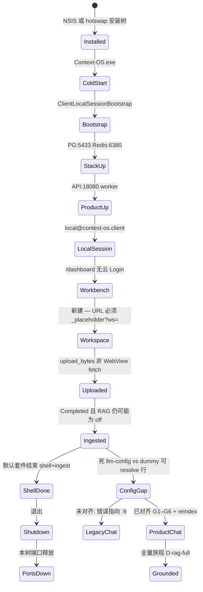

# Windows 桌面客户端打包本机 E2E 方案

| 字段 | 内容 |
|------|------|
| **日期** | 2026-08-13（修订 2026-08-13：审查回合） |
| **作者** | — |
| **状态** | Draft |
| **类型** | 设计 + 测试架构（**不实现测试**） |
| **默认套件名** | **packaged local-only shell+ingest**（安装树 / 冷启动 / 建库留在 WebView / IPC 上传 / ingest `Completed`） |
| **「全量旅程」** | **仅**指产品聊天对齐之后的 `D-rag-full`（grounded 问答）。默认绿 **不是** J1 成功态 |
| **动机** | 打包 Windows 客户端没有 WebView 级旅程门禁；近三次真机 bug（外链开 OS 浏览器、WebView→loopback PNA 导致 `Failed to fetch`、冷启动卡死）现有 Playwright / Rust E2E 都抓不到；桌面 LLM 配置是 **OpenAI-compatible 单路由**，看起来像 LiteLLM，但与云端 Settings → providers / `user_provider_secrets` / `ProviderPool` 不是同一条路 |
| **范围** | 已安装 / hotswap 的 Windows 客户端；L0 进程生命周期、L1 UI、L2 真 LLM 分层；配置面对照与对齐**门闩**（对齐本身是独立产品工作） |
| **非目标** | 本文件不落地 spec / 不改产品代码；不引入 LiteLLM 作为产品网关；不把双聊天路径写成长期架构；**不把「IPC 改打 `execute_stream`」说成桌面就能 Lead+Workers** |

**关联（现行权威）**

- 产品 IA：`docs/design/PRODUCT_IA.md`（J1–J8、canonical `/settings?tab=providers`）
- 商业模式：`docs/adr/0010-share-service-business-model.md` §8（**内部纯 Rust `ProviderPool`，默认不引入 LiteLLM**）
- Agent-lane：`docs/plans/2026-08-11-lead-rag-web-workers-design.md`
- 金字塔：`avrag-rs/docs/e2e-gates.md` · `docs/engineering/TEST_PYRAMID_DEDUP_MAP.md`
- 真机冒烟：`docs/desktop/SMOKE_CHECKLIST.md`
- 打包 / 便携栈：`docs/desktop/2026-08-10-v0.2.0-free-client-release.md` · `docs/desktop/2026-08-04-portable-runtime-design.md`
- 平台 LLM 路由验收：`avrag-rs/docs/engineering/2026-08-01-llm-providerpool-acceptance.md`

---

## Overview

打包后的 Context-OS Client 是「Tauri 壳 + 嵌入的 Next 静态导出 + 本机 `avrag-api`/`avrag-worker` + 便携 PG/Redis」。现有 E2E 金字塔覆盖的是 **浏览器 ↔ Next `:3000`** 与 **Rust product_e2e ↔ 云形态 API**，没有一层对着 **WebView2 + `tauri.localhost` + IPC + `%LOCALAPPDATA%` 安装树**。最近三次回归（建库把 `http://tauri.localhost/dashboard/{uuid}` 甩到系统浏览器、上传 `Failed to fetch`、冷启动卡在 `pg_ctl`/console 闪窗）全部发生在这条缝上。

本方案的**默认可签发套件**叫 **packaged local-only shell+ingest**，拆成可独立变红的门禁：

- **L0** 进程/端口/安装树（Windows PowerShell，无 LLM、无 UI）
- **L1-packaged** 打包 WebView UI（**Windows-native** Playwright 经 CDP 附着；**独立** `playwright.desktop-client.config.ts`，禁止挂到会启动 `:3000`/`:8080` 的共享配置）
- **L2** 真 LLM（opt-in，密钥只走 env）— 接线前只允许 `legacy-llm-config` 标签

配置面单独成章：当前桌面聊天走 `%APPDATA%\com.contextos.desktop\llm-config.json` + `LlmClient::complete` **单次、一个 `ChatEvent::Token`**。线形是 **OpenAI-compatible 单路由**（比 LiteLLM 窄：不讲 Anthropic/Gemini 原生方言）。云端正式版走 Settings → providers（表 `user_provider_secrets`）+ 平台 `ProviderPool`（env 多 key / failover）+ `conversation().execute_stream`。**Secrets 不是 Pool 的子模块**；`bind_byok_client` 只在已有 `LlmClient` 上覆盖凭据。E2E 必须诚实命名鸿沟。默认绿不得被读成「全量用户旅程」。

---

## Background & Motivation

### 当前能测到什么

| 层 | 入口 | 实际驱动对象 | 抓不到的东西 |
|----|------|--------------|--------------|
| L1 crate / vitest | `scripts/test-l1.sh` · `frontend_next/tests/desktop/*` · `frontend_next/tests/workspace/desktop-upload.test.ts` · `frontend_next/tests/runtime/tauri-ipc.test.ts` | 函数与组件 | 打包后 WebView 源、PNA、外链、冷启动 |
| L2 product_e2e | `avrag-rs` mock / 真 API | HTTP + SSE | Tauri IPC、`tauri.localhost`、NSIS 安装树 |
| L3 Playwright journey | `frontend_next/e2e/specs/journey/*` + **共享** `playwright.config.ts`（`webServer` 起 `:8080`/`:8081`/`:3000`，`globalSetup` 鉴权） | Chromium ↔ Next `:3000` | 静态导出 `_placeholder.html`、IPC `upload_bytes`、本机 5433/6380/18080 |
| 手工 Windows 冒烟 | `docs/desktop/SMOKE_CHECKLIST.md` | 人眼 | 不可重复、无回归基线 |

仓库里**没有** packaged-Windows WebView E2E。`SMOKE_CHECKLIST` 仍是 v0.2.0 真机清单；I1–U2 全部手勾。`test-l3-journey.sh` 只跑 `--project=journey e2e/specs/journey`，与桌面套件隔离，但**不能**靠「在共享 config 里加一个 project」来躲开 `webServer`/`globalSetup`（二者是 **config 级**）。

### 近三次必须被 E2E 抓住的 bug

1. **建库开系统浏览器**  
   外链守卫把所有 `http(s):` 当外部链接。静态导出只有 `/dashboard/_placeholder.html`，`/dashboard/{uuid}` 在 WebView 里不是真实文件。`window.open` 落到 OS 浏览器，host `tauri.localhost` 对系统 DNS 不可达。  
   已修：`desktop/src-tauri/src/lib.rs` `DESKTOP_EXTERNAL_LINK_GUARD_JS`、`desktop/src-tauri/src/app_nav.rs`、`frontend_next/lib/runtime/desktop-app-href.ts`。  
   单测：`frontend_next/tests/desktop/desktop-app-href.test.ts`、`app_nav.rs` 内 `tauri_localhost_is_in_webview`。  
   **E2E 必须**：点击「新建工作区」后，**没有**新的 `msedge`/`chrome` 以 `tauri.localhost` 为主文档；WebView URL 匹配 `http://tauri.localhost/dashboard/_placeholder?ws=<uuid>`。

2. **上传 `Failed to fetch`（机制名：PNA，不是缺 CORS）**  
   WebView origin 是 `http://tauri.localhost`（对 Chromium 像「公网」源），对 `http://127.0.0.1:18080/uploads/...` 的 PUT 触发 **Private Network Access**（公网源 → loopback），请求在 CORS 之前失败。`write_client_env` 与 API `CorsLayer` **已经**允许 `tauri.localhost` 且 `/uploads/{id}` 不限 method/header——再加 origin **修不好**这条。  
   已修：`uploadWorkspaceDocumentFile`（`frontend_next/lib/workspace/client.ts`）在 `isTauri()` 时走 `uploadBytesViaIPC` → `upload_bytes`（`desktop/src-tauri/src/commands/api.rs`），只允许 loopback + `/uploads/` + 与本机 API 同端口。  
   **E2E 必须**：上传 `antifragile.txt` 后 UI 无 `Failed to fetch`；ingest 进 `Completed`。`D-env` 里 CORS 键只能证明 env 写出，**不能**证明上传路径。`Completed` **≠** RAG-ready（见 KD6 / §7）。

3. **冷启动卡死 / 控制台闪窗**  
   `pg_ctl`、`curl`、`taskkill` 曾弹出 console。生命周期在 `desktop/src-tauri/src/commands/lifecycle.rs` 的 `RunEvent::Exit` 上做 product → data plane → **可执行路径** scoped sweep；Windows 上当前 PG 停止是 pidfile 进程树终止（`native_stack.rs` 838 起），不是 `pg_ctl stop -m fast`。本方案不把 `pg_ctl` 行为当作 L0 硬门，只把端口释放当硬门。`native_stack` / `win_cmd.rs` 已用 `CREATE_NO_WINDOW`（`apply_windows_no_window`）。  
   **E2E 必须（L0 硬门）**：冷启动 120s 内 `:5433` / `:6380` / `:18080` 通；退出 15s 内端口释放。  
   **不要**用 `Get-Process conhost` 增量 = 0 作 pass/fail（Windows 常有不可见 conhost，会 flake）。可选软信号：启动窗口内无标题/owner 为 `pg_ctl`/`curl`/`taskkill` 的**可见**顶层控制台；或 `ensure-native.log` 里每次 spawn 经过 `apply_windows_no_window`（软，不阻断 L0）。

### 为什么配置必须单独成章

桌面设置抽屉与 `/setup` 收集 `provider + base_url + api_key + model`——**线形**像 LiteLLM / OpenAI 代理。用户会以为「客户端也是 LiteLLM」。事实更窄：`inferred_api_style` 把所有 provider 打成 `ApiStyle::OpenAi`，**不会**说 Anthropic Messages / Gemini 原生方言。仓库法则与 ADR-0010 §8：**产品网关不是 LiteLLM**。云端正式版是 `user_provider_secrets` +（有平台 key 时）纯 Rust `ProviderPool` + Lead/Workers。E2E 若按 LiteLLM 品牌种配置，就是在固化被禁止的架构。

---

## Goals & Non-Goals

### Goals

1. 给 **已安装或 hotswap 的 Windows 客户端** 一条可重复、可变红的 **packaged local-only shell+ingest** 门禁：J7（本机客户端）+ J1 的 **建库/上传/ingest** + J2 **鸿沟探针**（providers vs `llm-config`，机械 oracle）。**不含** J1 提问成功态，**不含** J8 账户/安全。
2. 把驱动方式（Windows Playwright + 独立 config）、配置播种、通过/失败信号写成可执行规格。
3. 诚实对照桌面 `llm-config.json` 与云端 `/settings?tab=providers`，并规定 E2E 如何种配置、如何命名鸿沟。
4. 与现有金字塔去重：桌面 E2E 只断言 **壳 / 运行时 / 传输 / 安装树** 特有属性。
5. 先交付 thin slice（hotswap → 端口 → 建库留在应用内 → IPC 上传），能对 bug 1+2 变红；「全量旅程」`D-rag-full` 锁在产品对齐 + RAG 翻开 + **reindex** 之后。

### Non-Goals

- 本文件不实现 spec、不改产品代码、不引入新 CI workflow（solo：无 CI theater）。
- 不把 LiteLLM 写成产品目标或测试夹具品牌。
- 不把双聊天路径设计成长期架构。
- 不在桌面 E2E 里重测 SSE 事件序、JSON 字段全集、RAG recall、citation precision。
- 不把 J3 钱包 / J4–J6 分享上云 / `/pricing` / J8 做成默认套件。
- 不要求每次跑全量 NSIS。
- 不向操作者索要密钥。
- **不把「产品对齐」列为 E2E 波次 must-ship**（见 PR Plan：对齐是独立产品设计，本文只列门闩与断言翻转）。
- 禁止编辑 `frontend_next/playwright.config.ts` 来「加一个 desktop project」。

---

## Key Decisions

| # | 决策 | 理由 |
|---|------|------|
| **KD1** | 默认套件是 **shell+ingest**，不是「全量用户旅程」。`D-rag-full` / J1 grounded **锁在**独立产品对齐之后：不仅要把 IPC 转到 `execute_stream`，还要能在 **无平台 `AGENT_LLM_*`** 时从 secret **构造** `LlmClient`、翻 RAG、**reindex**。接线前只允许 `legacy-llm-config` 连通冒烟。 | Q1 已拍板：默认 **不算进全量**，不另开 ADR。`bind_byok_client` 今日只 overlay 已有 client；`write_client_env` 不写 `AGENT_LLM_*`。选项 (a) = L1-legacy；选项 (b)+缺口列表 = 全量门闩。见 Q1、替代方案 G。 |
| **KD2** | **L0 = Windows PowerShell（无 UI）**；**L1-packaged = Windows-native Playwright `connectOverCDP`**；`tauri dev` 只作 L1-dev，**不能**签发；**不以 tauri-driver 作主路径**。 | 近三次 bug 发生在打包静态导出 + WebView origin。WSL `npx` 连 `127.0.0.1:9222` 是 Linux loopback。 |
| **KD3** | 配置播种两套、标签互斥：`legacy` 写 `llm-config.json`；`product` 走 `PUT /api/v1/settings/provider-secrets`。夹具禁止 `litellm` 品牌。桌面路径描述为 **OpenAI-compatible 单路由**，不是多方言代理。 | ADR-0010 §8。线形像 LiteLLM，能力比它窄。 |
| **KD4** | 默认套件 ≈ SMOKE **冷启动 L1–L4 + S0–S6 + K1–K2**。K3 属全量（对齐后）。K4、C1–C3、I1–I7、U1–U2、J3–J8 = 可选 / 发版。 | J1 提问成功态今天走不通产品路径；J8 不在本波次。 |
| **KD5** | 桌面旅程 **不** 复制 `workspace-upload-rag.spec.ts` 的 SSE / citation / 词表。默认套件只断言：导航未逃出 WebView、无 `Failed to fetch`、ingest `Completed`。`Completed` 不得当作 K3 证据。 | 金字塔去重；RAG off 时 worker 跳过向量。 |
| **KD6** | Thin slice（PR-2）对 bug 1+2 变红，**不依赖 LLM、不依赖 RAG**。`write_client_env` **每次 ensure（含端口已开快路径）都重写** `AVRAG_ENABLE_RAG=false`。 | 分层生长。E2E 禁止手改 env 骗 RAG 绿。 |
| **KD7** | 日常 hotswap 安装树，不每次 NSIS。 | Time-cost。 |
| **KD8** | L2 只读 `DESKTOP_E2E_LLM_*`；WSL 静默映射 `avrag-rs/.env`，禁止提交 / 询问 / 入库。 | 凭证法则。 |
| **KD9** | 标准语料 `antifragile.txt`（两侧同 MD5）。禁止 golden-set 泄漏。 | 金字塔约定。 |
| **KD10** | 脚本在 `scripts/desktop-e2e/` + `frontend_next/e2e/specs/desktop-client/`。**独立** `playwright.desktop-client.config.ts`：无 `webServer`、无 `globalSetup`、无云 `storageState`、`timeout ≥ 180_000`。`run.sh` 在 **Windows 工作副本**上调 `npx.cmd playwright test --config=…`（见 KD11）。默认不进 `test-l3-journey.sh`。**禁止**改共享 `playwright.config.ts`。 | 共享 config 的 `webServer`/`globalSetup`/`baseURL`/`timeout: 90_000` 是 config 级，project 挡不住。 |
| **KD11** | L1 Playwright 进程必须跑在 **Windows**，且用 **win32** 的 `@playwright/test`。禁止 `powershell.exe` 去跑 WSL 树里的 `frontend_next/node_modules`（Linux 原生绑定，会挂）。具体 bootstrap 见 Proposed Design §1「Windows Playwright 工具链」。WSL 只编排：hotswap、`.env` 映射、拷夹具到 Windows 路径。`setInputFiles` 只用 Windows 路径。 | WSL2 NAT 下 Linux `127.0.0.1` ≠ WebView2 CDP；本 monorepo 在 ext4 上。 |
| **KD12** | 默认 **E2E 独占**本树，且 PR-2 起即用 `CONTEXT_OS_STATE_HOME=%TEMP%\cos-e2e-<runid>\state`。`native_stack` **写死** `PG_PORT=5433` / `REDIS_PORT=6380`，`CONTEXT_OS_STATE_HOME` **不改端口**。ensure 快路径（端口已开 → 只刷新 `client.env`）**不**核对 data dir。因此 L0 必须按顺序执行：(1) **先审计** 5433/6380/18080 的监听进程 ImagePath、PG `data_directory`、Redis dir；不属于本次 `STATE_HOME`（显式 `DESKTOP_E2E_USE_DEFAULT_TREE=1` 的 manual hotswap 模式除外）→ **fail `S-desktop-port-owner`，禁止走快路径，禁止任何 stop**；(2) 若端口属于本次树且已有 `Context-OS.exe` 主窗口，用 `CloseMainWindow()` / `WM_CLOSE` 优雅关窗，由 Tauri `RunEvent::Exit` 触发 `shutdown_all_local_runtime`；**PowerShell 不直接调用该 Rust 函数，也不 `Stop-Process`**；无主窗口但端口仍属本次树 → `S-desktop-no-app-window`；(3) 端口释放后，**先 backup** AppData 下的 `local_user.json` / `local_session.json`（PR-2 起）与 `llm-config.json`（PR-3 起），再以 `CONTEXT_OS_STATE_HOME` + unset `CONTEXT_OS_CLIENT_HOME`（除非它等于 isolate root）启动 E2E 实例；(4) E2E 关闭后 **在 finally 中 restore** 这些 AppData 文件，因为 `STATE_HOME` 不覆盖 Tauri AppData。 | 否则 L0 会误杀陌生 Redis、挂上开发者日常 PG，或依赖不存在的直接 teardown API。 |

---

## 客户端配置：现状 vs 云端 vs 目标

> 本章是全文最重要的一章。桌面聊天**今天不走**产品 `avrag-api` Lead+Workers。配置是 **OpenAI-compatible 单路由客户端**，线形像 LiteLLM，但 **不是** 多方言代理，也 **不是** 产品网关（ADR-0010 §8）。`ProviderPool` **不拥有** BYOK secrets。E2E 必须按此表种配置、写断言。

### 1. 两条聊天路径（现状，2026-08-13 代码）



要点（均已对过代码，不是目标态）：

| 步骤 | 桌面（Tauri） | 云端 / 产品正式 |
|------|----------------|-----------------|
| UI 入口 | 同一 `useChatStream` | 同一 |
| 传输 | `isTauri()` → `streamChatViaIPC` | `streamWorkspaceChat` SSE |
| 命令 | `chat_stream` | HTTP → `app-chat` |
| 实现 | `run_desktop_chat` | `ChatService::execute_chat_stream` |
| 配置 | `LocalLlmConfig` ← `%APPDATA%\com.contextos.desktop\llm-config.json` | 表 `user_provider_secrets` + 可选平台 `ProviderPool` |
| 模型调用 | `LlmClient::complete(&[ChatMessage::user(query)], Some(0.7))` **单次、非流式、无工具**；**只读 `query`，忽略 capabilities** | Lead + Workers；`complete`/`complete_stream` 经 **已有** client（± BYOK overlay） |
| RAG | **不发生** | Worker → `evidence_pack_v1` |
| 「流式」 | **一个** `ChatEvent::Token` 带整段 answer，再 `Done`（不是拆成多 token） | 真 token / progress |
| 未配置文案 | `"LLM is not configured. Open Settings → AI Model to add your API key."` | providers / 钱包 |

REST 与聊天分开。桌面 REST：`restRequest` → `requestViaIPC` → `api_call` → `:18080`。**只有聊天被旁路。**

### 2. 桌面配置：OpenAI-compatible 单路由（比 LiteLLM 窄）

`LocalLlmConfig`（`desktop/src-tauri/src/commands/llm_config.rs` + `frontend_next/lib/desktop/tauri-llm.ts`）：

```rust
pub struct LocalLlmConfig {
    pub provider: String,      // "zhipu" | "openai" | "ollama" | "custom" | …
    pub base_url: String,      // OpenAI-compatible root
    pub api_key: String,       // 明文
    pub model: String,
    pub timeout_ms: u64,
    pub enable_thinking: Option<bool>,
    pub enable_cache: Option<bool>,
    pub embedding: Option<LocalEmbeddingConfig>,
}
```

`inferred_api_style` 把 `anthropic` / `google` / `gemini` / `ollama` / `custom` **全部**映射成 `ApiStyle::OpenAi`。UI 上 `llm-presets.ts` 的 `anthropic-messages` / `gemini` **不进入**请求风格。

这与 LiteLLM 的相似点：**一张** `base_url + key + model` 表，打 OpenAI chat completions。  
不同点（必须写进测试语言）：LiteLLM 会按 provider 说原生方言并做统一网关；桌面路径是 **`avrag-llm` 单路由、OpenAI 方言 only**。不是产品网关，没有独立 LiteLLM 进程。L0 断言 **没有** `litellm` 进程；夹具名用 `legacy-llm-config`。

UI 入口：

| 入口 | 文件 | 做什么 |
|------|------|--------|
| 首次 `/setup` | `frontend_next/app/(desktop)/setup/page.tsx` | 16 个 `LLM_PRESETS`，测通后 `set_llm_config` |
| 设置抽屉 | `DesktopSettingsDrawer.tsx` | tab：`llm` / `embedding` / `stack` / `license` / `diagnostic` |
| 诊断 | `LLMDiagnosticPanel.tsx` → `diagnose_llm` / `test_llm_connection` | DNS → TCP → `complete_with_max_tokens("ping")` → 可选 embedding |
| IPC | `get_llm_config` / `set_llm_config` / `list_available_models` | 明文 JSON；`GET {base_url}/models` |

**两棵树**（隔离必须两棵都管）：

| 数据 | 路径 | 谁写 | `CONTEXT_OS_STATE_HOME`？ |
|------|------|------|---------------------------|
| `llm-config.json` | `%APPDATA%\com.contextos.desktop\`（Tauri `identifier`） | `save_llm_config` | **否** |
| `local_session.json` / `local_user.json` | 同上 | `local_session.rs`（`local@context-os.client`） | **否** |
| `client.env`、`data/pg-native`、`data/redis-native`、logs | `%LOCALAPPDATA%\Context-OS Client\` | `write_client_env` | **是**（`install_state_dir`） |
| 安装二进制 | `%LOCALAPPDATA%\Context-OS Client\`（`Context-OS.exe`、`avrag-api.exe`、`runtime/pgsql`、`runtime/redis`） | NSIS / hotswap | 否（bins 另有 `CONTEXT_OS_RUNTIME`） |

`write_client_env` **硬写** `AVRAG_ENABLE_RAG=false`（注释：Cold start without cloud/BYOK embedding keys），且在 **每次** `ensure` 调用——包括「两端口已开」快路径（`native_stack.rs` 约 710–727 行）。桌面 embedding 嵌在 `llm-config.json`，**不会**变成 `user_provider_secrets.purpose=embedding`，也**不会**在下次 ensure 里保住手工改过的 RAG 开关。

### 3. 云端正式配置（产品 canonical）

PRODUCT_IA **J2** → **`/settings?tab=providers`**。

| 层 | 实现 |
|----|------|
| UI | `settings-providers-panel.tsx` |
| 行模型 | **固定三行**，只填 KEY：DeepSeek `purpose=llm`（`deepseek-v4-flash`）、百炼 `purpose=llm`（`qwen3.7-flash`）、SiliconFlow `purpose=embedding` + `rerank`（`BAAI/bge-m3` / `bge-reranker-v2-m3`） |
| API | `GET/PUT /api/v1/settings/provider-secrets`、`DELETE .../:id` |
| 存储 | 表 **`user_provider_secrets`**（migration `0067_user_provider_secrets`）；加密；列表只回 `key_fingerprint` = `{last4}:{length}` |
| 平台内部路由 | `ProviderPool`：`AGENT_LLM_API_KEY(S)` / `AGENT_LLM_FALLBACKS`。**不是** BYOK 仓库 |
| BYOK overlay | `UnifiedAgent::bind_byok_client`：仅 `(Some(client), Some(secret))` → `with_user_credentials`；`client = None` 时 **丢弃 secret** |
| 代购 | ADR-0010 §8：默认不引入 LiteLLM |

桌面静态导出里 `/settings?tab=providers` **页面在**，本机 API **有** secrets 路由。但：

- 桌面聊天 **不读** secrets；
- 设置主路径是抽屉 `llm` tab；
- `/setup` 16 预设 ≠ 云端三行槽；
- `client.env` **没有** `AGENT_LLM_*` → `make_llm_client` / `to_llm_config` 在 key/url 空时返回 `None`。

因此：**种一条 secret ≠ 桌面 Lead+Workers 能跑。** 这是产品缺口，不是 E2E 能绕过去的。

### 4. 对照表

| 维度 | 桌面现状 | 云端现状 | 目标（长期） | 默认 E2E |
|------|----------|----------|--------------|----------|
| 用户完成页 | `/setup` + 抽屉 `llm` | `/settings?tab=providers` | 只保留 providers；抽屉降为栈/诊断 | 记录实际打开的页；canonical 断言属对齐后 |
| 配置形 | OpenAI-compat 单路由 | 固定槽 + KEY | 同一 `user_provider_secrets`；桌面可加 custom 行但同一张表 | `legacy` JSON / `product` upsert |
| 落盘 | 明文 Roaming AppData | PG 加密 | 删 `llm-config.json` | L0 可读文件；对齐后断言消失 |
| 网关 | 无。直连 vendor | Pool（平台 key）**加** 独立 secret overlay | 无平台 key 时 **从 secret 构造** client；无 LiteLLM 进程 | 禁止「LiteLLM 就绪」；无 litellm 进程 |
| 聊天运行时 | `complete` 单次 | Lead + Workers | 同一 `execute_stream` + 上条构造规则 | 默认套件 **不问答**；legacy 另标 |
| Embedding / RAG | JSON 嵌套；`AVRAG_ENABLE_RAG=false` 每次 ensure 重写 | SiliconFlow 槽 | 有 embedding secret **且** restart **且** reindex | L0 记录开关实际值；`Completed` ≠ 有向量 |
| 协议 | 全部 OpenAI | `avrag-llm` 真风格 | 跟 `avrag-llm` | 不测方言 |
| 诊断 | `diagnose_llm` | 无对等 | 对已存 secret 打本机 API | L1-legacy 可选 |

### 5. 目标架构与产品缺口（全量旅程门闩 — **不是**「IPC 改 HTTP」就够）

期望形态：

```text
WebView  useChatStream
    →  IPC 透传或本机 HTTP
    →  avrag-api :18080  conversation().execute_stream
         ├─ 若平台 AGENT_LLM_* 为空：从 user_provider_secrets(purpose=llm) **构造** LlmClient
         ├─ 若平台 client 存在：bind_byok_client overlay
         ├─ Lead / RAG / Web Worker（与云端同一 assemble）
         └─ ProviderPool 仅当存在平台 / 多 key 配置

删除：run_desktop_chat → complete；llm-config.json 作为聊天真相
```

**今日代码缺口（产品 PR，非 E2E must-ship）：**

| # | 缺口 | 代码 | 不修的后果 |
|---|------|------|------------|
| G1 | 无平台 client 时 BYOK 被丢 | `bind_byok_client(None, secret) → None`；`make_llm_client` 要非空 `api_key`+`base_url` | 种 secret + 改 IPC 仍无模型 |
| G2 | `client.env` 无 `AGENT_LLM_*` | `write_client_env` | 桌面 API 永远 `llm_client = None` |
| G3 | RAG 每次 ensure 被写回 false | 快路径也 `write_client_env` | 手工改 env 无效 |
| G4 | `enable_rag=true` 需要 embedding client | `app-bootstrap`：`embedding client is required when enable_rag=true` | 只翻开关会启动失败 |
| G5 | RAG off 时 ingest **跳过向量** | `build_worker_retrieval_data_plane`：`enable_rag == false → None`；`needs_text_vector_index = retrieval_data_plane.is_some()` | 旧行 `Completed` 无向量；翻开后必须 **re-upload 或 reindex** |
| G6 | 开关 vs secret 鸡生蛋 | ensure 写 env 时 secrets 往往还不存在 | 产品必须规定：upsert embedding 之后 **谁** 重写 env、**何时** restart api/worker |

E2E **禁止**把 G1–G6 当成「测通 IPC 路由」就会绿。`D-rag-full` 序列见 §6。

### 6. E2E 如何种 / 断言配置

**L0 / L1 dummy（无真密钥）** — 只用于抽屉回读与 dead-endpoint，不用于鸿沟 PASS：

```json
{
  "provider": "custom",
  "base_url": "http://127.0.0.1:9",
  "api_key": "e2e-not-a-real-key",
  "model": "e2e-dummy",
  "timeout_ms": 2000
}
```

标签一律 `legacy-llm-config`。L0 读 `client.env`：`RETRIEVAL_BACKEND=pgvector`；记录 `AVRAG_ENABLE_RAG`（现状 `false`）；CORS 键只作 env 形，不证明上传。

**D-cfg-gap 机械 oracle（禁止「带 rag capability 问一句」）**

`run_desktop_chat` 只读 `query`，capabilities 无意义。

| 阶段 | 播种 | 观察 | 记法 |
|------|------|------|------|
| 接线前 | **dummy 可 resolve 行**（`PUT /api/v1/settings/provider-secrets`，`api_key=e2e-not-a-real-key`，本机 API 能落库并 GET 到 fingerprint）+ **死** `llm-config`（`127.0.0.1:9`）。**不是** `DESKTOP_E2E_LLM_API_KEY` | 聊天错误含死 endpoint / `LLM request failed` / 超时连 `:9`；`:18080` access log **无** `execute`/`chat/stream` | **`GAP`**（期望如此） |
| 接线前备选 | 读桌面日志 / IPC 计数：有 `chat_stream`+`complete`，无对本机 chat HTTP | 同上 | `GAP` |
| 对齐后 GAP→仍非 PASS | 仍是 dummy 行 + 已实现 G1 | 会改走 API 但模型调用失败（假 key）— 记 `GAP` 或 skip，**不是** `D-rag-full` | 勿标 PASS |
| 对齐后 PASS / `D-rag-full` | **删除** `llm-config.json`；种 **真 key**（仅 PR-5 / `DESKTOP_E2E_LLM_*`）；产品已实现 G1–G6 + reindex | 非空主气泡；`:18080` 有 chat stream；错误不再提 `:9` | **`PASS`** |
| 对齐后假绿防护 | 只种 dummy 行、未实现 G1 | 仍走死 json 或「无 client」 | **`FAIL`**（产品 PR 没做完） |

不要用「问 rag 题」当探针。

**L2 真密钥（opt-in）**

```text
DESKTOP_E2E_LLM_API_KEY      无则 skip L2
DESKTOP_E2E_LLM_BASE_URL     默认同 AGENT_LLM_BASE_URL
DESKTOP_E2E_LLM_MODEL
DESKTOP_E2E_EMBED_API_KEY    无则跳过向量 / D-rag-full
```

WSL 静默读 `avrag-rs/.env`，注入 **Windows** 进程环境。L2 播种走文件/API，不在可视 input 里粘贴 key。

接线前 L2 = `legacy` 单次 complete 有非空文本。  
接线后 L2 **不再写** `llm-config.json`；删文件仍能答。

**D-rag-full 序列（对齐后，缺一步就 skip，不要绿）**

1. 用 **`DESKTOP_E2E_LLM_*` / `DESKTOP_E2E_EMBED_*` 真 key** upsert `purpose=llm` + `purpose=embedding`（不是 PR-3 dummy 行）  
2. 产品按 G6 重写 `client.env`（`AVRAG_ENABLE_RAG=true` + 足够的 embedding 配置）或等价 restart 参数  
3. 重启 api **和** worker  
4. **re-upload 或触发 reindex**（第一次 RAG-off 的 `Completed` **作废**）  
5. 再问 antifragile 主题；断言用户可见引用 + 主题词（不测 SSE 序）

### 7. 给测试作者的禁令

| 禁止 | 原因 |
|------|------|
| 夹具 / 目录名 `litellm` | 错误架构语言 |
| 启动或断言 LiteLLM 进程 | ADR-0010 §8 |
| 用 `llm-config.json` 断言 J2 完成 | J2 canonical 是 providers |
| 在 IPC `complete` 上断言 citation / EvidencePack | 产不出 |
| 用「rag capability」作鸿沟探针 | 桌面 chat 忽略 capabilities |
| 把 RAG-off 的 `Completed` 当 K3 | 无向量 |
| 手改 `AVRAG_ENABLE_RAG` 骗绿 | 下次 ensure 写回 false |
| 把 G1–G6 当成 E2E 能修的 | 产品工作 |
| 在共享 `playwright.config.ts` 加 project | 会拖起 `:3000`/`:8080` |
| Windows `npx` 指向 WSL `frontend_next/node_modules` | Linux 原生绑定；必须 `DESKTOP_E2E_WIN_FRONTEND` |
| 5433 已开就当「本树已起」 | 端口写死；必须核对 `data_directory` |

---

## Proposed Design

### 1. 运行器拓扑



**Windows Playwright 工具链（KD11；禁止复用 WSL `node_modules`）**

本 monorepo 在 WSL ext4（`/home/chuan/context-osv6`）。`frontend_next/node_modules` 是 **Linux** 安装；`powershell.exe npx` 对着该路径会因原生绑定失败。`connectOverCDP` 不必下载 Chromium，但仍需要 **win32** 的 `playwright` / `@playwright/test`。

默认 bootstrap（PR-2 必须按此写，不许发明 `powershell -Command npx` 扫 WSL 树）：

1. 机器上已有 **Windows Node**（`node.exe` + `npx.cmd`）。`run.sh` 解析启动器：  
   `DESKTOP_E2E_WIN_NPX`（若设）否则 `where.exe npx` 的第一个 `*.cmd`。解析失败 → `S-desktop-win-node`，不要回退到 WSL `npx`。
2. **Windows 路径**上的 `frontend_next` 工作副本（**不是** `\\wsl$\…` 直用 Linux `node_modules`）：  
   `DESKTOP_E2E_WIN_FRONTEND`（例：`C:\src\context-osv6\frontend_next`，可以是 git worktree、junction、或 `robocopy` 的规格子集）。  
   该目录一次 `pnpm install`（Windows）。建议 `PLAYWRIGHT_SKIP_BROWSER_DOWNLOAD=1`（L1 只 `connectOverCDP`）。
3. 规格与 config **以 Windows 副本为准**（或 `robocopy` 同步 `playwright.desktop-client.config.ts` + `e2e/specs/desktop-client` + POM 依赖）。禁止 Windows Playwright 的 `testDir` 指回 `/home/chuan/...`。
4. 启动：  
   `cd $DESKTOP_E2E_WIN_FRONTEND; & $DESKTOP_E2E_WIN_NPX playwright test --config=playwright.desktop-client.config.ts`  
   工作目录必须是该 Windows 路径。
5. 备选（若不想整树 Windows checkout）：Windows 侧一个极小 `package.json` 只依赖 `@playwright/test`，`testDir` 指向 **已拷到 Windows** 的 `specs/desktop-client`。仍须 win32 install + 上列 `npx.cmd` 解析。不要用这条当「从 WSL node_modules 偷绑定」的借口。

**L1 宿主（默认 = 替代方案 F）**

| 方案 | 能抓打包 bug？ | 结论 |
|------|----------------|------|
| L0 PowerShell | 端口/进程/文件 | L0 主路径 |
| **Windows Playwright + `connectOverCDP`** | 能；origin 是 `tauri.localhost` | **L1 主路径** |
| WSL Playwright → `127.0.0.1` | 默认 **不能**（Linux loopback） | 禁止，除非 mirrored 且双侧 `/json/version` 探针都过（仍非默认） |
| `tauri dev` | 不能（`devUrl=localhost:3000`） | L1-dev only |
| tauri-driver | 能，双栈 | 仅当 Windows 上 `/json/version` 失败且已确认 env 被进程继承 |
| 手工 SMOKE | 能 | NSIS/卸载/品牌 |

**L0 teardown 契约**

`shutdown_all_local_runtime` 是 Tauri 进程内部函数，只在 `RunEvent::Exit` 时执行（`desktop/src-tauri/src/lib.rs` 246 起）。`l0.ps1` **不得**把它当成可外部调用的 PowerShell 函数，也不得用 `Stop-Process` 代替优雅退出。

1. L0 先做端口与数据目录审计。5433/6380/18080 若被非本次树占用 → `S-desktop-port-owner`，停止，不 teardown、不杀进程。
2. 若本次树已有 `Context-OS.exe`，通过 `CloseMainWindow()` / `WM_CLOSE` 关主窗口，等待进程退出和端口释放。Tauri 的 `RunEvent::Exit` 会执行 `shutdown_all_local_runtime`。
3. 若端口属本次树但找不到可关闭的主窗口 → `S-desktop-no-app-window`，提示先手动启动并关闭客户端或显式启用 manual hotswap，不调用 `redis-cli SHUTDOWN` 或 `kill_named_under` 的未知路径。
4. E2E 结束时用同一方式关闭自己启动的实例；`D-shutdown` 只验收端口释放。

**WebView2 附着**

1. **仅 E2E 进程环境**（不写用户快捷方式）：  
   `WEBVIEW2_ADDITIONAL_BROWSER_ARGUMENTS=--remote-debugging-port=${DESKTOP_E2E_CDP_PORT}`  
   默认端口 **19322**（避开 Chrome/Edge 常用 9222）。  
   `--remote-debugging-address=127.0.0.1` 是 Chromium 旗标，**WebView2 未文档化**，不要依赖它作绑定保证。
2. 启动后：Windows 侧 `GET http://127.0.0.1:19322/json/version`。失败 → `S-desktop-cdp`。打印该进程的 `Get-ChildItem env:WEBVIEW2*`。
3. `GET /json/list`，挑选 `url` 匹配 `^https?://tauri\.localhost` 的 target。**禁止**「取第一个 page」（可能是 `about:blank` / 第二个 WebView / service worker）。
4. 组策略可覆盖/屏蔽 env：`HKCU\Software\Policies\Microsoft\Edge\WebView2\AdditionalBrowserArguments`（及 HKLM 对等）。L0 探测该键；若存在且不含我们的 port，记 `S-desktop-cdp-gpo`。
5. 同一时刻只允许一个 WebView2 占该 CDP 端口。
6. 备选：若 TCP 端口 flaky，可试 Edge `edge://inspect` / 用户数据目录下 `DevToolsActivePort`——仅文档化，不作为默认签发。

**hotswap**：默认假设安装树已有 `Context-OS.exe`。`DESKTOP_E2E_HOTSWAP=1` 跑 `dev-windows-hotswap.sh`，必须拷成 `Context-OS.exe`。不对 `target/.../avrag-desktop.exe` 旁路签发 L1。

**夹具路径**：`run.sh` 把 `frontend_next/e2e/fixtures/antifragile.txt` 拷到例如 `%TEMP%\cos-e2e-<runid>\antifragile.txt`（Windows 路径）。Playwright `setInputFiles` **只**用该路径。

### 2. 用户旅程状态机



产品 bootstrap 超时：栈 95s → 产品 55s → 会话 30s，总 120s（`ClientLocalSessionBootstrap.tsx`）。E2E 对齐这些数字。L1 config timeout ≥ 180s。

### 3. 旅程表（信号是 pass/fail/gap/skip）

`P` = packaged L1；`L0` = 无 UI；`F` = 全量 `D-rag-full`；`O` 可选；`R` 发版。

| ID | Job / Smoke | 步骤 | 通过 | 失败 | 层 |
|----|-------------|------|------|------|-----|
| D-I-tree | J7 / S0 | 安装树 | `Context-OS.exe`、`avrag-api.exe`、`avrag-worker.exe`、`runtime\pgsql\bin\pg_ctl.exe`、`runtime\redis\redis-server.exe`、`runtime\pgsql\lib\vector.dll` | 缺任一项 | L0 |
| D-cold | J7 / 冷启动 L1–L3 | 冷启动 | 120s 内标题 `Context-OS Client`；不进云 `/login`；不停 `/activate` | 超时；URL 含 login/activate | L0+P |
| D-ports | J7 / S2 S4 | 端口 + 所有者 | TCP 5433/6380/18080；`:18080/health` 200；**api ImagePath 属本安装树**；**PG `data_directory` 与 Redis 数据目录属本次 STATE_HOME**（显式 manual hotswap 模式除外）。端口被他树占用 → 不停止、不走快路径 | 不通或 `S-desktop-port-owner` | L0 |
| D-env | J7 / S3 | `client.env` | `RETRIEVAL_BACKEND=pgvector`；**记录** `AVRAG_ENABLE_RAG`（现状 false）；CORS 键只记形 | 缺文件/缺键 | L0 |
| D-session | J7 / S5 | 本机会话 | Roaming `local_session.json` 有 JWT；email `local@context-os.client` | 无 token | L0 |
| D-console | J7 软 | 可见控制台 | **不作为硬门**。可选：无 `pg_ctl`/`curl`/`taskkill` 可见顶层窗；或 ensure 日志经 `apply_windows_no_window` | 只 warn | L0 软 |
| D-ws-inapp | J1 K1 | 新建工作区 | URL = `tauri.localhost` + `/dashboard/_placeholder` + `ws=<uuid>`；`workspace-top-bar` 可见；无新浏览器主文档 | OS 浏览器；空白；只匹配到 `/dashboard/_placeholder` 却无 `ws=` | P |
| D-upload | J1 K2 | 上传 | 无 `Failed to fetch`；文档 `Completed`（≤180s） | fetch 错误；任务失败 | P |
| D-ingest-api | J1 K2 | API | 该 doc `status=completed`。注释：RAG-off 时无向量 | 非 completed | L0 辅助 |
| D-cfg-legacy | J2 现状 | 抽屉回读 | llm tab 字段 = 播种 dummy | 空 | P（PR-3） |
| D-cfg-gap | J2 鸿沟 | 死 json vs dummy 可 resolve 行 | 接线前：`GAP`（错误指向 `:9` / 无 `:18080` chat）。**PR-3 无真 key**。对齐后 + **真 key**（PR-5）删 json 仍能答 = `PASS` | 对齐后仍走 `:9` = FAIL | P（PR-3） |
| D-chat-unconf | J2 | 无 json | 错误含 `LLM is not configured` 或等价 | 静默空 | P（PR-3） |
| D-chat-dead | J2 | dummy `:9` | ≤数秒 Error，不 hang 30s+ | hang | P（PR-3） |
| D-chat-l2 | 现状问答 | 真 key + legacy | 非空散文；**不**断言 citation | 空 / 配置错误 | L2-legacy |
| D-rag-full | J1 成功态 | 对齐 + G1–G6 + reindex | 非空主气泡 + 用户可见引用 + antifragile 主题词 | 无引用却声称读过文档；用第一次 Completed 当证据 | F+L2 |
| D-shutdown | S6 | 退出 | 关闭主窗口后 15s 内本树 5433/6380/18080 释放 | 仍占 | L0 |
| D-nsis | I1–I7 | 安装向导 | 免费/无需激活 | 许可墙 | R |
| D-uninst | U1–U2 | 卸载 | 程序目录删除；AppData 默认保留 | 误删库 | R |
| D-cloud | J3–J6 | 连云 | `/pricing` = 名额+钱包 | 买断 CTA | O |

### 4. 默认套件 vs 全量 vs 可选

**默认 `desktop-client` = packaged local-only shell+ingest**

- D-I-tree → D-cold → D-ports → D-env → D-session  
- D-ws-inapp → D-upload → D-ingest-api  
- D-shutdown  
- PR-3 起加入：D-cfg-legacy、D-cfg-gap、D-chat-unconf、D-chat-dead  
- **不问答、不 citation、不 J8**

**全量旅程（仅此使用「全量」一词）**

- 产品对齐 G1–G6 已落地 + `DESKTOP_E2E_LLM=1` + `DESKTOP_E2E_EMBED_API_KEY`  
- 跑 §6 的 D-rag-full 序列  
- 此时 D-cfg-gap 必须从 `GAP` 变 `PASS`

**可选** `desktop-optional`：J3–J6、J8、K4、NSIS、卸载、D-chat-l2。

若后续改选 Q1 =「短期内 IPC complete 算桌面问答」：另开 ADR + 标签 `legacy-qa` 切片，**不得**把默认套件改名为全量（替代方案 G）。

### 5. 去重与 POM 契约

| 关注点 | 主人 | 桌面 E2E |
|--------|------|----------|
| SSE 序 | L1 `chat_stream_contract` | 不测 |
| CRUD JSON | L1/L2 `workspace_crud` | 不测字段全集 |
| IPC 上传形状 | vitest `frontend_next/tests/workspace/desktop-upload.test.ts` **和** `frontend_next/tests/runtime/tauri-ipc.test.ts` | 只断言用户可见结果 |
| 外链纯函数 | `desktop-app-href.test.ts` + `app_nav.rs` | 只断言没弹出 OS 浏览器 |
| RAG 词表 | L3 `workspace-upload-rag.spec.ts` | 仅 `D-rag-full` 复用语料/主题词 |
| 本机端口 / 安装树 / WebView origin / PNA | **无主人** | **本方案主人** |

**Desktop URL / wait 契约**（不要靠 `/\/dashboard\/[^/]+$/` 碰巧吃掉 `_placeholder`）：

- 工作台：`tauri.localhost` + 可见 `data-testid="dashboard-create-workspace"`（没有叫「工作台」的 testid）。
- 建库后：`http://tauri.localhost/dashboard/_placeholder?ws=<uuid>`（允许额外 query），**且** `data-testid="workspace-top-bar"` visible。
- 禁止 `page.goto("/dashboard/${id}")`（静态导出 404）。
- 不 import journey spec。薄包装 `DesktopWorkbench`：内部用 `desktopAppHref` / 上述 wait；现有 `DashboardPage.createWorkspace` 的 `waitForURL(/\/dashboard\/[^/]+$/)` **不得**直接当桌面契约。

### 6. Thin slice（对 bug 1+2 变红）

**名字**：`desktop-client-shell-ingest`  
**时间**：L0 ~1 min + 冷启动 ≤2 min + UI ~2 min ≈ **5 min**（已有安装、不 hotswap、不 LLM）。  
**步骤**

1. 可选 `DESKTOP_E2E_HOTSWAP=1`；PR-2 起默认 `CONTEXT_OS_STATE_HOME=%TEMP%\cos-e2e-<runid>\state`。先关闭已有本树实例，再备份 AppData 的 `local_user.json` / `local_session.json`，最后启动 E2E。
2. L0 先审计：5433/6380/18080 的 ImagePath、PG `data_directory`、Redis dir 属本次树才继续；他树占用 → `S-desktop-port-owner`，不 teardown。属本次树且有主窗口时，用 `CloseMainWindow()` / `WM_CLOSE` 触发 `RunEvent::Exit` → `shutdown_all_local_runtime`；无主窗口 → `S-desktop-no-app-window`。不直接调用 Rust teardown，不 `Stop-Process`，不盲跑 `redis-cli SHUTDOWN`。
3. 带 CDP 19322 启动 → 等端口；读 `client.env` `DATABASE_URL` 可与活 PG `data_directory` 交叉验证；`GET :18080/health`
4. Windows `npx.cmd` + `DESKTOP_E2E_WIN_FRONTEND` + 独立 config → CDP → 选 `tauri.localhost` page → 等到工作台控件
5. 点 `dashboard-create-workspace` → URL `_placeholder?ws=` + `workspace-top-bar`；无新浏览器主文档
6. `setInputFiles`（Windows 路径 antifragile.txt）→ 无 `Failed to fetch` → `Completed`
7. 关闭主窗口 → 等进程退出；15s 内本树端口释放；`finally` 恢复 AppData backup

**不含**：LLM、提问、citation、云登录、conhost 计数。  
**变红**：回滚外链守卫或 `uploadBytesViaIPC`。不要用「少写一个 CORS origin」当假红实验——PNA 才是 fetch 死因。

### 7. 目录与入口（落地时；本文件不创建）

```text
scripts/desktop-e2e/
  run.sh                      # WSL 编排；解析 DESKTOP_E2E_WIN_NPX / where.exe npx
  l0.ps1                      # 两棵树、ImagePath+data_directory、CloseMainWindow+Exit hook teardown
  backup-appdata.ps1          # PR-2 起备份/恢复 local_user.json + local_session.json；PR-3 含 llm-config.json
  seed-legacy-llm.ps1         # 写 Roaming llm-config.json；先 backup
  README.md                   # 链到本文；写明 DESKTOP_E2E_WIN_FRONTEND

# Windows 路径（DESKTOP_E2E_WIN_FRONTEND），pnpm install 产出 win32 node_modules
frontend_next/playwright.desktop-client.config.ts
  # 禁止从 playwright.config.ts import webServer / globalSetup
  # 禁止 testDir 指回 /home/chuan/... WSL 路径
  testDir: e2e/specs/desktop-client
  timeout: ≥180_000
  无 webServer / 无 globalSetup / 无 storageState / 无 baseURL :3000

frontend_next/e2e/specs/desktop-client/
  nav-upload.spec.ts
  config-gap.spec.ts
  chat-unconf.spec.ts
  chat-dead-endpoint.spec.ts
  chat-legacy.spec.ts         # DESKTOP_E2E_LLM=1
  chat-rag.spec.ts            # 仅对齐后
```

`run.sh` 预估：L0+L1 ≈ 5–8 min；+hotswap ≈ 10–15 min；+L2 另计 token。缺 `DESKTOP_E2E_WIN_FRONTEND` 或 Windows `npx.cmd` 时 **fail 并打印上述变量**，不回退 WSL `npx`。

### 8. 风险

| 严重度 | 风险 | 缓解 |
|--------|------|------|
| 高 | WSL Playwright 连错 loopback | KD11：L1 必须 Windows Node |
| 高 | Windows `npx` 误用 WSL `node_modules` | KD11 工具链：`DESKTOP_E2E_WIN_FRONTEND` + `npx.cmd`；禁止 `\\wsl$\` 混用 Linux 绑定 |
| 高 | 共享 Playwright config 拖起云栈 | KD10：独立 config |
| 高 | 双路径让 K3 假绿 | KD1 + G1–G6 + reindex |
| 高 | PR-2/PR-3 覆盖开发者真 key/JWT | 两棵树隔离；AppData **强制 backup/restore**；不把 `llm-config.json` 种子留在 AppData |
| 高 | L0 直接调 Rust teardown 或 `Stop-Process` | teardown 只经 `CloseMainWindow()` + `RunEvent::Exit`；先审计端口，后关窗 |
| 高 | STATE_HOME 不改 5433/6380，快路径挂上日常 PG/Redis | KD12：先审计端口与 data dir，再决定关闭；陌生占用 fail，不杀 |
| 中 | 本树端口已开但无应用主窗口 | `S-desktop-no-app-window`，不盲跑 `redis-cli SHUTDOWN`；提示手动关闭或 manual hotswap |
| 中 | CDP 被 GPO 挡 | 读 `...\Edge\WebView2\AdditionalBrowserArguments`；`S-desktop-cdp-gpo` |
| 中 | 19322 仍冲突 | 可配 `DESKTOP_E2E_CDP_PORT` |
| 中 | 冷启动 flaky | 对齐产品 120s；端口就绪再附着 |
| 中 | hotswap 不换嵌入前端 | 改选择器的 PR 需完整 tauri build 一次 |
| 中 | 真密钥进 trace | L2 `trace=off`；不 UI 粘贴 key |
| 低 | 抢用户日常客户端 | KD12 独占本树；陌生 api 则 fail 不杀 |

---

## API / Interface Changes

本方案是测试架构，**产品 API 不变**。测试使用的现有接口：

| 方向 | 已有 | E2E |
|------|------|-----|
| IPC | `ensure_*` | 产品冷启动会调；L0 侧证 |
| IPC | `get/set_llm_config` | PR-3 可读；播种优先写文件 |
| IPC | `upload_bytes` | **经 UI 触发**，禁止测试直接 invoke 代替点击 |
| IPC | `chat_stream` | unconf / dead / L2-legacy |
| HTTP | `GET :18080/health` | L0 |
| HTTP | provider-secrets | 鸿沟探针；对齐后播种 |
| HTTP | documents | L0 辅助 |

**产品对齐**（独立设计，不在 E2E must-ship）需要至少：

1. G1：平台 client 为 `None` 时从 resolved secret **构造** `LlmClient`。  
2. G2/G3/G6：upsert embedding 后重写 env（或等价），且后续 ensure **不再**盲目写回 `AVRAG_ENABLE_RAG=false`。  
3. G4/G5：有 embedding client 才开 RAG；开后 **reindex**。  
4. 聊天走本机 `execute_stream`；退役 `llm-config.json` 作为真相。  
5. `/setup` 改为带到 `/settings?tab=providers`。

E2E 在对齐落地后只做：D-cfg-gap `GAP`→`PASS`；启用 `chat-rag.spec.ts`。

---

## Data Model Changes

无产品 schema 变更。测试读写：

| 文件 / 表 | 所有者 | 隔离 |
|-----------|--------|------|
| `%APPDATA%\com.contextos.desktop\llm-config.json` | 现状聊天真相 | **不是** STATE_HOME。PR-3：**强制** backup → 写 dummy → restore（即使用户选了 STATE_HOME） |
| 同上目录 `local_session.json` / `local_user.json` | 本机 JWT | PR-2 起强制 backup/restore；即使产品将来支持重定向 `app_data_dir`，也优先用 temp profile |
| `%LOCALAPPDATA%\Context-OS Client\client.env` 与 `data/` | native_stack | PR-2 起：`CONTEXT_OS_STATE_HOME=%TEMP%\cos-e2e-<runid>\state`。**端口仍是 5433/6380**。仅当监听进程的 data dir 就是该 STATE_HOME 时才算隔离成功。E2E 进程 unset `CONTEXT_OS_CLIENT_HOME`（除非它等于该 isolate root）。显式 `DESKTOP_E2E_USE_DEFAULT_TREE=1` 的 manual hotswap 模式才允许默认树。 |
| 本机 PG **`user_provider_secrets`** | 与云端同表 | 随 **本次** STATE_HOME 的 PG 数据，不是开发者日常库 |

Tauri **不读** `CONTEXT_OS_STATE_HOME`。`STATE_HOME` **也不改端口**。文档与脚本禁止声称 STATE_HOME 单独隔离了聊天配置或「换目录就换端口」；因此 AppData 下的 `local_user.json` / `local_session.json` / `llm-config.json` 必须显式 backup/restore。

---

## Alternatives Considered

### A. 只扩充手工 `SMOKE_CHECKLIST`

零工程，无法对回归变红。否决为主路径；清单留给 NSIS/卸载/品牌。

### B. 现有 journey 对着 `tauri dev`

`devUrl` 不是打包 origin。降为 L1-dev。

### C. tauri-driver 唯一 UI 驱动

新二进制、POM 双栈。备选，非默认。

### D. 先强制产品对齐再写 E2E

对齐期间导航/上传无门禁。否决「先对齐再测」。

### E. 以 LiteLLM 为配置 UX / 夹具品牌

违反 ADR-0010 §8。否决。

### F. Windows 侧 Playwright 作为 L1 宿主（**默认采纳**）

WSL 只编排。上传与 CDP 都在 Windows 进程空间。这是 Issue 2 的唯一可实现默认。mirrored networking + 双侧探针可作为文档化逃生舱，不作默认。

### G. 短期内把 IPC `complete` 写成正式桌面问答（Q1 另一叉）

若用户选择「桌面问答就是 `llm-config` 单次 complete」，必须 **另开 ADR**：J1 成功态降级为无检索散文；`D-rag-full` 仍锁产品路径。E2E 增加带标签的 `legacy-qa` 切片，**不**把默认 shell+ingest 改名为全量。在 ADR 之前，本文不把这条当目标架构。

---

## Security & Privacy Considerations

| 威胁 | 处理 |
|------|------|
| key 进 trace / screenshot | L2 `trace=off`；文件/API 播种；redaction |
| CDP 端口 | 仅 E2E env；默认 19322；跑完清变量 |
| dummy json 覆盖真配置 | PR-3 **强制** backup/restore `%APPDATA%\com.contextos.desktop\` 下 `llm-config.json`；PR-2/PR-3 都会 backup/restore `local_user.json` / `local_session.json`；restore 放在 `finally`。STATE_HOME **不够** |
| `upload_bytes` 打非 loopback | 产品已 `assert_desktop_upload_url` |
| 向人要 key | 缺 key → skip L2，`skipped-no-key` |

T7：只建 workspace。T8：无 org。

---

## Observability

`%TEMP%\cos-e2e-<runid>\`（或 `CONTEXT_OS_E2E_OUT`）：

| 产物 | 内容 |
|------|------|
| `l0.json` | 端口延迟、PID、ImagePath、`AVRAG_ENABLE_RAG`、两棵树路径、GPO 键、teardown 用的主窗口状态 |
| `signals.txt` | `PASS\|FAIL\|GAP\|SKIP\|WARN <id> <reason>` |
| `client.env.redacted` | 抹密钥 |
| `appdata-backup/` | PR-2 起 `local_user.json` / `local_session.json`；PR-3 起含 `llm-config.json` |
| 拷贝 `ensure-native.log` / `lifecycle-shutdown.log` | |
| `playwright/` | 失败 screenshot（L2 默认无 trace） |

| 信号 | 含义 | 下一刀 |
|------|------|--------|
| `S-desktop-tree` | 安装树缺文件 | hotswap / NSIS |
| `S-desktop-port` | 端口不通 | `ensure-native.log` |
| `S-desktop-port-owner` | 5433/6380/18080 被他树占用，或 PG `data_directory` ≠ 本次 STATE_HOME | 不要走快路径；不要杀陌生进程；换 isolate 或先停日常客户端 |
| `S-desktop-no-app-window` | 端口属本次树但没有可关闭的 `Context-OS.exe` 主窗口 | 不盲跑 `redis-cli SHUTDOWN`；手动关闭客户端或启用 manual hotswap |
| `S-desktop-win-node` | 找不到 Windows `npx.cmd` 或未设 `DESKTOP_E2E_WIN_FRONTEND` | 装 Windows Node；做 Windows 路径 checkout / junction |
| `S-desktop-cdp` | `/json/version` 失败 | env 继承、SKU |
| `S-desktop-cdp-gpo` | 组策略挡 CDP | 上述 registry |
| `S-desktop-origin` | 无 `tauri.localhost` target | 是否误启 tauri dev |
| `S-desktop-external` | OS 浏览器 | 外链守卫 |
| `S-desktop-cors` / **`S-desktop-pna`** | `Failed to fetch` | `upload_bytes`；不是再加 CORS origin |
| `S-desktop-ingest` | 未 Completed | worker.log |
| `S-desktop-cfg-gap` | 鸿沟（接线前不是 fail） | 产品对齐 |
| `S-desktop-llm` | L2 失败 | key / 网络 |

不进用户主气泡。

---

## Rollout Plan

Solo 本地主干，无 CI theater。

| 阶段 | 可演示 | 回滚 |
|------|--------|------|
| PR-0 本文（README 已收录） | 人能按表手测 | 删文档 |
| PR-1 L0 | `run.sh l0` | 删 `scripts/desktop-e2e` |
| PR-2 shell+ingest L1 + STATE_HOME | 回滚外链/IPC 即红 | 删独立 config + spec；restore AppData |
| PR-3 配置/unconf/dead + llm-config 夹具 | `GAP` 稳定 | 关探针；restore AppData |
| 产品对齐（独立 PR / 设计） | G1–G6 | 该产品 PR 回滚 |
| PR-5 断言翻转 + opt-in RAG | D-cfg-gap PASS；D-rag-full | 默认关 L2 |
| PR-6 NSIS/卸载可选 | 干净机 | 手清单 |

---

## Open Questions

1. **Q1** — 已拍板：默认 **不算进全量**，不另开 ADR。若后续改算，走替代方案 G + ADR。  
2. **Q2** — providers 是否立刻取代 `/setup` + 抽屉 llm tab？E2E 不拍板。  
3. **Q3** — 桌面固定三行是否太窄？跟当时 UI 播种。  
4. **Q4** — 目标 Win10/11 上 WebView2 是否继承 `WEBVIEW2_ADDITIONAL_BROWSER_ARGUMENTS`、19322 `/json/list` 是否稳定？PR-2 真机验证；失败再评 tauri-driver / `DevToolsActivePort`。先确认 **Playwright 在 Windows**。  
5. **Q5** — 隔离策略：PR-2 起即用 **STATE_HOME（数据面，端口不变）+ 启动前 data_directory 核对 + unset `CONTEXT_OS_CLIENT_HOME` + Roaming AppData backup/restore**；PR-3 只新增 `llm-config.json` 夹具与恢复。L0 teardown 只通过 `CloseMainWindow()` + Tauri `RunEvent::Exit` 触发，不允许外部直接调用 Rust teardown。产品若增加 Tauri `app_data_dir` 重定向再升级为 temp profile。  
6. **Q6** — `AVRAG_ENABLE_RAG` 何时翻开、谁在 upsert 后写 env、谁触发 reindex？属产品 G6，不是 E2E 能独断的。

---

## References

- `docs/design/PRODUCT_IA.md`
- `docs/adr/0010-share-service-business-model.md` §8
- `avrag-rs/docs/engineering/2026-08-01-llm-providerpool-acceptance.md`
- `docs/plans/2026-08-11-lead-rag-web-workers-design.md`
- `avrag-rs/docs/e2e-gates.md` · `docs/engineering/TEST_PYRAMID_DEDUP_MAP.md`
- `docs/desktop/SMOKE_CHECKLIST.md` · `docs/desktop/2026-08-10-v0.2.0-free-client-release.md`
- `docs/desktop/2026-08-04-portable-runtime-design.md` · `docs/engineering/SOLO_DISCIPLINE.md`
- `desktop/src-tauri/src/commands/{chat.rs,chat_stream.rs,llm_config.rs,api.rs,native_stack.rs,lifecycle.rs,local_session.rs,win_cmd.rs}`
- `avrag-rs/crates/app-chat/src/agents/unified/mod.rs` `bind_byok_client`
- `avrag-rs/crates/app-bootstrap/src/{lib.rs,config_helpers.rs}`
- `avrag-rs/bins/worker/src/runtime_support.rs` · `.../document_pipeline/index.rs`
- `avrag-rs/migrations/0067_user_provider_secrets.up.sql`
- `frontend_next/lib/runtime/{transport.ts,tauri-ipc.ts,desktop-app-href.ts}`
- `frontend_next/lib/desktop/{tauri-llm.ts,llm-presets.ts}`
- `frontend_next/components/settings/settings-providers-panel.tsx`
- `frontend_next/playwright.config.ts`（共享；桌面 **不得**改）
- `frontend_next/e2e/specs/journey/workspace-upload-rag.spec.ts`
- `frontend_next/tests/workspace/desktop-upload.test.ts`
- `frontend_next/tests/runtime/tauri-ipc.test.ts`
- `scripts/dev-windows-hotswap.sh`

---

## PR Plan

有序、可单独合并。**产品对齐不在本波次 must-ship。**

### PR-0 — 文档入册（已做）

- **标题**：docs: Windows desktop packaged shell+ingest E2E design
- **文件**：本文、`docs/README.md`（「进行中的计划」已有一行，无需再加）
- **依赖**：无
- **说明**：本修订回合只改文档。

### PR-1 — L0 harness

- **标题**：test(desktop): L0 process/lifecycle for installed Windows client
- **文件**：`scripts/desktop-e2e/run.sh`、`l0.ps1`、`README.md`
- **依赖**：PR-0
- **说明**：安装树（含 `runtime\pgsql\lib\vector.dll`）。先审计 5433/6380/18080 的 ImagePath **与** PG/Redis 数据目录；他树占用 → `S-desktop-port-owner`，不 teardown。属本次树且有主窗口时，用 `CloseMainWindow()` 触发 `RunEvent::Exit`；无主窗口 → `S-desktop-no-app-window`。不直接调用 Rust teardown，不 `Stop-Process`。unset `CONTEXT_OS_CLIENT_HOME`（除非等于 isolate root）。无 Playwright、无 LLM。`D-console` 只 WARN。`DESKTOP_E2E_YES=1`。

### PR-2 — L1 shell+ingest

- **标题**：test(desktop): packaged WebView — in-app workspace + IPC upload
- **文件**：`frontend_next/playwright.desktop-client.config.ts`（**新文件**）、`e2e/specs/desktop-client/nav-upload.spec.ts`、`DesktopWorkbench` 薄包装、`scripts/desktop-e2e/backup-appdata.ps1`、`run.sh`（解析 `DESKTOP_E2E_WIN_NPX` / `where.exe npx`，要求 `DESKTOP_E2E_WIN_FRONTEND`）
- **依赖**：PR-1
- **说明**：独立 config，无 webServer/globalSetup。Windows 路径 `pnpm install` + `PLAYWRIGHT_SKIP_BROWSER_DOWNLOAD=1`。**禁止**对 WSL `node_modules` 调 `npx`。CDP 19322，选 `tauri.localhost`。PR-2 起使用 `CONTEXT_OS_STATE_HOME` 临时数据树，并对 AppData `local_user.json` / `local_session.json` backup/restore，避免污染日常数据。对 bug 1+2 变红。不问答。

### PR-3 — llm-config 夹具 + 配置探针 + 未配置/死 endpoint

- **标题**：test(desktop): llm-config fixture; config-gap + unconf + dead-endpoint
- **文件**：`seed-legacy-llm.ps1`（Roaming **backup/restore**）、`config-gap.spec.ts`、`chat-unconf.spec.ts`、`chat-dead-endpoint.spec.ts`
- **依赖**：PR-2
- **说明**：机械 oracle（死 json vs **dummy 可 resolve 行**，`api_key=e2e-not-a-real-key`）。**无真 key**（真 key 留给 PR-5 / `D-rag-full`）。L0 复用 PR-2 的 STATE_HOME 隔离与 teardown 契约；新增 `llm-config.json` 的强制 backup/restore；断言无 litellm 进程。

### PR-4 — 不在本 E2E 波次 must-ship

- **标题**：feat(desktop): chat via avrag-api + construct LlmClient from secrets（**独立产品设计/PR**）
- **文件**：产品代码（`bind_byok_client` / `write_client_env` / chat 路由 / setup IA）— **另开产品文档跟踪 G1–G6**
- **依赖**：Q2 产品决策
- **说明**：本文只列门闩。合入后 E2E 在 PR-5 翻断言。实现者不要把本行当成「写测试时顺手改聊天」。

### PR-5 — 断言翻转 + opt-in LLM / RAG

- **标题**：test(desktop): opt-in LLM; rag assertions require product alignment
- **文件**：`chat-legacy.spec.ts`（可先合，标 legacy）；`chat-rag.spec.ts`（**对齐前 skip**）；改 `config-gap` 期望
- **依赖**：PR-3；**D-rag-full / gap PASS 依赖产品 PR-4**
- **说明**：只读 `DESKTOP_E2E_LLM_*`。默认 skip。不进 `test-l3-journey.sh`。

### PR-6 — 可选 NSIS / 卸载

- **标题**：test(desktop): optional NSIS install/uninstall L0
- **文件**：`scripts/desktop-e2e/nsis.ps1`
- **依赖**：PR-1
- **说明**：不进默认 `run.sh`。
