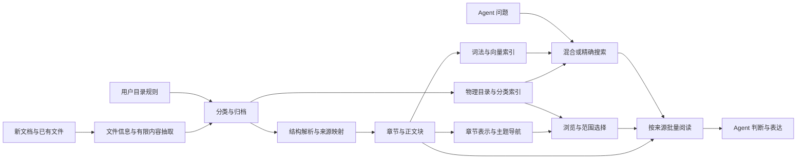

# PRD v0.3：规则归档、仓库树与 Agent 文档检索服务

日期：2026-09-10 · 状态：独立技术方案草案，待原型验证

**产品定义：** 面向本地文档仓库，文档进入时根据用户目录规则、名称、有限原文、类型和时间信息归档，形成用户可见、Agent 可读取的仓库目录与分类索引。目录内保留文档的标题树和 chunk 前后顺序；向量提供跨目录关联与直接检索；Agent 可按预算定位、展开和连续读取原文。

**本版边界：** 技术栈独立于既有项目。用户选定的项目目录是文件主本，用户可编辑的目录规则决定其组织方式；索引是派生层。Python、SQLite、LanceDB 等选择仍须独立通过功能与性能验证。自动归档面向已配置的接收入口及规则范围，存量批量重组是独立任务。

**版本关系：** 本版承接[独立评审](../reviews/2026-09-10-repository-tree-prd-independent-review.md)和[v0.2](2026-09-10-repository-tree-prd-v0.2.md)，将“自动整理文件不在范围内”修订为“规则驱动的新文档归档是核心功能”。v0.2 保留原方案及 chunk 顺序设计；[v0.1](2026-09-10-subtex-repository-tree-prd.md)保留前序集成方案。本版借鉴 Genaima 的文件角色与目录路由方式，不继承其技术栈、业务分类或项目专有路径。

**本次新增决策：** 仓库第一层导航来自可编辑的文件夹体系及归档元数据；无须等待全仓向量聚类或递归摘要才能使用。向量主题作为补充视图，不能自动重排物理文件夹。分类允许有界、按需的 LLM 调用，不把“完全零 LLM”作为产品目标。

## 1. 目标、假设与决策摘要

### 1.1 产品目标

1. Agent 找到证据时，同时获得文档路径、章节位置、来源版本和继续读取入口。
2. 自然语言、精确术语和仓库浏览都具有可用路径，不要求每次逐层遍历主题树。
3. 文件更新后逐步就绪；已知过期、未解析或未完成的内容不被误报为“没有答案”。
4. 对跨文档任务区分文件枚举、搜索覆盖、原文阅读和语义结论覆盖。
5. 在达到正确性与证据完整性要求的条件下，降低端到端延迟、模型输入量和索引维护成本。
6. 新文档有明确归档位置、分类依据与纠正入口；文件归档后即可进入目录索引，深度解析与向量就绪状态独立可见。

### 1.2 首版负载假设

| 档位 | 用途 | 数据/并发 | 环境假设 |
|---|---|---|---|
| S | 小型本地仓库 | 1万 chunks，1 个活跃请求 | 16 GB RAM、SSD、CPU，无 GPU 必需 |
| M | 常规目标 | 10万 chunks，并发 1/4 | 16–32 GB RAM；模型运行资源单列 |
| L | 扩展验证 | 100万 chunks，并发 4/16 | 工作站或单服务器；不套用 M 档时延承诺 |

文件数、PDF页数、正文 tokens、平均 chunk 长度、向量维度与更新比例全部记录；文件数量不单独代表负载。主目标是单机单写入者、多读者；多租户、高可用和分布式不进入首版。

### 1.3 本版推荐

| 项 | 推荐决定 |
|---|---|
| 第一层组织 | 用户目录规则 → 文档识别 → 主目录归档；目录树和元数据直接形成导航索引 |
| 分类成本 | 文件与入口事实优先，有限内容抽取补充；歧义时按需分类，按规则决定自动归档或待处理 |
| 编排与接口 | Python + Pydantic + 官方 MCP Python SDK |
| 文档解析 | Markdown/文本快速路径；PDF/Office 使用 Docling 并做格式验收 |
| 结构/状态 | SQLite，负责来源、规则/分类记录、文件操作账本、版本、树、任务与发布 manifest |
| 搜索引擎 | 优先验证 LanceDB OSS，统一正文 BM25、向量、过滤与搜索表版本 |
| 精确检索 | ripgrep 或具资源限制的等价实现；原始匹配与语义检索明确分开 |
| embedding | E5-small CPU 候选，BGE-M3/Qwen3-Embedding-0.6B 质量对照；评测后冻结默认模型 |
| 排序 | 词法+dense 的 RRF 基线；首轮即对比小候选 cross-encoder 精排 |
| 聚类 | scikit-learn 公共 KMeans/MiniBatchKMeans，产品记录分裂关系 |
| 代表文本 | 原文代表块 + 去重复 + 覆盖多个子节点；SVD 不默认启用 |
| 上线方式 | 先原型验证引擎契约，再打通规则归档、目录索引与原文阅读，最后增加语义主题导航 |

推荐不等于已经证明最优。若 SQLite FTS5 + sqlite-vec 在真实负载上同时满足过滤、质量和时延门，可以选择更少存储组件的方案；不为换栈而换栈。

## 2. 用户任务与范围

| 场景 | 入口 | 完成标准 |
|---|---|---|
| 新文档进入仓库 | 配置的收件目录/产品导入 | 按规则归档或进入待处理，位置与依据可见，目录索引已更新 |
| 纠正分类或目录规则 | 文件卡片/规则编辑器 | 单文件纠正保留依据；规则变更不静默搬迁存量文件 |
| 精确查编号/原句 | search literal/regex | 返回原始匹配、定位与可枚举的剩余命中 |
| 问制度、流程、研究结论 | search hybrid → read | 结论有原文，关键条件与例外得到处理 |
| 浏览仓库有什么 | browse folders/structure/topics | 物理目录、真实章节与统计主题标识清楚 |
| 比较所有文件 | browse inventory → 批量 search/read | 文件集合与未处理文件可核对 |
| 跨文档追踪关联 | search/read 多轮 | 继续搜索依据新发现，关联由证据支持 |
| 刚编辑文档就查询 | search/read + freshness | 最新观察状态准确；旧内容不伪装最新 |

首版必需格式：Markdown、TXT、DOCX、含文本层 PDF、转写 Markdown。扫描 PDF 的 OCR 为独立质量/耗时档；PPTX、HTML、CSV/XLSX 在格式测试通过后扩大支持。表格原文读取属于能力，公式重算、电子表格分析引擎与图片内容生成不属于首版。

非目标：未经配置的全盘整理、存量文件随聚类结果自动搬迁、自动撰写 Wiki、关系三元组抽取、合同有效性自动裁决、全盘监听、必须经目录或主题树才能检索、默认上云处理所有文件。

## 3. 核心概念：目录治理、原文结构与语义关联

| 结构 | 描述什么 | 技术表示 | 不负责什么 |
|---|---|---|---|
| 仓库目录树 | 文件的业务归属、角色和摆放位置 | 用户规则 + 物理路径 + 目录卡片/分类字段 | 不自动证明内容事实或材料已获确认 |
| 原文结构树 | 文件/章节/段落/表格的包含顺序 | 邻接关系 + source locator | 不推断跨文档语义 |
| chunk 顺序 | 文档内原文的前后位置和续读入口 | 同快照序号 + 范围引用 | 不机械判定论述已完整 |
| 语义主题视图 | 内容相近的章节/文档分组 | 聚类层次 + 多对多成员引用 | 不重排物理目录，不代表事实关系 |
| 物理检索索引 | 词项与向量的高效候选搜索 | 倒排、flat 或 ANN | 不作为 Agent 阅读的语义目录 |



同一文件有一个主要物理归档位置，可通过项目、对象、文档类型、时间等字段出现在多个检索视图；不为多标签复制多份原件。同一文档也可关联多个语义主题。原文包含关系组成树；前后顺序和跨文档相似/引用共同构成带类型的图，不要求全部关系组成 DAG。目录计数与主题成员计数分别报告；全仓文件数量以 inventory 的唯一文件为准。

## 4. 功能规格

| ID | 能力 | 优先级 | 硬要求 |
|---|---|---|---|
| F01 | 结构解析与原文定位 | P0 | 读序、标题、表格和来源可验证 |
| F02 | 身份/版本/发布代次 | P0 | 解析版本变化不沿用错误节点引用 |
| F03 | hybrid/literal/regex 搜索 | P0 | scope 前置；搜索语义与分页语义明确 |
| F04 | 按目标批量阅读 | P0 | 不静默截断，预算及剩余范围可见 |
| F05 | 文件清单与章节浏览 | P0 | 固定快照可完整枚举 |
| F06 | 增量就绪与崩溃恢复 | P0 | 来源、正文、检索代次一致，不读半成品 |
| F07 | 模型/分词/精排对照 | P0 验证 | 选型有质量与硬件耗时证据 |
| F08 | 主题导航与原文代表 | P1 | 单例不丢，分组不改文件，跨主题引用可追溯 |
| F09 | 主题补充召回 | P2 实验 | 相对 dense+BM25 有新增证据价值才启用 |
| F10 | SVD 代表文本 | P2 研究 | 不退化、优于代表块基线才产品化 |
| F11 | 规则驱动的新文档归档 | P0 | 单一规则主本、可追溯分类、无覆盖、原文可达，歧义可纠正 |
| F12 | 目录与分类索引 | P0 | 规则定义和实际文件清单可浏览，分类状态/来源清楚，不依赖 embedding 完成 |

### 4.1 目录规则是产品配置

参考形态是“AGENTS.md 触发读取 → 独立文件摆放规范”。仓库根规则入口仅指向一份版本化的目录规则文件；产品 UI 和文件编辑维护同一份主本，避免聊天约定、Agent 提示与数据库规则各自漂移。参考文件见 §16。

规则包含：目录用途、文件主要角色、对象/项目维度、文档类型、日期语义、目标路径模板、匹配优先级、命名策略、自动归档条件和待处理入口。产品技术实现采用 Markdown 规则文件中标记的结构化 JSON 配置块，正文解释业务含义；用现有 Markdown 解析器定位、标准 JSON 解析与 Pydantic 校验。自由文本规范可在设置阶段辅助转换为规则草案，不由每次文档进入时重新解释成不同动作。

可提供来源、工作、知识、交付、归档等角色模板，用户可修改目录名称与组织轴；不强制所有仓库沿用同一套文件夹。文件扩展名是格式，合同/会议纪要是文档类型，来源/交付是角色，三者分别存储。目录的包含标准和排除标准保留为 Agent 可读的目录说明。

文件内容只作为分类材料，不能修改目录规则。文件名含“最终版”、PDF 格式或最近修改时间，都不能自动把来源材料升级为已确认交付物；角色提升依赖用户动作或已配置的生成/检查完成事件。

### 4.2 入库识别与分类流程

首版入口是用户配置的收件目录和产品导入操作；已经处于目标目录的文件登记原位。Agent 新生成文件可先取得归档决定再落盘，避免先写根目录后搬迁。已有文件树接入时先登记与索引，存量批量搬迁使用单独的操作计划。

流程：文件稳定可读 → 识别基本信息 → 按需读取有限内容 → 分类与目标路径 → 执行归档/待处理 → 发布目录索引 → 后台补齐正文与向量索引。目录归档成功、全文解析完成和向量可检索是三个独立状态。

| 信号 | 获取方式与用途 | 边界 |
|---|---|---|
| 名称与来源 | 原文件名、入口、来源目录/系统及已有显式标签 | 名称线索与用户指定归属分别记录 |
| 格式与类型 | 扩展名/文件头识别格式；标题和局部内容辅助判别文档类型 | 冲突时保留候选，不按扩展名推定业务角色 |
| 对象/项目/主题 | 名称、标题、目录、首尾内容及具有区分性的已解析片段 | 局部内容不足时允许未知或待处理 |
| 时间 | 文件名日期、内容中的事件/签署/版本日期、接收时间与文件修改时间 | 分字段保存来源；mtime 不自动等于业务日期 |
| 内容样本 | 复用解析缓存；优先标题/目录/首尾及目标字段附近原文 | 保存抽样范围，扫描件的 OCR 需求单列，不伪装已理解全文 |

执行顺序以规则和显式事实为先；无法唯一确定时，可用候选目录的说明与已分类代表材料做 embedding 匹配，或用有限样本进行一次有预算的 LLM 分类。两者是消歧手段，不是每个文件的必经依赖。首版抽样与模型调用有文件级 token/页数上限，超限进入待处理或独立深度识别任务；不因分类自动对全部文件做递归摘要。

模型返回候选归属、字段值和证据位置，产品校验允许目录、字段和冲突后才执行路径操作。自动归档条件来自规则及验证结果；未校准的模型 confidence 不充当正确概率。多候选、日期冲突或缺少必填字段时留在待处理区，卡片展示候选与原因，用户可以单项或批量纠正；不要求每个确定命中文件都重复确认。

### 4.3 目录与元数据共同组成索引

物理路径表达一种稳定的主要归属；其余维度是多值标签或可过滤字段。例如可选路径模板为 `sources/<对象>/<文档类型>/<业务年份>/原文件名`；缺少业务日期时进入规则定义的“日期未知”，不能填成导入年份。实际目录层级由用户规则决定，不由每次全仓聚类生成。

| 对象 | 最小信息 |
|---|---|
| Folder | folder_id、parent_id、relative_path、用途/包含与排除标准、policy_revision |
| Document classification | document_id、primary_folder_id、role、document_type、对象/项目/主题、各类时间字段、classification_state |
| Field provenance | field、value、origin=user/rule/filename/content/model、evidence_ref、识别所用 source_revision |
| Routing decision | decision_id、policy_revision、规则命中/冲突、候选位置、选定位置、识别方法、用户纠正记录 |

目录卡片由规则说明、直接子目录、文件类型/时间分布、唯一文件数和待处理数形成；按聚合字段和原文标题生成，不必为每个文件夹调用 LLM 写摘要。可导出独立的 `.catalog.generated.md` 供通用 Agent 阅读，它是有版本的派生清单，不能覆盖用户维护的 AGENTS.md、README.md 或 index.md。大目录分页读取，导出内容与数据库目录索引使用同一 publication_epoch。

search 可检索名称、目录说明、分类字段和原文；scope 新增 folder_ids（含子目录）、document_types、roles 及明确字段的日期范围。显式 scope 是硬过滤；由问题推测的目录只作路由线索并保留全仓补检入口，避免错分文件被永久排除。归档推断可辅助找文件，最终回答中的业务事实仍需原文或明确的用户记录支撑。

### 4.4 归档执行、纠正与增量

配置的规则允许对新到文件自动归档，无须逐份审批。首次将外部材料接入仓库时保留来源路径/信息与原名；用户选定的项目目录保存主本，不在索引私有目录另存一份隐藏主本。首版自动移动限定在同一文件系统的受管范围内；跨设备移交、存量重组和依赖资产的成组迁移为独立导入/整理操作。

每次移动形成 operation_id 和操作账本，记录原路径、目标路径、源 hash、规则版本及阶段。执行前核对源版本与目标冲突，使用失败即不覆盖的移动操作；相同名字不等于相同文档。内容 hash 相同也保留来源记录，不能自动删除重复文件。存在相对链接或伴随资源时保留目录单元关系，无法保证时进入待处理，不承诺任意格式链接自动修复。

目标路径由已校验的相对路径模板生成，规范化后仍须位于配置的受管根内；绝对路径注入、路径穿越或符号链接逃逸不能变成有效归档目标。归档写操作由导入/目录管理服务执行，检索工具仅提供查询和原文读取。

文件系统移动和数据库发布不是同一事务：记录 planned → 文件移动且校验原文 hash → 更新路径/分类并发布 manifest → committed。中断恢复按账本检查两侧路径及 hash，再完成登记或标记需处理；不能再次移动已成功文件或用旧源覆盖新内容。重复文件事件由 operation_id/已观察版本识别。索引切换前访问旧路径失败时报告 filing_in_progress 或 source_changed，不返回“文件不存在”的业务结论。

用户纠正单文件位置时更新该文件分类和目录成员；只有显式保存为规则才影响后续文件。规则更新不自动回扫搬迁历史文件。已登记文件移动保留 document_id，更新路径及受影响的引用解析；纯移动不改变 source_revision。正文 chunk/embedding 不包含物理目录路径，纯移动复用原文索引，只更新目录/过滤投影；若用户启用的输入模板确实引用了变化字段，按 representation_revision 定向失效。

旧快照仍按旧目录成员关系枚举；read 的当前文件位置通过 document_id 和移动账本解析，只有源 hash 相同才可在新路径读取该旧引用。分类/路径快照与当前文件位置分别呈现，不能按旧文件名猜测新来源。归档进程只负责可核验的路径操作，文件版本与阅读一致性继续遵守 §8。

文件内容变化后，旧分类依据标记需复核；默认不因正文编辑反复搬迁文件。先更新原文索引，分类变化形成新的决定。归档纠正可生成规则候选，首版不做不可解释的隐式自学习。

## 5. 解析与规范文档模型

### 5.1 解析路线

快速文本路径：直接读取 TXT；Markdown 用 markdown-it-py 的解析 token 与源码行映射构建树，列表、代码块和表格由语法决定，不能靠标题正则独立解析整份 Markdown。[markdown-it-py](https://markdown-it-py.readthedocs.io/en/latest/using.html)

PDF/Office 路径：Docling 为首选候选，保留其结构、版面和 provenance，再映射到产品的最小文档模型。不能只导出 Markdown 后丢弃来源结构。扫描件按页触发 OCR，正文不可读与解析失败分别记录。[Docling IR](https://docling-project.github.io/docling/concepts/docling_document/)、[格式支持](https://docling-project.github.io/docling/usage/supported_formats/)

解析器选择基于标注样本的读序、标题层级、表格与定位表现，不能只根据“支持 PDF”列表决定。正文抽取成功不等于树解析正确。

### 5.2 最小 IR

| 对象 | 字段/约束 |
|---|---|
| Document | document_id、source_revision、parse_revision、media_type、relative_path |
| Node | node_id、parent_id、kind、ordinal、text_ref、locator、structure_origin |
| SourceRange | text 行/字节、PDF 页/坐标、Office 结构路径、表格行列、音频时间 |
| Relation | contains、explicit_reference；语义成员关系另表 |
| Warning | unsupported_locator、ambiguous_heading、ocr_required、partial_table 等事实状态 |

结构来源区分 explicit、layout_inferred、synthetic_container。无标题内容可挂在中性容器下；不生成假装来自作者的标题。结构树无环，每个原文节点只有一个结构父节点。

纯文本字节位置对应原始编码/换行，规范化文本的偏移另存映射。PDF 读取的是提取文本时，明确 `text_kind=extracted`，不称作逐字节原文件。DOCX 未排版时不伪造页码。表格合并单元格与跨页问题在输出中保留未恢复状态。

### 5.3 切分与 embedding 输入

原文 block 与检索 chunk 分开。chunk 可覆盖若干连续 blocks，也可对应超长 block 的子范围。节点身份不等于 embedding chunk 身份。

语义边界切分旨在尽量保持局部表达完整，不保证一组论点、条件或步骤处于同一 chunk。例如原文有四个观点，前三个完整落入 chunk A，第四个完整落入 chunk B；只召回 A 时，第四个观点仍在索引中，但未进入本次阅读。切分边界不能作为论述已完整的信号。

默认尝试每 chunk 约 320 个模型 tokens，实际总长度包含模型前缀与标题；受所选模型上限约束。长列表/表格/段落允许分片，保留引导句、表头与完整 block 引用，不由模型 tokenizer 静默截断。长上下文模型也需要评测，不因支持 32K 就整篇嵌入。

heading_path、标题与原文分别存储。检索输入可带标题，但代表选择要测量标题/模板重复是否主导向量。长文档不能因 chunks 多就无限主导主题分组；可用每文档样本权重和结构代表候选限制影响。

### 5.4 文档内 chunk 顺序与续读

每个 chunk 保存 document_id、source_revision、parse_revision、chunk_id、chunk_seq、node_refs 与原文范围。chunk_seq 是同一文档在固定 publication_epoch 所发布切分结果中的零基连续序号，按解析后的原文阅读顺序生成；不是相关性排名、观点编号或全仓编号。结构节点的 ordinal 只表达兄弟节点顺序，不能替代文档内 chunk_seq。切分规则变化可以重排序号，序号不承担跨版本稳定身份。

同一快照中，prev/next 由文档 ID 和序号查询派生，不另存一套需同步的链表。关系覆盖全部已生成 chunks，包括尚未生成 embedding 的块。chunk_count 仅在该文档完整切分完成时报告为总量，否则为 null，并报告顺序覆盖未完成；最后一个已就绪 chunk 不冒充文档结束。解析未恢复的原文范围仍由解析状态报告，连续序号不能证明解析无遗漏。

标题树提供向上读取章节的路径，chunk 顺序提供沿原文向前、向后读取的路径，两者共同构成原文阅读层。相邻块无需再次通过向量阈值或 Top-K 筛选。顺序元数据作为工具返回的位置事实，不拼入正文或 embedding 文本。

首版不依赖 LLM 识别“论述组”。原文显式列表、步骤组可沿结构节点读取；无法确定组边界时保留未知状态和续读入口。chunk 序号只能表明原文位置与后文可达性，不能机械判定四个观点已经读全；固定 overlap 或固定补一个相邻块也不提供这一保证。

## 6. embedding、聚类与 SVD

### 6.1 模型选型与冻结

| 候选 | 用途 | 已知功能边界 | 选择门 |
|---|---|---|---|
| multilingual-e5-small | CPU 默认候选 | 384 维，512-token 输入，检索/聚类模板有区别 | CPU P95、中文短问、长文切片召回 |
| BGE-M3 | 多语质量对照 | 模型提供 dense/sparse/multi-vector 能力；首轮只测 dense，避免把三种机制同时加入 | 与 E5 同预算质量/成本比较 |
| Qwen3-Embedding-0.6B | 指令式 embedding 对照 | 支持任务指令与可变输出维度 | 模板正确性、CPU/GPU延迟、领域召回 |
| BGE-reranker-v2-m3 | 质量模式精排候选 | 输入 query 与 passage，输出相关性评分 | 精排 20/40 候选的真实耗时与条件保留 |

来源：[E5 模型卡](https://huggingface.co/intfloat/multilingual-e5-small/raw/main/README.md)、[BGE-M3](https://huggingface.co/BAAI/bge-m3)、[Qwen3](https://huggingface.co/Qwen/Qwen3-Embedding-0.6B)、[BGE reranker](https://huggingface.co/BAAI/bge-reranker-v2-m3)。模型卡能力不代表在本文仓库上的排名；CPU 候选也不构成亚秒推理保证。

模型配置冻结 model ID、权重 revision、tokenizer revision、pooling、归一化、任务模板、维度及量化方式。配置 ID 进入缓存和索引 metadata；不同配置的向量不混用。查询 embedding 批量执行、缓存；文件 embedding 按内容 hash 复用。

检索向量可作为章节聚类的低成本候选；聚类专用模板重新嵌入作为对照，额外成本单列。均值向量、代表块向量集合均需测试，不能假定整文均值就是文档语义。

### 6.2 聚类策略

规则目录与分类索引先提供仓库第一层导航；聚类只形成补充的语义主题视图，不承担物理文件摆放。先做一层语义主题，证明可读性与任务收益，再增加必要的层次。推荐使用 scikit-learn 公共 KMeans API，产品按成员规模与聚类收益决定是否继续分裂；每次分裂记录 parent_id、成员与参数。BisectingKMeans/MiniBatchKMeans 可作为批量性能对照，不读取库的私有树对象来形成持久化协议。[scikit-learn](https://scikit-learn.org/stable/modules/generated/sklearn.cluster.BisectingKMeans.html)

使用归一化输入，但区分欧氏 KMeans 与 spherical KMeans。初始化随机种子固定；平分、空簇、过小簇有确定处理；数据无明显分组时允许更宽导航。单例与离群材料始终在原文清单可达。

一个章节有一个主要主题，可按校准的距离与间隔增加次级引用。一个文档通过不同章节出现在多个主题。次级归属、分支数、深度与拆分阈值属于可调参数，不作为“最佳实践常数”。

每次编辑先更新对应章节表示。主题生成采用批量窗口：短期分配至当前冻结质心，累计变化或导航质量退化后构建新代次。全局重聚类费用单列；不设计每个击键都精确维护全仓聚类。

### 6.3 默认代表文本

为每个主题选择质心附近原文候选，去除完全重复后按多个文档/子章节分配代表名额。代表文本固定上限，保留节点引用。主题标签优先使用原文标题与区分性词语；标签差时使用“主题 017”，不以生成式编写新概念名作为建树前提。

主题代表文本属于 navigation；原文证据从其引用节点读取。多样性不是每题强制多来源配额，也不能覆盖相关性约束。

### 6.4 SVD 研究项及退出条件

设 `M=UΣVᵀ`，能量贡献评分为 `Σ(j≤k) σ_j²U_ij²`。当 k 等于矩阵秩时，它等于候选向量的平方长度；逐行归一化后全部为 1。因此高能量保留阈值不是代表性保证。[SVD 定义](https://numpy.org/doc/stable/reference/generated/numpy.linalg.svd.html)；退化结论为本次数学推导。

SVD 只在低秩信号清楚、分数有区分度且胜过代表块基线时考虑采用。必测正交单位向量、同模板不同事实、少数关键例外和重复文本。记录有效秩、代表覆盖、分数分散度与选句成本；不把“保留 95% 数值能量”写成“保留 95% 信息”。

不通过时不启用、不占据核心建设里程碑。相关思路可参考 [SVD-RAG](https://arxiv.org/html/2607.10316v1)，但其小规模实验不能为本产品提供性能担保。

## 7. 存储引擎独立选型

### 7.1 比较矩阵

| 组合 | 功能适配 | 性能关注点 | 运行代价 | 本版结论 |
|---|---|---|---|---|
| SQLite FTS5 + sqlite-vec | 状态/正文/向量可集中；轻量 | 短中文词、范围过滤、扫描规模和并发 | 最少组件，CJK词法需明确设计 | 轻量对照；达标即可选 |
| SQLite + LanceDB OSS | 结构状态与搜索分工；FTS/dense/filter/version集中于搜索表 | 索引维护、过滤选择性、未索引尾部、MVCC保留 | 2 个存储组件，需发布协议 | 独立单机产品首选验证 |
| SQLite + Tantivy + FAISS/USearch | 索引可独立优化 | 跨索引过滤、删除、融合与绑定能力 | 多份索引同步，自研接口较多 | 非默认；明确瓶颈时再考虑 |
| 状态库 + Qdrant Server | dense/sparse/hybrid、payload过滤和服务并发 | payload索引、召回参数、服务资源 | 多一个本地/服务器进程 | L档/服务式候选，不作为首版必需 |
| PostgreSQL + 扩展 | 事务与服务管理集中 | ANN、中文词法扩展和本机资源 | 服务常驻与分发较重 | 服务式备选，不为桌面默认启动 |

依据：[LanceDB hybrid](https://docs.lancedb.com/search/hybrid-search)、[Qdrant hybrid](https://qdrant.tech/documentation/search/hybrid-queries/)、[Qdrant client local mode](https://github.com/qdrant/qdrant-client)、[USearch bindings](https://github.com/unum-cloud/usearch)。本矩阵是适配判断，未实测吞吐排名。

### 7.2 LanceDB 的采用条件

采用当前支持的 Lance-native FTS，不能混用旧 Tantivy-only 参数。中文分词在官方 Python API 中有 Jieba 路径，ICU 可用于混合语言；需要打包词典/模型并验证锁定版本在目标 OS 上可用。默认英文空白分词不能自动作为中文质量基线。[FTS 文档](https://docs.lancedb.com/search/full-text-search)

新行尚未进入物理索引时，搜索应覆盖未索引尾部；不启用跳过尾部的快速模式来兑现延迟目标。后台维护以尾部规模与延迟为依据，不能只设一个全局固定周期。更新和索引维护能力均以 OSS 实际提供范围为准，不能引用 Enterprise 自动管理来设计 OSS。[索引维护](https://docs.lancedb.com/indexing/vector-index)

以下门有任一失败，先暂停该选型：中文分词不可部署；范围过滤不能满足候选正确性；更新后新内容不可见；版本句柄无法安全保留；M档P95或内存预算失败。此时评估矩阵中的下一候选，不在产品内长期并列多套检索后端。

### 7.3 物理向量索引

S档先使用 exact 检索作为正确性基准。M/L档对比 exact、IVF_FLAT 和库实际提供的 IVF_HNSW_FLAT/量化变体，不能将 LanceDB 的 IVF 内 HNSW 称作独立顶层 HNSW。量化需单独测召回损失。[向量索引类型](https://docs.lancedb.com/indexing/vector-index)

过滤选择率低、候选范围小时，exact 可以是合理执行计划；大范围时 ANN 可能更合适。按照候选数量与成本模型选择执行方式，并用 exact Top-K 校验 ANN Recall@K。索引参数不能只从数据总量推导，不跨硬件复用未经验证的阈值。

## 8. 版本、增量与一致性

### 8.1 四类版本

| 标识 | 含义 |
|---|---|
| source_revision | 原始文件内容 hash |
| parse_revision | source_revision + parser/IR版本 + 解析配置 |
| representation_revision | 模型/任务模板/tokenizer/切分规则/输入hash |
| publication_epoch | 对外可读的一组结构与搜索表版本 |

document_id 独立于文件名；明确 rename 可保留身份，模糊的删除+新增不猜测。节点 ID 在同 parse_revision 内稳定，解析器变化可产生新节点。相同文字不同文件保留各自来源，不能仅按内容 hash 合并文档身份。

### 8.2 存储职责

SQLite：repositories、documents、document_versions、folders、classification_records、field_provenance、routing_decisions、file_operations、nodes、source_ranges、topics、memberships、jobs、publications、query_handles。规则文件为配置主本，数据库存 policy_revision 及其已校验快照；目录成员/分类按 catalog_epoch 发布。正文规范化缓存可落 SQLite 或内容寻址文件，路径由 SQLite 管理。

LanceDB：检索 chunks、标题/正文检索字段、vector、document_id、parse_revision、chunk_seq、node_refs、原文范围与结构祖先/范围过滤字段。同一文档同一发布快照内 chunk_seq 唯一；文档和序号范围查找不依赖向量就绪。搜索数据是派生投影。索引数据可以删重建；原文件不写入索引服务私有的唯一主本。

folder_id/目录祖先、角色、类型及可过滤日期从分类快照投影到搜索记录，参与 §8.3 同一次 manifest 发布。归档完成而正文未就绪时，SQLite 目录/文件卡片已可浏览和按名称/字段定位；卡片不冒充可回答问题的正文命中。卡片匹配返回导航引用，正文仍通过 search/read 获得，避免为“先有目录索引”强制制造空向量或虚构 chunk。

### 8.3 发布协议：先准备，再切换可读指针

每个 root 只有一个发布写入者。读请求先读取 SQLite 的 manifest：`publication_epoch → {catalog_epoch, search_table_version, model_config, coverage}`，随后只读这组版本，不直接打开搜索表 latest。

仅目录/分类就绪的批次可先发布 catalog_epoch，复用原 search_table_version（新仓库初始化为空表），并将对应文件标为正文未就绪；不等待完整解析。已有 chunks 的目录或分类改变时，先写过滤投影再共同发布新 manifest，不能只更新 SQLite 造成目录过滤与搜索结果不同步。下述正文批次与目录批次由同一发布者串行执行。

1. 捕获文件版本并稳定读取；创建带 job_id 的准备记录，解析新 IR。开始/结束状态不一致的文件重新排队。
2. 将新 document_versions、nodes 写为 prepared，不改变活动目录版本。
3. 写入该批文档的搜索投影，在搜索表中替换旧 chunks。删除限定于本批 document_id，避免“源集合未匹配删除”误删全仓。写入必须幂等并验证业务键唯一性。
4. 验证变更文档的 chunk 集合、文本范围和模型配置一致；取得已提交搜索表 version。向量未好时可发布词法就绪版本，vector 字段缺失不生成假向量。
5. SQLite 短事务一次发布新 catalog_epoch 与 search_table_version。此后新查询才看到新版本。
6. 新 vector/主题就绪时走同一协议发布下一代；后台 optimize 产生的新物理版本也通过发布者管理。

词法覆盖包含全部已解析当前 chunks；dense 覆盖仅包含当前 representation_revision 且 vector_ready 的 chunks，返回各自分母与缺失数。G0 必须验证所选引擎对空向量与部分就绪索引的行为；不能用全零向量填充，也不能把 dense 较小的覆盖集称作整仓已就绪。

SQLite 事务不是跨库分布式事务。上述 protocol 是应用层发布设计，需故障注入验证。LanceDB 支持表版本与版本读取，但版本保留、写入确认和索引完整性必须在锁定版本上验证。[版本接口](https://docs.lancedb.com/tables/versioning)、[更新接口](https://docs.lancedb.com/tables/update)

### 8.4 崩溃恢复和清理

manifest 未发布时，prepared 数据对用户不可见。重启后，写入者根据 journal 完整重放同一批次，或将搜索写入头恢复到最后已发布的搜索快照后重建；不能在混入未发布变化的 head 上继续下一批并直接发布。manifest 已发布则按其指针恢复，旧节点与搜索版本在句柄租约结束后清理。

query handle 初始 TTL 为 10 分钟、受内存/磁盘预算限制；活动版本加保留保护。自动维护不能清除仍被 manifest/句柄引用的版本。超预算提前过期返回明确错误，不静默换新快照。节点历史仅用于短期一致读取，不提供永久历史档案产品承诺。

### 8.5 新鲜度与读取

search 报告 indexed_at、source_observed_at 和 known_changed/pending 文件数，并分列归档、目录、解析、词法与向量就绪状态。它反映索引视图，不能无条件声称与此刻全部磁盘文件一致。监听是提示，周期 reconciliation 校正漏事件。

对于已经观察到修改或删除、但新投影尚未发布的文件，默认当前查询在候选生成前排除其旧版本并列入 pending/unavailable；显式快照查询可以返回旧版本且标记历史状态。查询记录该观察集合的水位，分页中若当前视图发生变化则失效重开，不能在已排序结果后直接删项并声称仍是完整Top-K。

read 默认按 expected source_revision 核验目标原文件；严格模式在本次读取中核对内容 hash，计入 I/O 耗时。源文件已变化返回 source_changed，而不是换成新段落沿用旧引用。显式 snapshot 阅读可使用短期缓存并标注历史版本；不把旧缓存称为当前原文。

## 9. Agent 工具契约

### 9.1 三项核心能力

`repo.search` 找候选，`repo.read` 读证据，`repo.browse` 看范围。管理/健康状态可另有工具，但日常检索不要求额外发现接口。工具名是本稿规范名，可由 MCP schema 直接暴露，与某个大项目工具前缀无关。

search 内部机械并行，read 支持批量；工具报告状态，Agent 判断下一步和答案充分性。工具数量不是评测成绩，三个工具也不构成最高效的先验证明。

### 9.2 search：分请求范围、共享预算

```json
{
  "requests": [
    {"qid": "q1", "query": "延期交付如何处理", "mode": "hybrid", "scope": {"root_id": "r1"}},
    {"qid": "q2", "query": "豁免", "mode": "literal", "scope": {"root_id": "r1", "document_ids": ["d2"]}}
  ],
  "max_output_tokens": 2500,
  "max_output_bytes": 24000
}
```

数组起始上限 8 个请求，每个请求最多取 40 个词法、40 个 dense 候选，融合后最多保留 60 个；返回条数由预算控制。它们是待调优默认值，不是服务能力承诺。每题留最低结果配额，超出部分按候选排序分配；批量部分超时逐题返回状态。

预算参数可省略并使用服务默认值；支持整批 deadline_ms，后端子任务共享剩余时间。超出模型或服务查询长度上限时返回 query_too_long，不静默截掉问题条件。质量模式与低延迟模式是明确的调用配置，超时会报告未执行的精排阶段。

scope 先规范化：root 与 document/node/topic 范围取交集。省略集合表示不增加限制；显式空集合表示空范围，避免把空过滤误解成全仓。topic scope 固定其 generation，并标记统计成员范围。

返回每题 qid、hits、候选句柄、cursor、publication_epoch、通道状态、原文 excerpt、heading_path、source_revision、parse_revision、citation、parent_id、估计章节大小。数值 score 是相关性或排序信息，不是答案正确概率。

scope 的 folder_ids 在当前 catalog_epoch 展开子目录，并与其他范围取交集；日期过滤包含 field、start/end、时间精度及是否纳入 unknown，不把年月粒度补成某一天。名称、目录说明和分类字段可通过目录卡片的有界文本/字段匹配返回独立的 matched_locations={document_ref|folder_ref}；它们属于导航，不混作原文 hits 或第三路重复投票。全文尚未就绪时仍可返回这些位置卡片及解析状态。

每条 chunk 命中另带 chunk_id、position={seq,total} 和 adjacent={prev,next} 可读引用；total 未知时为 null。相邻引用绑定同一文档与 publication_epoch，已到文档端点时为空，顺序未就绪时另报 boundary_unknown。卡片的末尾只是本次返回范围结束；snippet 被截短时，同时保留本块剩余原文的读取入口。position/adjacent 不随检索重排而变化。

### 9.3 搜索分页与覆盖语义

literal/regex：按文档 ID 与原文位置稳定排序，可分页枚举匹配；达到扫描/输出/超时上限时返回 `scan_complete=false` 和续查 cursor。regex 不支持的语法明确报错，不降为语义查询。

hybrid：cursor 遍历固定候选结果集，返回 `candidate_set_complete`；它仅表示本次候选已经读完。响应始终标记 `semantic_exhaustive=false`。需要“所有文件都检查”时先 inventory，再分文件搜索/读取。

handle 保存 query 配置、scope、publication_epoch、排序后的候选 ID 和去重状态，受 TTL 与总量限制。过期返回 handle_expired；跨快照续读返回 snapshot_changed。命中不够时 Agent 可以新搜，不伪造“继续”是同一批结果。

### 9.4 read：原文与阅读大小可控

```json
{
  "targets": [
    {"node_id": "n1", "source_revision": "s1", "parse_revision": "p1", "view": "context"},
    {"node_id": "n2", "source_revision": "s2", "parse_revision": "p2", "view": "section"}
  ],
  "consistency": "current",
  "max_output_tokens": 5000,
  "max_output_bytes": 48000
}
```

view = exact/context/section。exact 返回目标原文；context 返回必要前后文；section 返回最近完整小节，过大则提供局部范围与剩余 cursor。每批 targets 上限起步为 16。topic 是导航对象，不能直接作为整仓原文读取；browse(topic) 提供代表原文的可读 refs。

target 也支持 {chunk_id, publication_epoch, view}，与 node_id 目标二选一；服务从指定快照解析其原文范围与结构引用，再按 consistency 检查来源。相邻引用可直接作为 target 读取，也可与父章节引用批量读取；快照过期按 §9.3 返回 handle_expired，不凭旧序号读取新版本。continuation cursor 延续当前阅读范围，相邻引用则定位原文中的前后块，两者不与搜索候选 cursor 混用。

每项状态为 ok/partial/source_changed/source_deleted/parse_unavailable/filing_in_progress。返回 returned_ranges、unread_ranges、source_check_at、citation 与 cursor。合并相同版本的重叠范围，保留不同来源与版本差异。表格按行分页时附表头；正文未恢复的部分明确标记。

响应另带本次 scope 及其前后边界状态 available/end/unknown；end 只表示指定原文范围的端点。预算不足时保留局部原文与剩余范围/续读引用，不把输出截止改报为章节结束。按原文范围去重，避免 overlap 或多个命中的邻接展开重复计入阅读量；相邻块的引用与定位仍各自保留。

源文件未变但请求的parse_revision已不可读时返回parse_revision_unavailable；不得在新解析结构中按同名标题猜测旧node_id。调用方可重新浏览该文档获取新节点。

### 9.5 browse：导航与枚举分开

view = inventory/folders/structure/topics。inventory 对一个 publication_epoch 完整分页，含归档、解析和向量状态，支持名称/已知分类字段过滤。folders 返回规则说明、物理目录、分类分布、文件计数和待处理入口；可按名称或目录说明有界匹配。structure 返回真实结构节点与大小。topics 返回统计标签、成员引用、代表块、唯一文档数和未归类入口。

coverage 只记录能机械验证的事实：files_enumerated、files_search_attempted、files_with_read_ranges、unavailable_files、remaining_cursor。不能从“读过一段”计算“整份文档已理解”，也不输出 host 自评的语义覆盖通过标志。

### 9.6 预算与传输

`max_output_tokens` 在已知目标 tokenizer 时精确计数，否则是尽力满足的目标，返回 tokenizer_id 与 token_count_kind。`max_output_bytes` 是服务返回内容的硬限，不保证 MCP 客户端包装后仍占相同 tokens。

服务规定最小可接受响应预算（初值1024字节）与最大值；小于最小值直接返回budget_too_small，避免错误元数据本身都装不下的无解契约。所有限制的服务默认值通过工具schema提供。

元数据也占预算。正常命中卡片优先提供原文、来源、范围、继续读入口；距离、解析后端和通道耗时放可选 diagnostics，避免每次几十个字段吞掉上下文。结果内容是数据，不提升为工具权限或系统指令。

## 10. 搜索与阅读执行计划

### 10.1 默认流程

```text
解析范围与发布快照
  → 目录/分类位置卡片（可选导航，直接检索可绕过）
  → BM25候选 + dense候选（并行）
  → 按原文范围去重 + RRF
  → 质量模式：小候选集 cross-encoder
  → 预算化原文卡片
  → Agent 按需批量读取局部/小节
```

相关性先于来源配额；完全相同范围去重，版本不同不可抹平。topic 默认不增加第三路融合，只有实验证明新增原文证据价值才开启。

RRF 用于不同通道名次融合；不能将 BM25 分数、余弦值和聚类距离直接相加。精排输入保留 query、短标题和候选原文；超过模型窗口时分片评分并保留引用，不能静默截掉规则的“除外”部分。最终回答仍由 Agent 读取证据后完成。[Retrieve and rerank](https://sbert.net/examples/sentence_transformer/applications/retrieve_rerank/README.html)

### 10.2 范围过滤与 ANN 质量

root/目录/文档/章节及显式分类范围同时作用于 BM25 与 dense 候选生成。为 document_id、kind、必要范围字段建立可用的标量索引；目录移动后过滤投影与 manifest 同步更新。API 接受过滤不等于执行计划已前置，PoC 要检查候选范围与计划。[LanceDB 过滤](https://docs.lancedb.com/search/filtering)

禁止全局 Top-10 后丢掉范围外结果并称作“范围内 Top-10”。如果某过滤无法高效下推，应对合法候选范围做 exact；超时则如实返回 partial，不能静默遗漏。

### 10.3 精确检索与中文

中文 BM25 采用经过验证的分词与查询同处理；短词、编号和原句走 literal。literal 定义默认区分大小写、Unicode 字符原样匹配；大小写折叠、规范化等变化必须由参数显式选择，保留 source offset 映射。

regex 可使用 ripgrep 默认 Rust regex 语义，配置模式长度、扫描字节和 deadline。工具根据授权文件清单传入参数，避免拼 shell 指令；导出的规范文本按 document_id 映射回来源。[ripgrep](https://github.com/BurntSushi/ripgrep)

### 10.4 上下文展开

先在章节内合并相邻命中，保留标题与适用范围。父章节太大时返回邻近小节而非提升到文档根。跨文档关系由显式原文链接或 Agent 新查询追踪；向量近邻不自动生成“相关规定已全部补齐”的承诺。

命中块同时暴露原文序号、相邻引用和父级结构，Agent 可选择继续读块或展开章节。结构已识别的列表/步骤组按该范围分页读取；未识别组边界时不把 chunk 末尾、页末或固定相邻窗口当成语义完成条件。后继块即使语义检索未命中，仍可由序号直接读取。对于“有四点、当前只见三点”等证据状态，工具报告原文与未读范围，是否补读及何时收束由 Agent 决定。

## 11. 运行架构与开源组件

| 模块 | 组件建议 | 产品自建部分 |
|---|---|---|
| 规则与分类 | markdown-it-py、标准 JSON、Pydantic；按需复用 embedding/LLM provider | 规则快照、候选/冲突、字段来源与纠正逻辑 |
| 文件归档 | 目标 OS 的无覆盖文件操作、SQLite 操作账本 | 路径验证、原文校验、操作幂等与中断恢复 |
| 目录索引 | SQLite + 可选 Markdown 导出 | 目录卡片、分类过滤、位置引用和发布一致性 |
| MCP/协议 | 官方 Python SDK、Pydantic | scope、分页、阅读与错误契约 |
| 调度 | Python asyncio + 有界 worker进程 | 单写入者、取消、批量任务、资源预算 |
| 文本结构 | markdown-it-py | IR映射、字节/行号与树构造 |
| PDF/Office | Docling | provenance适配、解析质量分级 |
| 数值 | NumPy/SciPy/scikit-learn | 分裂记录、主题生命周期、代表策略 |
| 推理 | Sentence Transformers/Transformers | 模型配置、缓存、预算与输入模板 |
| 搜索 | LanceDB OSS | 查询计划、exact/ANN选择、去重 |
| 结构状态 | SQLite | 节点模型、发布manifest、任务与句柄 |
| 精确扫描 | ripgrep | 文本映射与范围限制 |

官方 SDK：[MCP Python](https://github.com/modelcontextprotocol/python-sdk)。产品自建的是数据语义、阅读契约和生命周期，不重写向量数据库、Markdown语法或矩阵分解。

计算重活不在 Python for 循环内执行；交给引擎、向量化库和模型 runtime。CPU-bound 解析/推理从接口事件循环隔离，进程通信传批量 IDs、文件或 Arrow 数据，避免逐候选 JSON 往返。BLAS、PyTorch、OCR 与检索线程池共享整机预算，不能各自开满核心。

S档起步一个接口进程、一个有界后台 worker；质量模型按配置载入，不要求多份进程各加载一套大权重。GPU型和CPU型需要不同的batch/并发配置。优化基于profile，不先指定必须把主运行时改写成某语言。

依赖与模型权重分别锁定。上游许可证、模型许可、native wheels/动态库和词典分发在发布时核对；不将“开源项目”当作所有内含模型均可任意分发的结论。

## 12. 性能与容量验收

### 12.1 指标分解

检索服务端：query embedding、FTS、dense、过滤、精排、卡片序列化。完整 Agent 任务：工具往返、阅读量、模型推理和生成全部纳入。冷启动、热缓存和索引积压分别报告。

索引：文件稳定等待、有限抽取、分类、归档与目录可见、深度解析/OCR、chunk、embedding、FTS/ANN维护、主题与代表选择、发布及清理分别统计。分别报告“目录可定位”和“全文/向量可检索”的时间，不能用前者代表全文就绪，也不能用“已有 embedding 后 0.1 秒建树”代表完整入库速度。

分类性能报告规则直接命中率、需要 embedding/LLM 的文件比例、每文件抽样量/调用数/tokens、人工待处理比例、自动归档错误率及纠正耗时；自动化覆盖率与错误率共同报告，不以大量放入待处理区制造高准确率。模型或 OCR 介入时的耗时单列。

### 12.2 拟目标与实验矩阵

| 项 | M档首轮验收目标 | 条件 |
|---|---|---|
| 热 browse/read 已解析缓存 | P95 ≤300 ms | 指定范围；严格源hash I/O另列并报告总耗时 |
| 词法/过滤/向量/融合 | P95 ≤1 s | 不含 query embedding；精确扫描独立统计 |
| CPU hybrid 工具端到端 | P95 ≤2 s | 本地模型已热，最长128 query tokens，无精排；未验证 |
| 精排质量模式 | 新增耗时/收益单列 | 20/40候选、不同长度，不套用上述2秒 |
| 小文本变更到词法可见 | 95% ≤5 s | ≤100 KB、空任务队列 |
| 正确性 | 版本误指、范围泄漏、静默截断=0 | 确定性测试与故障注入样本 |

容量矩阵为 N=1万/10万/100万、维度384/1024；过滤保留100%/10%/1%/0.1%；并发1/4，L档另测16；未索引尾部0/1%/10%。报告内存、磁盘、索引构建与更新负载。

10万×384×float32原始向量约153.6 MB；10万×1024约409.6 MB；100万×1024约4.096 GB。均未含原文、索引、元数据、模型权重或版本保留，不等于实际RSS。压缩仅在召回门通过后采用。

### 12.3 质量门优先于速度门

ANN先与相同范围exact Top-K比较，目标Recall@20≥0.98作为初始门；这是近邻一致性，不等于答案召回。达不到时增大搜索努力或对该范围改用exact。主题分组不能替代这个门。

性能目标是在锁定基准环境上的可审查要求，不是对所有用户机器的承诺。所有硬件、模型版本、后台压力和缓存条件均随报告提交。

## 13. 质量评测与上线顺序

### 13.1 对照设计

| 组 | 配置 | 问题 |
|---|---|---|
| A | 文件/grep + 原始阅读 | 当前简单方法能做到什么 |
| B | BM25+dense+RRF | 混合召回本身贡献多少 |
| C | B + 结构化批量阅读 | 原文树与阅读契约是否减少遗漏和重复 |
| D | C + cross-encoder | 排序是否已能解决问题 |
| E | 最佳C/D + 主题导航 | 探索/多文档任务是否受益 |
| F | E + 主题候选召回 | 是否增加新证据而非重复投票 |
| G | E/F + SVD代表选择 | 是否优于普通代表块 |

目录产品层另设固定原文与向量的配对对照：有/无规则目录说明和分类字段、有/无目录路由；主动放入误分类、日期缺失、多主题和同名不同内容材料，测量找文件耗时、路由遗漏、补检次数与完整答案率。自动归档改变物理路径不应改变事实题本身的正确答案。

同一模型、总token预算、语料版本和任务范围对照。排序参数与模板只在开发集调整；按文档族拆分留出集，不能把同文换标题算新增独立样本。

探索阶段先用120题诊断失败类型；正式优劣结论由基线通过率、可接受最小差异与配对方差决定所需样本量，必要时扩充数百题。人工盲评关键条件、引用和错误归因；模型judge只作辅助，并抽样核验偏差。多次运行报告区间，不用6道题改善就宣称稳健提高5pp。

### 13.2 不同层分别验收

解析：读序、标题、表格与locator；检索：证据Recall与ANN近邻一致性；阅读：重复率、重要条件覆盖和输出量；Agent：答案正确性、无依据断言、遗漏与轮次；导航：查找耗时、分组可理解性与主题稳定性。

跨块完整性专项验收：使用与业务评测集隔离的合成材料，将四个观点的第 3/4 点分到相邻 chunks，并使第 4 点不进入初始 Top-K；另覆盖跨三块、跨页、无显式编号、例外条件在后块、overlap、尚无向量和切分版本更新。结构层检查全部已解析原文范围仍可达、顺序正确、跨版本不误读；工具层检查定位/相邻读取不依赖再次召回、预算截断可续读；Agent 层在相同总预算下比较有无顺序与续读入口的完整回答率、末项/例外遗漏率、读取 tokens 和调用数。序号存在、工具可读和 Agent 实际读全分别验收，不相互替代。

归档专项验收：规则命中与多规则冲突、业务日期与 mtime 不同、文件名“最终版”但角色未确认、同名异内容、同内容异来源、部分解析、多标签单原件、纯移动复用向量、用户纠正、规则更新不搬迁存量、路径越界、目标并发占用、移动前后中断、重复入口事件及旧快照读取。原件内容 hash 不变、无目标覆盖、文件可追溯是操作硬门；分类正确率和待处理率则需独立标注样本测量。

结构正确性硬门先通过。新增层不得以明显增加条件遗漏换取tokens下降；成本与质量差异的上线阈值在评审中冻结，区间不确定时不宣布取胜。

## 14. 交付阶段与决策门

| 阶段 | 可交付结果 | 决策门 |
|---|---|---|
| G0 引擎/模型PoC | 固定版本的中文FTS、范围过滤、版本读取、模型输入与基本耗时报告 | 功能与部署支持实际成立；决定最终搜索组合 |
| G1 归档与阅读闭环 | 规则配置、新文档归档/纠正、目录索引、解析、search/read/browse | 文件操作与元数据发布一致，归档/全文状态分开；分页、范围及恢复通过 |
| G2 质量基线 | embedding、RRF、精排对照；真实Agent任务 | C/D有可解释质量和成本；模型冻结 |
| G3 语义主题补充 | 跨文档引用、代表文本、增量主题生成 | 相对规则目录仍有新增导航价值；检索不中断 |
| G4 可选增强 | 主题召回/SVD/量化等独立实验 | 每项单独通过门；无收益不启用 |

每阶段都保留完整的检索阅读能力。本文不承诺并行维护全部候选引擎，不把PoC实验配置全部变成产品开关。

## 15. 开放项、风险与核验状态

| 项 | 状态/处理 |
|---|---|
| 目标OS/分发方式 | 默认本机服务；native wheel、模型与词典实际打包在G0验证 |
| 目录规则与归档质量 | 产品流程已定义；规则模板、自动归档覆盖率/错误率和待处理量尚待样本验证 |
| 无覆盖移动与恢复 | 按目标 OS 验证原子操作和账本恢复；首版不自动做跨设备移动 |
| 最终默认embedding | 有候选与选择门，尚无实测胜者 |
| LanceDB OSS关键能力 | 上游文档支持相关方向；锁版API、性能、snapshot/维护语义需PoC |
| 双存储一致性 | 已定义发布协议；必须故障注入，不能仅靠代码审阅声称完成 |
| PDF结构准确率 | 待标注样本；不以格式支持表代替 |
| 聚类和SVD收益 | 未验证；默认无SVD，主题先用于导航 |
| 变更新鲜度 | 观察时间与发布代次显式；不存在无代价全仓实时hash保证 |
| 费用/上云 | 本地模型路线可用；远程provider只能显式配置，不自动发送原文 |

## 16. 来源与交付边界

本稿依据截至2026-09-10查询的官方文档、模型卡与上游实现，来源已在相应决策附近给出。外部资料证明组件功能，不证明本产品集成、吞吐或准确率。独立选型、SVD退化推导、发布协议与验收目标属于本次设计。

v0.3 另依据用户本轮提出的“名称、部分内容、类型、时间 → 文件夹归类 → 索引信息”产品方向，以及本轮读取的 [Genaima AGENTS.md](/home/chuan/genaima/AGENTS.md) 和其指向的[文件摆放规范](/home/chuan/genaima/docs/governance/agent-file-policy.md)。该规范提供角色、目录路由、来源保护与生命周期的参考，不是本产品固定分类，也未用于自动整理任何真实目录。

本次交付为 v0.3 PRD，v0.1/v0.2 与独立评审保留。当前完成的是文档设计与一致性检查，未安装依赖、未执行归档或运行解析/embedding/检索基准、未修改产品实现。原型验证结果才能将“推荐候选”升级为“已验证选型”。
