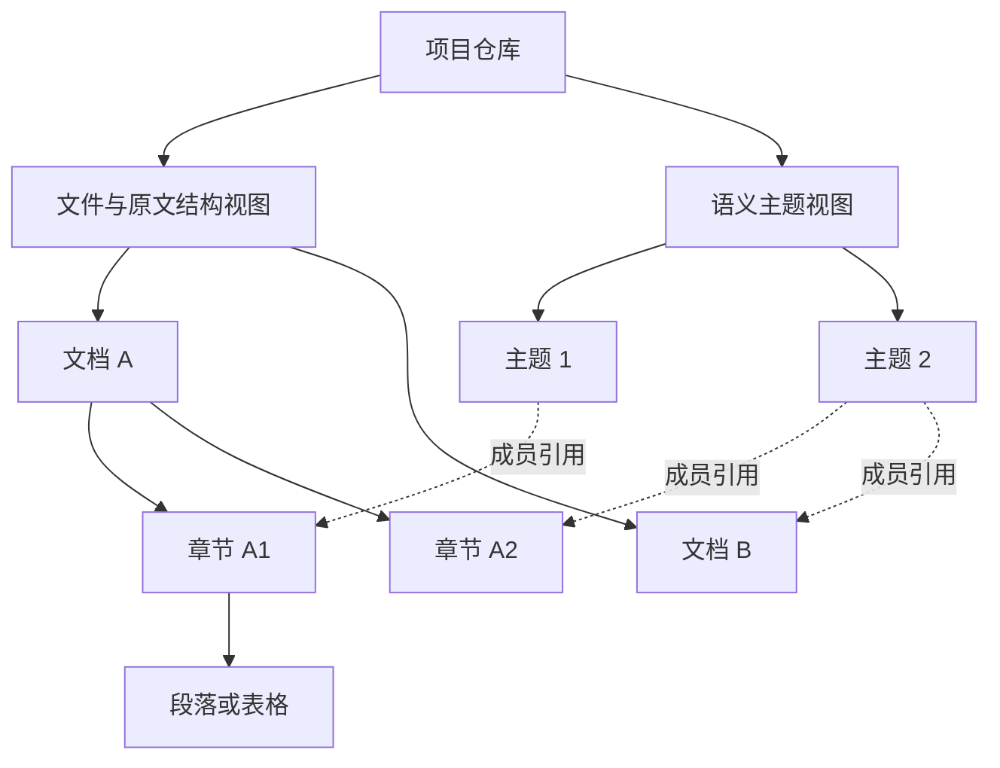

# PRD：Subtex 仓库树与 Agent 文档检索

> 版本：v0.1 · 日期：2026-09-10 · 状态：设计草案，待产品与技术评审
>
> 定位：在项目目录主本之上，以原文章节结构和跨文档向量聚类构建派生索引，让 Agent 搜索直达原文、按树补齐上下文、按范围检查覆盖。
>
> 适用：Subtex A 线。本文是现有目录插件 PRD 的检索能力演进提案；不代表功能已实现，也不自动取代既有产品裁决。性能数字均为拟验收目标或实验参数。

## 0. 阅读导航与决策摘要

| 阅读目的 | 对应章节 |
|---|---|
| 产品为什么做、做什么 | §1–§4：问题、边界、场景、需求 |
| 树如何建、如何更新 | §5–§8：结构、解析、聚类、数据模型 |
| Agent 如何调用、如何读取 | §9–§11：工具契约、检索与阅读、调用策略 |
| 技术栈与开源选型 | §12–§13：复用现状、技术选择、替代方案 |
| 开发与验收如何推进 | §14–§18：非功能需求、评测、阶段、风险与决策 |
| 事实与方案依据 | §19：仓库证据与外部来源 |

### 0.1 本稿推荐的技术方向

1. **原文主本、两种索引视图。** 物理文件与文档内部结构保持原貌；语义主题树提供跨文件导航，引用原文节点，不移动文件。
2. **结构关系确定、语义关系可修订。** 文档内父子关系由格式解析获得；主题归属由向量聚类获得，不能当作事实关系或业务分类规则。
3. **三项阅读能力。** `subtex.search`、`subtex.read`、`subtex.browse`；管理工具继续独立存在。默认搜索直达内容，批量阅读补齐上下文，浏览支持探索与枚举。
4. **Rust + SQLite 沿用现有基础。** 复用 Subtex、DocumentIr、FTS5、sqlite-vec、RRF 与 MCP；按阶段增加聚类和数值计算依赖。
5. **不以生成式 LLM 建树。** 标题解析、聚类、代表文本选择可在非生成式管线完成；embedding 仍是模型推理，不能宣称“无模型成本”。
6. **SVD 是实验增强项。** 首版代表文本先采用标题与代表原文块；SVD 只有通过消融评测才进入默认路径。
7. **以质量约束下的成本最小化为目标。** 同时衡量答案、引用、关键条件遗漏、读取量和延迟，不用调用次数或相似度单独判定成功。

### 0.2 与既有 PRD 的关系

上游：[Subtex 目录插件 PRD](2026-09-06-directory-plugin-prd.md)；实施背景：[M1 开发计划与记录](2026-09-06-subtex-m1-dev-plan.md)。

| 既有约束或设计 | 本稿处理 |
|---|---|
| 目录唯一主本，索引集中在应用数据目录 | 继承；解析文本、向量和树均为可删可重建缓存 |
| 索引未就绪时仍能查询 | 继承；分别披露结构、词法、向量和主题就绪度 |
| 默认不重编译 LLM Wiki | 继承；本能力默认不生成三元组、Wiki 或生成式节点摘要 |
| 现有 `search`、`outline` 与工作区中的 grep 相关变更 | 本稿提议收敛为三项阅读能力；具体替换在实现阶段完成调用方核对，不在本次改动产品代码 |
| 旧文档同时出现本地隐私目标与云 embedding 实施记录 | 本稿明确：沿用获授权的现有 provider；“索引在本地”不等于“文本从未出机”，不得新增隐含上云路径 |
| 云端工作台、credits、收件箱、转写 | 不改变这些产品契约；转写成品作为普通文档接入 |

## 1. 背景、问题与机会

Agent 在项目目录找文档时，常见成本不只来自召回，还来自反复定位：先找文件，再看目录，再搜术语，再读取附近段落。向量检索能找到相似片段，但通常不能充分表达片段的适用范围、章节边界和相邻例外。纯树导航有全局感，却可能在上层误选分支后漏掉答案。

本产品把两者组合为统一的读取环境。每次命中都同时提供：原文是什么、位于哪里、所属章节、可扩展范围、来源版本以及还没读到什么。

### 1.1 目标用户与主要任务

目标用户为已经通过桌面 Agent 使用项目文件夹的知识工作者。首批任务包括制度查询、研究材料比对、会议决议追踪、方案撰写和跨文件清点。主交互仍在 Agent 会话内，仓库树不要求配套独立知识库 UI。

### 1.2 成功与非目标

成功表现：用户更少纠正来源与适用条件；Agent 更少重复读同一章；跨文档任务能说明覆盖范围；改动文件后旧内容不冒充当前内容。

本期不做自动文件整理、实体知识图谱、因果/矛盾关系自动裁决、自动生成百科、全盘索引、独立向量服务、商业模式重构。主题相近不推出两份文件互相支持、冲突或存在因果。

## 2. 设计原则与硬边界

| 编号 | 原则 | 可检查的结果 |
|---|---|---|
| P01 | 项目目录是主本 | 删除索引不改变原文件；派生节点不能成为唯一证据 |
| P02 | 每份原文一个规范结构树 | 跨主题出现使用引用，不重复保存原始二进制文件 |
| P03 | 统计聚类不改变物理目录 | 重聚类前后文件路径不变 |
| P04 | 全部内容有可达入口 | 单例、离群内容保留；无标题正文也能直接检索 |
| P05 | 搜索、导航、证据分工明确 | 导航代表文本标记 `navigation`；原文摘录具有定位与版本 |
| P06 | 工具报告状态，Agent 决定推理 | 返回缺失层、截断、版本变化；不以相似度代替“答案足够”裁决 |
| P07 | 渐进就绪而非整仓阻塞 | 词法可用后即接受检索，主题树构建不阻塞前台 |
| P08 | 不承担兼容税 | 派生 schema 变更可重建；替换后的旧阅读工具/解析路径在对应阶段删除 |
| P09 | 范围约束先于召回 | 所有通道遵守同一 root、文件和节点范围，不能靠全局 Top-K 后过滤伪装范围内检索 |
| P10 | 数字目标可追溯 | 设计参数、实测结果、人工验收分栏记录 |

派生缓存可以保存规范化正文以服务 FTS 与复杂格式读取；它不具有独立编辑、分享或保留的产品生命周期。源文件删除后，相应缓存与引用失效。

## 3. 用户场景与任务旅程

| 场景 | 用户意图 | Agent 典型路径 | 完成条件 |
|---|---|---|---|
| S01 精确查找 | 找编号、原句、专有名词 | literal/regex search → 必要时 read | 原文与定位一致 |
| S02 规则问答 | 某情况如何处理 | hybrid search → 批量 read 条款与例外 | 答案包含证据支持的条件与出处 |
| S03 仓库探索 | 有哪些相关材料 | browse 主题 → browse 文档/章节 | 展示范围、成员数量与未分类内容 |
| S04 多文件对比 | 比较各文件的不同规定 | inventory → 分批 search/read | 枚举集合可核对，每份文件有处理状态 |
| S05 多跳追踪 | 付款与验收如何关联 | search → read → 依据新发现补检 | 每一步关联有原文支持 |
| S06 边写边查 | 文件刚改完就提问 | search/read + freshness 状态 | 不把旧索引当最新；可读就绪的当前内容 |
| S07 会议检索 | 找决议、负责人、时间 | hybrid search → 读取说话人/时间窗口 | 时间轴与原转写稿位置可追溯 |

**交互示例（虚构材料，仅说明流程）：** 用户询问延期交付处理方式。search 返回制度条款与项目合同片段，包含各自章节大小。Agent 批量读取两段所属小节，发现合同引用补充协议，再定向搜索补充协议。结果中的文档优先关系来自原文；主题归属不负责决定哪个条款优先。

## 4. 功能需求与优先级

P0 是最小完整阅读闭环；P1 是仓库语义树；P2 是质量/成本实验增强。每阶段独立可用。

| ID | 需求 | 优先级 | 验收要点 |
|---|---|---|---|
| F01 | 提取结构树与原文定位 | P0 | 标题、段落、表格关系可重建；无伪造页码 |
| F02 | 统一节点 ID、来源版本与范围 | P0 | 旧 ID 不静默指向新内容；同版本重复读取一致 |
| F03 | 关键词/向量混合搜索 | P0 | 各通道范围一致，精确模式保持精确语义 |
| F04 | 按节点批量读取与上下文展开 | P0 | 预算、截断、部分失败明确；重复范围只输出一次 |
| F05 | 浏览结构及完整文件清单 | P0 | 可分页枚举；区别导航抽样与完整清单 |
| F06 | 增量更新和分层就绪 | P0 | 新增、修改、删除、重启补扫均有可验证状态 |
| F07 | 跨文档主题聚类树 | P1 | 多主题文档可多处引用；单例不丢失 |
| F08 | 非生成式主题标签和代表原文 | P1 | 标签来源可说明；每条代表文本指向原文 |
| F09 | 跨主题候选补充与多来源排序 | P1 | 保留直接叶子召回；不凭聚类做排他裁剪 |
| F10 | SVD 代表文本实验 | P2 | 与无 SVD 基线公平对照，未过门不默认启用 |
| F11 | 小候选集 reranker 实验 | P2 | 计入模型成本，质量收益覆盖新增延迟 |
| F12 | Agent 真实任务评测 | 各阶段 | 不以静态测试替代真实工具调用与业务答案验收 |

## 5. 信息架构：结构树、主题树与引用

### 5.1 逻辑结构



结构节点只有一个结构父节点；主题节点也形成单父树。主题到文档/章节的成员引用允许多对多。整个仓库索引因此是带类型关系的 DAG，Agent 可获得树形投影视图。SQLite 邻接表与成员关系表即可表达，无需图数据库。

### 5.2 节点类型与关系语义

| 节点类型 | 作用 | 正文来源 |
|---|---|---|
| repository / directory | 项目范围与物理目录 | 元数据 |
| document | 原文件入口 | 原文件、版本与格式信息 |
| section | 章节、无标题的显式分段容器 | 结构范围内原文 |
| block | 段落、列表项、表格、代码、转写段 | 解析后的来源块 |
| topic | 聚类分组 | 标签与代表原文引用 |

`contains` 表示格式/物理包含；`member_of` 表示统计归属；`references` 只记录能定位的显式链接。语义相似不生成 `supports`、`contradicts`、`causes` 等事实边。

### 5.3 多主题文档与计数

跨文档聚类优先输入章节级表示。一个文档有采购、验收、付款章节时，可以从多个主题进入不同章节，再查看同一份文档的完整树。

主题浏览同时返回 `unique_document_count` 与 `membership_count`。跨主题汇总以规范 document ID 去重，不能把引用次数当文档数量。“全部文档”的权威入口是文件清单，不是主题成员并集。

## 6. 文档解析、切分与向量表示

### 6.1 格式支持与结构质量

| 格式 | 第一阶段处理 | 定位与质量边界 |
|---|---|---|
| Markdown | 复用锁文件内 pulldown-cmark，补足结构/偏移映射 | 标题级别、列表、代码围栏、表格；字节区间与行号 |
| TXT / 会议转写 Markdown | 段落与显式时间/说话人标记 | 不凭空生成主题标题；保留时间单位与说话人字段 |
| PDF | 复用现有 ingestion 解析入口 | 页码/坐标以实际解析产物为准；缺失时为 null |
| DOCX / PPTX | 复用既有 Office 解析入口并验收结构保真 | DOCX 无布局计算时不承诺页码；PPTX 可用页/形状定位 |
| CSV / XLSX | 工作表、表区域、表头与行范围 | 值与公式语义分开；本期不提供电子表格计算引擎 |
| 扫描件 / 复杂双栏 PDF | 隔离的重解析队列 | OCR/版面模型可能必要，不宣称纯规则可恢复全部结构 |
| 源代码 | 保留当前检索支持 | 代码调用图/符号解析不纳入本文建设范围 |

Markdown 格式提供较强结构约束；PDF 标题可能由版式推断。节点记录 `structure_origin = explicit | layout_inferred | synthetic_container`，避免把推断出的标题层级当作者明示结构。Docling 可提供层级、版面和 provenance 的 IR，作为重解析候选，不能据此假定零模型、零耗时。[Docling 文档模型](https://docling-project.github.io/docling/concepts/docling_document/)

### 6.2 切分规则

1. 标题节点独立保留，不因短文本合并而消失。正文块与检索 chunk 解耦：一个 chunk 可映射多个连续 block。
2. 优先按段落、列表、表格边界切分；超长块允许按 token 预算二次切分，始终保留所属 block 和偏移。不能用“结构感知”承诺永不切长块。
3. 检索文本可携带文件标题与章节路径；原文读取仍返回未改写文本，标题前缀不伪装为正文。
4. 表格按行组切分时附带表头引用；列表项保留引导句引用。空标题、跳级标题、重复标题均有确定处理规则。
5. token 长度优先使用对应 tokenizer；不可得时标明 `token_count_kind=estimate`。服务端仍设 UTF-8 字节硬上限，避免估计失准造成无限输出。

### 6.3 表示层级与成本

| 层 | 推荐表示 | 成本策略 |
|---|---|---|
| 检索 chunk | 标题路径 + 原文的 embedding | 按内容和模型版本缓存 |
| 章节 | 优先复用子块归一化向量聚合；必要时多代表块 | 章节整体新 embedding 作为对照项，不无条件重复嵌入 |
| 文档 | 章节表示集合 | 不用一个全文均值强行覆盖全部主题 |
| 主题 | 成员向量聚合 + 多条代表原文 | 质心用于数值候选，代表文本用于 Agent 浏览 |

平均向量可能相互抵消并隐藏少数主题；低范数聚合使用代表成员向量并标记退化。向量缓存键至少包含模型标识、可用的模型修订号、维度、输入规范化版本、内容 hash。云端模型无固定 revision 时记录 provider 与运行批次，不能承诺跨期完全可复现。

## 7. 主题树与代表文本算法

### 7.1 聚类选型与初始算法

推荐 P1 使用 `linfa-clustering` KMeans，在章节表示上递归分组。它提供批量与 Mini-Batch 实现；后者不等于自动维护完整的层次树、删除和稳定 ID，这些仍属于本产品的索引生命周期。[Linfa KMeans API](https://docs.rs/linfa-clustering/latest/linfa_clustering/struct.KMeans.html)

起步采用较浅的树，避免目录过深。以下是实验起始值，经过开发集校准后锁定，不宣称最优：

| 参数 | 初始值 | 限制与目的 |
|---|---|---|
| 最小参与聚类章节数 | 32 | 更小仓库直接展示章节/文档 |
| 单层最大分支 | 8 | 控制浏览宽度 |
| 主题树最大深度 | 3 | 控制额外工作与逐层导航成本 |
| 目标叶主题成员数 | 16–64 | 过大时才评估拆分 |
| 每章节主要主题数 | 1 | 保持主要层次明确 |
| 可选次级主题引用 | 最多 1 | 相似度/间隔经开发集校准；低置信不加 |

每层对输入向量归一化后执行库提供的欧氏 KMeans，记录随机种子与训练参数；不把普通 KMeans 标为 spherical KMeans。主题用于余弦检索的质心另行归一化。是否拆分结合规模、聚类紧凑度改善与最小有效成员数；改善阈值在开发集确定。无法合理分组时保留较宽节点或“未归类”，不强行制造有意义的类别。

### 7.2 主题命名与无 SVD 基线

主题标签从成员的真实标题中选择代表标题，并附去重关键词；无可靠标题时使用“主题 017”等中性 ID。界面标记“自动分组”。不承诺不用生成模型就能得到完美的人类概念名。

代表文本基线：选择靠近质心且来自不同文档的原文块，在预算内抑制重复内容；标题、编号与来源单独保留。数据结构保存 `representative_refs`，正文按读取时版本解析；不在每个祖先节点存放重复长摘要。

### 7.3 SVD 实验路线

借鉴点是用数值方法选择原句，降低父节点代表文本的生成成本。SVD-RAG 的主对比仅 38 块/20 问，317 倍建树提速使用缓存 embedding；205 块实验存在正文重复。因此它是方法参考，不构成本产品的性能承诺。[论文方法与实验](https://arxiv.org/html/2607.10316v1)

本产品拟议实现：对候选原文单元的向量矩阵做 SVD，按主方向贡献排序，再进行去冗余和来源多样性选择。第一轮可用已有块向量；若使用句子向量，额外嵌入成本必须单列。以块为单位的版本称“SVD 代表块选择”，不声称严格复现论文。

数值规格：`M=UΣVᵀ`；候选得分 `score(i)=Σ(j≤k) σⱼ² Uᵢⱼ²`。本产品实验用平方奇异值累计比选择 k，并在读取预算下选原文单元。论文使用的累计阈值公式为奇异值之和，二者明确区分。95% 数值阈值不表示保留 95% 事实。

每节点候选上限起步为 256，代表文本预算起步为 600 tokens；超限采用按子节点分层取样并标记非穷尽。小矩阵用库 SVD，后台最多 2 个 CPU 工作任务；失败或超时该节点继续使用基线代表文本。这里是当前能力分级，不是保留旧产品兼容接口。

### 7.4 局限与使用方式

常见主题可能压过罕见例外，数值方向也不等于可解释业务概念。主题与 SVD 仅服务导航和候选补充。原文叶子始终可直接检索；单例不得像某些研究实现那样从索引丢弃。

## 8. 存储、身份与增量更新

### 8.1 数据模型（逻辑契约，不是已实施 DDL）

| 对象 | 主要字段 | 关键不变量 |
|---|---|---|
| repository | root_id、canonical_root、active_generation | root 范围由会话授权决定 |
| document | document_id、relative_path、content_hash、source_version、parse_status | 原文件身份与当前可读版本可核对 |
| node | node_id、document_id、source_version、parent_id、kind、ordinal、locator、content_ref | 结构父子同文档同版本，无环 |
| chunk | chunk_id、node_refs、text_cache、heading_path | 覆盖原文范围，不改变来源含义 |
| embedding | item_id、model_key、input_hash、dimension、vector | 不混用模型空间/维度 |
| topic | topic_id、topic_generation、parent_topic_id、label、centroid | 仅表示统计分组 |
| membership | topic_id、node_id、assignment_kind、score | 引用存在且版本一致 |
| representative | owner_id、source_node_id、source_range、method | 每条代表文本有原文依据 |
| readiness/job | 各层状态、计数、generation、错误与重试信息 | 缺失不冒充零命中 |

结构层用邻接表，必要的遍历使用递归 CTE 和分页，不预生成全体祖先闭包。保留现有 FTS/向量存储并扩展节点关系。目标结构确定后删除被替代的重复大纲存储路径，避免两份章节真相。

### 8.2 稳定身份与引用

`document_id` 在确认的重命名时可保持；跨文件复制即使同内容也保留不同文档身份。`source_version` 基于内容 hash；`node_id` 对同源版本稳定，不承诺跨任意编辑稳定。ID 包含或关联版本，不能只用行号作为身份。

rename watcher 事件可信时更新路径映射；只能观察到删除+新增且存在歧义时创建新身份，不猜测移动关系。旧节点读取返回 `source_changed` 或 `source_deleted`，并提供当前文档入口；不会悄悄将旧引用定位到新段落。

### 8.3 更新生命周期

```text
发现变更 → hash 核对 → 解析新版本 → 结构与词法原子发布
                              → 缺失向量批量生成 → 向量层发布
                              → 受影响主题重新分配/重算代表文本
```

文件层以事务发布完整版本，避免正文换新但 FTS/来源仍旧。较慢向量/主题层保留明确的就绪状态；查询只把与当前源版本匹配的条目作为当前证据。

新章节可先分配到冻结质心，再后台修订受影响主题；删除成员后重算相关质心。累计变更比例达到实验阈值（初值 10%）或质量退化时，在后台构建新主题 generation 并原子切换。旧 generation 只在有限的在途读取窗口内保留，随后清理；不是长期双版本产品路径。

索引快照不冻结原始文件。读取时核对版本；若文件在分页期间变化，返回 `snapshot_changed` 或相应项的版本错误。前台能重新枚举，不能宣称旧快照已覆盖当前仓库。

embedding 仅处理输入 hash 变化的内容；监听去抖、周期调和扫描和持久任务队列复用现有服务。算法不存在“任何修改都只更新一个节点”的保证，局部更新成本与重聚类成本分别度量。

## 9. Agent 工具契约

### 9.1 工具集合与职责

| 工具 | 主要输入 | 主要返回 | 与现状关系 |
|---|---|---|---|
| `subtex.search` | queries、scope、mode、budget_tokens | 排序原文命中、路径、来源、可读范围、就绪度 | 演进现有 search |
| `subtex.read` | targets、view、budget_tokens | 批量原文、上下文、引用、截断与逐项状态 | 新增规范读取能力 |
| `subtex.browse` | scope、view、cursor、budget_tokens | 文件清单/结构/主题成员与目录卡片 | 接替 outline 的阅读职责 |

`init/status/transcribe/inbox` 等管理能力不属于“三工具”计数。实现阶段核对当前全部阅读调用方，将重复 grep/outline 产品入口按最终契约收敛；不新增别名维持长期双接口。工具清单按已发布能力固定，运行中通过返回字段说明就绪度，而不是随索引进度频繁增删工具。

### 9.2 search

```json
{
  "queries": ["延期交付的处理条件", "延期交付的例外约定"],
  "scope": {"root_id": "root_demo", "document_ids": []},
  "mode": "hybrid",
  "budget_tokens": 2500
}
```

`mode` 为 `hybrid | literal | regex`。空 document_ids 表示当前授权 root；非空时限制为给定文件交集。节点范围可通过 `node_ids` 指定；topic_id 转换为该 topic_generation 的成员范围，并在返回中披露它是统计范围。多个 scope 维度取交集，空交集返回空范围，不擅自扩大。

literal 保证指定字符串匹配；regex 保证表达式匹配并返回不支持语法的错误。hybrid 才进行语义补充。FTS、向量与正则候选不是同一种语义，`matched_via` 如实记录。多 query 支持每题分组结果与共享去重引用，防止一题吞完所有预算。

返回核心字段：

```json
{
  "snapshot_id": "snap_demo",
  "index_readiness": {"lexical": "ready", "vector": "partial", "topic": "building"},
  "scope_counts": {"files_known": 100, "files_parsed": 96, "files_vector_ready": 80},
  "hits": [{
    "node_id": "node_demo",
    "document_id": "doc_demo",
    "source_version": "hash_demo",
    "path": "制度/供应商管理.md",
    "heading_path": ["履约管理", "延期交付"],
    "locator": {"kind": "text", "line_start": 31, "line_end": 35},
    "text": "此处为示意占位，实际返回原文。",
    "evidence_kind": "source_excerpt",
    "matched_via": ["lexical", "vector"],
    "parent_id": "section_demo",
    "parent_tokens": 900,
    "token_count_kind": "estimate"
  }],
  "truncated": false,
  "budget_used_tokens": 500
}
```

以上数字仅用于 schema 示例。查询可附每通道状态 `ok | not_ready | timeout | failed`。相似度与融合分数可供诊断，但不以“置信度 95%”形式冒充答案正确概率。

### 9.3 read

```json
{
  "targets": [
    {"node_id": "section_demo", "source_version": "hash_demo"},
    {"node_id": "clause_demo", "source_version": "hash_other"}
  ],
  "view": "section",
  "budget_tokens": 5000
}
```

`view = exact | context | section`：exact 返回目标范围；context 读取目标所在语义单元及必要前后文；section 提升到最近章节并按原文顺序读取。topic 无规范原文，read(topic) 返回 `node_kind_not_readable`，其代表内容由 browse 提供并附来源节点。

每项返回 `status`、`returned_ranges`、`unread_ranges`、`citation`、`source_version` 和续读 cursor。status 包括 `ok | partial | source_changed | source_deleted | unavailable`。单项失败不使整个批次失效。输出包含完整标题路径；表格重复表头属于阅读呈现，不更改原文行数。

预算覆盖整次序列化响应的正文和元数据；超大单元采用分段返回并提供 cursor。相同版本的重叠范围合并，不因跨主题引用重复输出。不同文件的相同文字可以折叠显示出处列表，但合同版本差异不被消除。

### 9.4 browse

```json
{
  "scope": {"root_id": "root_demo"},
  "view": "inventory",
  "cursor": null,
  "budget_tokens": 2000
}
```

`view = inventory | structure | topics`。inventory 枚举源文件，返回总数、已返回数量、cursor、snapshot 和解析状态；不按相关性 Top-K 截断。structure 返回文件/章节子节点、类型、大小和可读性；topics 返回主题子节点及成员引用、代表原文和唯一文档计数。

省略 cursor 后再次请求等于重新开始；cursor 绑定 scope、view 与 snapshot。过期返回 `cursor_expired`。分页完成只证明文件枚举完成，不证明所有正文被读过，也不证明 Agent 已完成语义比较。

### 9.5 路径、来源与文本边界

root 校验使用规范路径与真实路径，处理符号链接逃逸；原文件内容不能指定工具的访问根。文本内容属于检索数据，不因包含指令就变成运行策略。

定位支持 text 行/字节、PDF 页/坐标、Office 结构项、表格区域和转写时间段；不支持的定位字段返回 null。citation 绑定文件、版本、原文范围，Agent 最终引用从该引用对象生成。

## 10. 检索与上下文组装

### 10.1 召回与排序

```text
scope 解析与版本筛选
  ├─ 词法候选：FTS5 / 原文精确扫描
  ├─ 向量候选：范围内 chunk/section 检索
  └─ 主题补充候选：相关主题的代表成员
        → 按规范节点/范围去重 → RRF → 来源分布约束
        → 可选小候选集 reranker → 预算化原文命中卡片
```

起步保持现有 RRF，通道名次融合参数继承当前实现后再实验。不得将 BM25、余弦和聚类距离直接相加。主题通道与向量通道相关性高，不能重复投票无条件压过原文命中；其权重与收益在消融中单独评估。

跨来源分布约束是同等相关候选间的软排序，不要求每个问题都读取多个文档。用户指定一个文件时不为了多样性跑到别处。

### 10.2 中文词法与精确检索

现有 FTS5 使用 trigram；它对短于 3 个 Unicode 字符的 MATCH 查询有限制。因此两字术语、编号、符号组合需要有界 literal 扫描或现有短串处理。trigram BM25 是子串统计，不等于中文词语分词；不能把长问句直接当连续精确短语而期待同义召回。[SQLite FTS5](https://sqlite.org/fts5.html#the_trigram_tokenizer)

hybrid 的词法分支可使用确定性的分隔、标题词与显式短语提取；Agent 也可在同一次批量调用中传多个查询。首版不引入生成式查询改写。regex 使用现有 Rust regex/grep 能力，其不支持的语法明确报错，不静默换成语义搜索。

### 10.3 读取组装

命中子块后按原文章节向上展开；同章多个相邻命中优先合并。章节过大时只扩展局部范围，并附同级标题目录与未读范围。父级提升在预算内进行，不能因命中比例高就递归吞下整篇文档。

该思路可借鉴 LlamaIndex AutoMergingRetriever 的父级合并实现；本产品只复用方法，不引入整套 Python 检索框架作为运行时依赖。[AutoMergingRetriever 源码](https://github.com/run-llama/llama_index/blob/main/llama-index-core/llama_index/core/retrievers/auto_merging_retriever.py)

### 10.4 部分就绪与 freshness

未解析文件仍出现在 inventory。可直接读的纯文本允许在本次范围内扫描；二进制重格式解析未完成时显示 unavailable，不能声称全文已检索。向量超时可返回词法结果，携带通道状态；禁止把“向量没跑完”编码成“语义检索零命中”。

## 11. Agent 调用策略与责任分工

| 层 | 负责 | 不承担 |
|---|---|---|
| Agent | 问题拆解、阅读选择、条件/冲突判断、覆盖裁决、最终表达 | 手工计算向量距离、逐节点执行机械树遍历 |
| 检索/读取服务 | scope、批量执行、去重、原文拼接、预算与版本状态 | 推断答案已足够、裁定哪份合同有效 |
| 后台索引服务 | 解析、向量化、聚类、增量维护、任务状态 | 自动撰写用户答案、将代表句变成权威知识 |

简单查找以一次 search、必要时一次批量 read 为设计目标；内容已完整时无需重复读取。跨文档清点先 inventory，再对分批文档搜索阅读。新发现存在交叉引用、例外或冲突时，由 Agent 继续补检，不设“固定两次调用后必须回答”的硬闸。

工具支持批量参数，使机械并行、结果去重和范围拼接在服务端完成。程序化工具调用可以进一步减少模型往返，但不作为首版使用门槛；三项核心工具足够小，不需要额外工具发现系统。[Anthropic 工具编排说明](https://www.anthropic.com/engineering/advanced-tool-use)

云端 B 线未来复用时保持既有 Lead/Worker 分工：RAG Worker 使用这些阅读能力，Lead 负责合成。桌面 A 线不新增一个内部生成式 Agent 来包裹已有桌面 Agent。

运行时工具描述与 observation 按仓规置于 `avrag-rs/prompts/subtex/`，使用第三人称环境事实；本稿不提供硬编码进产品源代码的 prompt。格式闸、预算和结构校验仍由 host 负责，语义充分性由 Agent 判断。

## 12. 当前仓库基础与实施落点

以下结论来自 2026-09-10 工作区文件静态读取，包含尚未提交的工作区状态；不等于编译通过或线上可用。本次未运行服务、编译、代码图构建或真实模型评测，也未检查私密配置值。

| 静态可见基础 | 证据 | 本期复用/变化 |
|---|---|---|
| Subtex core、index、store 三个 crate | 各 Cargo.toml | 保持模块边界，不新造一套索引服务 |
| files/chunks/FTS5/vec0/jobs/readiness/file_outline | subtex-store-sqlite/schema.rs | 扩展来源版本和规范结构节点，统一大纲存储 |
| BM25 + vector + RRF | subtex-store-sqlite/store.rs | 演进 scope、批量查询、预算和主题候选 |
| DocumentIr 与轻/重解析入口 | subtex-index/parse.rs | 保留 IR 接口，补结构/偏移保真 |
| TextEmbedder 与 CloudEmbedder | subtex-index/embed.rs | 复用 provider 接口和 usage；代码默认模型不视为实际配置 |
| pulldown-cmark 0.13.4 已在 Cargo.lock | avrag-rs/Cargo.lock | 优先复用已解析版本，新增直接依赖需核对 workspace 类型 |
| search/outline 工具文案 | prompts/subtex/tools/ | 实现阶段更新为最终阅读契约 |
| 目录监听与任务实施记录 | M1 计划 §9 | 作为候选复用，不把历史测试结果算成本稿验证 |

实施责任建议：core 放节点/范围/定位/错误契约；index 放解析、章节表示、聚类和代表选择；store 放 SQLite 持久化与检索读写；现有 transport 挂接工具；subtexd 负责后台任务调度。该划分是设计建议，未作全仓调用图或影响半径审计。实现前按仓规补 code-review-graph 查询，避免把静态文件清单当作完整依赖分析。

## 13. 技术栈、选型与可复用开源组件

### 13.1 推荐组合

| 层 | 推荐选择 | 状态/理由 | 接入或替换条件 |
|---|---|---|---|
| 主运行时 | 现有 Rust / Tokio | 复用本机服务与异步调度 | 不新增常驻 Python 总控 |
| 文档 IR | 现有 DocumentIr | 已连接 ingestion 与 chunk 管线 | 补结构质量、locator 和 version 字段 |
| Markdown | pulldown-cmark | 锁文件已有；CommonMark 与源位置能力 | 替换手写 Markdown 结构路径，避免双解析真相 |
| 重文档 | 既有 PDF/Office parser | 复用部署资产 | 按复杂格式样本验收；质量不足再试 Docling adapter |
| 元数据与树 | rusqlite / SQLite | 现有进程内存储 | 邻接关系+成员引用，不使用图 DB |
| 词法 | SQLite FTS5 trigram + 现有精确扫描 | 现有基础、单库事务 | 短串和中文词法单独评测 |
| 向量 | sqlite-vec | 已有依赖，适合本期本地存储边界 | 不能假定具备 ANN；达到性能瓶颈后另做 ADR |
| embedding | 现有 TextEmbedder/provider | 复用账户、批量调用和成本记录 | 本地模型需独立评测，不自动下载大权重 |
| 聚类 | linfa-clustering | 现成 KMeans，P1 才增加依赖 | 锁定兼容版本，限制线程，校准聚类参数 |
| SVD | nalgebra | 提供 Rust SVD，P2 才增加依赖 | 小矩阵预算化使用，先过成本/质量门 |
| 文件监听 | 现有 notify/debounce/ignore 链路 | 已有目录插件基础 | 保留周期调和扫描 |
| 工具协议 | 现有 MCP / ToolCatalog / dispatch | Agent 已有入口 | 不新增独立 REST 检索产品面 |
| 日志与任务 | 现有 tracing / jobs / usage | 可追踪阶段耗时与耗材 | 日志默认记录 ID/hash，正文按需且受控 |

### 13.2 组件依据与许可证核对

| 组件 | 可复用部分 | 上游公开许可/核对状态 | 风险 |
|---|---|---|---|
| [pulldown-cmark](https://github.com/pulldown-cmark/pulldown-cmark) | 事件解析、标题/表格、源偏移 | 上游标注 MIT | 本产品仍需处理层级与 IR 映射 |
| [sqlite-vec](https://github.com/asg017/sqlite-vec) | vec0、SQLite 内向量存储/查询 | [官方站](https://alexgarcia.xyz/sqlite-vec/)标注 MIT/Apache-2 | 当前公开版本仍处于 0.x；API/性能需锁版验证 |
| [Linfa](https://github.com/rust-ml/linfa) | KMeans、Mini-Batch；其他算法仅作对照 | 上游标注 MIT/Apache-2.0 双许可 | ndarray/RNG 版本与线程池集成 |
| [nalgebra SVD](https://docs.rs/nalgebra/latest/nalgebra/linalg/struct.SVD.html) | 数值分解 | [上游仓库](https://github.com/dimforge/nalgebra)标注 Apache-2.0 | 矩阵规模、内存与收敛错误 |
| [Docling](https://github.com/docling-project/docling) | PDF/Office 结构化解析候选 | 代码 MIT，模型许可另行核对 | Python/模型部署、OCR 与 CPU/GPU 耗时 |
| [LlamaIndex AutoMergingRetriever](https://github.com/run-llama/llama_index/blob/main/llama-index-core/llama_index/core/retrievers/auto_merging_retriever.py) | 父级展开方法参考 | 本稿不复制代码；复用代码前核对锁版许可 | 整框架引入会扩大运行时边界 |

许可证表是公开元数据记录，不替代发布阶段对精确依赖版本、模型权重和 notices 的核对。选型依据是与当前产品边界的匹配，不是星数或“最新版本”排名。

### 13.3 关键替代方案及本期决定

| 方案 | 优点 | 代价 | 本期决定 |
|---|---|---|---|
| 纯文件名/grep | 零 embedding，精确词可控 | 转述查询、跨章阅读与完整性需 Agent 多处理 | 保留精确通道与基线 |
| 平铺混合检索 | 现有能力，更新简单 | 缺少可操作的上下文结构 | 作为 P0 基础与评测基线 |
| 仅按原文章节树 | 来源清晰、构建低成本 | 跨文档主题发现弱 | P0 必须完整实现 |
| 递归 KMeans 主题树 | 可复用库，层次可控 | 参数与分组漂移需管理 | P1 推荐 |
| 凝聚层次聚类 | 天然生成树，适合小样本对照 | 某些算法需成对距离，规模和更新代价更高 | 仅离线对照，不并列生产后端 |
| LLM 摘要树 / Wiki 编译 | 可生成流畅概念与综合总结 | 生成成本、事实漂移、更新传播 | 不进默认索引路线 |
| GraphRAG 式实体图 | 适合显式实体关系任务 | 关系抽取与维护超出本期任务 | 不引入实体抽取与图 DB |
| 独立 ANN 服务 | 可支持更大检索规模 | 增加服务运维与同步边界 | 当前无必要，先测 sqlite-vec 实际瓶颈 |
| 全量 Python 框架 | 实验迭代方便 | 与既有 Rust 运行时重复 | 可用于离线实验，不作为产品主运行时 |

## 14. 性能、成本与可靠性目标

### 14.1 基准环境与规模

参考环境暂定本地 SSD、16 GB RAM、后台 CPU 工作并发不超过 2；正式报告写明 CPU、OS、模型、磁盘、冷/热缓存和并发。首期常规仓库为 100–1,000 份文档、约 1万–5万 chunks；10万 chunks 为压力档，不直接承诺同一延迟。

| 项目 | 拟验收目标 | 测量口径 |
|---|---|---|
| 热缓存 browse/read | P95 ≤ 300 ms | 本地已解析内容，不含 OCR/网络与模型推理 |
| 热缓存精确/词法 search | P95 ≤ 500 ms | 常规仓库；短串全扫另列 |
| 混合检索本地部分 | P95 ≤ 1 s | 查询 embedding 已得，含候选融合与组装 |
| 普通小文本修改可见 | 95% ≤ 5 s | ≤100 KB、无解析积压，统计结构/词法层 |
| 资源 | 后台 CPU 工作并发 ≤ 2 | 查询优先，单次 SVD/解析内存单列 |
| 读取预算 | 输出不静默超限 | 包括元数据；估计 token 附标识与字节上限 |

以上为待验证目标，未包含真实 provider 尾延迟。端到端时间分解为模型决策、query embedding、存储检索、网络往返、阅读和最终生成。索引时间分解为解析/OCR、embedding、聚类、代表选择和落库，避免“缓存后建树时间”冒充完整处理时间。

### 14.2 容量与成本估算

以 5万 个 1024 维 float32 向量为例，原始向量约 205 MB（约 195 MiB），尚未包含 SQLite、FTS、文本、索引页和主题表示。该估算不代表驻留内存或实测磁盘占用。章节向量、句子向量和重叠文本分别记账，不能把额外 SVD 句子 embedding 隐去。

消费指标记录：新增/复用 embedding tokens、provider 调用次数、解析 CPU 时间、OCR 时间、聚类耗时、SVD 耗时、工具输出 tokens、Agent 输入/输出 tokens。价格沿用实际 usage 账本，不在 PRD 固定引用过期单价。

### 14.3 可靠性

SQLite 写事务保持短小，后台批量分段提交；WAL/读连接策略按现有实现核对，不能因内部“并行”而共享不安全连接。任务支持取消、幂等重试与指数退避；read 不同步等待整仓建树。

新 schema 只重建派生索引；账本、用户确认记录等非派生状态不得随索引 schema 重建删除。存储重建不能扩大成应用数据目录整体清空。

## 15. 评测设计与验收门

### 15.1 评测集

使用获授权、版本固定的真实项目文档构建开发集与留出验收集，按文件族/项目分割，避免同文换标题跨集合泄漏。另设结构边界测试样本；不得将真实 gold 问题、答案或实体注入产品 prompt、规则和声称产品政策的单测。

建议首轮 120 个真实任务，覆盖 S01–S07；至少包含中文短词、跨章节例外、表格、多版本冲突、相似文件、离群主题、无答案和刚修改文件。样本量用于首轮诊断，不足以证明普遍领先。

### 15.2 消融组合

| 组 | 能力 | 比较目的 |
|---|---|---|
| A | 现有文件/grep + 原始读取 | Agent 当前工作流基线 |
| B | 平铺词法+向量混合检索 | 排除仅由 embedding 带来的收益 |
| C | B + 结构树 + 批量上下文读取 | 测量结构和工具契约贡献 |
| D | C + 主题树 + 无 SVD 代表文本 | 测量跨文档分组贡献 |
| E | D + SVD 代表选择 | 测量 SVD 独立贡献 |
| F | 最佳已通过组 + reranker | 测量精排独立贡献 |

使用相同 Agent 模型、工具说明质量、任务集合与总 token 上限，分别做固定预算与固定质量两种比较。真实模型任务重复运行并报告方差；调参只使用开发集。

### 15.3 指标与通过条件

| 维度 | 指标 | 验收要求 |
|---|---|---|
| 来源正确性 | 定位正确率、版本一致性 | 确定性测试中越界、错版本、原文误指均为 0 |
| 答案质量 | 人工评分、关键条件遗漏率、无依据断言 | 对照组盲评；关键事实回退逐例审查 |
| 召回 | 原文证据 Recall@K，按任务分层 | 主题增强不得以裁掉离群证据换平均分 |
| 覆盖 | 枚举完整性、漏文件、未读项披露 | inventory 对固定快照集合无漏项；语义覆盖由人工/Agent 单列 |
| 效率 | 端到端 P50/P95、工具轮次、总 tokens、费用 | 报告完整链路，不只服务端局部时间 |
| 新鲜度 | 修改到可查延迟、stale 错误率 | 分层状态准确，删除内容不冒充当前证据 |
| 索引维护 | 新增成本、重聚类代价、缓存命中率 | 与普通编辑工作流一起测试 |

建议增量上线门：在结构正确性硬门通过、关键条件遗漏不恶化的前提下，新增层至少获得“端到端 tokens 或延迟下降 15%”或“固定预算下答案正确率提高 5 个百分点”之一。阈值是产品评审起点；小样本结果需给置信区间与失败案例，不能只看均值越线。

SVD 若未证明收益，P1 仓库树仍可发布，SVD 不进入默认路径。组件可以按实验结果不采用，不为完成路线图保留无价值复杂度。

### 15.4 必测边界

- 重复标题、标题跳级、无标题、围栏内伪标题、超长段落、表格跨页。
- 文件重命名/复制/删除、同内容不同路径、编辑发生在 search 与 read 之间。
- 两字中文、特殊符号、正则错误、短查询范围全扫。
- 多主题文档、单例聚类、空簇、低范数向量、模型维度变化。
- 预算小于一个表格、批量部分失败、分页失效、索引未就绪。
- 符号链接越界、根路径前缀碰撞、原文内嵌提示指令。

## 16. 分阶段交付与验证门

以下为工作分解，不是已启动开发。工期估算在代码图审计和样本解析检查后给出；编译、脚本和真实模型验证按仓规提前报时并获得授权。

| 阶段 | 交付范围 | 进入下一阶段的门 |
|---|---|---|
| W0 契约与基线 | 核对调用方/依赖；冻结 IR、scope、source_version；建立 A/B 基线 | 模型与原文评测口径可复现，范围和身份设计通过评审 |
| W1 结构阅读闭环 | F01–F06：解析树、search/read/browse、事务更新、部分就绪 | 确定性边界测试通过；真实 Agent 单问答与跨文档枚举通过 |
| W2 仓库主题树 | F07–F09：聚类、引用、标签、增量与候选补充 | 单例不丢、多主题可达，D 对 C 有可解释收益 |
| W3 数值与精排实验 | F10/F11：SVD、可选 reranker | E/F 独立通过质量与成本门后才进入默认配置 |
| W4 自用验收 | 至少一周真实会话，记录纠偏、误读、成本 | 用户确认工作流成立；失败案例有归因与处理决定 |

每波保持一个可用产品。W1 完成时已经能检索和阅读；W2 不等待 W3；任何新增路径替换旧路径时，同波更新工具契约、调用方和文档，删除被取代实现。代码结构变更后更新 code-review-graph，测试范围按实际修改决定。

## 17. 风险与处理决定

| 风险 | 用户可见后果 | 处理 |
|---|---|---|
| PDF 结构解析错误 | 读错章节或遗漏表头 | 记录结构来源，格式专项验收，必要时采用重解析 adapter |
| 语义聚类漂移 | 相同文件在主题视图换位置 | 版本化主题视图，原文 ID 不依赖主题路径 |
| 代表文本遗漏少数条件 | Agent 提前排除正确分支 | 保留直接叶子召回，关键问题读取原文 |
| 长章节展开过量 | tokens 与延迟上升 | 按预算局部展开，附未读范围 |
| 未索引内容被忽略 | “没找到”被误当“不存在” | inventory 列出已知但未就绪文件；通道状态显式返回 |
| sqlite-vec 扫描规模瓶颈 | 大仓查询变慢 | 分层测量并先收窄合法 scope；证据充分再评估 ANN 替换 |
| 云 embedding 延迟/隐私边界 | 等待或文本意外出机 | 复用已授权 provider，明确能力状态；新增出机路径独立裁决 |
| 工具契约变更碰现有客户端 | 调用失败 | 同波更新实际调用方，删除旧入口，不建立永久兼容别名 |
| 将所有工作放进“智能检索”黑盒 | 调用少但结果不可解释 | 返回来源、范围、就绪、截断与版本；阅读可独立调用 |

## 18. 决策记录与待验证事项

| 编号 | 当前状态 | 结论/下一证据 |
|---|---|---|
| D01 | 用户讨论方向 | 文档内按原文章节，文档间按向量关系组织仓库树 |
| D02 | 本稿推荐 | 结构树 + 主题树 + 引用；不强制每篇文档单主题 |
| D03 | 本稿推荐 | 三项阅读能力，后台复用现有 Subtex 栈 |
| D04 | 本稿推荐 | 先结构阅读闭环，再主题树，最后 SVD/reranker |
| D05 | 待实验 | 章节聚合 vs 多代表向量的质量/成本 |
| D06 | 待实验 | 聚类规模、分支、次级归属和重聚类阈值 |
| D07 | 待样本审查 | 现有 PDF/Office parser 是否满足结构与定位要求 |
| D08 | 待环境核对 | 当前 embedding provider/model/revision、离线模式需求；本稿未读取凭据 |
| D09 | 待代码审计 | 工作区 grep/outline 变更的最终调用方与工具收敛范围 |
| D10 | 待产品评审 | 性能 SLO 与增量上线阈值；不以本文数字当实测承诺 |

## 19. 证据、来源与本次交付说明

### 19.1 仓库静态证据

- [上游目录插件 PRD](2026-09-06-directory-plugin-prd.md)：产品边界与 A/B 线关系。
- [M1 计划与实施记录](2026-09-06-subtex-m1-dev-plan.md)：既有实现与历史验收口径；不是本次运行结果。
- [subtex-core Cargo.toml](../../avrag-rs/crates/subtex-core/Cargo.toml)、[subtex-index Cargo.toml](../../avrag-rs/crates/subtex-index/Cargo.toml)、[store Cargo.toml](../../avrag-rs/crates/subtex-store-sqlite/Cargo.toml)：依赖基础。
- [schema.rs](../../avrag-rs/crates/subtex-store-sqlite/src/schema.rs)、[store.rs](../../avrag-rs/crates/subtex-store-sqlite/src/store.rs)：表结构、trigram、向量与 RRF。
- [parse.rs](../../avrag-rs/crates/subtex-index/src/parse.rs)、[embed.rs](../../avrag-rs/crates/subtex-index/src/embed.rs)：解析入口与 embedding 接口。
- [Cargo.lock](../../avrag-rs/Cargo.lock)：已有解析依赖版本。
- [工具文案目录](../../avrag-rs/prompts/subtex/tools/)：现有阅读工具语义；实现时按 prompts-in-md 规则修改。

### 19.2 外部原始来源

本稿于 2026-09-10 查询下列官方文档、上游实现与论文；引用支持能力与边界，不证明本产品已集成或达到性能目标。

| 来源 | 本稿采用的内容 |
|---|---|
| [SVD-RAG](https://arxiv.org/html/2607.10316v1) | 抽取式节点表示思路，以及小规模实验限制 |
| [SQLite FTS5](https://sqlite.org/fts5.html) | trigram、短串限制、检索与外部正文索引 |
| [sqlite-vec 官方站](https://alexgarcia.xyz/sqlite-vec/) | SQLite 内向量扩展及版本阶段说明 |
| [pulldown-cmark](https://github.com/pulldown-cmark/pulldown-cmark) | CommonMark、源位置与 MIT 许可 |
| [Linfa](https://github.com/rust-ml/linfa)、[KMeans API](https://docs.rs/linfa-clustering/latest/linfa_clustering/struct.KMeans.html) | 聚类组件与批量/增量算法边界 |
| [nalgebra](https://github.com/dimforge/nalgebra)、[SVD API](https://docs.rs/nalgebra/latest/nalgebra/linalg/struct.SVD.html) | 数值实现与许可元数据 |
| [Docling IR](https://docling-project.github.io/docling/concepts/docling_document/)、[Docling 项目](https://github.com/docling-project/docling) | 复杂文档结构、provenance、模型许可区别 |
| [LlamaIndex 父级合并实现](https://github.com/run-llama/llama_index/blob/main/llama-index-core/llama_index/core/retrievers/auto_merging_retriever.py) | 子块到父级阅读方法参考 |
| [Anthropic advanced tool use](https://www.anthropic.com/engineering/advanced-tool-use) | 批量编排与中间结果控制的工程依据 |

### 19.3 本次交付边界

交付物为本 PRD 与文档索引入口。进行了仓库定点静态读取、上游资料核对和文档结构审阅。未修改产品实现、未安装依赖、未构建索引、未运行编译或评测；本稿所有功能状态与验收指标均按此边界解读。
