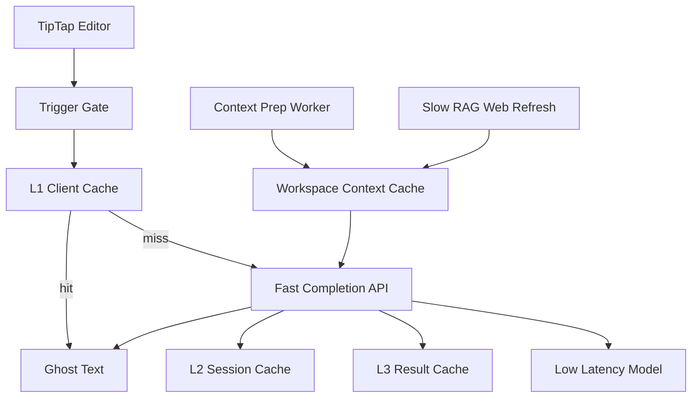

# Workspace 笔记 Tab 补全设计 (2026-06-25)

> 状态：设计草案  
> 范围：Workspace 笔记编辑器内的 ghost text 补全  
> 非目标：聊天输入补全、命令菜单、教学模式提示

---

## 1. 背景

用户希望在写作中获得类似 Cursor Tab 补全代码的体验。第一版首发场景是 Workspace 右侧笔记编辑器，而不是 chat composer。当前笔记编辑器基于 TipTap/ProseMirror，文件是 `frontend_next/components/workspace/workspace-note-editor-tiptap.tsx`。

参考资料给出的关键结论：

- Tab 补全是“每次按键都可能触发推断”的低延迟系统。
- Gmail Smart Compose 要求 90 分位端到端延迟低于 60ms，并依赖前缀状态缓存和 sticky serving。
- Cursor/Copilot 类 ghost text 更像 prefix/suffix 到 next tokens 或 next edit。
- Notion AI/TipTap suggestion 更偏结构化建议，能使用页面、block、selection 上下文，但可接受更高延迟。
- RAG autocomplete 不能默认阻塞主链路，否则体验更像“生成按钮”而不是 Tab 补全。

本设计因此采用快路径和慢路径分离。

---

## 2. 产品定义

### 2.1 目标

在用户写 workspace 笔记时，系统给出轻量、可忽略、可快速接受的 inline ghost text。

第一版体验：

- 用户停顿或输入到自然边界后出现灰色 ghost text。
- 按 `Tab` 接受建议。
- 按 `Escape` 或继续输入取消建议。
- 新输入到来时旧请求立即取消或废弃。
- 中文 IME 组合输入期间不触发补全。
- 补全可使用 workspace 文档、网络检索内容和 LLM 生成能力，但不能牺牲普通 Tab 的实时感。

### 2.2 非目标

第一版不做：

- Chat 输入框补全。
- 多候选菜单。
- `/AI` 命令面板。
- 大段文章生成。
- 自动修改已写内容。
- 每次按键都实时 RAG + Web Search。

---

## 3. 现有代码约束

### 3.1 前端

当前笔记编辑器：

- `WorkspaceNoteEditorTiptap` 使用 TipTap `useEditor`。
- 内容以 Markdown 作为外部存储格式。
- `editorProps.handleKeyDown` 已处理 `Shift+Enter` 插入 `<br>` 和标题末尾 `Enter` 行为。
- 粘贴逻辑已有 HTML 清洗和链接处理。
- 笔记保存链路在 `frontend_next/lib/workspace/client.ts` 中使用 `/api/v1/notebooks/{workspace_id}/notes`。

这意味着 Tab 补全应作为 TipTap extension 或 ProseMirror plugin 接入，而不是在 React 外层用 textarea 方式处理。

### 3.2 后端

当前没有笔记补全 API。现有 chat/RAG 流式接口会创建真实 chat session、写入消息、触发进度和计费语义，不适合作为每次 Tab 补全入口。

需要新增轻量 API，避免污染 `/api/v1/chat`。

---

## 4. 推荐架构



核心原则：

- 用户按键链路只走快路径。
- Workspace 文档和网络检索走慢路径，提前准备上下文。
- 快路径可以读取慢路径缓存，但不等待慢路径完成。
- 新请求到来后旧请求必须取消或结果废弃。

---

## 5. 快路径与慢路径

### 5.1 快路径

目标：尽快给出可接受的短补全。

输入：

- 当前 note ID。
- 当前 block 文本。
- 光标前 `prefix`。
- 光标后 `suffix`。
- 当前标题。
- 最近 1-3 个 block 的纯文本。
- 已缓存的 workspace context digest。

输出：

- 1 个 ghost text。
- 建议插入范围。
- 置信度。
- 来源说明。

触发：

- 用户停止输入 150-250ms。
- 当前光标在普通 paragraph/list item。
- prefix 长度达到阈值。
- 不在 IME composition。
- 不在 link panel、toolbar、selection 操作中。

不触发：

- 光标选中一段文字。
- 当前 block 过短。
- 用户刚刚拒绝过同 prefix。
- 正在保存或 editor 失焦。
- 上一次建议刚被接受后立即连续触发。

### 5.2 慢路径

目标：准备更聪明的上下文，不阻塞 Tab。

来源：

- 当前 workspace 文档摘要。
- 最近选中的 sources。
- 已提升为 source 的 notes。
- 最近 chat 中用户关注的问题。
- Web Search 的可缓存摘要。

慢路径可以在这些时机运行：

- 用户打开 workspace。
- 用户打开 note。
- 用户停止输入超过 1-2 秒。
- 用户显式触发“深度补全”。
- workspace sources 变化。

慢路径输出的是 context digest，不直接展示 ghost text。

---

## 6. API 设计

### 6.1 快补全 API

建议新增：

`POST /api/v1/notebooks/{notebook_id}/notes/{note_id}/tab-completions`

请求：

```json
{
  "request_id": "uuid",
  "cursor": {
    "from": 120,
    "to": 120
  },
  "prefix": "用户光标前文本",
  "suffix": "用户光标后文本",
  "current_block": "当前 block 文本",
  "nearby_blocks": ["上一段", "下一段"],
  "title": "笔记标题",
  "locale": "zh-CN",
  "mode": "fast",
  "client_context_version": "ctx-123"
}
```

响应：

```json
{
  "request_id": "uuid",
  "suggestion_id": "uuid",
  "insert_text": "建议补全文本",
  "display_text": "建议补全文本",
  "replace_range": {
    "from": 120,
    "to": 120
  },
  "confidence": 0.82,
  "source": "fast_model",
  "context_version": "ctx-123",
  "expires_at": "2026-06-25T08:00:00Z"
}
```

### 6.2 上下文准备 API

建议新增：

`POST /api/v1/notebooks/{notebook_id}/notes/{note_id}/completion-context`

用途：

- 更新当前 note 的 workspace context digest。
- 后端可异步刷新 RAG/Web Search 相关缓存。
- 前端不直接等待这个 API 才显示补全。

### 6.3 接受/拒绝反馈

建议新增：

`POST /api/v1/notebooks/{notebook_id}/notes/{note_id}/tab-completions/{suggestion_id}/feedback`

事件：

- `accepted`
- `dismissed`
- `overwritten`
- `partially_kept`

这些反馈用于评估质量，不应写入聊天记录。

---

## 7. 前端实现模型

### 7.1 TipTap Extension

新增 `NoteTabCompletionExtension`，负责：

- 监听 editor transaction。
- 维护 plugin state。
- 用 Decoration 展示 ghost text。
- 处理 `Tab` 接受。
- 处理 `Escape` 取消。
- 在 transaction mapping 后保持或清理 decoration。

状态：

```ts
type TabCompletionState = {
  status: "idle" | "loading" | "visible";
  requestId: string | null;
  suggestionId: string | null;
  insertText: string;
  from: number;
  to: number;
  contextVersion: string | null;
};
```

### 7.2 键盘规则

| 键 | 行为 |
|----|------|
| `Tab` | 有 visible suggestion 时接受；否则保留浏览器/编辑器默认行为 |
| `Escape` | 有 suggestion 时取消 |
| 普通输入 | 取消当前 suggestion，debounce 后重新请求 |
| `Enter` | 取消 suggestion，不自动接受 |
| `Cmd/Ctrl+Z` | 由 TipTap undo 处理，接受的补全应作为一个 undo step |

Tab 只有在 suggestion 可见时才拦截，避免破坏可访问性和焦点导航。

### 7.3 IME 处理

中文输入期间必须暂停：

- `compositionstart` 后停止请求。
- `compositionupdate` 不展示 suggestion。
- `compositionend` 后重新计算 trigger。

### 7.4 后处理

客户端收到建议后必须处理：

- suffix overlap trimming。
- 最小长度门槛。
- 最大长度门槛。
- 不跨越当前 block 太远。
- 不重复用户刚输入的文本。
- 不展示低置信度建议。

---

## 8. 缓存设计

### 8.1 L1 客户端缓存

Key：

```text
note_id + cursor_block_hash + normalized_prefix_tail + normalized_suffix_head + context_version
```

Value：

- `insert_text`
- `replace_range`
- `confidence`
- `created_at`

用途：

- 最近 N 次补全。
- 用户回退/重输时快速恢复。
- 避免同一 prefix 重复请求。

### 8.2 L2 编辑会话缓存

存在于后端短生命周期内存或 Redis：

- 当前 note 的 block tree 摘要。
- 最近 prefix state。
- 最近请求结果。
- workspace context digest。

如果使用普通 OpenAI-compatible LLM，不一定能直接复用 KV cache；但仍可复用 prompt fragment、上下文摘要和检索结果。

### 8.3 L3 服务端结果缓存

Key：

```text
hash(model, mode, locale, prefix_tail, suffix_head, context_version, feature_flags)
```

适合：

- 模板化表达。
- 常见开头。
- 用户短时间内反复编辑同一段。

不适合：

- 高度个性化、含敏感临时内容的长上下文。

### 8.4 L4 检索/语义缓存

缓存对象：

- query embedding。
- 检索 chunk IDs。
- rerank 结果。
- web search digest。
- workspace source digest。

RAG/Web Search 只更新 context digest，不直接阻塞快补全。

---

## 9. 触发策略

默认触发条件：

- 用户在 paragraph/list item 中输入。
- 距上次输入超过 200ms。
- 当前 prefix 至少 8 个字符或中文 4 个字。
- 当前 block 不超过 800 字符。
- 没有选区。
- 当前没有打开 link panel。
- 用户最近 5 秒内没有连续 dismiss 3 次。

降噪策略：

- 空行不默认补全，除非用户显式触发。
- 标题行只给短补全。
- 连续两次低置信度后暂停一段时间。
- 用户接受后短时间内不要立刻再弹下一条。

---

## 10. 深度补全

普通 `Tab` 应该快。需要 workspace 文档 + 网络检索的更强能力时，建议作为第二层体验。

可选入口：

- `Alt+Tab`：深度补全。
- 工具栏按钮：“用 workspace 资料续写”。
- 用户停顿 1-2 秒后后台刷新下一条更强建议。

深度补全可以等待 RAG/Web Search，但 UI 文案要区别于普通 ghost text，避免用户以为 Tab 卡住。

---

## 11. 隐私与权限

### 11.1 草稿隐私

未保存草稿会发送到服务端，因此必须：

- 只在已登录用户自己的 workspace 内启用。
- 遵守 notebook 访问权限。
- 不对 workspace API key 开放用户笔记补全。
- 设置用户可关闭的偏好。

### 11.2 网络检索边界

普通快路径不应实时把用户草稿发给 Web Search。网络检索只能由慢路径使用经过裁剪的 topic/query，且要避免把完整私人笔记当搜索词。

### 11.3 日志

默认不记录完整草稿和完整补全文本。可记录：

- 请求耗时。
- 是否命中缓存。
- 是否接受。
- 文本长度。
- 匿名化错误码。

---

## 12. 评估指标

体验指标：

- P50/P90/P95 端到端延迟。
- 首 token 或完整建议延迟。
- ghost text 展示率。
- Tab 接受率。
- dismiss 率。
- 接受后 30 秒内保留率。
- 用户关闭功能比例。

质量指标：

- suffix overlap 错误率。
- 重复文本率。
- 幻觉引用率。
- workspace 证据相关性。
- 用户接受后编辑比例。

成本指标：

- 每千次触发模型调用数。
- 客户端缓存命中率。
- 服务端结果缓存命中率。
- 检索缓存命中率。
- 每接受建议成本。

---

## 13. 分阶段落地

### Phase 0：TipTap 原型

- 本地 extension 展示固定 ghost text。
- Tab 接受、Esc 取消、继续输入取消。
- IME 不触发。
- 验证 Decoration 与 Markdown 同步。

### Phase 1：快路径 LLM 补全

- 新增 `tab-completions` API。
- 请求只包含当前 note 局部上下文。
- 实现 AbortController 和 request_id 去重。
- 加 L1 客户端缓存。
- 加反馈接口。

### Phase 2：Workspace Context Digest

- 新增 context prep API。
- 缓存 workspace 文档摘要和 note block 摘要。
- 快路径读取 context digest，但不等待检索。

### Phase 3：慢路径 RAG/Web Search

- 后台刷新 RAG/Web digest。
- 支持显式深度补全。
- 加 L4 检索缓存。
- 评估普通 Tab 与深度补全的体验分界。

---

## 14. 风险

| 风险 | 缓解 |
|------|------|
| 延迟过高 | 快慢路径分离，普通 Tab 不等待 RAG/Web |
| ghost text 抖动 | request_id、AbortController、旧结果废弃 |
| 中文输入误触发 | composition 期间禁用 |
| Tab 破坏可访问性 | 只有 suggestion 可见时拦截 |
| 幻觉内容 | workspace context digest 标注来源，低置信度不展示 |
| 成本放大 | debounce、缓存、触发门控、反馈采样 |
| 隐私担忧 | 用户开关、最小上下文、日志不存全文 |

---

## 15. 未决问题

1. 普通 Tab 的第一版延迟目标是 P90 200ms，还是先宽松到 500ms。
2. 是否需要 `Alt+Tab` 或按钮作为深度补全入口。
3. 第一版模型使用现有 LLM provider，还是配置专用低延迟模型。
4. Workspace context digest 是否包含网络检索，还是先只包含文档摘要。
5. 补全反馈是否要进入用户偏好模型。

---

## 16. 推荐结论

第一版应先证明 TipTap ghost text 体验成立，再接入复杂上下文。

推荐最小可行路径：

1. TipTap extension 实现 ghost text 和 Tab 接受。
2. 快补全 API 使用当前笔记局部上下文。
3. 加取消、缓存、后处理和反馈。
4. 再引入 workspace context digest。
5. 最后把 RAG/Web Search 放进慢路径和深度补全。

这样可以保留 Cursor/Copilot 式的实时感，同时为 workspace 文档和网络上下文留下演进空间。
